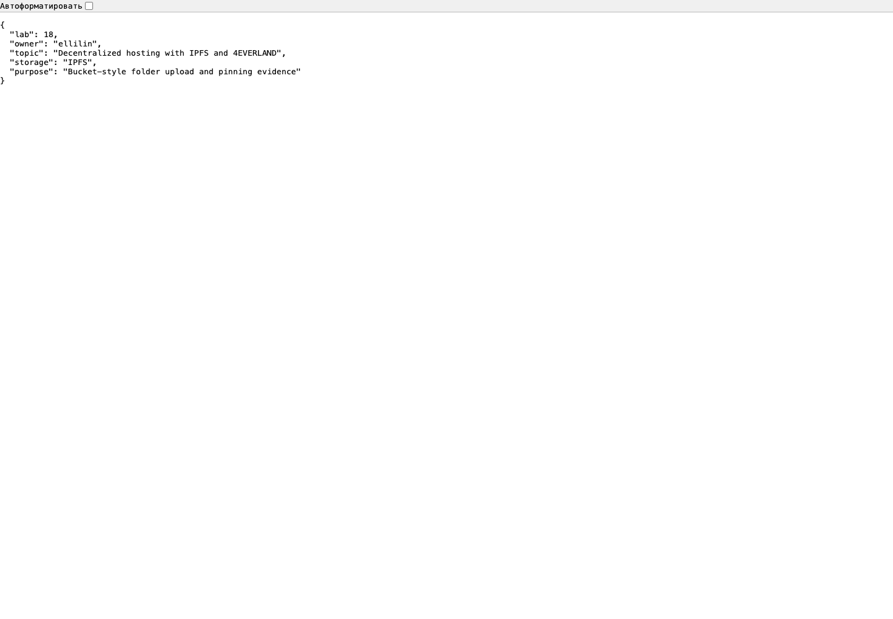
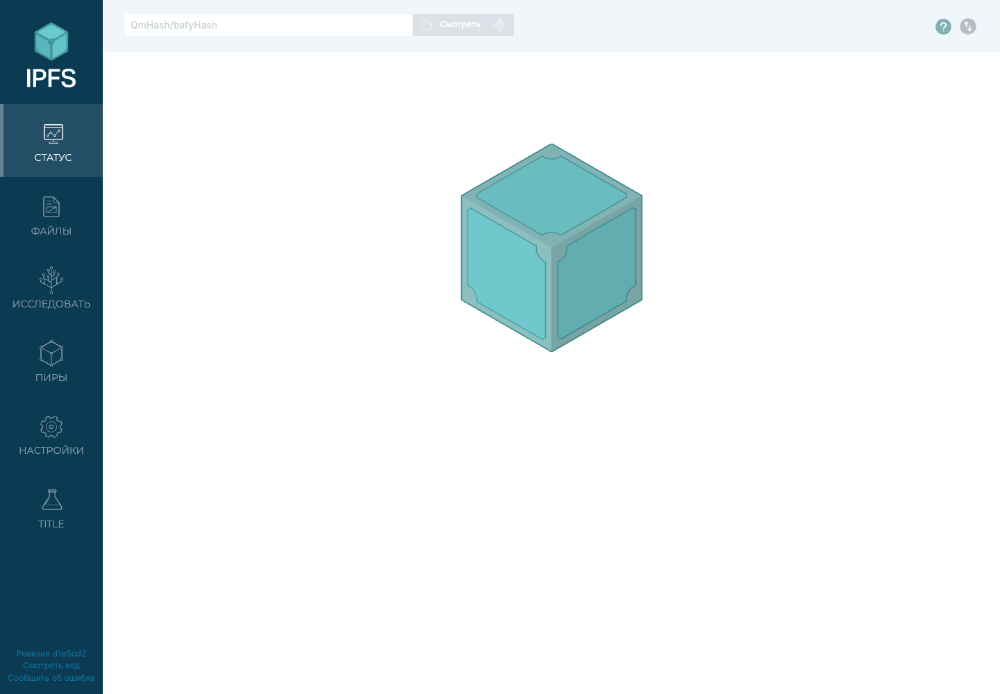
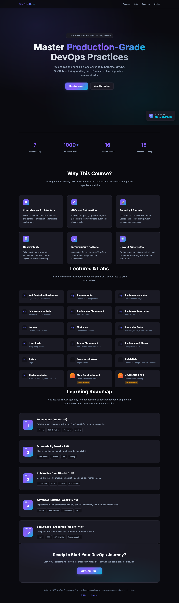

# Lab 18 - Decentralized Hosting with 4EVERLAND and IPFS

Date: 2026-05-13  
Repository branch: `lab18`  
Repository owner: `ellilin`

## Deployment Summary

The provided static course landing page at `labs/lab18/index.html` was added to a local Kubo/IPFS node, retrieved through the local HTTP gateway, verified through public IPFS gateways, pinned locally, and republished through a local IPNS name to demonstrate mutable updates.

4EVERLAND dashboard deployment was prepared but not executed from this machine because no 4EVERLAND dashboard session, Hosting auth token, or Bucket/S3 credentials are available in the workspace. 4EVERLAND's current Hosting CLI and Hosting API both require a dashboard-generated token for authenticated deployment, and the Bucket service requires dashboard/API credentials for account-backed pinning. The exact 4EVERLAND settings to use after login are documented below.

## Local IPFS Node

Container:

```bash
docker run -d --name ipfs-lab18 \
  -p 4001:4001 \
  -p 8080:8080 \
  -p 5001:5001 \
  ipfs/kubo:latest
```

Verification:

```text
ipfs version 0.41.0
Node ID: 12D3KooWAiNtotZkUmfQPWSAMaWAJG7RRkmfPKAtfC16rRCL7bXW
Web UI: http://127.0.0.1:5001/webui/
Local gateway: http://127.0.0.1:8080
```

## CIDs

| Content | CID | URL |
| --- | --- | --- |
| Test file `hello.txt` | `bafkreic7wjegosrfsxjgccaounxtmqadr2gicy5y6vwn6rjalxq666446e` | `http://127.0.0.1:8080/ipfs/bafkreic7wjegosrfsxjgccaounxtmqadr2gicy5y6vwn6rjalxq666446e` |
| Static site `index.html` | `bafkreid4c3xgakvdq5igbtokbvspbzouid6q2egoqsn22hwcl4lkxjh4je` | `http://127.0.0.1:8080/ipfs/bafkreid4c3xgakvdq5igbtokbvspbzouid6q2egoqsn22hwcl4lkxjh4je` |
| Bucket-style directory `labs/lab18/bucket` | `bafybeigwuajej7ja6iixd4tazxgqfnhirwom42g2noao5ij7tanlxwygvq` | `http://127.0.0.1:8080/ipfs/bafybeigwuajej7ja6iixd4tazxgqfnhirwom42g2noao5ij7tanlxwygvq/metadata.json` |
| Updated static site | `bafkreih3lnfhl5xcba6vguykcxovi6jwbkso25n7b54d4753rkhmrbqbuu` | `http://127.0.0.1:8080/ipfs/bafkreih3lnfhl5xcba6vguykcxovi6jwbkso25n7b54d4753rkhmrbqbuu` |

The local IPNS name stayed stable while its target CID changed:

```text
k51qzi5uqu5dgijlyr0oneb0a5gtv7eop9oli0bpy6g8f1lcxhr4vccxkdadyp
initial target: /ipfs/bafkreid4c3xgakvdq5igbtokbvspbzouid6q2egoqsn22hwcl4lkxjh4je
updated target: /ipfs/bafkreih3lnfhl5xcba6vguykcxovi6jwbkso25n7b54d4753rkhmrbqbuu
```

Current IPNS gateway URL:

```text
http://127.0.0.1:8080/ipns/k51qzi5uqu5dgijlyr0oneb0a5gtv7eop9oli0bpy6g8f1lcxhr4vccxkdadyp
```

## Gateway Checks

| Gateway | Test | Result |
| --- | --- | --- |
| Local Kubo gateway | `http://127.0.0.1:8080/ipfs/bafkreic7...` | `200`, returned `Hello IPFS from DevOps course!` |
| Local Kubo gateway | `http://127.0.0.1:8080/ipfs/bafybeig.../metadata.json` | `200`, returned bucket metadata |
| `ipfs.io` | `https://ipfs.io/ipfs/bafkreic7...` | `200` |
| `dweb.link` | `https://dweb.link/ipfs/bafkreic7...` | `200` |
| `ipfs.io` | `https://ipfs.io/ipfs/bafybeig.../metadata.json` | `200` |
| `dweb.link` | `https://dweb.link/ipfs/bafybeig.../metadata.json` | `200` |
| 4EVERLAND public gateway | `https://ipfs.4everland.link/ipfs/bafkreic7...` | `404`, expected because this CID is not pinned in a 4EVERLAND account |

## Pinning

The local node pins the uploaded file, static site, and directory recursively:

```text
bafkreic7wjegosrfsxjgccaounxtmqadr2gicy5y6vwn6rjalxq666446e recursive
bafkreid4c3xgakvdq5igbtokbvspbzouid6q2egoqsn22hwcl4lkxjh4je recursive
bafybeigwuajej7ja6iixd4tazxgqfnhirwom42g2noao5ij7tanlxwygvq recursive
```

Pinning matters because IPFS addressing alone does not guarantee long-term availability. A CID identifies bytes; a pin tells a node or pinning service to keep those bytes instead of allowing garbage collection.

## Screenshots

| Evidence | Screenshot |
| --- | --- |
| Static site through local IPFS gateway | `labs/lab18/screenshots/01_local_ipfs_site.png` |
| Bucket file through local IPFS gateway | `labs/lab18/screenshots/02_local_gateway_bucket_file.png` |
| Local IPFS Web UI | `labs/lab18/screenshots/03_local_ipfs_webui.png` |
| Updated site through local IPNS name | `labs/lab18/screenshots/04_local_ipns_updated_site.png` |








## Bonus Evidence

The extra update/IPNS exercise was completed locally. The original static page CID and updated static page CID are different, while the IPNS name remains stable and resolves to the updated CID. This demonstrates the same immutable-content plus mutable-pointer model that 4EVERLAND project URLs and IPNS-backed deployments use.

## 4EVERLAND Setup and Deployment Plan

4EVERLAND account-backed deployment requires an authenticated dashboard session:

1. Sign in at `https://dashboard.4everland.org/` with GitHub or a wallet.
2. Open Hosting and create a new project from GitHub.
3. Select repository `ellilin/DevOps` and branch `lab18`.
4. Configure the project as a static site:
   - Framework preset: `Other` or `None`
   - Build command: empty
   - Output directory: `labs/lab18`
   - Hosting platform: `IPFS`
5. Deploy and record:
   - 4EVERLAND app URL, normally `https://<project>.4everland.app`
   - 4EVERLAND deployment CID
   - Gateway URL, normally `https://ipfs.4everland.link/ipfs/<cid>`
6. For Bucket storage, create a bucket, upload `labs/lab18/bucket`, and record the directory CID and file CIDs.

CLI/API alternative after generating a Hosting token in the dashboard:

```bash
npm install -g @4everland/hosting-cli
4ever-hosting login
4ever-hosting deploy -ipfs
4ever-hosting getipns
```

4EVERLAND's current docs state that CLI login uses a Hosting token from the dashboard and that authenticated API deployment uses the `https://hosting.api.4everland.org/` endpoint.

## Centralized vs Decentralized Comparison

| Aspect | Traditional Hosting | IPFS/4EVERLAND |
| --- | --- | --- |
| Content addressing | URL points to a server location and path. Content can change behind the same URL. | CID points to content bytes. Same content produces the same CID; changed content produces a new CID. |
| Single point of failure | A failed origin, region, DNS setup, or provider account can take the site down. | Content can be served by any node that has the blocks. Pinning through multiple nodes improves resilience. |
| Censorship resistance | Provider, region, account, or DNS controls can remove or block content. | Harder to remove globally once replicated, though gateways and domains can still filter. |
| Update mechanism | Replace files on the origin or deploy a new release behind the same URL. | Publish new content to get a new CID, then update IPNS, DNSLink, or the 4EVERLAND project URL pointer. |
| Cost model | Usually priced by compute, storage, requests, and bandwidth. | Usually priced by storage, build minutes, pinning, and gateway bandwidth. Current 4EVERLAND public pricing lists free monthly bandwidth/build/storage allowances before paid overage. |
| Speed/latency | Fast and predictable with CDN in front of the origin. | Gateway performance varies by provider and whether content is already cached nearby. |
| Best use cases | APIs, private apps, server-rendered apps, databases, dynamic authenticated workloads. | Static sites, public assets, release artifacts, docs, NFTs, censorship-resistant frontends, archival content. |

## Use Case Analysis

Decentralized hosting makes sense when the application is static, public, and benefits from verifiable content integrity. Course landing pages, project documentation, open datasets, software release artifacts, and public frontend bundles fit well because users can verify exactly which bytes they are loading from the CID.

Traditional hosting is better for dynamic applications, private data, server-side sessions, high write rates, and systems that need strict latency guarantees or centralized access control. IPFS content is public by default, and mutable update paths such as IPNS add another operational layer.

Recommended approach: use IPFS/4EVERLAND for public static frontends and artifacts, while keeping APIs, databases, secrets, and authenticated workflows on conventional infrastructure. For production decentralized sites, use at least two independent pins or pinning services, keep a normal domain with DNSLink or the provider's stable project URL, and monitor gateway availability.

## Concepts Learned

Content addressing: IPFS identifies content by hash, not by server location.

CID: The content identifier is derived from the data, so `index.html` and the modified `index-v2.html` have different CIDs.

Pinning: The local node stores recursive pins for the uploaded content so it is not garbage-collected locally.

Gateway: HTTP gateways translate browser requests into IPFS block retrievals.

IPNS: The local IPNS name `k51qzi5u...` remains stable while the target CID changes, matching the update model used by hosted project URLs.

## References

- [IPFS documentation](https://docs.ipfs.tech/)
- [IPFS content addressing](https://docs.ipfs.tech/concepts/content-addressing/)
- [IPNS documentation](https://docs.ipfs.tech/concepts/ipns/)
- [4EVERLAND Hosting CLI](https://docs.4everland.org/hositng/hosting-cli)
- [4EVERLAND Hosting API](https://docs.4everland.org/hositng/hosting-api)
- [4EVERLAND Bucket documentation](https://docs.4everland.org/storage/bucket)
- [4EVERLAND pricing](https://www.4everland.org/price/)
