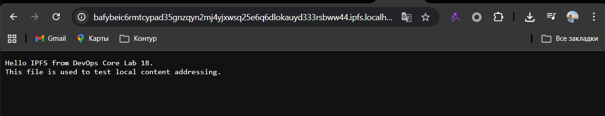
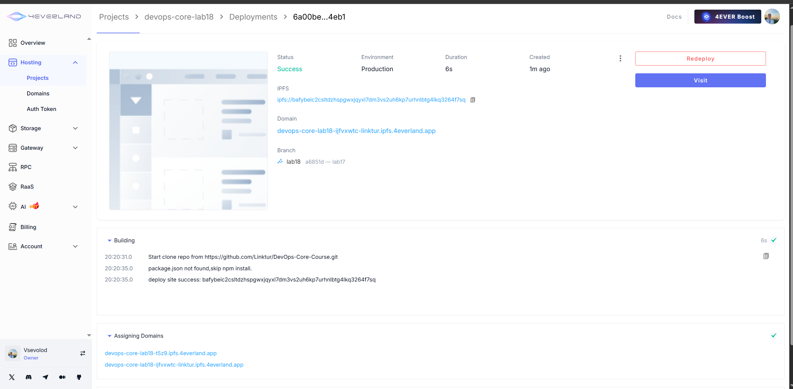
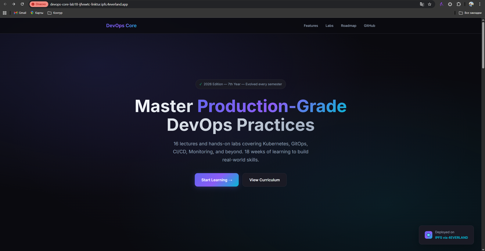

# Lab 18 - IPFS and 4EVERLAND

## Goal

In this lab I deployed a static website to IPFS using 4EVERLAND.

I also tested IPFS locally with Docker. The main idea was to see how content addressing works. In IPFS, files are found by their content hash, not only by a server address.

Deployed site:

- Source file: `labs/lab18/index.html`
- Type: static HTML/CSS site
- Build command: empty
- Output directory: `labs/lab18`

## Task 1 - Local IPFS Node

I started a local IPFS node with Docker and the Kubo image.

```powershell
docker run -d --name ipfs-lab18 `
  -p 4001:4001 `
  -p 8080:8080 `
  -p 5001:5001 `
  -v "${PWD}\labs\lab18:/lab18:ro" `
  ipfs/kubo:latest
```

Local services:

- Web UI: `http://localhost:5001/webui`
- Local gateway: `http://localhost:8080`
- IPFS agent: `kubo/0.41.0`

I added files to the local IPFS node.

| Content | CID | Access |
| --- | --- | --- |
| `hello-ipfs.txt` | `QmUhi6bbaPubXRVq3vCxdFZjRPYnGbpZWqQMQmeCvMaLsY` | `http://localhost:8080/ipfs/QmUhi6bbaPubXRVq3vCxdFZjRPYnGbpZWqQMQmeCvMaLsY` |
| `bucket-sample/` | `QmfEPoXQVtHTj3MK2jX23HW4Q7pJ2q2MD6HCnJEYgWqJSA` | `http://localhost:8080/ipfs/QmfEPoXQVtHTj3MK2jX23HW4Q7pJ2q2MD6HCnJEYgWqJSA/readme.txt` |
| Full Lab 18 site | `Qmd63qTMCvi5hYgskGc5dyhhBaNefh3UnG2YrVLYAfERmN` | `http://localhost:8080/ipfs/Qmd63qTMCvi5hYgskGc5dyhhBaNefh3UnG2YrVLYAfERmN/index.html` |

I also checked that the content was pinned locally.

```powershell
docker exec ipfs-lab18 ipfs pin ls --type recursive
```

Result:

```text
Qmd63qTMCvi5hYgskGc5dyhhBaNefh3UnG2YrVLYAfERmN recursive
QmfEPoXQVtHTj3MK2jX23HW4Q7pJ2q2MD6HCnJEYgWqJSA recursive
QmUhi6bbaPubXRVq3vCxdFZjRPYnGbpZWqQMQmeCvMaLsY recursive
```

## Task 2 - 4EVERLAND Setup

I used 4EVERLAND as a managed IPFS platform.

Main services:

| Service | What it does |
| --- | --- |
| Hosting | Deploys websites to IPFS from GitHub. |
| Bucket | Stores and pins files on IPFS. |
| Gateway | Opens IPFS files in a normal browser. |
| Domains | Gives a stable URL for the site. |

Useful links:

- Hosting docs: <https://docs.4everland.org/hositng/guides/site-deployment>
- Bucket docs: <https://docs.4everland.org/storage/bucket/ipfs-bucket>
- Gateway docs: <https://docs.4everland.org/gateways>

## Task 3 - Static Site Deployment

I connected my GitHub repository to 4EVERLAND Hosting.

Build settings:

| Setting | Value |
| --- | --- |
| Repository | `DevOps-Core-Course` |
| Branch | `lab18` |
| Framework | `Other` |
| Build command | empty |
| Output directory | `labs/lab18` |
| Entry file | `index.html` |

Deployment result:

| Item | Value |
| --- | --- |
| Site URL | `https://devops-core-lab18-fdbos9gf-linktur.ipfs.4everland.app` |
| First CID | `bafybeic2csltdzhspgwxjqyxl7dm3vs2uh6kp7urhnlbtg4lkq3264f7sq` |
| Updated CID | `bafybeifgqcrtvheeitferrhiofgvg6r7tq63c5ttaxnhay4j7pvwlt2yqu` |
| Updated gateway URL | `https://ipfs.4everland.io/ipfs/bafybeifgqcrtvheeitferrhiofgvg6r7tq63c5ttaxnhay4j7pvwlt2yqu` |

The first deploy was successful. Then I changed the site text and deployed again.

The second deployment used:

- Status: `Success`
- Environment: `Production`
- Branch: `lab18`
- Commit: `5f8e61 - lab18-v2`
- New IPFS URI: `ipfs://bafybeifgqcrtvheeitferrhiofgvg6r7tq63c5ttaxnhay4j7pvwlt2yqu`

This proves that the content changed and IPFS created a new CID.

Gateway checks:

- 4EVERLAND: `https://ipfs.4everland.io/ipfs/bafybeifgqcrtvheeitferrhiofgvg6r7tq63c5ttaxnhay4j7pvwlt2yqu`
- dweb.link: `https://dweb.link/ipfs/bafybeifgqcrtvheeitferrhiofgvg6r7tq63c5ttaxnhay4j7pvwlt2yqu`
- ipfs.io: `https://ipfs.io/ipfs/bafybeifgqcrtvheeitferrhiofgvg6r7tq63c5ttaxnhay4j7pvwlt2yqu`

## Task 4 - Bucket and Pinning

I created a sample bucket and uploaded two files:

- `about.html`
- `readme.txt`

Bucket result:

| Item | Value |
| --- | --- |
| Bucket name | `bucket-sample` |
| `about.html` CID | `bafkreienvgdxqjih2cohzkxf7oco72jfohq5ryupl6f6wwk2hw3vbfbzpe` |
| `readme.txt` CID | `bafkreicvse3fd6pkhulyfok7j6fgv7rkh6gpft52763zqzrirkf44k3xze` |
| Object URL | `https://bucket-sample.4everbucket.com/bucket-sample/readme.txt` |
| 4EVERLAND gateway | `https://ipfs.4everland.io/ipfs/bafkreicvse3fd6pkhulyfok7j6fgv7rkh6gpft52763zqzrirkf44k3xze` |
| dweb.link gateway | `https://dweb.link/ipfs/bafkreicvse3fd6pkhulyfok7j6fgv7rkh6gpft52763zqzrirkf44k3xze` |
| ipfs.io gateway | `https://ipfs.io/ipfs/bafkreicvse3fd6pkhulyfok7j6fgv7rkh6gpft52763zqzrirkf44k3xze` |

Pinning means that the content is kept available. If nobody pins the content, IPFS nodes may delete it later. 4EVERLAND Bucket pins the files for me, so they stay online even when my local IPFS node is off.

## Task 5 - IPFS, IPNS, and Updates

IPFS content is immutable. If I change the file, the CID changes.

This happened in my deployment:

- First CID: `bafybeic2csltdzhspgwxjqyxl7dm3vs2uh6kp7urhnlbtg4lkq3264f7sq`
- Updated CID: `bafybeifgqcrtvheeitferrhiofgvg6r7tq63c5ttaxnhay4j7pvwlt2yqu`

The project URL still works as a normal stable URL. 4EVERLAND handles this part for the user.

IPNS is useful for this idea because it can point one stable name to a new IPFS CID.

## Screenshots

The screenshots are stored in `k8s/photos/lab18`.

| Screenshot | File |
| --- | --- |
| Local IPFS Web UI | `k8s/photos/lab18/ipfs-webui.png` |
| Local IPFS gateway | `k8s/photos/lab18/local-gateway.png` |
| 4EVERLAND deployment success | `k8s/photos/lab18/4everlans-success.png` |
| Deployed website | `k8s/photos/lab18/deployed-app.png` |
| Bucket files | `k8s/photos/lab18/bucket-files.png` |
| IPFS gateway access | `k8s/photos/lab18/gateway-access.png` |

Evidence:







## Centralized vs Decentralized Hosting

| Aspect | Traditional hosting | IPFS / 4EVERLAND |
| --- | --- | --- |
| Addressing | Uses server URL. | Uses content CID. |
| Failure point | Server or provider can fail. | Content can be served by many nodes and gateways. |
| Censorship | Provider can remove the site. | Pinned content is harder to remove. |
| Updates | Replace files on the server. | New content gets a new CID. |
| Stable URL | Domain points to a server. | 4EVERLAND domain can point to the latest IPFS content. |
| Cost | Pay for server and traffic. | Pay for pinning, gateway, and platform usage. |
| Best for | Dynamic apps, APIs, private apps. | Static sites, public docs, archives, metadata. |

## Use Case Analysis

Decentralized hosting is good for public static content. It is useful when people need to verify that content did not change secretly.

Good use cases:

- documentation;
- public reports;
- static course pages;
- open source release files;
- NFT metadata.

Traditional hosting is better for apps with login, private data, APIs, or databases.

My recommendation is simple: use IPFS/4EVERLAND for public static content and archives. Use traditional hosting for dynamic applications.

## Final Checklist

- [x] IPFS concepts described
- [x] Local IPFS node started with Docker
- [x] Content added to local IPFS
- [x] Local CIDs recorded
- [x] Local pinning verified
- [x] 4EVERLAND account used
- [x] Static site deployed with 4EVERLAND
- [x] First and updated deployment CIDs recorded
- [x] Files uploaded to 4EVERLAND Bucket
- [x] Bucket CIDs and gateway URLs recorded
- [x] Screenshots added
- [x] Centralized vs decentralized comparison completed
