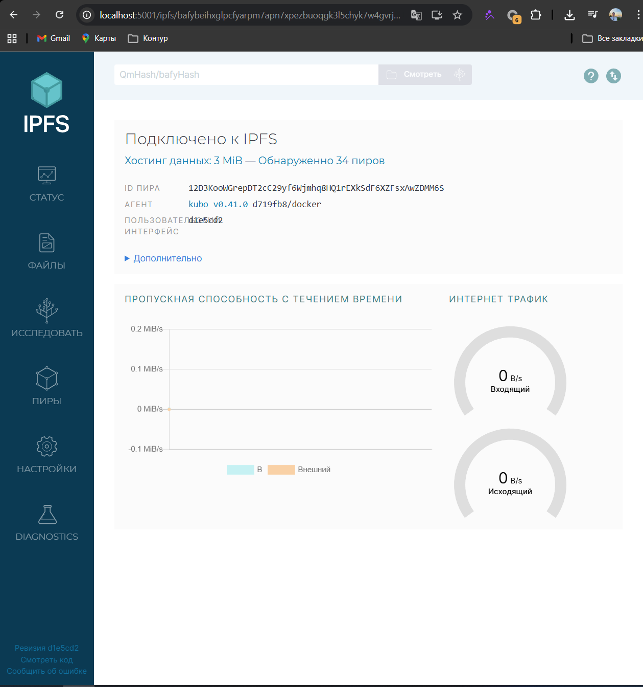
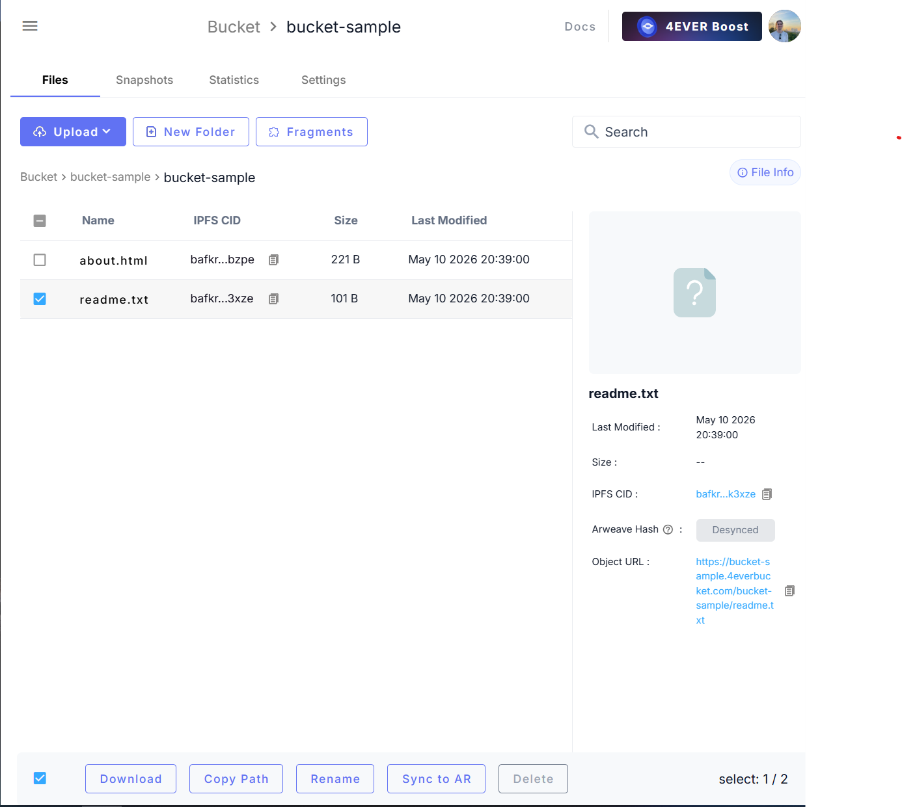
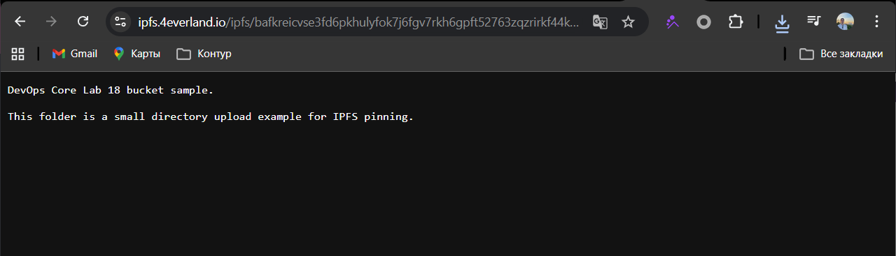

# Lab 18 - Decentralized Hosting with IPFS and 4EVERLAND

## Goal

The goal of this lab is to deploy static content to the decentralized web and understand how IPFS content addressing is different from normal web hosting.

The deployed content is the provided static site:

- Local source: `labs/lab18/index.html`
- Site type: static HTML/CSS
- Build command: none
- Output directory for 4EVERLAND: `labs/lab18`

## Task 1 - Local IPFS Node

I started a local IPFS node with Docker using the Kubo image.

```powershell
docker run -d --name ipfs-lab18 `
  -p 4001:4001 `
  -p 8080:8080 `
  -p 5001:5001 `
  -v "${PWD}\labs\lab18:/lab18:ro" `
  ipfs/kubo:latest
```

The node was available at:

- Web UI: `http://localhost:5001/webui`
- Local gateway: `http://localhost:8080`
- Agent version: `kubo/0.41.0`

I added a test file, a sample folder, and the full Lab 18 static site to IPFS.

| Content | CID | Local access |
| --- | --- | --- |
| `hello-ipfs.txt` | `QmUhi6bbaPubXRVq3vCxdFZjRPYnGbpZWqQMQmeCvMaLsY` | `http://localhost:8080/ipfs/QmUhi6bbaPubXRVq3vCxdFZjRPYnGbpZWqQMQmeCvMaLsY` |
| `bucket-sample/` folder | `QmfEPoXQVtHTj3MK2jX23HW4Q7pJ2q2MD6HCnJEYgWqJSA` | `http://localhost:8080/ipfs/QmfEPoXQVtHTj3MK2jX23HW4Q7pJ2q2MD6HCnJEYgWqJSA/readme.txt` |
| Full `labs/lab18/` site folder | `Qmd63qTMCvi5hYgskGc5dyhhBaNefh3UnG2YrVLYAfERmN` | `http://localhost:8080/ipfs/Qmd63qTMCvi5hYgskGc5dyhhBaNefh3UnG2YrVLYAfERmN/index.html` |

All three objects were pinned recursively on the local node.

```powershell
docker exec ipfs-lab18 ipfs pin ls --type recursive
```

Result:

```text
Qmd63qTMCvi5hYgskGc5dyhhBaNefh3UnG2YrVLYAfERmN recursive
QmfEPoXQVtHTj3MK2jX23HW4Q7pJ2q2MD6HCnJEYgWqJSA recursive
QmUhi6bbaPubXRVq3vCxdFZjRPYnGbpZWqQMQmeCvMaLsY recursive
```

## Task 2 - 4EVERLAND Setup

4EVERLAND provides several Web3 hosting services:

| Service | Purpose |
| --- | --- |
| Hosting | Deploy static sites and web apps to IPFS from GitHub or uploaded files. |
| Bucket | Store and pin files or folders on IPFS. |
| Gateway | Access IPFS content from normal browsers over HTTPS. |
| Domains | Keep a stable URL while the IPFS CID changes after updates. |

Useful official docs:

- 4EVERLAND Hosting deployment: <https://docs.4everland.org/hositng/guides/site-deployment>
- 4EVERLAND IPFS Bucket: <https://docs.4everland.org/storage/bucket/ipfs-bucket>
- 4EVERLAND IPFS Gateway: <https://docs.4everland.org/gateways>

## Task 3 - Static Site Deployment

Deployment settings for 4EVERLAND:

| Setting | Value |
| --- | --- |
| Repository | `DevOps-Core-Course` |
| Branch | current working branch |
| Framework | None / Static |
| Build command | empty |
| Output directory | `labs/lab18` |
| Entry file | `index.html` |

Deployment result:

| Item | Value |
| --- | --- |
| 4EVERLAND project URL | `TODO: paste 4EVERLAND URL here` |
| IPFS gateway URL | `TODO: paste IPFS gateway URL here` |
| First deployment CID | `TODO: paste first CID here` |
| Updated deployment CID | `TODO: paste second CID here after a small change` |

The site URL should stay the same after redeploy. The CID should change when the site content changes.

## Task 4 - Bucket and Pinning

For the Bucket task I prepared a small sample folder:

- `labs/lab18/bucket-sample/readme.txt`
- `labs/lab18/bucket-sample/about.html`

The same folder was added locally to IPFS and received this directory CID:

```text
QmfEPoXQVtHTj3MK2jX23HW4Q7pJ2q2MD6HCnJEYgWqJSA
```

4EVERLAND Bucket result:

| Item | Value |
| --- | --- |
| Bucket name | `TODO: paste bucket name here` |
| Uploaded file CID | `TODO: paste file CID here` |
| Uploaded folder CID | `TODO: paste folder/root CID here` |
| 4EVERLAND gateway access | `TODO: paste URL here` |
| dweb.link gateway access | `TODO: paste URL here` |
| ipfs.io gateway access | `TODO: paste URL here` |

Pinning is important because IPFS content can disappear if no node keeps it. A local node can pin content, but it depends on my machine. 4EVERLAND Bucket pins the content in a managed service, so the content remains available even when my local node is offline.

## Task 5 - IPNS and Updates

IPFS content is immutable. If one byte changes, IPFS creates a new CID.

IPNS solves this by using a stable name that points to the newest CID. 4EVERLAND hides this complexity for normal hosting:

- the project URL stays the same;
- a new deployment can produce a new CID;
- users still open the same 4EVERLAND URL.

This is close to traditional hosting from the user's point of view, but the deployed build is still content-addressed by IPFS.

## Screenshots

Required screenshots to add before final submission:

| Screenshot | Save as |
| --- | --- |
| Local IPFS Web UI | `k8s/photos/lab18/ipfs-webui.png` |
| Local IPFS gateway with `hello-ipfs.txt` | `k8s/photos/lab18/local-gateway-file.png` |
| 4EVERLAND dashboard / project | `k8s/photos/lab18/4everland-dashboard.png` |
| Deployed static site | `k8s/photos/lab18/deployed-site.png` |
| 4EVERLAND Bucket files | `k8s/photos/lab18/bucket-files.png` |
| Gateway access from 4EVERLAND or public gateway | `k8s/photos/lab18/gateway-access.png` |

After screenshots are saved, they can be embedded here:

```markdown





```

## Centralized vs Decentralized Hosting

| Aspect | Traditional Hosting | IPFS / 4EVERLAND |
| --- | --- | --- |
| Content addressing | Uses a server location and URL. | Uses a content hash called a CID. |
| Single point of failure | One server or provider can be a weak point. | Content can be served by many IPFS nodes and gateways. |
| Censorship resistance | Provider or server owner can remove content. | Pinned content is harder to remove from the network. |
| Update mechanism | Replace files on the same server. | New content creates a new CID; stable URLs can point to the newest CID. |
| Cost model | Pay for server, traffic, storage, and uptime. | Pay for pinning, gateways, bandwidth, or managed platform features. |
| Speed / latency | Usually fast when close to the server or CDN. | Can be fast with good gateways, but cold content may take longer. |
| Best use cases | Dynamic apps, APIs, databases, private dashboards. | Static sites, public docs, archives, NFT metadata, immutable releases. |

## Use Case Analysis

Decentralized hosting is a good choice for public static content that should be easy to verify and hard to silently change. Examples include course pages, documentation, public reports, open source release artifacts, and NFT metadata.

Traditional hosting is better for dynamic applications with login, private data, server-side APIs, databases, or fast updates that do not need immutable history.

For this lab, 4EVERLAND is a practical middle ground. It gives a normal hosting workflow through GitHub, but the deployed content can still be accessed and verified through IPFS CIDs.

## Final Checklist

- [x] IPFS concepts described
- [x] Local IPFS node started with Docker
- [x] Content added to local IPFS
- [x] Local CIDs recorded
- [x] Local pinning verified
- [x] Static site prepared for 4EVERLAND
- [ ] 4EVERLAND account/project screenshot added
- [ ] Static site deployed via 4EVERLAND
- [ ] 4EVERLAND deployment URL and CID recorded
- [ ] Files uploaded to 4EVERLAND Bucket
- [ ] Bucket CIDs and gateway URLs recorded
- [ ] Screenshots embedded
- [x] Centralized vs decentralized comparison completed
