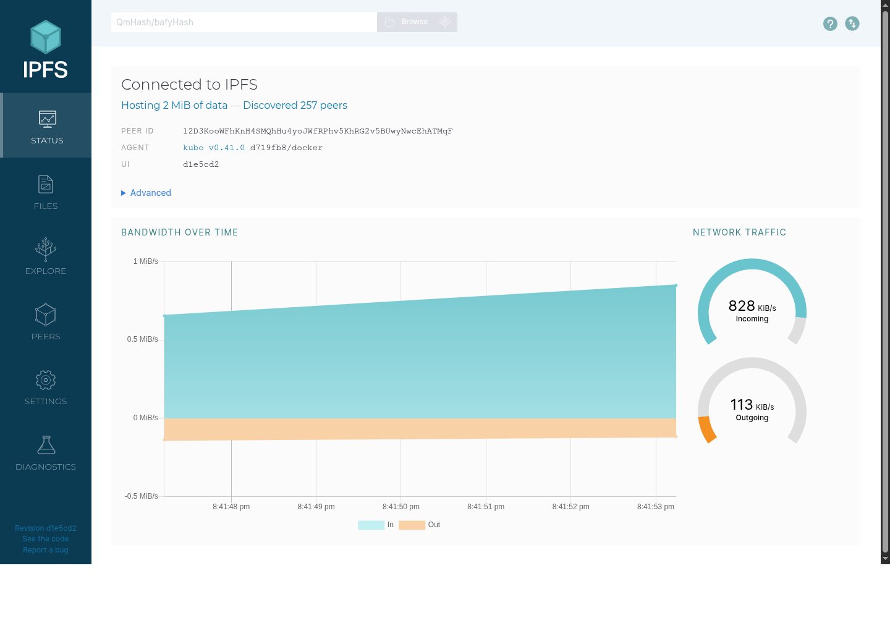
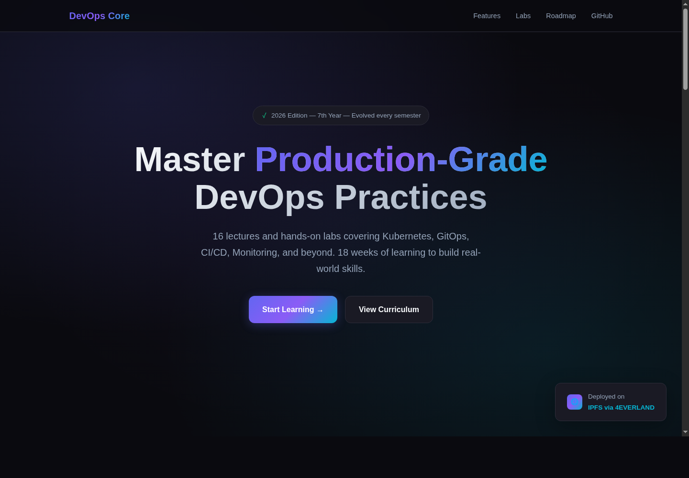

# Lab 18 - Decentralized Hosting with 4EVERLAND and IPFS

Date: 2026-05-10  
Repository: `git@github.com:egraPA006/DevOps-Core-Course.git`  
Static site source: `labs/lab18/index.html`  
Evidence directory: `docs/lab18-evidence/`

## Status Summary

The local IPFS part of Lab 18 is complete and verified with Docker/Kubo, real CIDs, local gateway access, public gateway checks, pinning output, and screenshots.

The 4EVERLAND-hosted cloud deployment is prepared but not completed from this machine because no 4EVERLAND account session/token/API key exists locally, the 4EVERLAND CLI is not installed, and Node.js/npm are not installed. This is an external account step rather than a repository issue. See `docs/lab18-evidence/4everland-blocker.txt`.

Evidence files:

- `docs/lab18-evidence/ipfs-local.txt`
- `docs/lab18-evidence/4everland-blocker.txt`
- `docs/lab18-evidence/ipfs-webui.png`
- `docs/lab18-evidence/local-ipfs-site.png`
- `docs/lab18-evidence/local-ipfs-bucket-file.png`
- `docs/lab18-evidence/hello-ipfs.txt`
- `docs/lab18-evidence/bucket-sample/`

## IPFS Fundamentals

IPFS uses content addressing instead of location addressing. A traditional URL asks a specific server for a path. An IPFS CID asks the network for content matching a cryptographic hash. If the bytes change, the CID changes.

Key concepts:

| Concept | Explanation |
|---------|-------------|
| Content addressing | Content is identified by hash/CID instead of server location. |
| CID | Content Identifier. It represents the exact bytes or directory graph added to IPFS. |
| Pinning | A node promises to keep content instead of letting garbage collection remove it. |
| Gateway | HTTP bridge that lets browsers retrieve IPFS content through normal URLs. |
| IPNS | Mutable name that can point to a newer CID while the name remains stable. |

## Local IPFS Node

Kubo was run with Docker:

```bash
docker run -d --name ipfs-lab18 \
  -p 4001:4001 \
  -p 8080:8080 \
  -p 5001:5001 \
  -v /home/egrapa/prog/DevOps-Core-Course/docs/lab18-evidence:/lab18:ro \
  ipfs/kubo:latest
```

Verified version:

```text
ipfs version 0.41.0
```

Local services:

| Service | URL |
|---------|-----|
| Web UI | `http://127.0.0.1:5001/webui/` |
| Local gateway | `http://127.0.0.1:8080/ipfs/<CID>` |
| Swarm | `4001/tcp` |

Screenshot: 

## Content Added Locally

Single file:

| Item | Value |
|------|-------|
| File | `docs/lab18-evidence/hello-ipfs.txt` |
| CID | `QmdHmdWf87goRYyrvXELqkPgbv8MZ6P7Uqq31fDuhmrUB5` |
| Local gateway | `http://127.0.0.1:8080/ipfs/QmdHmdWf87goRYyrvXELqkPgbv8MZ6P7Uqq31fDuhmrUB5` |
| dweb.link | `https://dweb.link/ipfs/QmdHmdWf87goRYyrvXELqkPgbv8MZ6P7Uqq31fDuhmrUB5` |
| ipfs.io | `https://ipfs.io/ipfs/QmdHmdWf87goRYyrvXELqkPgbv8MZ6P7Uqq31fDuhmrUB5` |

The local gateway, `dweb.link`, and `ipfs.io` returned the expected file content. The 4EVERLAND public gateway timed out for this local-only CID, which is expected until the content is pinned or deployed through 4EVERLAND.

## Static Site Deployment Preparation

The provided static course landing page was added to local IPFS as a directory:

| Item | Value |
|------|-------|
| Source directory | `labs/lab18` |
| Site CID | `QmSAT1vb9LsfKiSGoptLgiTsjrzjnVfSb3GWpSbsiQNqNe` |
| Local gateway URL | `http://127.0.0.1:8080/ipfs/QmSAT1vb9LsfKiSGoptLgiTsjrzjnVfSb3GWpSbsiQNqNe/` |

Screenshot: 

Update test:

| Version | CID |
|---------|-----|
| Original site directory | `QmSAT1vb9LsfKiSGoptLgiTsjrzjnVfSb3GWpSbsiQNqNe` |
| Site directory plus `deployment-version.txt` | `QmdK78QRMu3C23kGqz3gmYcPvG8YkDh753Y3wGCPUnq9C2` |

This confirms that IPFS content is immutable: a small content change produced a new CID.

## 4EVERLAND Setup and Deployment Plan

4EVERLAND account setup must be completed in the browser or with an authenticated token.

Dashboard deployment settings:

| Field | Value |
|-------|-------|
| Source | GitHub repository |
| Repository | `egraPA006/DevOps-Core-Course` |
| Framework preset | Other/None |
| Build command | empty |
| Output directory | `labs/lab18` |
| Platform | IPFS |

Values to copy from the successful 4EVERLAND deployment:

| Field | Value |
|-------|-------|
| 4EVERLAND project URL | Pending external dashboard deployment |
| 4EVERLAND deployment CID | Pending external dashboard deployment |
| 4EVERLAND gateway URL | `https://ipfs.4everland.io/ipfs/<CID>` |
| Stable project/domain URL | Pending external dashboard deployment |

Official 4EVERLAND docs used for the plan:

- Hosting CLI: https://docs.4everland.org/hositng/hosting-cli
- Site deployment: https://docs.4everland.org/hositng/guides/site-deployment
- IPFS hosting: https://docs.4everland.org/hositng/what-is-hosting/ipfs-hosting
- Bucket API: https://docs.4everland.org/storage/bucket/bucket-api-s3-compatible
- Pinning Services API: https://docs.4everland.org/storage/4ever-pin/pinning-services-api

## Bucket and Pinning

A multi-file folder was prepared and added to local IPFS to model the 4EVERLAND Bucket upload:

| Item | Value |
|------|-------|
| Folder | `docs/lab18-evidence/bucket-sample` |
| Directory CID | `QmZ56vE89Uw1bZ5Hj2Y1qFHXzuN7uep5HcjbMXgDPtHNU1` |
| Local metadata URL | `http://127.0.0.1:8080/ipfs/QmZ56vE89Uw1bZ5Hj2Y1qFHXzuN7uep5HcjbMXgDPtHNU1/metadata.json` |
| Local SVG URL | `http://127.0.0.1:8080/ipfs/QmZ56vE89Uw1bZ5Hj2Y1qFHXzuN7uep5HcjbMXgDPtHNU1/ipfs-badge.svg` |

Screenshot: 

Recursive pins confirmed:

```text
QmSAT1vb9LsfKiSGoptLgiTsjrzjnVfSb3GWpSbsiQNqNe recursive
QmZ56vE89Uw1bZ5Hj2Y1qFHXzuN7uep5HcjbMXgDPtHNU1 recursive
QmdHmdWf87goRYyrvXELqkPgbv8MZ6P7Uqq31fDuhmrUB5 recursive
QmdK78QRMu3C23kGqz3gmYcPvG8YkDh753Y3wGCPUnq9C2 recursive
```

For 4EVERLAND Bucket completion, upload `docs/lab18-evidence/bucket-sample`, then verify the returned directory CID through:

- `https://ipfs.4everland.io/ipfs/<CID>/metadata.json`
- `https://ipfs.io/ipfs/<CID>/metadata.json`
- `https://dweb.link/ipfs/<CID>/metadata.json`

## IPNS and Updates

IPFS CIDs are immutable. Updating the site creates a new CID, as shown by the local update test. IPNS solves this by keeping a stable name that points to the current CID.

4EVERLAND handles the same idea at the hosting layer: the project URL remains stable while each successful deployment can point to a new IPFS CID. The user-facing URL behaves like a mutable pointer, while the historical CIDs remain content-addressed snapshots.

## Centralized vs Decentralized Comparison

| Aspect | Traditional Hosting | IPFS/4EVERLAND |
|--------|---------------------|----------------|
| Content addressing | Location-based URL points to a server and path. | CID points to exact content bytes. |
| Single point of failure | Higher risk if one origin, region, DNS path, or provider fails. | Lower risk when content is pinned and replicated across nodes/gateways. |
| Censorship resistance | Provider or infrastructure owner can remove content from the origin. | Stronger when many independent nodes pin the content. |
| Update mechanism | Replace files behind the same URL. | New content gets a new CID; IPNS/project URL/custom domain points to the latest CID. |
| Cost model | Usually server, bandwidth, CDN, and operations costs. | Storage/pinning and gateway bandwidth; no always-running app server for static content. |
| Speed/latency | Very fast with mature CDNs and regional origins. | Can be fast through gateways/CDNs, but cold or poorly pinned content may be slower. |
| Best use cases | Dynamic apps, private data, databases, APIs, strict low latency. | Static sites, public artifacts, documentation, releases, archives, verifiable content. |

## Use Case Analysis

Decentralized hosting makes sense for public static content where integrity, verifiability, and persistence matter. Good examples are documentation, release artifacts, static portfolios, educational sites, public datasets, and project landing pages.

Traditional hosting is better for private content, dynamic server-side applications, transactional APIs, real-time systems, and anything requiring fast updates with strict access control.

Recommendation for this course site: use 4EVERLAND/IPFS for the static Lab 18 landing page because it is public, static, easy to cache, and benefits from content-addressed verification. Keep application backends, databases, and authenticated services on traditional cloud/PaaS infrastructure.

## Checklist

- [x] IPFS concepts documented
- [x] Local IPFS node running in Docker
- [x] Local Web UI reachable
- [x] File added to local IPFS
- [x] Static site added to local IPFS
- [x] Local gateway access verified
- [x] Public gateway access verified through `dweb.link` and `ipfs.io`
- [x] Directory upload/pinning modeled with multiple files
- [x] Recursive pins verified
- [x] CID change after content update demonstrated
- [x] Comparison analysis complete
- [x] Local screenshots captured
- [ ] 4EVERLAND account created: requires user dashboard action
- [ ] 4EVERLAND Hosting deployment completed: requires user dashboard token/session
- [ ] 4EVERLAND Bucket upload completed: requires user dashboard token/session
- [ ] 4EVERLAND dashboard screenshots captured: requires user dashboard access

