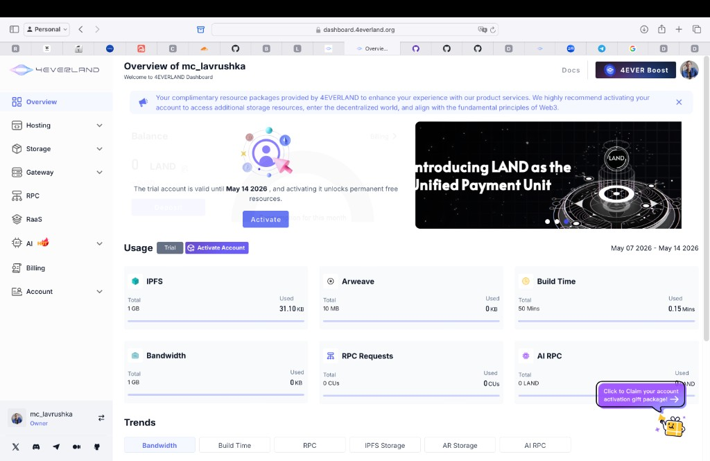
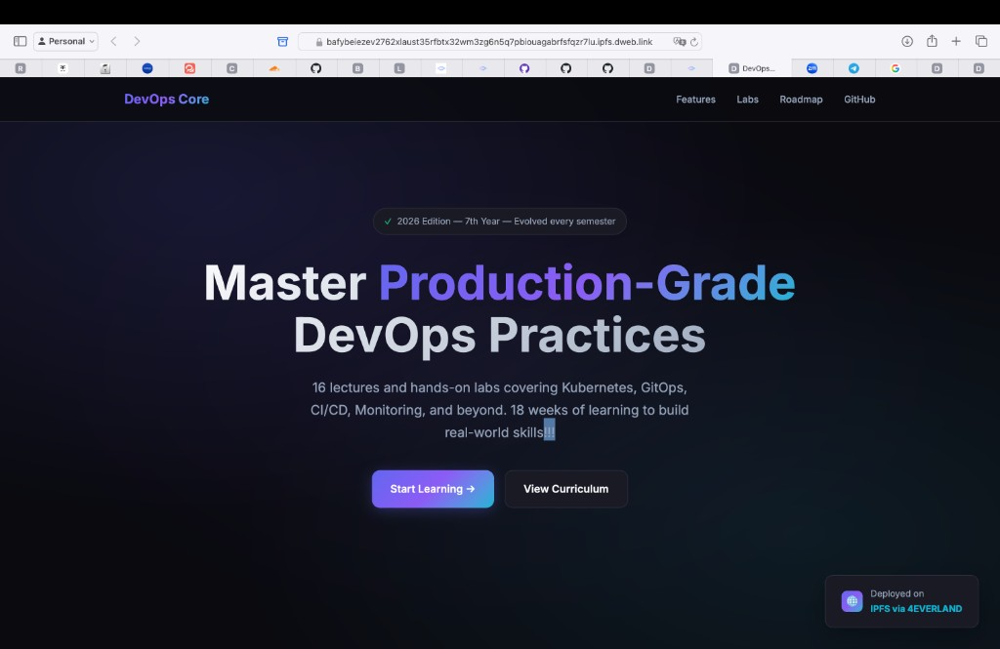
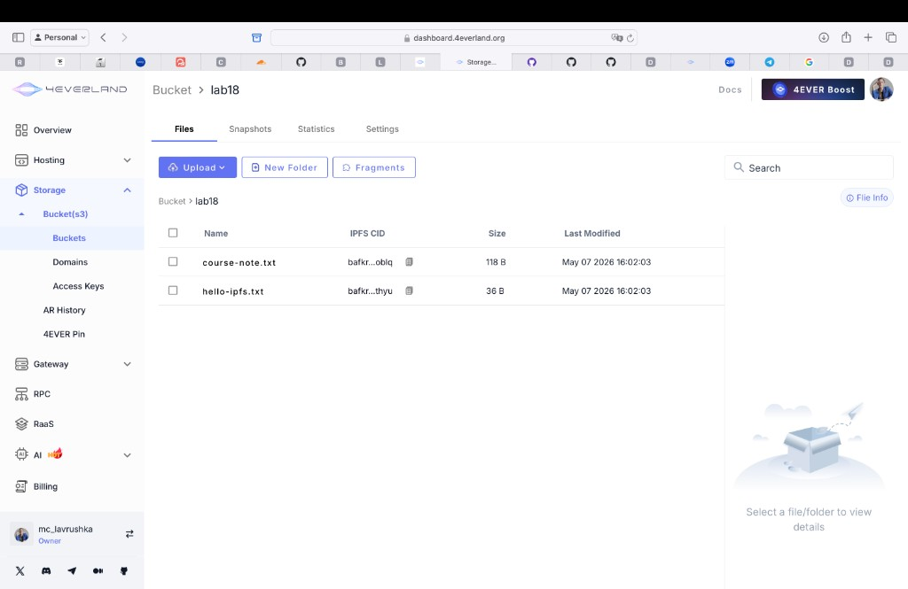
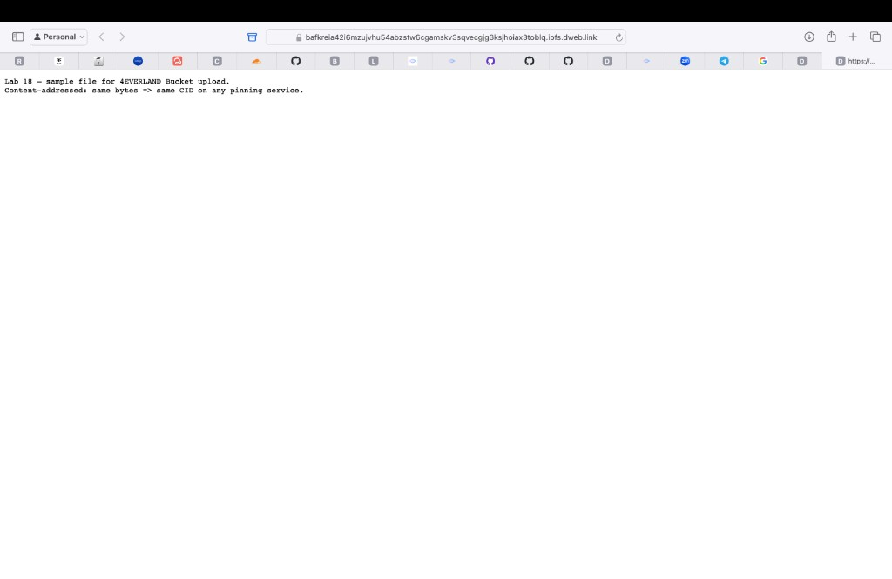

# Lab 18 — 4EVERLAND & IPFS

## 1. Deployment summary

| | |
|--|--|
| **What was deployed** | Static site from branch `lab18`: `labs/lab18/` (`index.html`). Commits through `5121b3f` on `origin/lab18` (includes redeploy after HTML change). |
| **Public site URL** | https://bafybeiezev2762xlaust35rfbtx32wm3zg6n5q7pbiouagabrfsfqzr7lu.ipfs.dweb.link/ |
| **Site / directory CID** | Current: `bafybeiezev2762xlaust35rfbtx32wm3zg6n5q7pbiouagabrfsfqzr7lu`. Previous build (before redeploy): `bafybeib2kzyofilvnswg3plm47sxwdgrjxnhklj6newiat4r7xftkobxze`. |
| **Same CID via other gateways** (current build) | `https://ipfs.io/ipfs/bafybeiezev2762xlaust35rfbtx32wm3zg6n5q7pbiouagabrfsfqzr7lu` · `https://ipfs.4everland.link/ipfs/bafybeiezev2762xlaust35rfbtx32wm3zg6n5q7pbiouagabrfsfqzr7lu` |
| **Local Kubo (Task 1)** | `docker compose -f labs/lab18/docker-compose.yml up -d`; `ipfs add` → `hello.txt` CID `QmeoZRLd2Srb2ENuEXA1BX8TJDM12qh6RpupazVikUz5PK`; `curl http://localhost:8080/ipfs/QmeoZRLd2Srb2ENuEXA1BX8TJDM12qh6RpupazVikUz5PK` returned redirect to the wrapped DAG URL (expected for Kubo gateway). |
| **Bucket (Task 4)** | Bucket **`lab18`**: `course-note.txt` → `bafkreia42i6mzujvhu54abzstw6cgamskv3sqvecgjg3ksjhoiax3toblq`; `hello-ipfs.txt` → `bafkreiblh6wuzfwwbgzunjjzhbwmd3bq75hrelwdzh6izu67zmvchwthyu`. Verified via `ipfs.io` (HTTP 200) and `dweb.link` (HTTP 200 with redirects). `ipfs.4everland.link` returned 404 in tests. |

## 2. Screenshots

## 3. Centralized vs decentralized comparison

| Aspect | Traditional Hosting | IPFS / 4EVERLAND |
|--------|----------------------|------------------|
| Content addressing | URLs point to a **location**; the same URL can serve different bytes over time. | Content is referenced by **CID** (hash of the content); the same bytes always resolve to the same CID. |
| Single point of failure | Depends on one provider, region, or origin; DNS and origin are central bottlenecks. | The same CID can be fetched via many gateways/peers, but availability still requires **pins** and gateway/DNS infrastructure for easy URLs. |
| Censorship resistance | Blocking a domain or seizing one host can take the site down. | Widely pinned content is harder to erase; **friendly URLs** and individual gateways can still be filtered. |
| Update mechanism | Overwrite files on the server; URL usually stays the same. | Content change implies a **new** CID; stable URLs use **IPNS**, hosting project URLs, or DNS that tracks the latest build. |
| Cost model | Typical VPS/PaaS billing for compute, egress, and storage. | Pinning and bandwidth quotas (e.g. free tiers); public gateways are shared and not a private SLA. |
| Speed/latency | Strong when origin and CDN are close to users. | Latency depends on gateway and whether the CID is already cached/replicated; first fetch can be slower for rare CIDs. |
| Best use cases | Dynamic apps, auth, databases, private data, strict operational SLAs. | Static sites, public artifacts, docs, verifiable downloads, read-mostly content with explicit pinning. |

## 4. Use case analysis

### When decentralized hosting makes sense

Public static sites and downloadable artifacts where **integrity** (matching the CID) matters; mirroring the same content from several gateways; reducing dependence on a single file host when combined with **pinning**.

### When traditional hosting is better

Server-rendered apps, sessions, **secrets**, transactional backends, strict compliance, fine-grained **access control**, and workloads that need predictable single-vendor support.

### Recommendations

Use **IPFS + pinning (e.g. 4EVERLAND)** for **static** frontends and public blobs; use **conventional or serverless backends** (e.g. APIs) where logic, auth, and databases belong. A common pattern is a stable **project URL** for the site while underlying **CIDs** change on each static rebuild.
