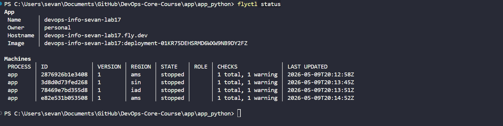
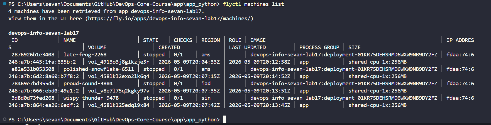
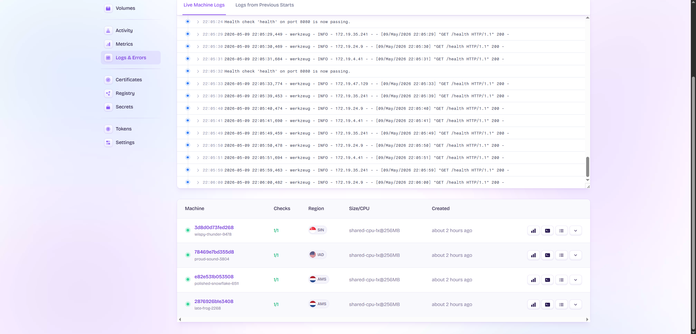
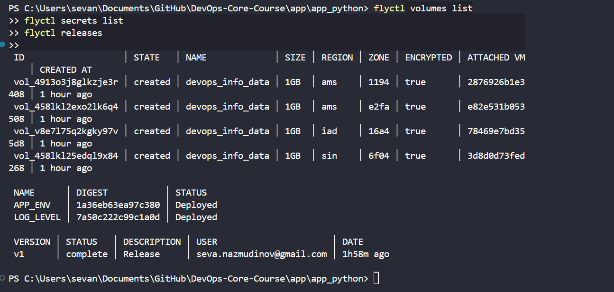
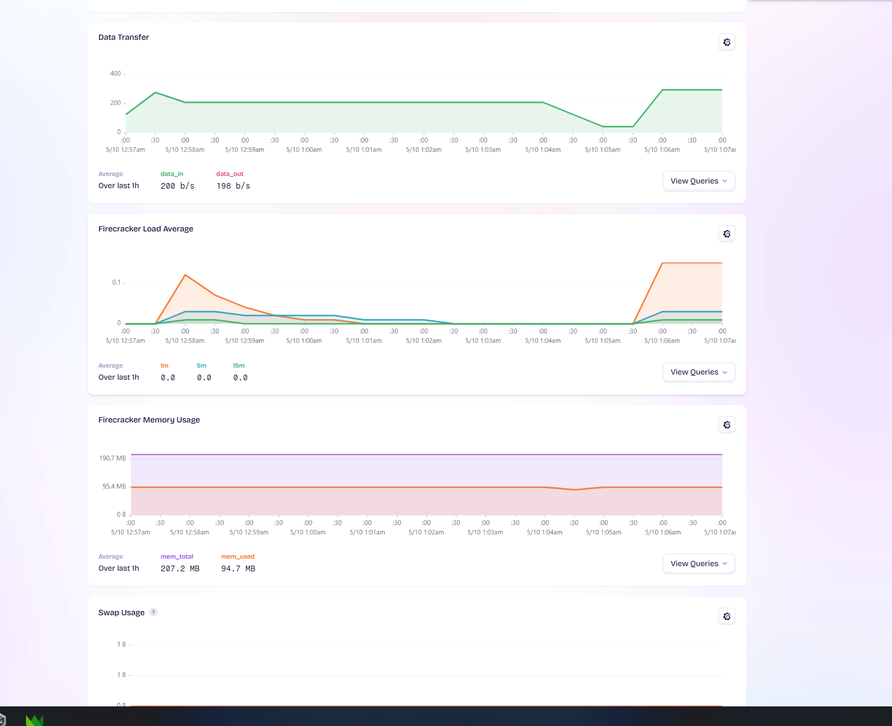

# Lab 17 - Fly.io Edge Deployment

## Note
Note: the live Fly.io deployment was shown to and checked by the professor. After verification, the deployment was stopped because keeping the service running may require paid cloud resources.


This lab deploys the Flask DevOps Info Service to Fly.io. The app runs from a Docker image, uses a health check, stores the visits counter on a Fly Volume, and runs in several regions.

## 1. Setup

I installed `flyctl` on Windows:

```powershell
winget install --id Fly-io.flyctl --accept-package-agreements --accept-source-agreements --silent
flyctl version
```

Result:

```text
flyctl.exe v0.4.49 windows/amd64
```

I logged in with:

```powershell
flyctl auth login
flyctl auth whoami
```

Result:

```text
seva.nazmudinov@gmail.com
```

## 2. App Configuration

The Fly.io config is in `app/app_python/fly.toml`.

Main settings:

- App name: `devops-info-sevan-lab17`
- Primary region: `ams`
- Internal port: `8080`
- HTTPS enabled
- Health check path: `/health`
- Persistent mount: `/data`

The app uses these environment variables:

```toml
[env]
  APP_ENV = "flyio"
  HOST = "0.0.0.0"
  PORT = "8080"
  VISITS_FILE_PATH = "/data/visits"
```

The Docker image was tested locally before deploy:

```powershell
docker build -t devops-info-service:lab17 app/app_python
docker run --rm -p 8080:8080 -e PORT=8080 -e VISITS_FILE_PATH=/data/visits devops-info-service:lab17
```

Local health check worked:

```json
{"status":"healthy","timestamp":"2026-05-09T19:15:31.177Z","uptime_seconds":3}
```

## 3. Deployment

I created the Fly app, volume, secrets, and deployed it:

```powershell
cd app/app_python
flyctl apps create devops-info-sevan-lab17
flyctl volumes create devops_info_data --size 1 --region ams
flyctl secrets set APP_ENV="flyio" LOG_LEVEL="info"
flyctl deploy
```

App URL:

```text
https://devops-info-sevan-lab17.fly.dev
```

The release is complete:

```text
VERSION | STATUS   | USER
v1      | complete | seva.nazmudinov@gmail.com
```

## 4. Application Verification

I checked the app endpoints:

```powershell
curl.exe --resolve devops-info-sevan-lab17.fly.dev:443:66.241.125.216 https://devops-info-sevan-lab17.fly.dev/health
curl.exe --resolve devops-info-sevan-lab17.fly.dev:443:66.241.125.216 https://devops-info-sevan-lab17.fly.dev/visits
curl.exe --resolve devops-info-sevan-lab17.fly.dev:443:66.241.125.216 https://devops-info-sevan-lab17.fly.dev/metrics
```

Health result:

```json
{"status":"healthy","timestamp":"2026-05-09T21:57:10.151Z","uptime_seconds":42}
```

Visits result:

```json
{"count":1,"storage_path":"/data/visits"}
```

Metrics result:

```text
devops_info_http_requests_total{endpoint="health",method="GET",status="200"} 6.0
devops_info_visits_total 0.0
devops_info_uptime_seconds 43.0
```

## 5. Multi-Region Deployment

The app runs in 3 regions:

- `ams` - Amsterdam
- `iad` - Virginia, USA
- `sin` - Singapore

There are 4 machines total:

- 2 machines in `ams`
- 1 machine in `iad`
- 1 machine in `sin`

Commands used:

```powershell
flyctl scale count 2 --region ams --with-new-volumes --yes
flyctl scale count 1 --region iad --with-new-volumes --yes
flyctl scale count 1 --region sin --with-new-volumes --yes
flyctl status
flyctl machines list
```

Machine status:



Machine list:



The dashboard also shows machines in `SIN`, `IAD`, and `AMS`, all with `1/1` checks:



## 6. Secrets and Persistence

I configured two secrets:

- `APP_ENV`
- `LOG_LEVEL`

I also created Fly Volumes for persistent data. The app writes the visits counter to:

```text
/data/visits
```

Because the app runs in multiple regions, each machine has its own attached volume.

Evidence:



## 7. Monitoring and Operations

Fly.io dashboard shows machine logs and health checks. The logs show `/health` requests returning `200`.

The app health check is configured in `fly.toml`:

```toml
[checks]
  [checks.health]
    type = "http"
    port = 8080
    path = "/health"
    interval = "10s"
    timeout = "2s"
    grace_period = "30s"
```

Metrics visible in the Fly.io dashboard:

- Data transfer
- Load average
- Memory usage
- Swap usage

Dashboard metrics:



Logs and health checks:


Note: `auto_stop_machines = true` is enabled, so Fly can stop machines after idle time and start them again when needed.

## 8. Kubernetes vs Fly.io

| Aspect | Kubernetes | Fly.io |
| --- | --- | --- |
| Setup complexity | High. Need cluster, networking, ingress, monitoring. | Lower. Create app and deploy with `flyctl`. |
| Deployment speed | Slower for a new project. Many YAML files are needed. | Faster. One `fly.toml` and one deploy command. |
| Global distribution | Possible, but hard. Usually needs multi-cluster setup. | Built in. Machines can run in many regions. |
| Cost for small apps | Can be expensive because cluster resources keep running. | Good for small apps because machines can auto stop/start. |
| Learning curve | Steep. Many Kubernetes objects and tools. | Easier. Fewer concepts for a small app. |
| Control and flexibility | Very high. | Lower than Kubernetes, but simpler. |
| Best use case | Large platforms and many services. | Small/medium apps with simple global deployment. |

## 9. When to Use Each

Use Kubernetes when:

- The system has many services.
- The team needs full control.
- The app needs custom networking or platform tools.
- The company already runs Kubernetes.

Use Fly.io when:

- The app is small or medium.
- Fast deployment is important.
- The app should run close to users.
- The team wants less infrastructure work.

My recommendation:

For this Flask service, Fly.io is a better fit. It is simpler than Kubernetes and gives global deployment with less configuration. Kubernetes is better for bigger systems with many services and more infrastructure requirements.

## 10. Final Status

Completed:

- `flyctl` installed and authenticated.
- Fly.io app created.
- Docker image deployed.
- App runs on port `8080`.
- `/health`, `/visits`, and `/metrics` work.
- Secrets configured.
- Volumes configured.
- 3 regions configured: `ams`, `iad`, `sin`.
- 4 machines created.
- Health checks pass.
- Fly dashboard metrics are available.
