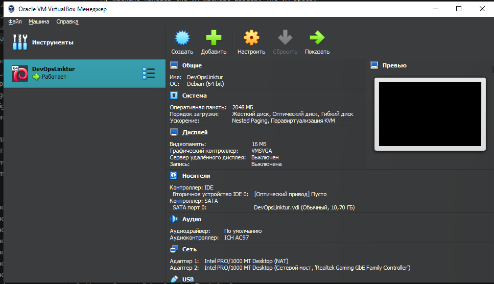
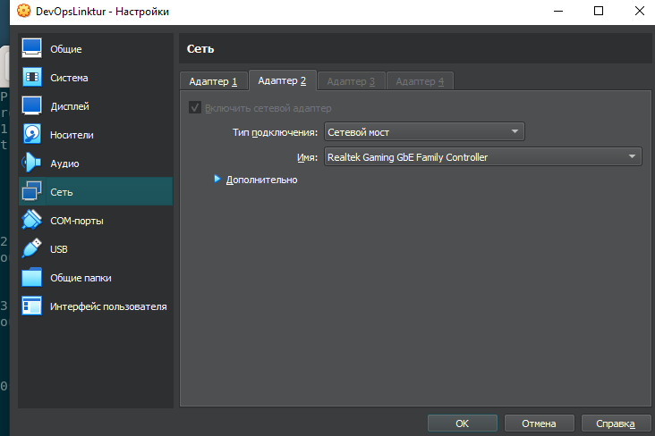
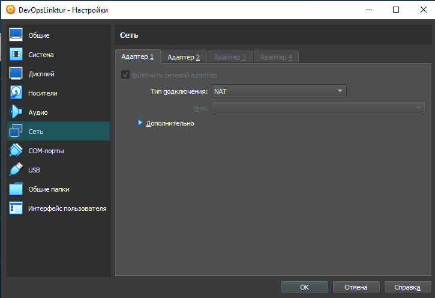
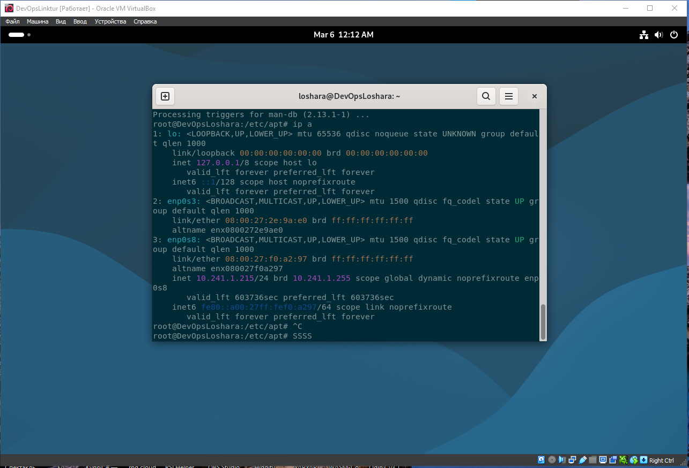
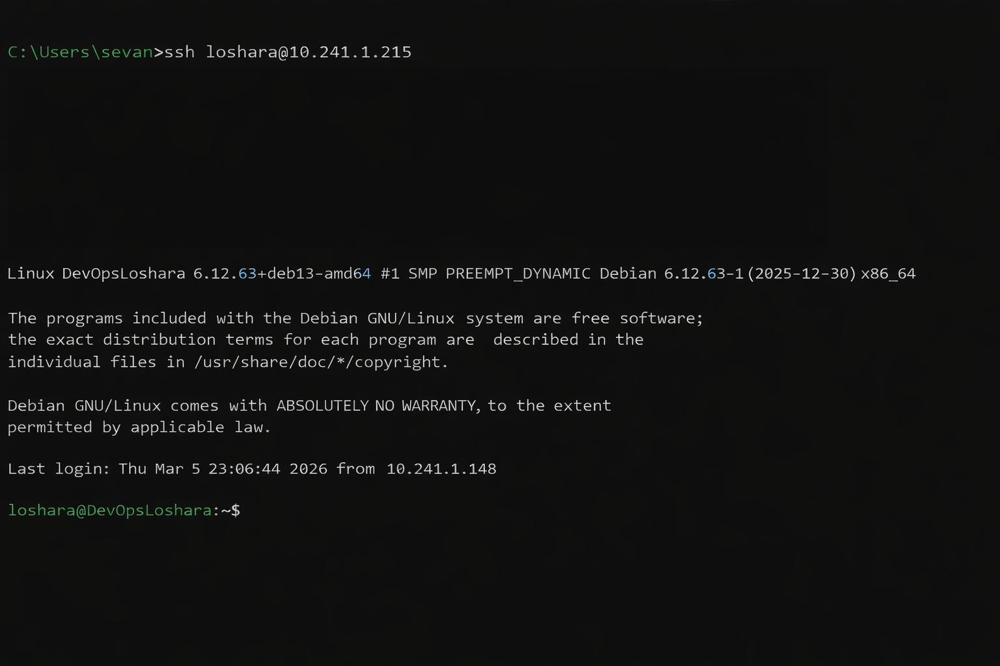

# LAB04

### 1. Provider & Infrastructure

I decided to use a local VM for this lab instead of a cloud instance, as I don't have access to any cloud provider. A local setup is also more convenient for my workflow.

My machine handles the VM without issues. The VM specs:

| Parameter       | Value                            |
|-----------------|----------------------------------|
| OS              | Debian 13 (6.12.63 amd64)        |
| RAM             | 2 GB                             |
| Disk            | 10 GB                            |
| Network         | Bridged mode                     |
| IP Address      | 10.241.1.215                    |
| SSH             | Installed and configured         |
| Auth            | Public key in `~/.ssh/authorized_keys` |

### 2. Terraform Implementation

Terraform was not applied against a cloud provider since a local VM was chosen. However, the full Terraform configuration for AWS is present in `terraform/` — it defines a VPC, subnets, security groups, and an EC2 instance — and passes `terraform validate` successfully.

### 3. Pulumi Implementation

Similarly, Pulumi was not run against a cloud provider. The full Pulumi Python configuration is available in `pulumi/` and mirrors the Terraform setup. `pulumi preview` confirms the plan is valid.

### 4. VM Creation

After downloading and installing `virtualbox-7.2` (host: `6.18.9+kali-amd64`) and the Debian 13 `.iso`, I set up the VM:

Then installed the required packages including `openssh-server`:

### 5. Exposed Ports & Firewall

The following ports are accessible within the bridged network:

| Port | Purpose  |
|------|----------|
| 22   | SSH      |
| 3000 | App      |

### 6. Lab 5 Preparation & Cleanup

**Keeping VM for Lab 5:** Yes

The local Debian 13 VM will be used directly in Lab 5 (Ansible) for Docker installation and application deployment.

No cloud resources were provisioned, so no `terraform destroy` or `pulumi destroy` is required.
