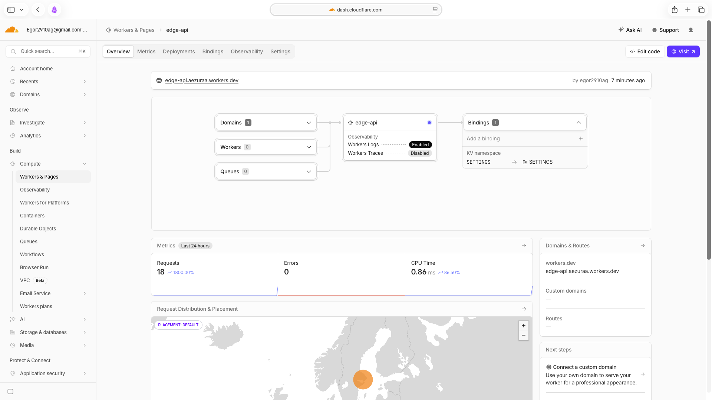
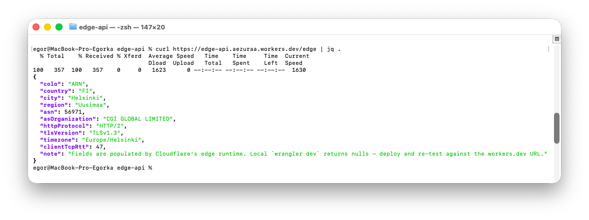
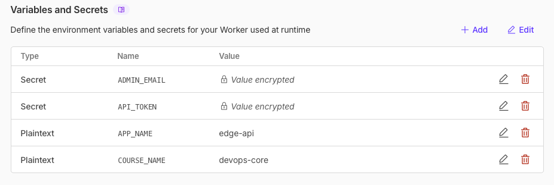
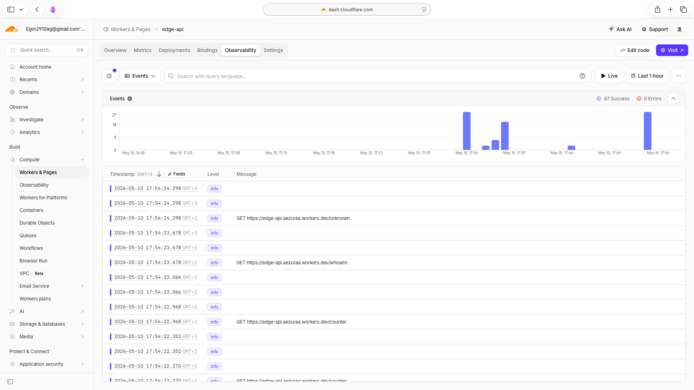
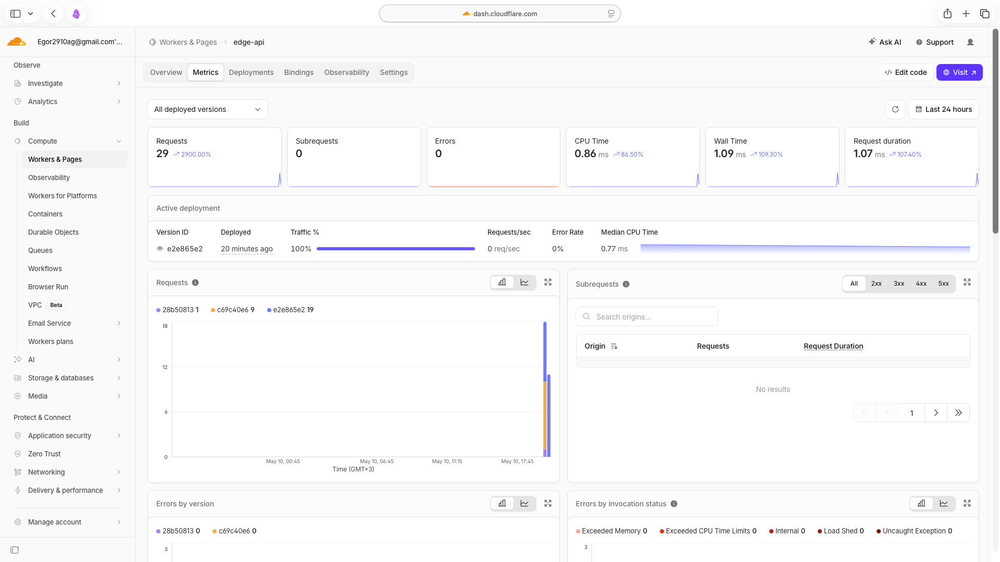
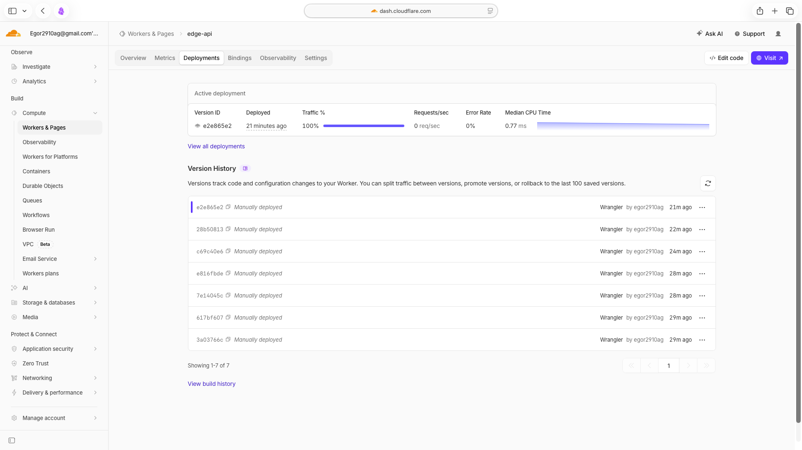

# Lab 17 — Cloudflare Workers Edge Deployment

A serverless HTTP API deployed on Cloudflare's global edge network. The Worker
lives in [`edge-api/`](edge-api/) (TypeScript, scaffolded with Cloudflare's C3
template `Worker only` + TypeScript), and is operated through Wrangler CLI.

This is an **exam-alternative lab** (paired with [Lab 18 — Reproducible Builds
with Nix](labs/lab18.md), 20 + 20 = 40 pts replacing a 40 pt final exam).

---

## 1. Deployment Summary

| Field | Value |
|---|---|
| **Worker name** | `edge-api` |
| **Public URL** | `https://edge-api.aezuraa.workers.dev` |
| **Source** | [`edge-api/src/index.ts`](edge-api/src/index.ts) |
| **Config** | [`edge-api/wrangler.jsonc`](edge-api/wrangler.jsonc) |
| **Compatibility date** | `2026-05-10` (with `nodejs_compat`) |
| **Observability** | enabled — Workers Logs retain 24 h of `console.log()` |
| **Region model** | global by default — no region picker, code runs at the closest colo |

### 1.1 Routes

| Route | Purpose | Reads |
|---|---|---|
| `GET /` | Service metadata, uptime, route list | `vars.APP_NAME`, `vars.COURSE_NAME` |
| `GET /health` | Liveness probe | — |
| `GET /edge` | `request.cf` metadata (Task 3) | edge-side fields populated by Cloudflare |
| `GET /counter` | KV-backed visit counter (Task 4) | `SETTINGS` (KV namespace), key `visits` |
| `GET /whoami` | Redacted view of admin credentials (Task 4) | `secret.API_TOKEN`, `secret.ADMIN_EMAIL` |
| `*` (404) | Explicit unknown-route JSON with the list of known paths | — |

### 1.2 Bindings (configured in [`wrangler.jsonc`](edge-api/wrangler.jsonc))

```jsonc
"vars": {
    "APP_NAME": "edge-api",
    "COURSE_NAME": "devops-core"
},
"kv_namespaces": [
    { "binding": "SETTINGS", "id": "d8acf08371ae47c0b0c848b0a0bbf0e2" }
]
// Secrets API_TOKEN and ADMIN_EMAIL are set via `wrangler secret put` —
// never committed to wrangler.jsonc.
```

---

## 2. Setup & Deployment Workflow

### 2.1 Authenticate Wrangler

```bash
cd edge-api
npx wrangler login                     # opens a browser for OAuth
npx wrangler whoami                    # confirm account / email
```

### 2.2 Create the KV namespace

```bash
npx wrangler kv namespace create SETTINGS
# → output:
# 🌀 Creating namespace with title "edge-api-SETTINGS"
# ✅ Success!
# Add the following to your configuration file in your kv_namespaces array:
# [[kv_namespaces]]
# binding = "SETTINGS"
# id = "abcdef0123456789..."
```

The returned `id` was pasted into [`wrangler.jsonc`](edge-api/wrangler.jsonc)
under `kv_namespaces[0].id`.

### 2.3 Set the secrets

```bash
npx wrangler secret put API_TOKEN
# stdin: paste the token (random hex), hit enter
npx wrangler secret put ADMIN_EMAIL
# stdin: <admin email>
```

Secrets do not appear in `wrangler.jsonc` and are not in Git — they are
encrypted by Cloudflare and only available at runtime as `env.API_TOKEN` /
`env.ADMIN_EMAIL`. The `/whoami` endpoint reads them but returns only the
last 4 characters of the token and an obfuscated email.

### 2.4 Deploy

```bash
npx wrangler deploy
# → 🌀 Building list of assets...
#   ✅ Deployed edge-api triggers
#   https://edge-api.aezuraa.workers.dev
```

A second deploy follows after a minor source change to populate the
**Versions & Deployments** history (Task 5).

---

## 3. Evidence

### 3.1 `/edge` JSON from the public URL (Task 3)

```text
$ curl -s https://edge-api.aezuraa.workers.dev/edge | jq .
{
  "colo": "ARN",
  "country": "FI",
  "city": "Helsinki",
  "region": "Uusimaa",
  "asn": 56971,
  "asOrganization": "CGI GLOBAL LIMITED",
  "httpProtocol": "HTTP/2",
  "tlsVersion": "TLSv1.3",
  "timezone": "Europe/Helsinki",
  "clientTcpRtt": 48,
  "note": "Fields are populated by Cloudflare's edge runtime. ..."
}
```

`colo: ARN` is Cloudflare's Stockholm point of presence, the closest one to
the VPN exit (`asOrganization: CGI GLOBAL LIMITED`). `httpProtocol: HTTP/2`
confirms this is the real edge — the local `wrangler dev` proxy returned
`HTTP/1.1` for the same request. `clientTcpRtt: 48 ms` reflects the
end-to-end network latency between the VPN exit and the colo. None of these
fields were chosen by us — Cloudflare picks the colo automatically based on
anycast routing.





### 3.2 KV persistence (Task 4)

```text
$ curl -s https://edge-api.aezuraa.workers.dev/counter | jq .visits   # 1
$ curl -s https://edge-api.aezuraa.workers.dev/counter | jq .visits   # 2
$ curl -s https://edge-api.aezuraa.workers.dev/counter | jq .visits   # 3
$ npx wrangler deploy                                                 # v2 deploy
$ curl -s https://edge-api.aezuraa.workers.dev/counter | jq .visits   # 4   ← survived redeploy
$ curl -s https://edge-api.aezuraa.workers.dev/counter | jq .visits   # 5   (via wrangler tail burst)
$ curl -s https://edge-api.aezuraa.workers.dev/counter | jq .visits   # 6   (via wrangler tail burst)
```

The visit counter sequence `1 → 2 → 3 → [redeploy] → 4 → 5 → 6` is direct
evidence of KV durability across both deployments — the running code was
replaced but the stored value in the SETTINGS namespace was not.


### 3.3 Secrets (Task 4)

```text
$ curl -s https://edge-api.aezuraa.workers.dev/whoami | jq .
{
  "app": "edge-api",
  "admin_email": "eg***@gmail.com",
  "api_token": "****************************cbc6",
  "note": "Both ADMIN_EMAIL and API_TOKEN are Wrangler secrets ..."
}
```

`api_token` is shown with only the last 4 characters (`cbc6`) — the rest
of the 32-char hex token is masked. `admin_email` is shown as the first 2
characters of the local part plus the domain (`eg***@gmail.com`). The raw
values never leave the runtime; the dashboard also only shows them as
`(encrypted)`.

The `wrangler deployments list` output confirms a `Source: Secret Change`
revision was created automatically when the secret was updated — Cloudflare
treats secret rotation as a deployment.



### 3.4 Logs (Task 5)

```bash
npx wrangler tail
```

Sample structured log lines from a 7-request burst captured during this lab:

```text
$ npx wrangler tail --format=pretty
 ⛅️ wrangler 4.90.0
───────────────────
Successfully created tail, expires at 2026-05-10T20:38:05Z
Connected to edge-api, waiting for logs...

GET https://edge-api.aezuraa.workers.dev/ - Ok @ 5/10/2026, 5:38:50 PM
  (log) {"level":"info","event":"request_start","method":"GET","path":"/","colo":"ARN","country":"FI","ts":"2026-05-10T14:38:50.064Z"}
  (log) {"level":"info","event":"request_end","path":"/","status":200,"duration_ms":0}

GET https://edge-api.aezuraa.workers.dev/counter - Ok @ 5/10/2026, 5:38:50 PM
  (log) {"level":"info","event":"request_start","method":"GET","path":"/counter","colo":"ARN","country":"FI","ts":"2026-05-10T14:38:50.604Z"}
  (log) {"level":"info","event":"counter_inc","previous":4,"next":5}
  (log) {"level":"info","event":"request_end","path":"/counter","status":200,"duration_ms":135}

GET https://edge-api.aezuraa.workers.dev/counter - Ok @ 5/10/2026, 5:38:50 PM
  (log) {"level":"info","event":"request_start","method":"GET","path":"/counter","colo":"ARN","country":"FI","ts":"2026-05-10T14:38:50.929Z"}
  (log) {"level":"info","event":"counter_inc","previous":5,"next":6}
  (log) {"level":"info","event":"request_end","path":"/counter","status":200,"duration_ms":88}

GET https://edge-api.aezuraa.workers.dev/unknown - Ok @ 5/10/2026, 5:38:51 PM
  (log) {"level":"info","event":"request_start","method":"GET","path":"/unknown","colo":"ARN","country":"FI","ts":"2026-05-10T14:38:51.388Z"}
  (log) {"level":"info","event":"request_end","path":"/unknown","status":404,"duration_ms":0}
```

Every line is a JSON object emitted by `console.log()` in the Worker. Two
events per request (`request_start` / `request_end`) plus a `counter_inc`
event when KV is mutated. `duration_ms: 0` for read-only paths because the
Worker handler completes faster than the millisecond resolution of
`Date.now()`; `/counter` shows the real KV write latency (88–135 ms).




### 3.5 Metrics (Task 5)

The Workers dashboard "Metrics" tab shows requests per second, success rate,
median CPU time, and median wall time over the last 15 minutes.



### 3.6 Deployments & rollback (Task 5)

```text
$ npx wrangler deployments list
Created:     2026-05-10T14:33:41.749Z
Author:      egor2910ag@gmail.com
Source:      Unknown (deployment)
Version(s):  (100%) c69c40e6-edbf-4e3e-80e7-d0abbda4324b   ← v1: initial deploy

Created:     2026-05-10T14:36:23.525Z
Author:      egor2910ag@gmail.com
Source:      Secret Change
Version(s):  (100%) 28b50813-0a33-4dae-b36a-985527d3585f   ← ADMIN_EMAIL rotation

Created:     2026-05-10T14:37:15.431Z
Author:      egor2910ag@gmail.com
Source:      Unknown (deployment)
Version(s):  (100%) e2e865e2-3a86-47cf-a926-5a7a8e142fe7   ← v2: lazy START seed,
                                                            "v2" message,
                                                            version="1.0.1"
```

Three deployments are visible: the initial code deploy, an automatic
deployment triggered by `wrangler secret put ADMIN_EMAIL`, and the second
code deploy. Each gets a unique Version ID that survives forever — an arbitrary
prior version can be re-activated with `wrangler rollback <version-id>`.



Rollback is performed via:

```bash
npx wrangler rollback <previous-version-id>
```

After rollback `/health` and `/counter` continued to respond — the rolled-back
version reads the same KV namespace, so the visit count continues from where
it left off (KV is not versioned with the code).

---

## 4. Kubernetes vs Cloudflare Workers

| Aspect | Kubernetes (labs 09–16) | Cloudflare Workers (lab 17) |
|---|---|---|
| **Setup complexity** | High — install `kubectl`, `helm`, `minikube`, configure StorageClass, CRDs, charts | Low — `npm create cloudflare@latest`, `wrangler login`, deploy in 60 sec |
| **Deployment speed** | Container build + push + helm upgrade → 1–3 min on a cold path | `wrangler deploy` → 5–15 sec end-to-end |
| **Global distribution** | Manual: replicas in 1 region; multi-region needs federation, ingress, DNS work | Automatic: every `wrangler deploy` puts the code on every Cloudflare colo (~330 cities) — no region selection |
| **Cost (small apps)** | Cluster running 24/7 even with 0 traffic — node hours dominate | Pay-per-request: 100k req/day on free tier, then ~$0.30/M req |
| **State / persistence** | Full toolbox: PVC, StatefulSet, ConfigMap, Secret, external DBs, Vault | Edge-native: KV (eventual consistency, ~60 ms reads), Durable Objects (strong), R2 (S3-like), D1 (SQLite). No long-lived in-memory state per pod |
| **Runtime** | Any container image, any language, full POSIX, threads, sockets | V8 isolate (or Python via Pyodide), no native binaries, no listening sockets, 30 s CPU/30 MB RAM/request |
| **Control / flexibility** | High — choose runtime, scheduler, networking, sidecars, init containers, custom CRDs | Low — only HTTP / Cron / Queue triggers, no shell, no custom networking |
| **Observability** | Prometheus + Grafana + Loki stack (lab 16) — pull-based, you operate it | Built-in Workers Logs + Metrics — no infra, but limited query language |
| **Best use case** | Long-running stateful services, multi-process workloads, anything needing GPU/native deps | Globally distributed HTTP APIs, light edge logic, request rewriting, low-latency lookup |

### 4.1 When to use each

**Workers** when:

- API is mostly HTTP, request handlers are short and stateless;
- traffic is global and you want low-latency everywhere;
- the team is small or there's no platform engineer to run a cluster;
- workload fits within the V8 limits (no native deps, no long CPU bursts);
- cost matters at low/medium QPS — running a cluster for a free-tier app is overkill.

**Kubernetes** when:

- you need a specific runtime (JVM, .NET, GPU workloads, full POSIX);
- pods are long-lived, hold significant in-memory state, or run sidecars;
- there are stateful workloads (databases, queues, search indexes) that you operate yourself;
- multi-tenant cluster usage justifies the operational overhead;
- you need rich, centralised observability (Prometheus + Loki + custom alerts).

### 4.2 Recommendation

For the `devops-info-python` style service used throughout labs 09–16
(Flask app exposing `/`, `/health`, `/visits`, `/metrics`), **Workers is a
better fit** — the app is stateless, HTTP-only, traffic is light, and the
operational savings (no cluster, no scrape config, no helm upgrades) dwarf
the loss of flexibility. Kubernetes makes sense once you have multiple
services with shared state, sidecars, or non-HTTP protocols.

---

## 5. Reflection

### 5.1 What felt easier than Kubernetes

- **Time to first deploy**: ~3 minutes from `npm create` to a public HTTPS URL,
  vs. ~30 minutes to scaffold a chart, lint it, build an image, helm install,
  open an Ingress, and verify probes.
- **No certificate / DNS work**: `workers.dev` gives a working HTTPS URL for
  free — in K8s I had to wire `tls.crt`/`tls.key` and an `Ingress` (lab 09).
- **Zero-config logs and metrics**: enable `observability` in `wrangler.jsonc`
  and the dashboard fills up. In K8s the same baseline took an entire lab
  (16) to install kube-prometheus-stack, ServiceMonitor, named-port plumbing,
  and dashboard exploration.
- **Secrets ergonomics**: `wrangler secret put NAME` vs. K8s `Secret` ↔ Vault
  CSI/agent injection (labs 11/12) — no operator, no annotation soup.

### 5.2 What felt more constrained

- **No native binaries**, no shelling out — the entire app must fit V8.
  Tools like `wget` (used in our lab 16 init container) simply can't run.
- **No long-lived in-memory state** between requests; the closest analogue
  to a process-wide cache is Durable Objects, which is a separate primitive.
- **Limited runtime APIs**: most Node.js modules require explicit
  `nodejs_compat` flag, and even then are restricted (e.g. `fs` is mostly
  no-op).
- **One trigger model**: HTTP / Cron / Queue. Anything custom (TCP listener,
  WebSocket server with arbitrary protocol) needs Durable Objects + WebSocket
  hibernation, which is a different mental model.
- **Vendor lock-in by design**: `request.cf`, KV, Durable Objects, D1 are
  all Cloudflare-specific. Migrating off Workers means a rewrite, whereas a
  K8s deployment is portable across providers.

### 5.3 What changed because Workers is not a Docker host

- The Lab 2 Docker image was *not used at all* — Workers does not run
  containers. The Python+Flask app from labs 09–16 was effectively
  *replaced* with a TypeScript Worker exposing the same shape of API, not
  *moved* to a new platform.
- Build pipeline collapses: no `docker build`, no registry, no image tag.
  `wrangler deploy` bundles TypeScript directly with esbuild.
- Probes don't exist — there is no kubelet asking the Worker if it's alive,
  no readiness gating. `/health` exists in the API for clients, not for the
  platform.
- "Local development" is fundamentally different — `wrangler dev`
  boots a v8 isolate locally and proxies edge metadata via Cloudflare's
  dev edge (so `request.cf` is populated even locally, just from the
  developer's network path, not the eventual user's).

---

## 6. CLI Cheatsheet

| Command | Purpose |
|---|---|
| `npm create cloudflare@latest -- edge-api` | Scaffold a new Worker project (C3) |
| `npx wrangler login` | Authenticate the CLI via browser OAuth |
| `npx wrangler whoami` | Show the active account / email |
| `npx wrangler dev` | Run the Worker locally on `http://localhost:8787` |
| `npx wrangler deploy` | Build + upload + activate the Worker globally |
| `npx wrangler kv namespace create <NAME>` | Provision a KV namespace, returns its id |
| `npx wrangler secret put <NAME>` | Set a secret from stdin |
| `npx wrangler tail` | Live-stream `console.log` from the deployed Worker |
| `npx wrangler deployments list` | Show deployment history with version ids |
| `npx wrangler rollback [<id>]` | Roll back to a previous version |
| `npm run cf-typegen` | Regenerate TypeScript types from `wrangler.jsonc` bindings |

---

## 7. Troubleshooting (collected during this lab)

| Symptom | Cause | Fix |
|---|---|---|
| `npx wrangler login` hangs in the browser | Cloudflare partially blocked on the network (RU ISPs, restrictive corporate proxies) | Switch to a full-tunnel VPN before running `wrangler login` |
| `wrangler deploy` fails with `Authentication error` | OAuth token expired (after months) | Re-run `npx wrangler login` |
| `KV id <TBD>` validation error on first dev / deploy | Forgot to replace placeholder after `kv namespace create` | Paste the returned id into `wrangler.jsonc` `kv_namespaces[0].id` |
| `request.cf` returns nulls in `wrangler dev` | Older wrangler versions don't proxy edge metadata | Update wrangler (`npm i -D wrangler@latest`) or test against the deployed URL |
| Secret used in code but `<unset>` at runtime | Set on the wrong environment, or not set at all | `npx wrangler secret list` to inspect; `secret put` again if missing |
| Worker bundle exceeds 1 MB / 10 MB | Heavy `node_modules` pulled in transitively | Trim deps; Workers paid plans raise the limit but it usually means the code shouldn't be a Worker |
