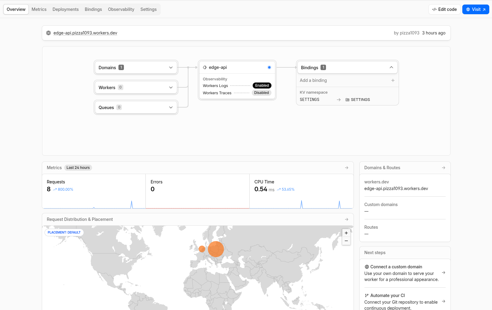
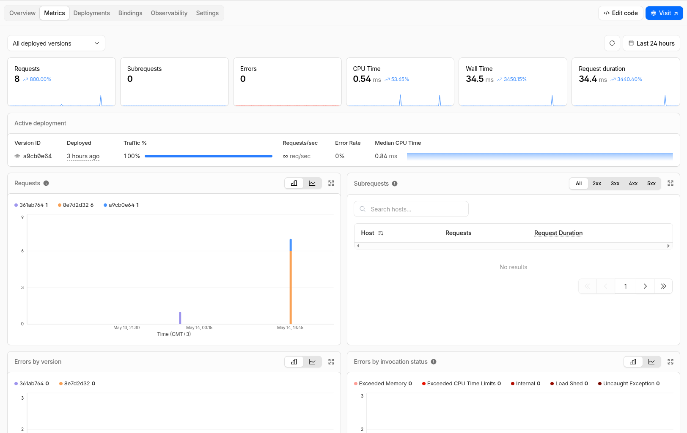

# Lab 17

## **Deployment Summary**

### Worker URL

- <https://edge-api.pizza1093.workers.dev>

### Main routes

| Route | Purpose | Returns |
|-------|---------|---------|
| **`/`** | Root endpoint with app metadata | JSON with app name, greeting, and timestamp |
| **`/health`** | Health check | `{ "status": "ok" }` |
| **`/edge`** | Edge metadata (geolocation, network info) | JSON with colo, country, city, ASN, HTTP protocol, TLS version |
| **`/counter`** | KV-backed persistent visit counter | JSON with current visit count |

### Configuration used

**Plaintext Environment Variables (in `wrangler.jsonc`):**

- `APP_NAME`: "edge-api"
- `COURSE_NAME`: "devops-core"

**Secrets (configured with `npx wrangler secret put`):**

- `API_TOKEN`
- `ADMIN_EMAIL`

**Bindings:**

- **KV Namespace:** `SETTINGS`
  - Stores: visit counter with key `"visits"`
  - Persists across deployments and redeployments

## **Evidence**

- Screenshot of Cloudflare dashboard



- Example `/edge` JSON response

```bash
curl https://edge-api.pizza1093.workers.dev/edge
{"colo":"WAW","country":"PL","city":"Warsaw","asn":209693,"httpProtocol":"HTTP/2","tlsVersion":"TLSv1.3"}
```

- Example log or metrics screenshot

```bash
 npx wrangler tail

 ⛅️ wrangler 4.90.1
───────────────────
Successfully created tail, expires at 2026-05-14T13:35:12Z
Connected to edge-api, waiting for logs...

GET https://edge-api.pizza1093.workers.dev/edge - Ok @ 5/14/2026, 10:41:55 AM
  (log) path /edge colo WAW
GET https://edge-api.pizza1093.workers.dev/counter - Ok @ 5/14/2026, 10:42:08 AM
  (log) path /counter colo WAW

```



- Persistency verification

```bash
curl https://edge-api.pizza1093.workers.dev/counter
{"visits":4}
curl https://edge-api.pizza1093.workers.dev/counter
{"visits":5}
```

## **Kubernetes vs Cloudflare Workers Comparison**

| Aspect | Kubernetes | Cloudflare Workers |
| ------ | ---------- | ------------------ |
| Setup complexity | Very high, requires deep kubernetes understanding | Low enough, just some commands and one config file |
| Deployment speed | several minutes (it depends) | about minute |
| Global distribution | Manual choose region | Automatic |
| Cost (for small apps) | expensive, because you pay also for the cluster itself | very cheap |
| State/persistence model | external database or pv | workers KV: simple key-value store at the edge; automatic global replication |
| Control/flexibility | very high, any runtime, any network configuration and etc | V8 runtime only, no arbitrary system access |
| Best use case | Long-running services, stateful applications, monoliths, complex microservices, batch jobs, custom infrastructure | Lightweight APIs, edge routing, request transformation, serverless functions, globally distributed logic |

1. **When to Use Each**

- Scenarios favoring Kubernetes
  - Long-running background jobs - Workers cold-start in milliseconds but are designed for request-response cycles, not persistent processes
  - Complex stateful systems - Multi-service architectures with inter-service communication, transactions, and shared databases
  - Custom runtime requirements - Need Python, Go, Java, or other languages; Workers is JavaScript/TypeScript only
  - Direct hardware/OS access - Require low-level networking, file system control, or specific system libraries
  - High compute intensity - CPU-heavy workloads (video processing, ML models); Workers have execution time limits (~30 seconds)
  - Large teams - RBAC, audit logs, resource quotas, and multi-tenant isolation are native to Kubernetes

- Scenarios favoring Workers

  - Global low-latency APIs - Your code runs in 300+ data centers; no "cold region" problem like Kubernetes
  - Request/response workflows - HTTP APIs, webhooks, reverse proxies, content transformation
  - Rapid deployment cycles - Deploy new versions in seconds; rollbacks are instant
  - Low traffic, high uptime - Pay for what you use; no idle cluster costs
  - Edge logic & routing - Request modification, authentication, A/B testing, geolocation-based responses
  - Simple persistence needs - KV is perfect for sessions, caches, feature flags, leaderboards
  - Teams starting serverless - Less operational overhead; no cluster management, networking, or scaling configuration

- Your recommendation

    **Choose Cloudflare Workers if:**
  - You're building a lightweight, globally distributed API or edge function
  - Your deployment speed and operational simplicity matter
  - You want to avoid infrastructure management

    **Choose Kubernetes if:**
  - You need advanced runtime features, multiple languages, or direct system access
  - Your workload is complex, stateful, or requires long-running processes
  - Your team has Kubernetes expertise and wants maximum control

1. **Reflection**

- What felt easier than Kubernetes?
  - Deployment is actually trivial, no need to build docker image, configure and etc.
- What felt more constrained?
  - I cannot run anything that I may want, only specific runtimes, Also, If I understand it right, I cannot use custom protocols, sockets and etc. Only http based. I can deploy it only to Cloudflare.
- What changed because Workers is not a Docker host?
  - Now app running in sandboxed env with his own rules.

## Checklist

- [X] Cloudflare account created
- [X] Workers project initialized
- [X] Wrangler authenticated
- [X] Worker deployed to `workers.dev`
- [X] `/health` endpoint working
- [X] Edge metadata endpoint implemented
- [X] At least 1 plaintext variable configured
- [X] At least 2 secrets configured
- [X] KV namespace created and bound
- [X] Persistence verified after redeploy
- [X] Logs or metrics reviewed
- [X] Deployment history viewed
- [] `WORKERS.md` documentation complete
- [] Kubernetes comparison documented
