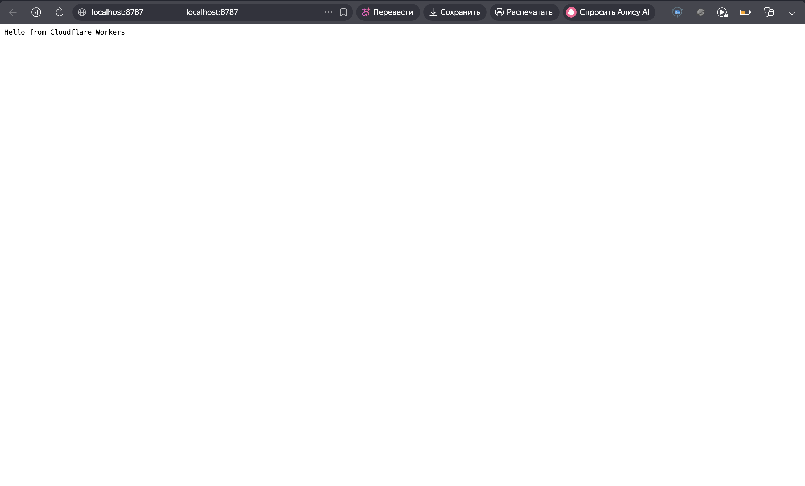
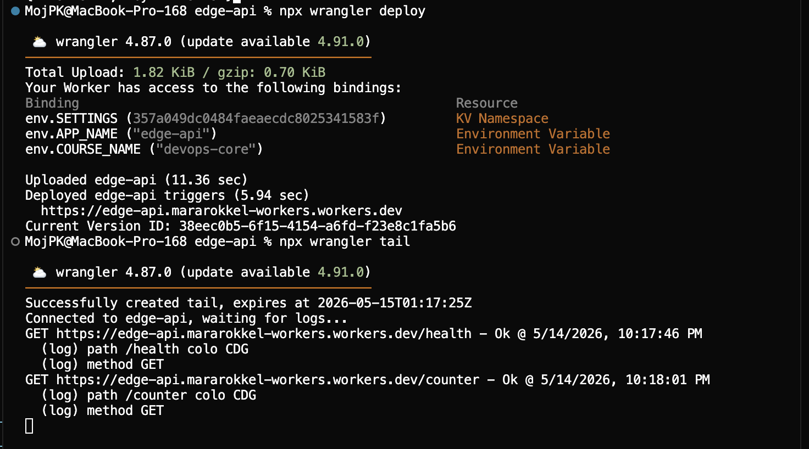
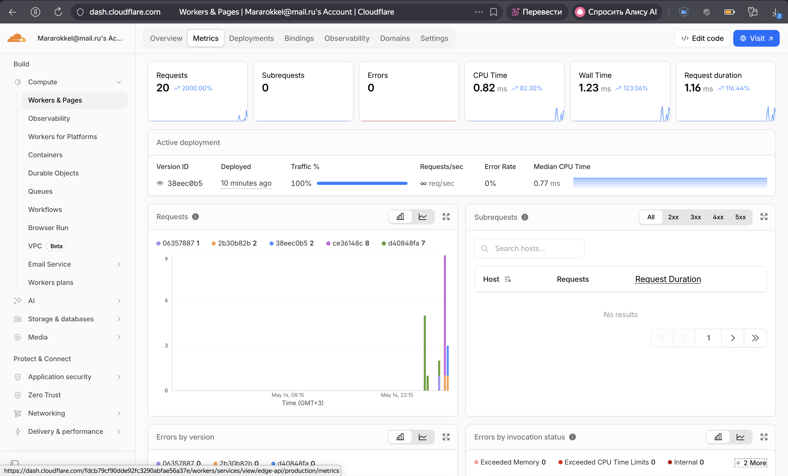
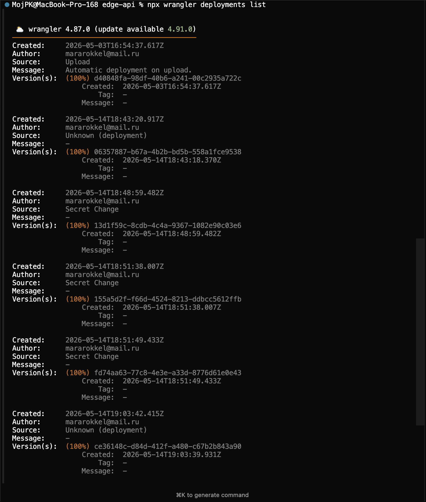
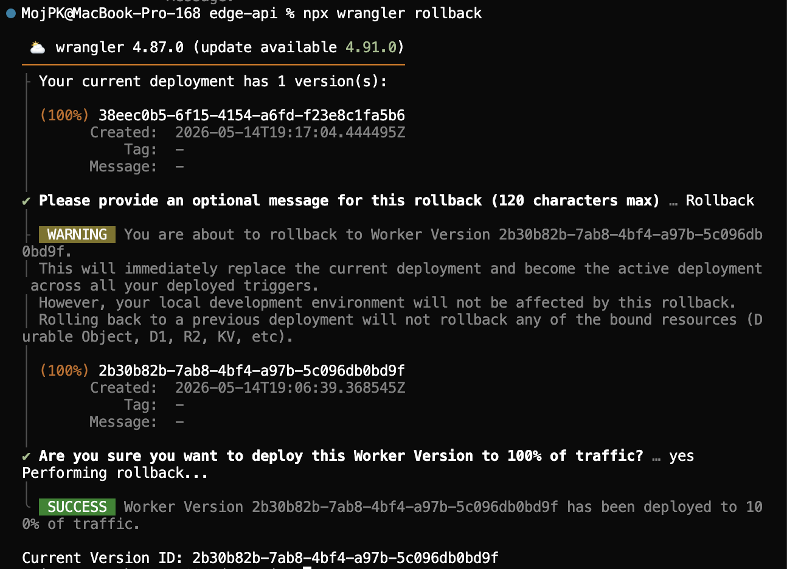

# Lab 17 — Cloudflare Workers Edge Deployment

This document records the `edge-api` Worker: configuration, public URL, HTTP behaviour, and operational evidence for the course lab.

---

## 1. Cloudflare setup (Task 1)

- Cloudflare account with Workers enabled; CLI authenticated with **`npx wrangler login`**.
- **`npx wrangler whoami`** confirms an OAuth token and account access.
- **workers.dev:** account subdomain **`mararokkel-workers`**. Workers are served at **`https://<worker-name>.mararokkel-workers.workers.dev`**.
- Project root: **`edge-api/`** — `src/index.ts` (handler), **`wrangler.jsonc`** (name, `compatibility_date`, `vars`, observability).

---

## Deployment summary

| Item | Value |
|------|--------|
| **Public URL** | `https://edge-api.mararokkel-workers.workers.dev` |
| **Worker name** | `edge-api` (`wrangler.jsonc` → `name`) |
| **Account workers.dev host** | `mararokkel-workers.workers.dev` |
| **Bindings** | `env.APP_NAME`, `env.COURSE_NAME` (plaintext `vars`); **`API_TOKEN`**, **`ADMIN_EMAIL`** (secrets); **`SETTINGS`** (KV) |
| **Version ID (current, 100% traffic)** | `2b30b82b-7ab8-4bf4-a97b-5c096db0bd9f` |
| **Version ID (superseded by rollback, 2026-05-14)** | `38eec0b5-6f15-4154-a6fd-f23e8c1fa5b6` |
| **Version ID (earlier deploy)** | `06357887-b67a-4b2b-bd5b-558a1fce9538` |
| **Version ID (initial deploy)** | `d40848fa-98df-40b6-a241-00c2935a722c` |

Traffic was rolled back from **`38eec0b5-…`** to **`2b30b82b-…`** with `npx wrangler rollback` (details under **Deployments and rollback** below); KV and secrets bindings stayed the same.

**Configuration (`edge-api/wrangler.jsonc`):** `compatibility_date` **2025-05-01**, observability enabled, **`vars`:** `APP_NAME` = `edge-api`, `COURSE_NAME` = `devops-core`; **`kv_namespaces`:** binding **`SETTINGS`**, id **`357a049dc0484faeaecdc8025341583f`**. Secrets are not stored in this file.

---

## 2. HTTP API (Task 2)

**Source:** `edge-api/src/index.ts`  
**Local dev:** `npx wrangler dev` → `http://127.0.0.1:8787`

| Method | Path | Response |
|--------|------|------------|
| GET | `/health` | `{"status":"ok"}` |
| GET | `/` | JSON: `app`, `course`, `message`, `timestamp` |
| GET | `/deploy-info` | JSON: `worker`, `course`, `runtime`, `compatibilityDate`, `observedAt` |
| GET | `/edge` | JSON from `request.cf`: `colo`, `country`, `city`, `asn`, `httpProtocol`, `tlsVersion` |
| GET | `/secrets-status` | JSON: secret presence flags and `apiTokenLength` (no raw secrets) |
| GET | `/counter` | JSON: KV-backed `visits` counter |
| * | other | `404 Not Found` |

### Production checks

Commands (host matches the deployed URL above):

```bash
curl -sS "https://edge-api.mararokkel-workers.workers.dev/health"
curl -sS "https://edge-api.mararokkel-workers.workers.dev/"
curl -sS "https://edge-api.mararokkel-workers.workers.dev/deploy-info"
curl -sS "https://edge-api.mararokkel-workers.workers.dev/edge"
curl -sS "https://edge-api.mararokkel-workers.workers.dev/counter"
curl -sS "https://edge-api.mararokkel-workers.workers.dev/secrets-status"
curl -sS -o /dev/null -w "%{http_code}\n" "https://edge-api.mararokkel-workers.workers.dev/unknown-route"
```

**Observed responses (2026-05-14):**

```text
$ curl -sS "https://edge-api.mararokkel-workers.workers.dev/health"
{"status":"ok"}

$ curl -sS "https://edge-api.mararokkel-workers.workers.dev/"
{"app":"edge-api","course":"devops-core","message":"edge-api worker","timestamp":"2026-05-14T17:24:58.998Z"}

$ curl -sS "https://edge-api.mararokkel-workers.workers.dev/deploy-info"
{"worker":"edge-api","course":"devops-core","runtime":"cloudflare-workers","compatibilityDate":"2025-05-01","observedAt":"2026-05-14T17:25:02.873Z"}

$ curl -sS -o /dev/null -w "%{http_code}\n" "https://edge-api.mararokkel-workers.workers.dev/unknown-route"
404

$ curl -sS "https://edge-api.mararokkel-workers.workers.dev/edge"
{"colo":"CDG","country":"FR","city":"Paris","asn":56971,"httpProtocol":"HTTP/2","tlsVersion":"TLSv1.3"}
```

The first `curl` to `/edge` before this deploy returned **404 Not Found** (previous bundle had no route); after **`npx wrangler deploy`** the handler served edge metadata (POP **CDG**, country **FR**, city **Paris**, ASN **56971**, **HTTP/2**, **TLSv1.3**).

Right after the first deploy, **`curl` to the public URL could hang** until DNS for the new `workers.dev` record propagated; retries after a few minutes succeeded as shown above.

### Local development (browser)



---

## 3. Global edge behaviour (Task 3)

**Route:** `GET /edge` — returns **`request.cf`** fields: `colo`, `country`, `city`, `asn`, `httpProtocol`, `tlsVersion` (null where the runtime does not populate them, e.g. some local `wrangler dev` cases).

```bash
curl -sS "https://edge-api.mararokkel-workers.workers.dev/edge"
```

**Sample production response** (captured when **`06357887-b67a-4b2b-bd5b-558a1fce9538`** was live; the same `/edge` shape applies on the current bundle):

```json
{"colo":"CDG","country":"FR","city":"Paris","asn":56971,"httpProtocol":"HTTP/2","tlsVersion":"TLSv1.3"}
```

The response shows Cloudflare attaching **edge request metadata** (`colo`, `country`, etc.) to the `Request` object at the POP that handled the call (here **CDG** / **Paris**, **FR**).

**Edge vs regions:** Workers run close to the client on Cloudflare’s network; you do not pick “three regions” per deploy the way you might with VMs or many PaaS defaults—the platform schedules isolates across the edge.

**workers.dev** — public hostname under `*.workers.dev`. **Routes** — attach a Worker to URLs in a zone managed in Cloudflare. **Custom domains** — serve a custom hostname as the Worker origin; this deployment used **`workers.dev`** only.

---

## 4. Configuration, secrets, and KV (Task 4)

### Plaintext `vars`

`wrangler.jsonc` defines **`APP_NAME`** and **`COURSE_NAME`** under **`vars`**. They are visible in Git and in the dashboard configuration, so they must not hold credentials—only **Secrets** (or other secret stores) are appropriate for tokens and private addresses.

### Secrets

| Name | Role |
|------|------|
| **`API_TOKEN`** | Uploaded with **`npx wrangler secret put API_TOKEN`** (value not stored in the repo). |
| **`ADMIN_EMAIL`** | Uploaded with **`npx wrangler secret put ADMIN_EMAIL`**; value stays in Cloudflare only. |

The Worker exposes **`GET /secrets-status`**, which returns booleans and the **length** of `API_TOKEN` only—never the raw secret strings.

### Workers KV

| Field | Value |
|-------|--------|
| Namespace title | `SETTINGS` |
| Namespace ID | `357a049dc0484faeaecdc8025341583f` |
| Binding | `SETTINGS` → `env.SETTINGS` (`KVNamespace`) |

`wrangler.jsonc` includes the `kv_namespaces` block above (added by Wrangler when the namespace was created). For **`npx wrangler dev`**, **remote KV** was left disabled (**no**), so local runs use a local KV simulation; production uses the remote namespace.

### API

- **`GET /counter`** — reads key **`visits`** from `SETTINGS`, increments, writes back, returns `{ visits, key }`.
- **`GET /secrets-status`** — proves secrets are bound without leaking values.

### Verification

Secrets **`API_TOKEN`** and **`ADMIN_EMAIL`** were uploaded with **`wrangler secret put`** (values only in Cloudflare). **`GET /counter`** was called repeatedly on the public URL until **`visits`** reached **3**; after **`npx wrangler deploy`** the counter read **4** on the next request, so KV was not reset by redeploy. **`GET /secrets-status`** confirms both secrets are bound without exposing values (transcript below).

### Production evidence (2026-05-14)

```text
$ curl -sS "https://edge-api.mararokkel-workers.workers.dev/secrets-status"
{"apiTokenConfigured":true,"adminEmailConfigured":true,"apiTokenLength":25}

$ curl -sS "https://edge-api.mararokkel-workers.workers.dev/counter"
{"visits":1,"key":"visits"}
$ curl -sS "https://edge-api.mararokkel-workers.workers.dev/counter"
{"visits":2,"key":"visits"}
$ curl -sS "https://edge-api.mararokkel-workers.workers.dev/counter"
{"visits":3,"key":"visits"}

$ npx wrangler deploy
… Current Version ID: 2b30b82b-7ab8-4bf4-a97b-5c096db0bd9f

$ curl -sS "https://edge-api.mararokkel-workers.workers.dev/counter"
{"visits":4,"key":"visits"}
```

---

## 5. Observability and operations

Logging in code (`edge-api/src/index.ts`):

```ts
console.log("path", url.pathname, "colo", request.cf?.colo);
console.log("method", request.method);
```

### 5.1 Tail logs (CLI)

`npx wrangler tail` was run from **`edge-api/`** while a second shell sent traffic to production:

```bash
BASE="https://edge-api.mararokkel-workers.workers.dev"
curl -sS "$BASE/health" >/dev/null
curl -sS "$BASE/counter" >/dev/null
```

Tail lines included **`path`**, **`colo`**, and **`method`** for those requests.



### 5.2 Metrics (dashboard)

In [Cloudflare dashboard](https://dash.cloudflare.com/) → **Workers & Pages** → **edge-api** → **Metrics**, the **Requests** series was reviewed: it shows total HTTP requests served by the Worker in the selected interval, together with error and resource charts for the same window.



### 5.3 Deployments and rollback

Deployment history from the CLI:

```bash
cd edge-api
npx wrangler deployments list
```



**Rollback:** `npx wrangler rollback` (interactive) was used on **2026-05-14** with message `Rollback`. Traffic moved from **`38eec0b5-6f15-4154-a6fd-f23e8c1fa5b6`** to **`2b30b82b-7ab8-4bf4-a97b-5c096db0bd9f`**. That operation creates a new deployment that points 100% of traffic at the chosen older Worker version; KV and secrets bindings are unchanged ([Cloudflare rollbacks](https://developers.cloudflare.com/workers/configuration/versions-and-deployments/rollbacks/)).



---

## 6. Kubernetes vs Cloudflare Workers (Task 6)

| Aspect | Kubernetes | Cloudflare Workers |
|--------|--------------|---------------------|
| Setup complexity | Cluster, networking, manifests/Helm, often CI | Account + Wrangler + small project |
| Deployment speed | Image build, push, rollout minutes–tens of min | Seconds for script upload |
| Global distribution | Multi-region clusters or traffic steering | Automatic edge placement |
| Cost (small apps) | Control plane + nodes even when idle | Generous free tier; pay per use at scale |
| State / persistence | PVCs, DBs, operators | KV, D1, R2, Durable Objects; not arbitrary POSIX |
| Control / flexibility | Full OS, any binary, sidecars | Sandboxed JS/TS (or limited WASM), platform APIs |
| Best use case | Stateful systems, batch, arbitrary containers | HTTP APIs, routing, edge logic close to users |

**When to prefer Kubernetes:** long-running services, databases on cluster, custom networking, workloads that need a full container image.

**When to prefer Workers:** latency-sensitive HTTP at the edge, small APIs, global fan-out without managing regions.

**Conclusion:** Workers fits this lab’s HTTP API; Kubernetes remains appropriate when the workload needs a full container, in-cluster state, or control planes already used elsewhere in the course.

**Reflection:** Workers avoids image builds and node pools but limits runtime and persistence compared to Kubernetes; deployment is a Workers bundle, not the Lab 2 container image reused as-is.
