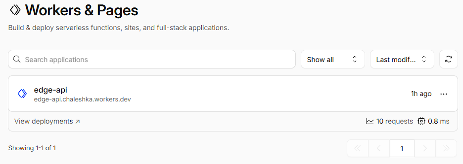
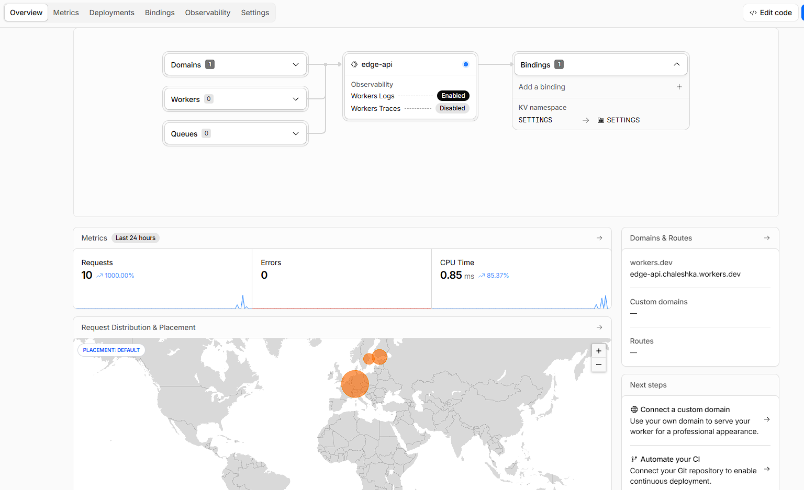
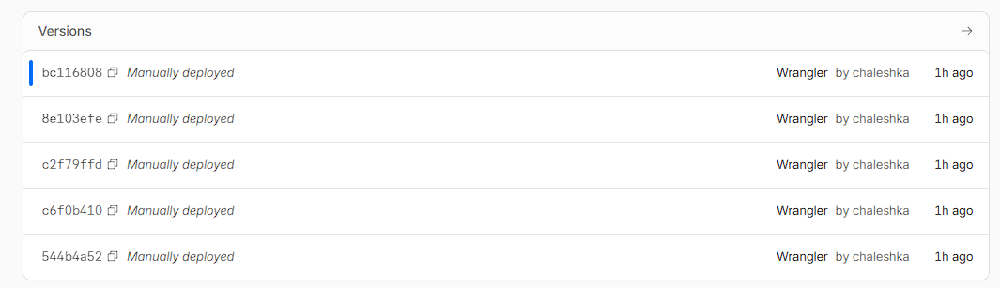
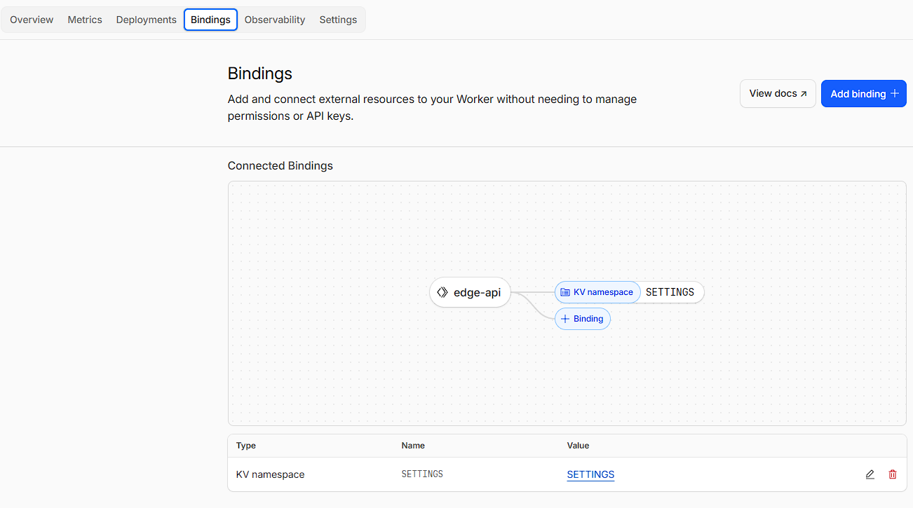
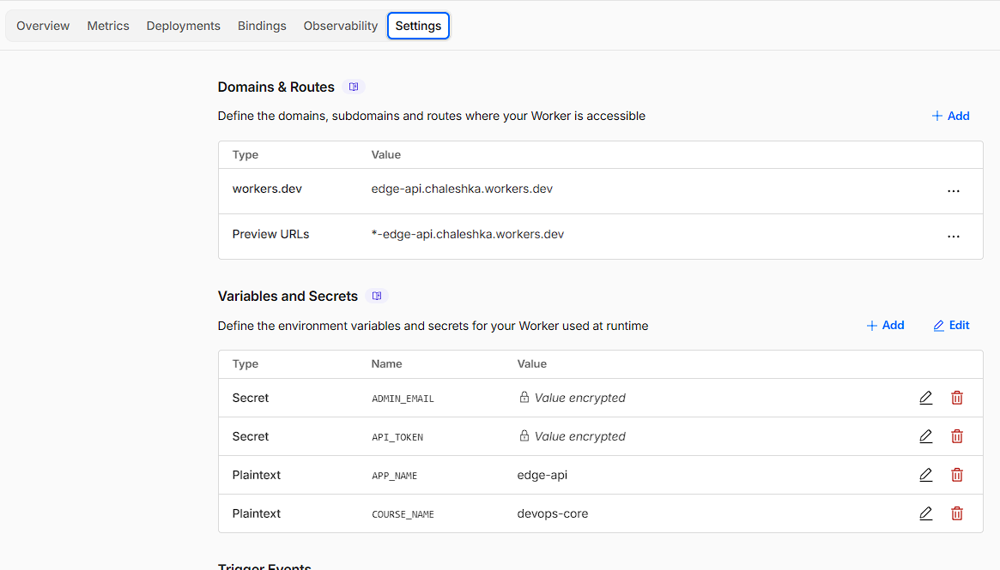
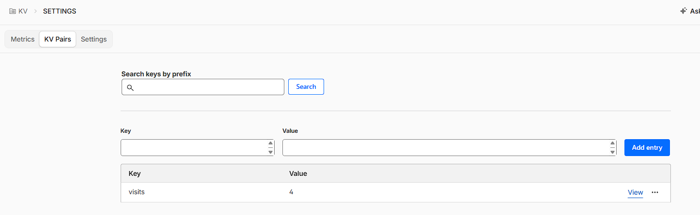
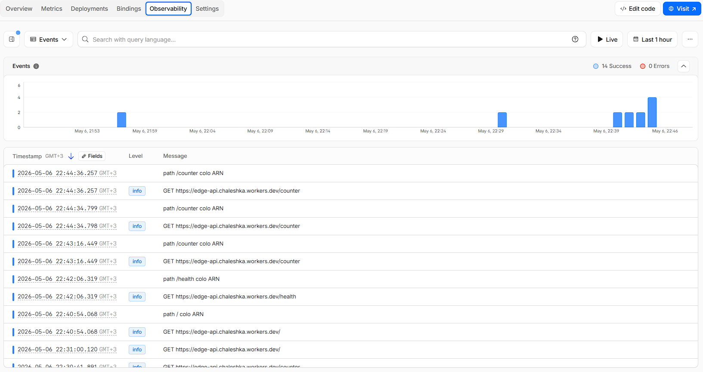
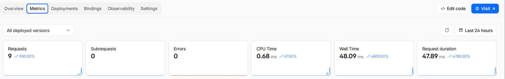

# Lab 17 — Cloudflare Workers Edge Deployment

## Deployment Summary

### Worker URL 

https://edge-api.chaleshka.workers.dev/

### Main routes

- `/`: App name, course name and boolean (secrets loaded)
- `/health`: App is alive
- `/edge`: Info about user's cf
- `/couunter`: Counter increment with visit this route

### Configuration used

- `kv_namespaces`: binding `SETTINGS` (id: `21bbed0ec4214bb5bb61268eb05ee6a2`)
- `vars`: `APP_NAME=edge-api`, `COURSE_NAME=devops-core` (plaintext vars)
- Secrets (created via Wrangler, not committed): `API_TOKEN`, `ADMIN_EMAIL`

## Evidence

### Screenshot of Cloudflare dashboard








### Example /edge JSON response

```json
{
  "colo": "FRA",
  "country": "NL",
  "region": "North Holland",
  "city": "Amsterdam",
  "timezone": "Europe/Amsterdam",
  "latitude": "52.37403",
  "longitude": "4.88969",
  "edgeRequestKeepAliveStatus": 1,
  "httpProtocol": "HTTP/2",
  "requestPriority": "weight=256;exclusive=1",
  "tlsVersion": "TLSv1.3"
}
```

### Example log or metrics screenshot




## Kubernetes vs Cloudflare Workers Comparison

| Aspect | Kubernetes | Cloudflare Workers |
|--------|------------|--------------------|
| Setup complexity | Higher: cluster, networking, infra provisioning and CI/CD | Low: create Worker and deploy; minimal infra management |
| Deployment speed | Slower: build images, push, rollouts | Fast: `npx wrangler deploy` distributes globally within seconds |
| Global distribution | Manual: choose cloud regions or multi-cluster setup | Automatic: executes at nearest Cloudflare edge node |
| Cost (for small apps) | Higher operational overhead and baseline costs | Lower cost for lightweight APIs; pay-per-execution model |
| State/persistence model | Full control: databases, volumes, StatefulSets | Managed options: Workers KV, Durable Objects (eventual consistency) |
| Control/flexibility | Full runtime control, custom binaries and networking | Constrained runtime (no arbitrary containers); fast iteration |
| Best use case | Stateful or complex workloads, custom runtimes, long-running processes | Low-latency edge APIs, request-level logic, CDN-fronted features |

## When to Use Each

### Scenarios favoring Kubernetes

- Stateful services requiring full control of runtime and storage
- Complex microservices with strict networking, sidecars, or custom binaries
- Workloads needing long-running processes, background jobs, or hardware access (GPUs)


### Scenarios favoring Workers

- Lightweight HTTP APIs that must be globally low-latency
- Edge concerns: header manipulation, A/B tests, auth at the edge, rate limiting
- Projects where operational overhead should be minimal and scaling automatic


### Your recommendation

When you need globally distributed API with minimal operations, or your application using minimal resources, or minimize infrastructure costs - use Cloudflare.

When you need complex stateful workloads or full container flexability, or youu need detailed control over storage and computing - use Kubernetes.


## Reflection

### What felt easier than Kubernetes?

Easy application create w/o clusters or pods, secrets management, observing, rollbacks and deploy for make Application or API globally availavle in few seconds.

### What felt more constrained?

Limited system (no full linux container). You can't create hard applications.

### What changed because Workers is not a Docker host?

- No port forwarding
- No install commands
- No Dockerfile configure
- No need to document evey requirements