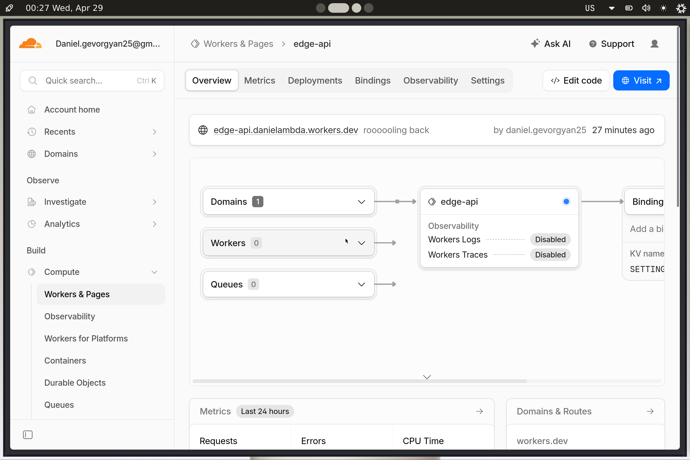

# Lab 17 — Cloudflare Workers (WORKERS.md)

## Deployment summary

- **Worker name**: `edge-api`
- **Worker URL (`workers.dev`)**: `https://edge-api.danielambda.workers.dev`
- **Main routes**
  - `GET /` app info + routes list
  - `GET /health` health check
  - `GET /meta` deployment metadata
  - `GET /edge` edge request metadata (`request.cf`)
  - `GET /counter` read KV counter (`SETTINGS:visits`)
  - `POST /counter` increment KV counter
  - `GET /settings/:key` read KV key
  - `PUT /settings/:key` write KV key (auth via `API_TOKEN`)

## Configuration used

- **Plaintext vars (in `edge-api/wrangler.jsonc`)**
  - `APP_NAME`
  - `APP_VERSION`
  - `COURSE_NAME`

Plaintext variables are stored in config and can be committed to Git, so they are **not suitable for secrets** (tokens, passwords, private keys) because they can leak via source control or logs.

- **Secrets (set via Wrangler, NOT committed)**
  - `API_TOKEN`
  - `ADMIN_EMAIL`

Secrets are stored and managed by Cloudflare and are injected into the Worker at runtime. They should never appear in Git history or `wrangler.jsonc`.

- **Persistence (Workers KV)**
  - KV namespace binding: `SETTINGS`
  - Stored values:
    - `visits` (used by `/counter`)
    - arbitrary keys (used by `/settings/:key`)

## Evidence

- **Screenshot: Cloudflare dashboard (Worker overview/metrics)**


- **Example `/edge` JSON response (from deployed URL)** (`GET https://edge-api.danielambda.workers.dev/edge`)

```json
{
  "colo": "ARN",
  "country": "FI",
  "city": "Helsinki",
  "asn": 56971,
  "asOrganization": "HostVDS.com Cloud Service Provider",
  "httpProtocol": "HTTP/2",
  "tlsVersion": "TLSv1.3",
  "timezone": "Europe/Helsinki",
  "region": "Uusimaa"
}
```

- **Example log entry**
  - Captured via `npx wrangler tail` (or dashboard logs)
  - Example:

```text
request {"method":"GET","path":"/edge","colo":"ARN","country":"FI","httpProtocol":"HTTP/2"}
```

- **Deployment history + rollback evidence**
  - `npx wrangler deployments list` shows multiple deployments/versions (deploy + secret changes).
  - Rollback performed successfully:
    - Rolled back from `a6fd644d-8d17-4b0b-b333-17ea36bda9e3` to `bd250a1b-6d4a-4359-9d8a-ce651e468ddd`
    - Current Version ID after rollback: `bd250a1b-6d4a-4359-9d8a-ce651e468ddd`

## How global distribution works (Workers vs “regions”)

Cloudflare Workers runs your code on Cloudflare’s global edge network. Incoming requests are routed to a nearby Cloudflare data center (colo), and the Worker executes there, so you typically get low latency without choosing regions manually.

With VMs / many PaaS platforms, you usually:
- pick one or more regions,
- deploy separately per region,
- and manage global routing/latency as an extra step.

Workers doesn’t have a “deploy to 3 regions” step because the platform **automatically distributes** the Worker across Cloudflare’s edge footprint; you deploy one Worker version and Cloudflare handles where it executes.

## Routing concepts

- **`workers.dev`**
  - A fast default public hostname Cloudflare provides for your account/subdomain.
  - Good for labs and quick public testing.

- **Routes**
  - Used to attach a Worker to requests for an existing Cloudflare-managed zone (e.g., run the Worker for `example.com/api/*`).

- **Custom Domains**
  - Make your Worker the origin for a domain/subdomain you control, often with more production-friendly naming and integration.

This lab uses **`workers.dev`** for the required deployment.

## Persistence verification (after redeploy)

What was stored:
- KV key `visits` via `POST /counter`

How it was verified:
- Call `POST /counter` a few times, note the number increases.
- Deploy a new Worker version.
- Call `GET /counter` or `POST /counter` again and confirm the value continues (KV persisted across deploys).

## Observability & operations

- **Logs**
  - The Worker logs every request using `console.log(...)`.
  - View with:
    - `npx wrangler tail`

## Local development note (NixOS)

- **Metrics**
  - In the Cloudflare dashboard, review one of:
    - request count,
    - error rate,
    - latency / CPU time.
  - Note here which metric you reviewed and what you observed.

- **Deployments & rollback**
  - Deploy at least two versions:
    - `npx wrangler deploy`
  - View history:
    - `npx wrangler deployments list`
  - Roll back (or describe doing so):
    - `npx wrangler rollback`

## Kubernetes vs Cloudflare Workers comparison

| Aspect | Kubernetes | Cloudflare Workers |
|--------|------------|--------------------|
| Setup complexity | Higher (cluster, networking, ingress, images) | Lower (project + config + deploy) |
| Deployment speed | Medium–slow (build/push image + rollout) | Fast (deploy JS/TS bundle) |
| Global distribution | You choose regions/clusters; manage routing | Built-in edge footprint; automatic |
| Cost (for small apps) | Often higher baseline (nodes/cluster costs) | Often low/usage-based for small APIs |
| State/persistence model | Many options (DB, PV, caches); you operate them | Platform bindings (KV/D1/R2/Durable Objects); managed |
| Control/flexibility | Very high (any container/process) | Constrained runtime + platform limits |
| Best use case | Complex apps, custom runtimes, long-running services | Lightweight APIs, edge logic, low-latency global endpoints |

## When to use each

- **Favor Kubernetes when**
  - you need custom runtimes/binaries, GPUs, long-lived processes, background workers,
  - you need fine-grained networking/storage control,
  - you run many services with complex internal communication.

- **Favor Workers when**
  - you need globally distributed request handling with minimal ops,
  - you build an API gateway/edge auth/routing layer,
  - you want fast iteration with simple managed persistence.

- **Recommendation**
  - Use **Workers** for edge API + routing/metadata and simple key/value state.
  - Use **Kubernetes** for anything that truly needs containers, complex stateful workloads, or deep infra control.

## Reflection

- What felt easier than Kubernetes?
  - Single deploy target + no cluster/ingress management.
  - Built-in public URL and request metadata.

- What felt more constrained?
  - Runtime limits and the “Worker-first” programming model.
  - Persistence via platform bindings rather than arbitrary local disks.

- What changed because Workers is not a Docker host?
  - No “build an image and run it”; instead, you ship a Worker bundle and attach managed services (KV/secrets/vars).

