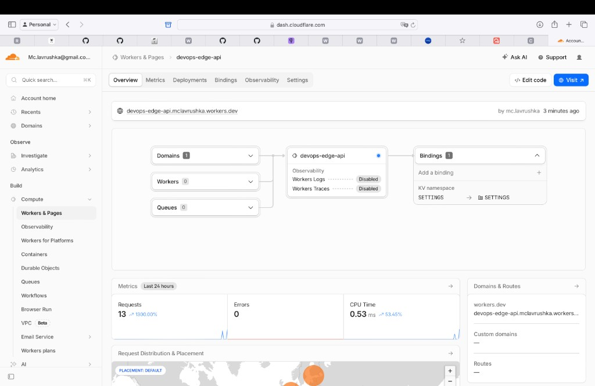
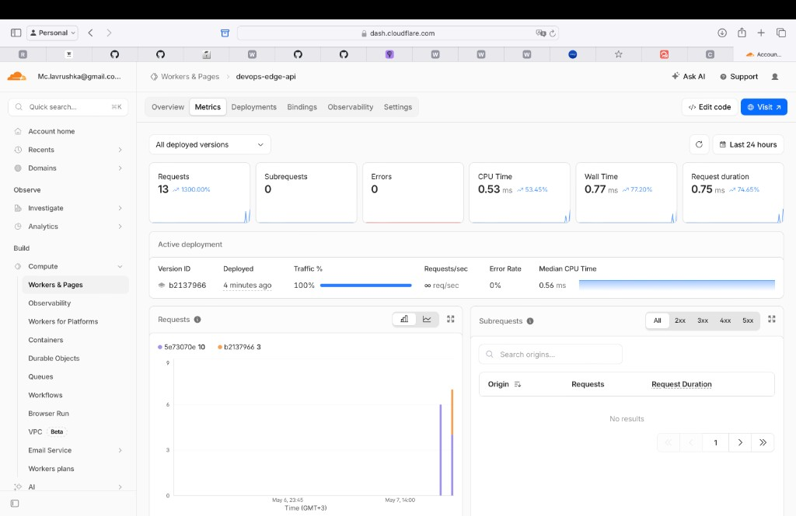

# Lab 17 — Cloudflare Workers

## 1. Deployment summary

| Item | Value |
|------|--------|
| **Worker URL (`workers.dev`)** | `https://devops-edge-api.mclavrushka.workers.dev` |
| **Account `workers.dev` subdomain** | `mclavrushka.workers.dev` |
| **Main routes** | `GET /` (deployment metadata JSON), `GET /health`, `GET /edge` (request `cf` metadata), `GET /counter` (KV-backed visit counter) |
| **Configuration** | `edge-api/wrangler.jsonc`: `compatibility_date` 2025-05-07, `vars` `APP_NAME`, `COURSE_NAME`; KV binding **`SETTINGS`** (`8a8027a83ff6466aaf031d1cc5baa731`); secrets **`API_TOKEN`**, **`ADMIN_EMAIL`** (Wrangler only, not in Git). **Plaintext `vars`** are fine for non-sensitive labels; they ship in config and are visible to anyone with repo or dashboard access — **not** suitable for tokens/passwords (use **secrets** instead). |
| **Persistence check** | After `npx wrangler deploy`, `GET /counter` returned `visits: 1`, then `2` — KV counter survives redeploy (same namespace binding). |
| **Operations** | `npx wrangler deployments list`: several versions (upload, secret changes, deploys). Rollback executed to `5e73070e-f19a-418c-a381-da1b1741f18b`, then a later deploy produced `b2137966-0729-46a0-be2c-d7018a03447e` (see Metrics). |

### Global edge behavior (Task 3)

- Workers run at Cloudflare **PoPs**; code is **not** pinned to “3 regions” like VMs — the platform schedules execution **near the client**. The `/edge` response shows **colo**, **country**, and related **`request.cf`** fields; values **depend on where the request enters** the network (e.g. **AMS / NL** from a browser in Europe vs **IAD / US** from another vantage).
- **`workers.dev`** — quick default hostname `*.workers.dev`. **Routes** attach a Worker to a zone’s URL patterns. **Custom domains** put the Worker on your own hostname (optional for this lab).

---

## 2. Evidence

### Dashboard & metrics





**Metrics reviewed (Task 5):** request count (13 in the 24h window), **errors** (0), and **median CPU time** (~0.53 ms) — confirms traffic reaches production with no execution failures and very low isolate CPU per request.

### Example `GET /` (deployment JSON)

```json
{"runtime":"cloudflare-workers","app_name":"devops-edge-api","course":"devops-core","timestamp":"2026-05-07T11:05:00.604Z","routes":["/","/health","/edge","/counter"],"secrets_configured":{"api_token":true,"admin_email":true}}
```

### Example `GET /health`

```json
{"status":"ok"}
```

### Example `GET /edge` (captured from browser; fields vary by viewer / PoP)

```json
{"colo":"AMS","country":"NL","city":"Amsterdam","asn":205489,"httpProtocol":"HTTP/2","tlsVersion":"TLSv1.3"}
```

*(For the same URL, another client may see another colo, e.g. `IAD` / `US` — that illustrates edge routing.)*

### Logs (`npx wrangler tail`)

```text
GET https://devops-edge-api.mclavrushka.workers.dev/health - Ok @ 5/7/2026, 2:08:56 PM
  (log) request { path: '/health', colo: 'AMS', country: 'NL' }
GET https://devops-edge-api.mclavrushka.workers.dev/edge - Ok @ 5/7/2026, 2:09:06 PM
  (log) request { path: '/edge', colo: 'AMS', country: 'NL' }
```

### Deployments & rollback (excerpt)

```text
npx wrangler rollback → deployed version 5e73070e-f19a-418c-a381-da1b1741f18b to 100% traffic
(Current Version ID after rollback shown in CLI.)

Later deployment list includes version b2137966-0729-46a0-be2c-d7018a03447e (re-deploy).
```

---

## 3. Kubernetes vs Cloudflare Workers

| Aspect | Kubernetes | Cloudflare Workers |
|--------|------------|-------------------|
| **Setup complexity** | High: cluster lifecycle, networking, storage, RBAC. | Low: account + Wrangler; no nodes to manage. |
| **Deployment speed** | Slower loop (image build, manifests, rollouts). | Fast: `wrangler deploy`, small bundles. |
| **Global distribution** | Multi-region is manual/heavy; often one region + extra CDN. | Automatic global PoPs; no “pick 3 regions” deploy step. |
| **Cost (for small apps)** | Cluster/node cost even for tiny services. | Generous free tier for small Workers; pay for usage. |
| **State/persistence model** | Pods + PVCs, DBs, operators. | Bindings (KV, D1, R2, …); not a general POSIX filesystem. |
| **Control/flexibility** | Full container/runtime choice, CRDs, mesh, etc. | Sandboxed V8 isolate model; opinionated platform limits. |
| **Best use case** | Broad enterprise workloads, stateful systems, existing K8s. | HTTP/API edge logic, redirects, lightweight global APIs. |

---

## 4. When to use each

**Scenarios favoring Kubernetes:** long-running containers, heavy dependencies, cluster-wide policy, self-hosted data planes, teams already standardized on K8s.

**Scenarios favoring Workers:** latency-sensitive HTTP at the edge, small secure bundles, minimal ops, global footprint without regional VM provisioning.

**Your recommendation:** use **Kubernetes** when you need **opaque containers and cluster primitives**; use **Workers** for **global request-path code** where the platform’s bindings and runtime are enough.

---

## 5. Reflection

**What felt easier than Kubernetes?** One-command deploys, no cluster or image registry loop, immediate `workers.dev` URL, built-in TLS.

**What felt more constrained?** No Node/Python “full server”; dependency and CPU/memory model differs from containers; persistence only via platform bindings.

**What changed because Workers is not a Docker host?** Shipping **handler code + config** instead of **images + orchestration**; state is **KV/binding-shaped**, not arbitrary files in a container.
