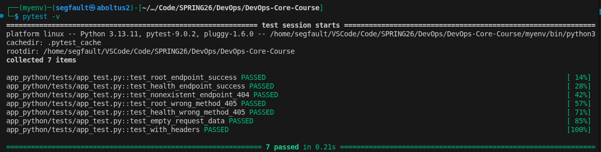

# LAB03 — Continuous Integration (CI/CD)
[](https://github.com/CacucoH/DevOps-Core-Course/actions/workflows/python-ci.yml)

## 1. Unit testing
### 1.1 Testing framework choise
To complete this lab I selected **pytest**:
- Supports fuxtures
- Simple to use
- Easilly integrates with Flask

#### 1.2 Tests structure explanation:
- `test_root_endpoint_success`: Verifies GET / returns 200 status, checks complete JSON structure (service, system, runtime, request, endpoints fields), validates data types (str, int, list), and mocks uptime/system_info for consistent testing.
- `test_health_endpoint_success`: Tests GET /health returns 200 status, confirms health JSON structure (status, timestamp, uptime_seconds), verifies string/integer data types.
- `test_nonexistent_endpoint_404`: Ensures non-existent endpoint /nonexistent returns 404 status with correct error JSON structure ("Not Found" message).
- `test_root_wrong_method_404`: Confirms POST to root / (unsupported method) returns 404 status code.
- `test_health_wrong_method_405`: Verifies POST to /health (unsupported method) returns 404 status code.
- `test_unsupported_methods_405`: Parametrized test checking PUT, DELETE, PATCH methods on various endpoints all return 404 status.
- `test_empty_request_data`: Edge case test ensuring basic GET / works without additional request data, validates client_ip presence in response.
- `test_with_headers`: Edge case testing custom User-Agent header, confirms request parsing correctly extracts and returns header value in JSON.

#### 1.3 Running tests locally
Execute (in main project directory)
```bash
pytest
```
All test should pass


### 2 CI Workflow
CI workflow triggers on:
- push to `main`, `dev`, and `lab3` branches
- pull requests

It performs:
1. Linting (ruff)
2. Testing (pytest)
3. Coverage generation
4. Docker build & push
5. Snyk security scan


## 2. Versioning Strategy
I have chosen Calendar Versioning (CalVer YYYY.MM):
- Format: 2026.02 (current month) + latest
- Implementation: docker/metadata-action@v5 with type=raw,value={{date 'YYYY.MM'}}
- Why CalVer: Perfect for CI/CD pipelines with frequent releases, date-based tracking

### 2.1 Key Implementation Highlights
CI Stages:
1. Test job (matrix: Python 3.9-3.11)
   - Ruff linting + formatting
   - Pytest unit tests
2. Docker job (depends on tests)
   - Multi-tag strategy (latest + CalVer + branch)
   - Docker layer caching for speed

### 2.2 Triggers Logic:
- main/dev push: full CI/CD (tests + Docker push)
- PR: tests only (no Docker push)
- Any branch: basic linting

Also I used Git secrets:
- DOCKER_USERNAME
- DOCKERHUB_TOKEN (Docker Hub Access Token)
- SNYK_TOKEN

### 2.3 Evidence

#### - [👉 Link to successful CI (full lab done)](https://github.com/CacucoH/DevOps-Core-Course/actions/runs/21959626699)
#### - Tests passing locally:

#### - [Docker image on Docker Hub](https://hub.docker.com/r/cacucoh/testiks) 


## 3. Best Practices Implemented
1. Matrix Testing: Tests Python 3.9-3.11 in parallel across multiple jobs, ensuring cross-version compatibility
2. Job Dependencies: Docker build only runs after tests pass (needs: test), preventing broken images from being pushed
3. Docker Layer Caching: cache-from/to: type=gha reduces build time from 5+ minutes to ~30 seconds on repeat runs
4. Caching: Pip dependencies cached, so: 3min to 15sec speedup; Docker layers sped up from 5min to 30sec

## 4. Key Decisions
- Versioning Strategy: CalVer (YYYY.MM) chosen over SemVer because this is a CI/CD pipeline with frequent automated releases—dates provide instant temporal context without manual version management.
- Docker Tags: Creates username/app:latest (production), username/app:2026.02 (monthly archive), username/app:main (branch tracking)—multiple tags enable flexible deployments and rollbacks.
- Workflow Triggers: push to main/develop → full CI/CD; pull_request → tests only; all branches → linting—balances automation with safety (no Docker push from PRs/forks).
- Test Coverage: Unit tests via pytest + linting/formatting via ruff cover code quality; integration/E2E tests and security scanning deferred to future tasks.
