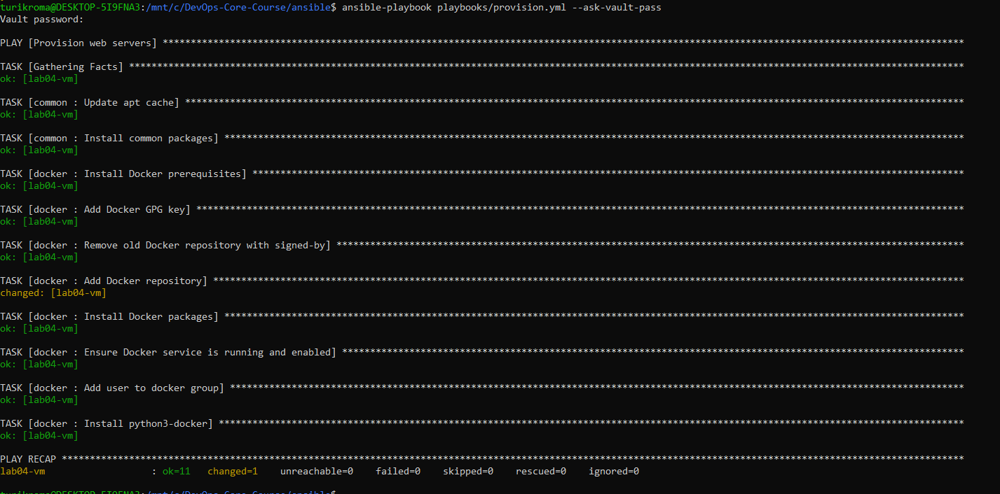
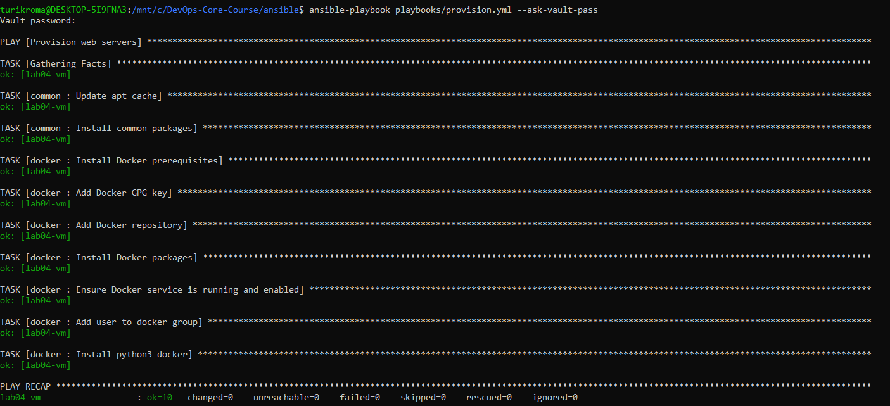
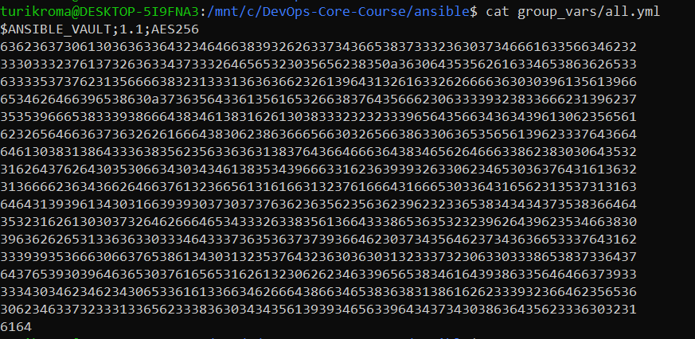
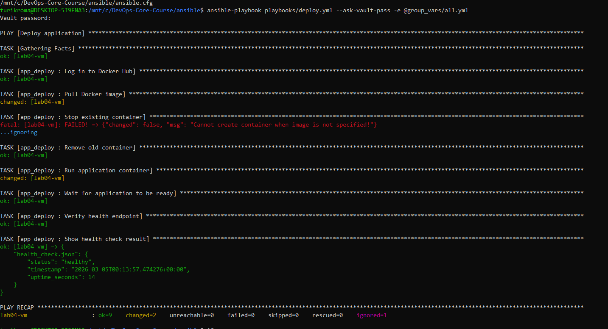
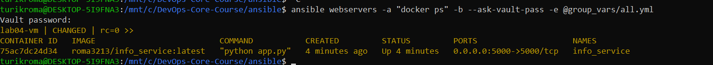
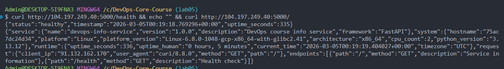

# Lab 05 — Ansible Fundamentals

## 1. Architecture Overview

**Ansible version:** 2.16.3

**Target VM:** Ubuntu 22.04 LTS on GCP (e2-micro, us-central1-a)

**Control node:** WSL Ubuntu on Windows (MINGW64)

**Role structure:**

```
ansible/
├── inventory/
│   └── hosts.ini
├── roles/
│   ├── common/
│   │   ├── tasks/main.yml
│   │   └── defaults/main.yml
│   ├── docker/
│   │   ├── tasks/main.yml
│   │   ├── handlers/main.yml
│   │   └── defaults/main.yml
│   └── app_deploy/
│       ├── tasks/main.yml
│       ├── handlers/main.yml
│       └── defaults/main.yml
├── playbooks/
│   ├── site.yml
│   ├── provision.yml
│   └── deploy.yml
├── group_vars/
│   └── all.yml (encrypted)
└── ansible.cfg
```

**Why roles instead of monolithic playbooks?** Reusability — each role is independent and can be used across projects. Clear separation of concerns: common setup, Docker installation, and app deployment are logically separate tasks.

---

## 2. Roles Documentation

### common

**Purpose:** Basic system setup — update apt cache, install essential packages.

**Variables:**
- `common_packages` — list of packages (python3-pip, curl, git, vim, htop, wget, unzip)

**Handlers:** None.

**Dependencies:** None.

### docker

**Purpose:** Install Docker CE from official repository, configure service, add user to docker group.

**Variables:**
- `docker_user` — user to add to docker group (default: ubuntu)
- `docker_version` — Docker version constraint (default: latest)

**Handlers:**
- `restart docker` — restarts Docker service when configuration changes

**Dependencies:** None (but should run after common).

### app_deploy

**Purpose:** Deploy containerized application — pull image from Docker Hub, run container, verify health.

**Variables:**
- `app_port` — application port (default: 5000)
- `app_restart_policy` — container restart policy (default: unless-stopped)

**Handlers:**
- `restart app container` — restarts application container

**Dependencies:** docker role must be applied first.

---

## 3. Idempotency Demonstration

**First run** (`ansible-playbook playbooks/provision.yml`):



Result: `ok=11, changed=1` — only apt cache update triggered "changed" (expected behavior, cache was stale). All other tasks already in desired state from previous runs.

**Second run:**



Result: `ok=10, changed=0` — zero changes. All tasks report "ok" (green). Cache is still fresh (`cache_valid_time: 3600`).

**Analysis:** Roles are idempotent because they use stateful Ansible modules (`apt` with `state: present`, `service` with `state: started`, `user` with `append: yes`). These modules check current state before making changes. Running playbooks multiple times is safe — only applies changes when state drifts from desired.

---

## 4. Ansible Vault Usage

**What is stored:** Docker Hub credentials (`dockerhub_username`, `dockerhub_password`), application configuration (`app_name`, `docker_image`, `app_port`).

**Vault file:** `group_vars/all.yml` — encrypted with `ansible-vault encrypt`.

**Password management:** `--ask-vault-pass` flag on each run. No `.vault_pass` file committed.

**Encrypted file (proof):**



**Why Vault is important:** Credentials must never be stored in plaintext in version control. Vault encrypts sensitive data with AES256, allowing safe commits while keeping secrets protected.

---

## 5. Deployment Verification

**Deploy run** (`ansible-playbook playbooks/deploy.yml --ask-vault-pass`):



Result: `ok=9, changed=2` — pulled image and started container. Health check passed: `"status": "healthy"`.

**Container status** (`ansible webservers -a "docker ps"`):



```
CONTAINER ID  IMAGE                          STATUS      PORTS                    NAMES
75ac7dc24d34  roma3213/info_service:latest    Up          0.0.0.0:5000->5000/tcp   info_service
```

**Health check verification:**



- `curl http://104.197.249.40:5000/health` → `{"status":"healthy","timestamp":"2026-03-05T00:13:57"}`
- `curl http://104.197.249.40:5000/` → Full service info (name, version, system, runtime, endpoints)

---

## 6. Key Decisions

**Why use roles instead of plain playbooks?** Reusability, organization, maintainability. Use same role across projects, share via Ansible Galaxy.

**How do roles improve reusability?** Self-contained with own tasks, handlers, defaults. Mix and match in different playbooks without duplication.

**What makes a task idempotent?** Stateful modules: `apt: state=present`, `service: state=started`, `file: state=directory`. Check current state before acting.

**How do handlers improve efficiency?** Only run when notified, execute once at end of play. Prevent unnecessary service restarts.

**Why is Ansible Vault necessary?** Encrypts sensitive data (AES256) for safe storage in version control. `no_log: true` hides credentials from task output.

---

## 7. Challenges

- **WSL world writable directory:** Ansible ignores `ansible.cfg` in `/mnt/c/` (Windows filesystem). Fix: `export ANSIBLE_CONFIG=/mnt/c/DevOps-Core-Course/ansible/ansible.cfg`
- **Vault variables not loaded by deploy.yml:** `group_vars/all.yml` not picked up automatically. Fix: explicit `-e @group_vars/all.yml` flag
- **WSL terminal inconvenience:** vim opens incorrectly in WSL on Windows, `ansible-vault create` unusable. Fix: created file with `echo` and encrypted with `ansible-vault encrypt`
