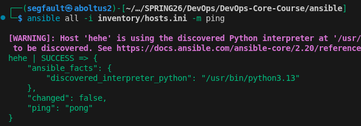
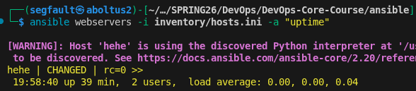
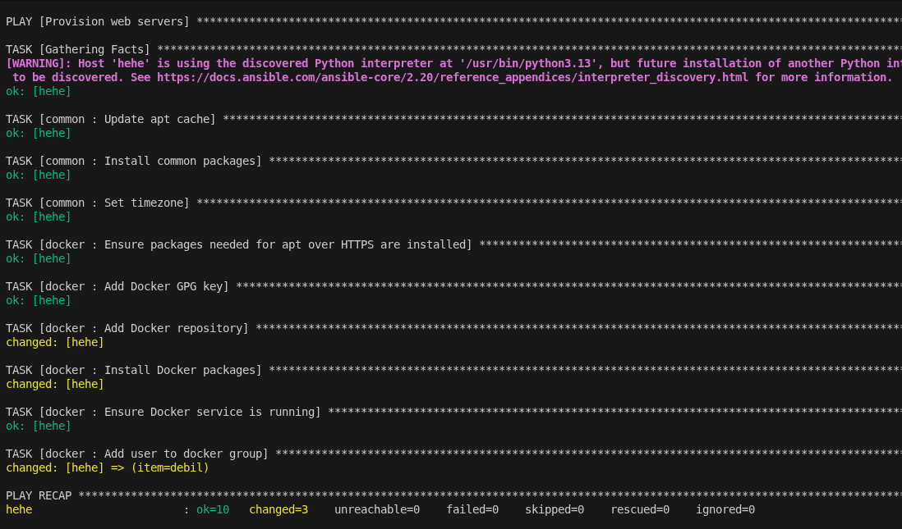
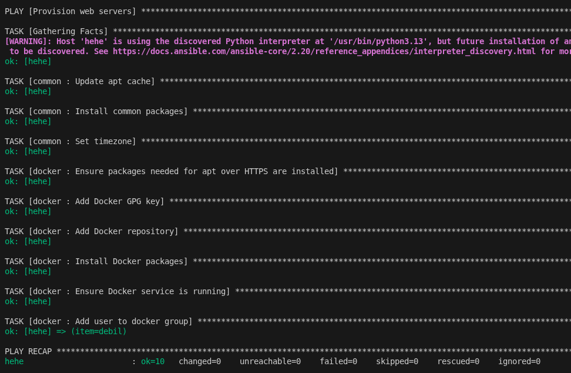
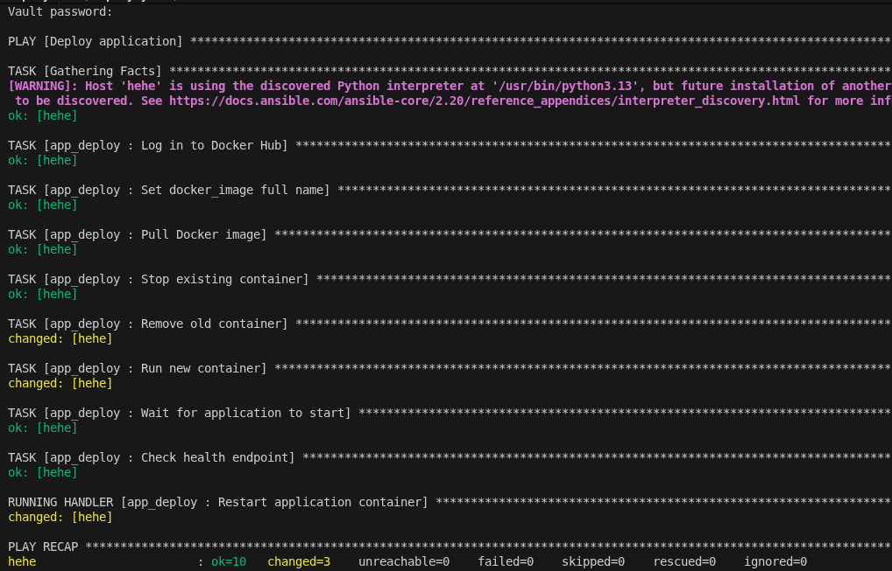
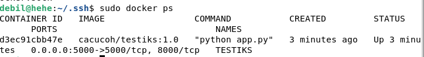
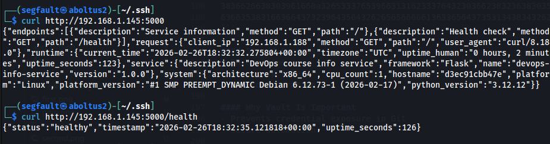

# Lab 5 — Ansible Fundamentals

### Architecture Overview
#### Ansible Version Used
Installed on Linux using apt

```bash
$ ansible --version       
ansible [core 2.20.1]
  config file = None
  configured module search path = ['/home/segfault/.ansible/plugins/modules', '/usr/share/ansible/plugins/modules']
  ansible python module location = /usr/lib/python3/dist-packages/ansible
  ansible collection location = /home/segfault/.ansible/collections:/usr/share/ansible/collections
  executable location = /usr/bin/ansible
  python version = 3.13.11 (main, Dec  8 2025, 11:43:54) [GCC 15.2.0] (/usr/bin/python3)
  jinja version = 3.1.6
  pyyaml version = 6.0.3 (with libyaml v0.2.5)
```

### Target VM

I used a VM that I created in previous lab:
- Debian 13 (6.12.63 amd-64)
- 4 GB RAM
- 10 GB disk space
- Network adapter in Bridged mode
- Static IP (192.168.1.145)
- SSH server is installed and configured
- Public SSH key added to `~/.ssh/authorized_keys`

Ansible connects via SSH using key-based auth

### Ansible Project Structure
The project follows a role-based architecture:
```
ansible/
├── inventory/
│   └── hosts.ini
├── roles/
│   ├── common/
│   ├── docker/
│   └── app_deploy/
├── playbooks/
│   ├── provision.yml
│   └── deploy.yml
├── group_vars/
│   └── all.yml (Vault encrypted)
├── ansible.cfg
└── docs/LAB05.md
```

### Why Roles Instead of Monolithic Playbooks?
**Because roles improve modularity, reusability, and maintainability**

Instead of putting everything in one large playbook, roles let you split infrastructure into logical components (e.g., web server, database, users). Each role has a defined structure (tasks, vars, handlers), which makes the code easier to read and manage

### Connectivity check:





This confirms SSH conection working correctly for ansible

### Roles
#### Common
##### Purpose
Provides baseline system configuration (packages, users, timezone, basic security settings, updates)

##### Variables
- common_packages – list of packages to install (default: basic utilities)
- common_timezone – system timezone (default: UTC)
- common_create_user – whether to create a deploy user (default: true)
```
common_packages:
  - python3-pip
  - curl
  - git
  - vim
  - htop
timezone: "UTC"
```

##### Handlers
- Restart SSH
- Reload systemd

##### Dependencies
- None

#### Docker
##### Purpose
Installs and configures Docker engine and related components.

##### Variables (key examples)
- docker_version – Docker package version (default: latest)
- docker_users – list of users added to docker group
- docker_daemon_options – custom daemon.json configuration

##### Handlers
- Restart Docker
```
- name: Restart Docker
  service:
    name: docker
    state: restarted
```

##### Dependencies
May depend on common (for base packages and users)

#### App_deploy
##### Purpose
Deploys and configures the application (pulls image, runs container, sets environment variables).

#### Variables
- app_image – Docker image name
- app_tag – image tag (default: latest)
- app_env – environment variables
- app_port – exposed port
```
restart_policy: unless-stopped
env_vars: {}
```

##### Handlers
- Restart application container
- Reload reverse proxy (if applicable)
```
- name: Restart application container
  community.docker.docker_container:
    name: "{{ app_container_name }}"
    state: started
    restart: true
```

##### Dependencies
- Depends on docker
- May depend on common

### Idempotency Demonstration
#### Run playbook first time



Observe:
- New packages installed
- Docker installed
- Docker started
- User added to docker group

#### Run playbook second time




On the second run of the playbook, all tasks showed changed = 0 because the system was already in the desired state

#### Analysis

- First run:
Tasks that installed packages (common_packages, Docker packages), updated the apt cache, created users/groups, and set the timezone all showed changed = 1 because these actions modified the system to reach the desired state

- Second run:
All tasks showed changed = 0 because the system was already in the desired state. Nothing needed to be updated or modified

#### Explanation of Idempotency
The roles are idempotent because:
- Stateful modules were used (apt: state=present, service: state=started, user: state=present) rather than shell commands
- Variables define the desired state (package lists, timezone, users), so tasks only act when the system differs from that state
- Handlers (like Docker restart) only trigger when notified


### Ansible Vault
Sensitive data stored in `group_vars/all.yml` file

I created it using:
```bash
ansible-vault create group_vars/all.yml
```

All its content are encrypted:
```
$ANSIBLE_VAULT;1.1;AES256
62613132333831643565386162386637626234636236356236353639353632626364363137633265
3864393263303166333738663434653033333636643261310a373832303831613239616636393234
36383830643236666232633936613439653836333832376330393665633134623333653662336264
3836626638303961660a326533376539663131623337643230366238323638303562633563393062
63663538316636643732396435643262656566666136336564373531343834326235653164643063...
```

#### Stored Secrets
- DH username
- DH access token
- App configuration

#### Why Vault Is Important
- Prevents credential exposure in Git
- Secure automation

Vault password explicitly passed during deploy process:
```bash
ansible-playbook playbooks/deploy.yml --ask-vault-pass
```


### Deployment Verification

Deploy terminal output:


Checking `docker ps` out on remote VM:


Check if server is up:


### Key decisions

Why use roles instead of plain playbooks?
- Roles structure playbooks into modular, logical units, making them easier to read, maintain, and scale

How do roles improve reusability?
- Roles encapsulate tasks, defaults, handlers, and variables, allowing the same logic to be applied across multiple projects or environments

What makes a task idempotent?
- A task is idempotent if running it multiple times results in the same system state, with changes applied only when necessary

How do handlers improve efficiency?
- Handlers run only when notified by tasks, avoiding unnecessary service restarts and reducing redundant operations

Why is Ansible Vault necessary?
- Vault secures sensitive data like passwords, tokens, and keys, keeping credentials encrypted while still usable in playbooks

### 7. Challenges
- Docker repository on Debian 13 required using Debian 12 repo to avoid missing Release files
- Missing variables (e.g., docker_image_tag) caused container creation errors — fixed by defining defaults or vault variables