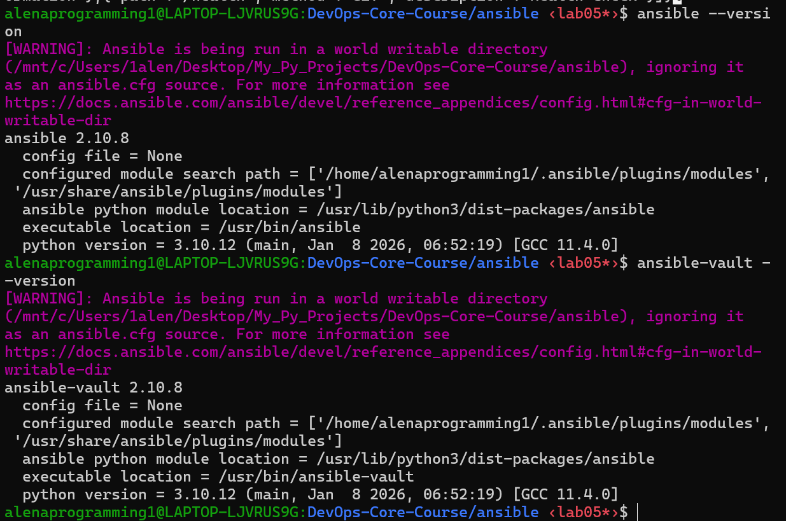
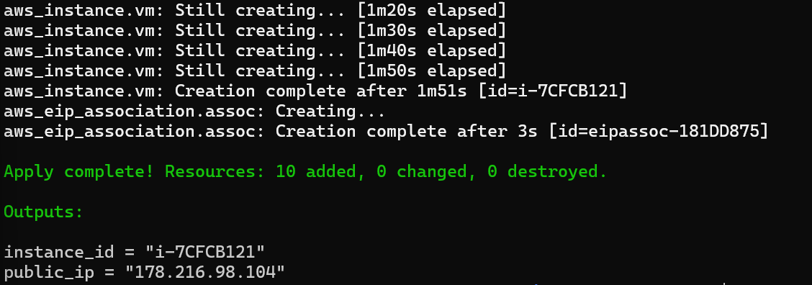
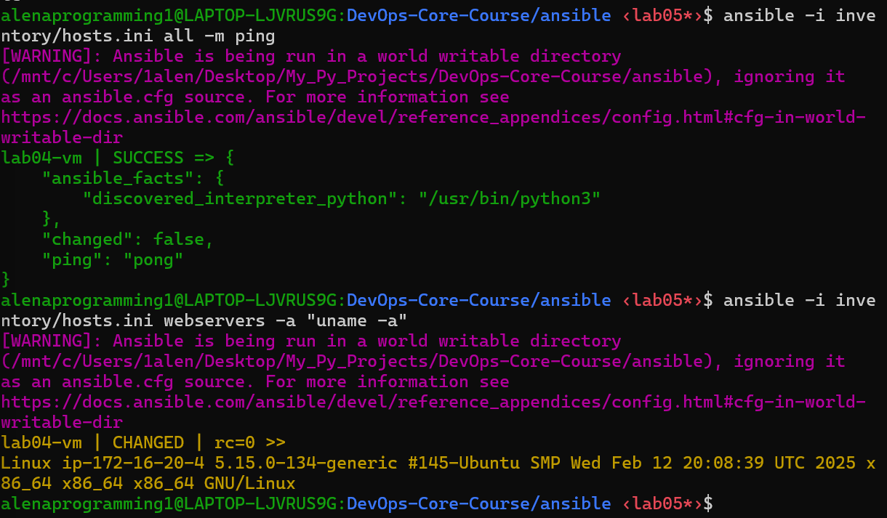
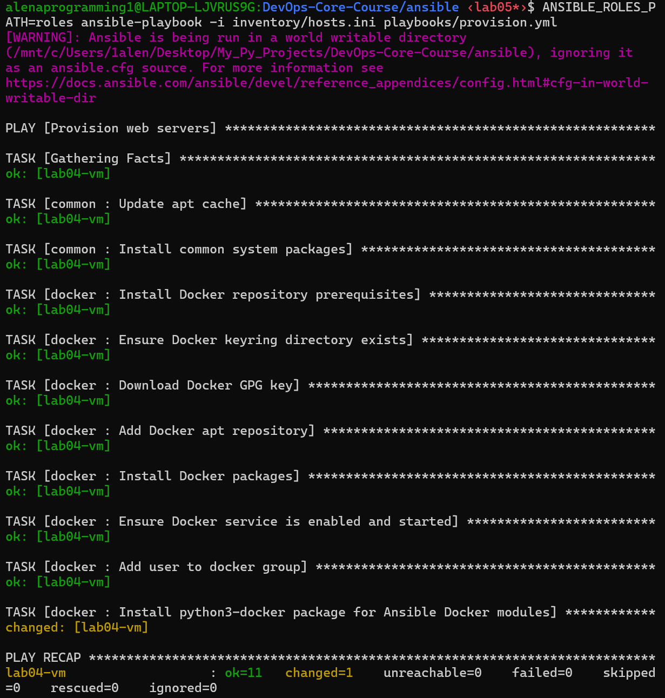
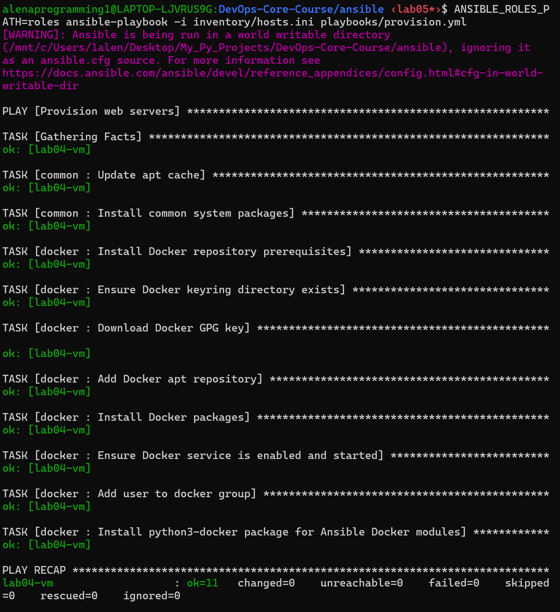
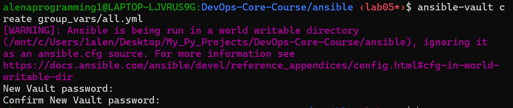
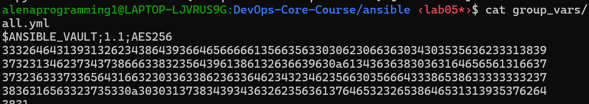
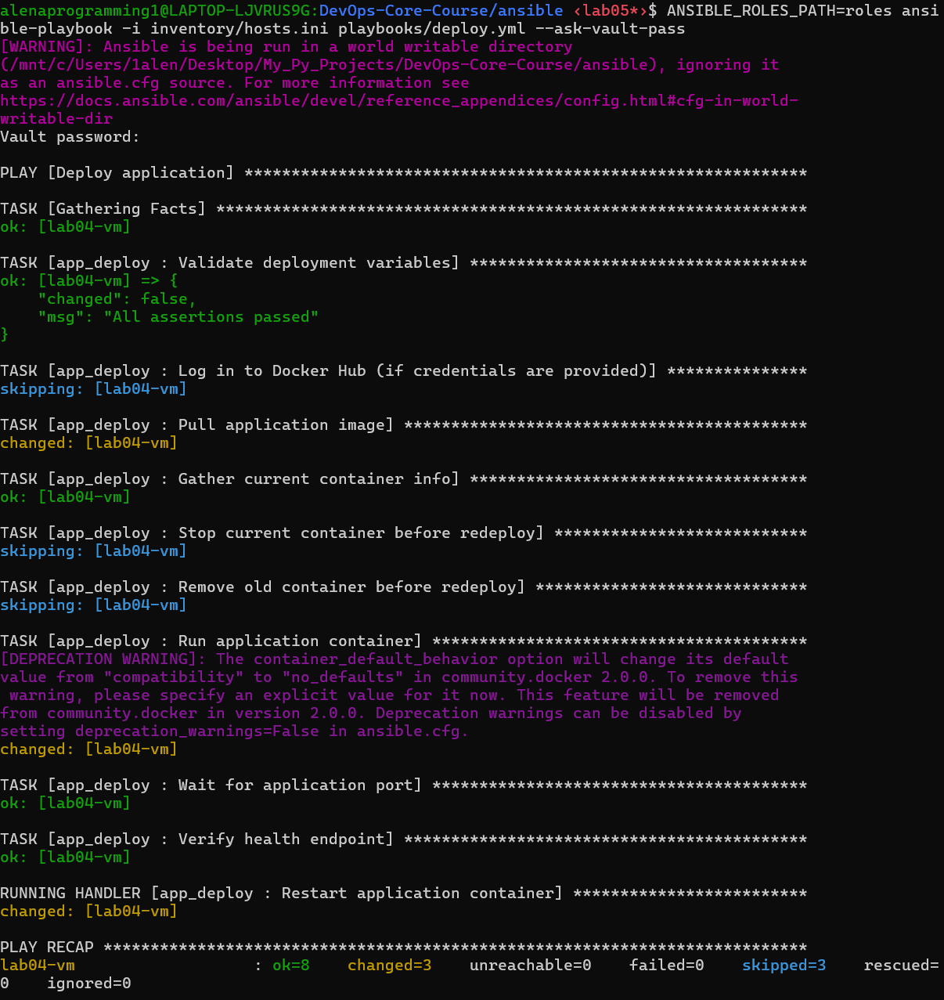
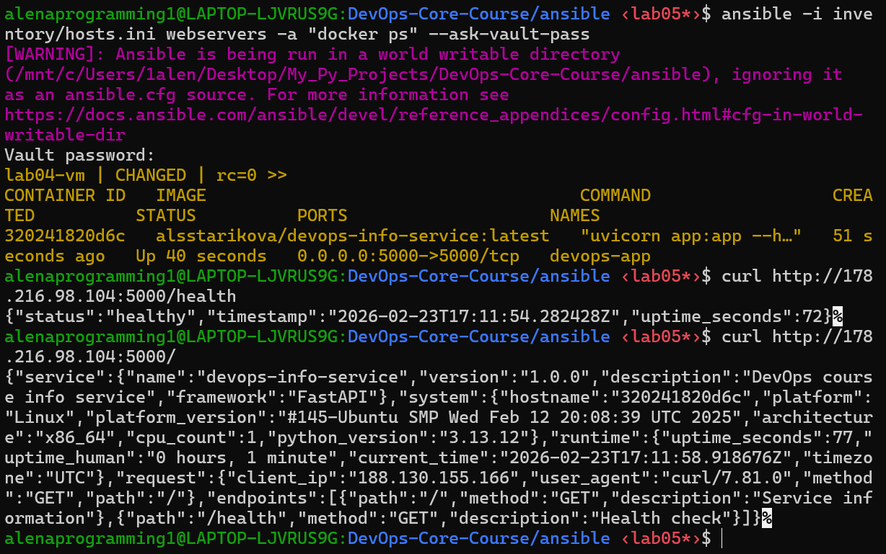

# LAB05 — Ansible Fundamentals

## 1. Architecture Overview

### Environment
- **Control node OS:** WSL2 Ubuntu
- **Ansible version:** `2.10.8`
  
- **Target host:** `lab04-vm` recreated with terraform
  
- **Target host OS:** #145-Ubuntu Linux (kernel shown in `uname -a` output)
- **SSH user:** `ec2-user`

### Role-based structure used
```text
ansible/
├── inventory/
│   └── hosts.ini
├── roles/
│   ├── common/
│   │   ├── tasks/
│   │   │   └── main.yml
│   │   └── defaults/
│   │       └── main.yml
│   ├── docker/
│   │   ├── tasks/
│   │   │   └── main.yml
│   │   ├── handlers/
│   │   │   └── main.yml
│   │   └── defaults/
│   │       └── main.yml
│   └── app_deploy/deployment
│       ├── tasks/
│       │   └── main.yml
│       ├── handlers/
│       │   └── main.yml
│       └── defaults/
│           └── main.yml
├── playbooks/
│   ├── site.yml
│   ├── provision.yml
│   └── deploy.yml
├── group_vars/
│   └── all.yml(Vault)
├── ansible.cfg
└── docs/
    ├── LAB05.md
    └── screenshots/
```

### Why roles instead of monolithic playbooks
Roles separate concerns and make automation reusable. In this lab, provisioning (`common`, `docker`) and deployment (`app_deploy`) are independent modules, so they can be run separately, tested independently, and reused in future labs/environments. Using roles provides reusability, clear organization, maintainability, and easy testing.

### Connectivity verification (Task 1)
```bash
ansible -i inventory/hosts.ini all -m ping
ansible -i inventory/hosts.ini webservers -a "uname -a"
```


---

## 2. Roles Documentation

### Role: `common`
- **Purpose:** Base system preparation for all servers.
- **Implemented tasks:**
  - Update APT cache.
  - Install essential packages (`python3-pip`, `curl`, `git`, `vim`, `htop`, etc.).
- **Key variables (defaults):**
  - `common_packages`
  - `common_timezone`
  - `common_manage_timezone`
- **Handlers:** none.
- **Dependencies:** none.

### Role: `docker`
- **Purpose:** Install and configure Docker Engine from the official Docker Ubuntu repository.
- **Implemented tasks:**
  - Install repository prerequisites.
  - Add Docker GPG key.
  - Add Docker apt repository.
  - Install Docker packages.
  - Ensure Docker service is enabled and started.
  - Add SSH user to `docker` group.
  - Install `python3-docker` for Ansible Docker modules.
- **Key variables (defaults):**
  - `docker_packages`
  - `docker_service_name`
  - `docker_user`
  - `docker_install_python_sdk`
- **Handlers:**
  - `restart docker`: Handler to restart Docker service
- **Dependencies:** usually executed after `common` role.

### Role: `app_deploy`
- **Purpose:** Deploy the Python app container, wait for startup, and validate health endpoint.
- **Implemented tasks:**
  - Validate required variables.
  - Docker Hub login (conditional, with `no_log: true`).
  - Pull image.
  - Check existing container.
  - Stop/remove old container when image changed.
  - Run container with port mapping and restart policy.
  - Wait for exposed port.
  - Validate `/health` via HTTP 200.
- **Key variables (defaults + Vault):**
  - `app_name`, `app_container_name`
  - `docker_image`, `docker_image_tag`
  - `app_port`, `host_port`
  - `app_restart_policy`, `app_env`
  - `dockerhub_username`, `dockerhub_password` (Vault)
- **Handlers:**
  - `restart app container`: Handler to restart application container
- **Dependencies:** Docker must already be installed and running.

---

## 3. Idempotency Demonstration

### Command used
```bash
ANSIBLE_ROLES_PATH=roles ansible-playbook -i inventory/hosts.ini playbooks/provision.yml
```

### Zero run summary
Zero run ended with an error because of wrong configuration. The changed tasks were:
- Install common system packages
- Download Docker GPG key
- Add Docker apt repository
- Install Docker packages
- Add user to docker group

### First run summary

- The changed task was Docker Python SDK installation (`python3-docker`).

### Second run summary

- No changes were needed because the host was already in the desired state.

### Analysis
Provisioning is idempotent: the first run converges the host to desired state; the second run confirms no drift and performs zero changes.

---

## 4. Ansible Vault Usage

### How secrets are stored
Sensitive data is stored in `ansible/group_vars/all.yml`, encrypted with Ansible Vault.

### Evidence that file is encrypted
The file starts with:
```text
$ANSIBLE_VAULT;1.1;AES256
```
This confirms secrets are not stored in plaintext.

### Vault password management strategy
- Use `--ask-vault-pass` for manual runs (I prefer this one), or
- Use a local password file (for automation) and keep it out of git.
- `.vault_pass` is listed in `.gitignore`.

### Why Vault is important
It allows storing credentials in the repository safely while preventing accidental secret exposure in plain text.




---

## 5. Deployment Verification

### Deployment verification
```bash
 ANSIBLE_ROLES_PATH=roles ansible-playbook -i inventory/hosts.ini playbooks/deploy.yml --ask-vault-pass
```
  

**Observed deployment result**
- `lab04-vm                   : ok=8    changed=3    unreachable=0    failed=0    skipped=3    rescued=0    ignored=0`
- Image pull completed.
- Container was created and started.
- `wait_for` succeeded.
- `/health` endpoint verification succeeded.
- Handler `Restart application container` executed.

### Container status verification
```bash
ansible -i inventory/hosts.ini webservers -a "docker ps" --ask-vault-pass
```
  

**Observed container:**
- **Image:** `alsstarikova/devops-info-service:latest`
- **Container name:** `devops-app`
- **Ports:** `0.0.0.0:5000->5000/tcp`
- **State:** `Up`

### HTTP checks
```bash
$ curl http://178.216.98.104:5000/health
{"status":"healthy","timestamp":"2026-02-23T17:11:54.282428Z","uptime_seconds":72}%  

$ curl http://178.216.98.104:5000/
{"service":{"name":"devops-info-service","version":"1.0.0","description":"DevOps course info service","framework":"FastAPI"},"system":{"hostname":"320241820d6c","platform":"Linux","platform_version":"#145-Ubuntu SMP Wed Feb 12 20:08:39 UTC 2025","architecture":"x86_64","cpu_count":1,"python_version":"3.13.12"},"runtime":{"uptime_seconds":77,"uptime_human":"0 hours, 1 minute","current_time":"2026-02-23T17:11:58.918676Z","timezone":"UTC"},"request":{"client_ip":"188.130.155.166","user_agent":"curl/7.81.0","method":"GET","path":"/"},"endpoints":[{"path":"/","method":"GET","description":"Service information"},{"path":"/health","method":"GET","description":"Health check"}]}%    
```

**Observed result:**
- `/health` returns healthy JSON payload.
- `/` returns service metadata and runtime/system info.

---

## 6. Key Decisions

### Why use roles instead of plain playbooks?
Roles provide modularity and clear boundaries. Provisioning and app deployment are implemented as reusable building blocks instead of one large file, which improves maintainability and readability.

### How do roles improve reusability?
A role can be reused in multiple playbooks and environments by overriding variables. The same `docker` or `app_deploy` logic can be applied to other hosts without rewriting tasks.

### What makes a task idempotent?
Idempotent tasks describe a target state (`present`, `started`, `absent`) instead of imperative actions. Re-running the playbook should not create new changes when the state already matches.

### How do handlers improve efficiency?
Handlers run only when notified by changed tasks, avoiding unnecessary restarts. This reduces downtime and makes playbook runs faster and cleaner.

### Why is Ansible Vault necessary?
Automation requires credentials (registry tokens/passwords). Vault encrypts these secrets at rest and allows secure collaboration without exposing plaintext credentials in version control.

---

## 7. Challenges and Solutions

- **Issue:** `ansible.cfg` warning in WSL world-writable directory (`/mnt/c/...`) causes config to be ignored.  
  **Workaround used:** explicit runtime options such as `ANSIBLE_ROLES_PATH=roles` and explicit inventory/playbook arguments.

- **Issue:** Initial confusion when `deploy.yml` content matched provisioning logic.  
  **Fix:** corrected `ansible/playbooks/deploy.yml` to run `app_deploy` role only.

---
