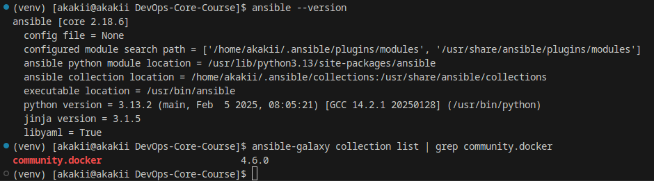
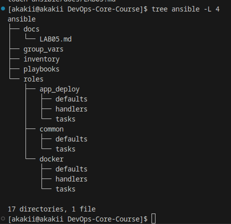
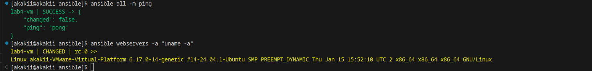
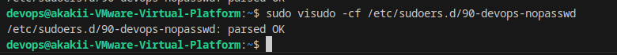
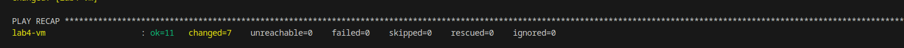
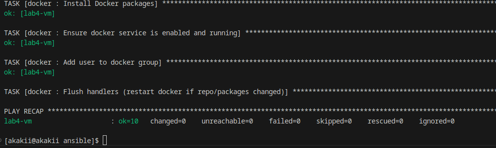
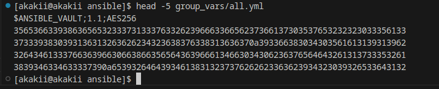
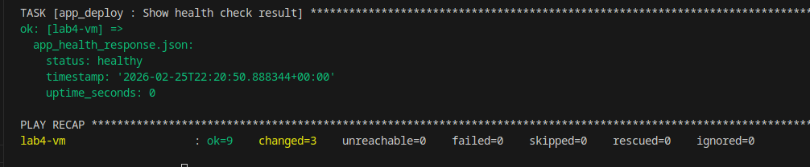
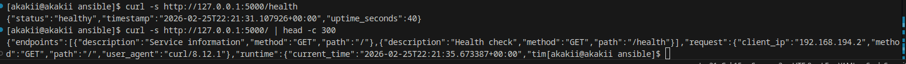

# Lab 5 — Ansible Fundamentals (Local VM Target)

**Student:** Alexander Rozanov  
**Email:** al.rozanov@innopolis.university  
**Group:** CBS-02  

---

## 1. Goal
The goal of this lab is to provision and deploy an application to a Linux host using **Ansible** with:
- a reproducible **role-based** structure
- **inventory** and connectivity validation
- **privilege escalation** (sudo)
- **idempotency** (second run produces mostly `ok`)
- **Ansible Vault** for secrets
- application deployment and **endpoint verification**

The lab is performed in the **local environment** (VMware VM as a managed node), which is allowed by the course as a local alternative.

---

## 2. Environment

### 2.1 Control node
- Ansible is installed locally on the control machine.

**Evidence — Ansible installed**

### 2.2 Managed node (target)
- Linux VM running in **VMware**
- Network mode: **NAT with port forwarding**
- SSH access method: `127.0.0.1:2222` (host port forwarded to guest `22/tcp`)
- A dedicated user **devops** is used for Ansible.

**Evidence — devops user**

---

## 3. Project Structure (Role-based)
The Ansible project is organized into inventory, playbooks, and roles.

**Evidence — lab structure**

Implemented roles:
- `common` — baseline packages and OS preparation
- `docker` — Docker Engine installation and configuration
- `app_deploy` — application deployment using Docker

Implemented playbooks:
- `provision.yml` — applies `common` + `docker`
- `deploy.yml` — applies `app_deploy`

---

## 4. Connectivity and Privilege Escalation

### 4.1 Connectivity check
Inventory is configured to connect to the VM through NAT port forwarding. The connection was verified with Ansible ping.

**Evidence — host connectivity check**

### 4.2 Passwordless sudo for automation
The `devops` user was configured for non-interactive automation with sudo (required for provisioning tasks).

**Evidence — sudo configuration**

---

## 5. Provisioning (Roles: common + docker)

### 5.1 First run (expected changes)
The first run installs packages, Docker, enables services, and configures permissions.

**Evidence — first provisioning run**

### 5.2 Second run (idempotency proof)
The same provisioning playbook was executed again to confirm idempotency: the second run results in mostly `ok` and minimal/no `changed`.

**Evidence — second provisioning run**

---

## 6. Secrets Management (Ansible Vault)

Docker Hub credentials required for image pull/login are stored in an encrypted Vault file.
- Secrets are not committed in plaintext.
- Vault password file is kept local and excluded from Git.

**Evidence — encrypted Vault file**

---

## 7. Deployment (Role: app_deploy)

The deployment role performs:
- Docker Hub login using Vault credentials
- pull of the application image from Docker Hub
- container start with required environment variables and port mapping

**Evidence — deployment run**

---

## 8. Verification (Application Endpoints)

After deployment, the application endpoints were validated from the shell using `curl`:
- `GET /health` returns a healthy status
- `GET /` returns the service JSON

**Evidence — curl verification**

---

## 9. Notes on Local VM (NAT) Stability
During the lab, SSH connectivity depends on:
- the VM having a valid IP on its NAT interface
- correct VMware NAT port-forward rules (host `2222` → guest `22`)
If NAT/DHCP changes occur, port-forward settings must match the current guest IP.

---

## 10. Completion Checklist

- [x] Role-based Ansible project structure
- [x] Inventory configured for local VMware VM (NAT + port forwarding)
- [x] Connectivity validated (`ansible ... -m ping`)
- [x] Privilege escalation configured (sudo for provisioning)
- [x] Provisioning playbook implemented and executed
- [x] Idempotency demonstrated (second run mostly `ok`)
- [x] Ansible Vault used for secrets
- [x] Application deployed via Ansible + Docker
- [x] Endpoints verified with `curl`