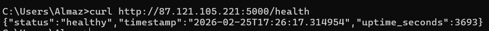

## Architecture Overview

- **Ansible version:** core 2.16.3
- **Target VM OS:** Ubuntu 24.04.2 LTS

### Role Structure
```
ansible/
├── inventory/
│   └── hosts.ini              # Static inventory with VM IP
├── roles/
│   ├── common/                # Common system packages & timezone
│   │   ├── tasks/main.yml
│   │   └── defaults/main.yml
│   ├── docker/                # Docker CE installation
│   │   ├── tasks/main.yml
│   │   ├── handlers/main.yml
│   │   └── defaults/main.yml
│   └── app_deploy/            # Application deployment via Docker
│       ├── tasks/main.yml
│       ├── handlers/main.yml
│       └── defaults/main.yml
├── playbooks/
│   ├── site.yml               # Main playbook (all roles)
│   ├── provision.yml          # Provision: common + docker
│   └── deploy.yml             # Deploy: app_deploy
├── group_vars/
│   └── all.yml                # Encrypted variables (Ansible Vault)
├── ansible.cfg                # Ansible configuration
└── docs/
    └── LAB05.md
```
The roles are executed sequentially: 
- `common` installs basic packages
- `docker` installs Docker (depends on packages from common)
- `app_deploy` deploys the container (depends on the presence of Docker)

### Why roles instead of monolithic playbooks?
Roles break automation into independent, reusable components. 
The `docker` role can be applied to any other project without modification. 
A monolithic playbook would otherwise become an unreadable 200+ line file.

## Roles Documentation

### `common`
**Purpose:** Server setup - update apt cache, install packeges, set timezone

**Variables:**

| Variable          | Default value                         | 
|-------------------|---------------------------------------|
| `common_packages` | `[python3-pip, curl, git, vim, htop]` |
| `common_timezone` | `UTC`                                 |

**Handlers:** no
**Dependencies:** no

### `docker`

**Purpose:** add GPG key, add docker repository, install docker packages, 
check that service is running, add user to docker group, install python3-docker

**Variables:**

| Variable          | Default value                                    |
|-------------------|--------------------------------------------------|
| `docker_user`     | `ubuntu`                                         |
| `docker_packages` | `[docker-ce, docker-ce-cli, containerd.io, ...]` |

**Handlers:**

| Handler          | Trigger                | Action                 |
|------------------|------------------------|------------------------|
| `restart docker` | install docker package | restart docker service |

**Dependencies:** role `common`.

### `app_deploy`

**Purpose:** log in to Docker Hub, pull docker image, stop and remove existing container,
run new container, verify service is successfully running 

**Variables:**

| Variable             | Default value    |
|----------------------|------------------|
| `app_port`           | `5000`           |
| `app_container_port` | `80`             |
| `app_restart_policy` | `unless-stopped` |
| `app_env_vars`       | `{}`             |

**Handlers:**

| Handler                 | Trigger            | Action                        |
|-------------------------|--------------------|-------------------------------|
| `restart app container` | edit configuration | restart application container |

**Dependencies:** role `docker`

## Idempotency Demonstration

### First run:
```bash
almaz@LAPTOP-3659RTVN:/mnt/c/Users/Almaz/PycharmProjects/DevOps/ansible$ ANSIBLE_CONFIG=/mnt/c/Users/Almaz/PycharmProjects/DevOps/ansible/ansible.cfg ansible-playbook playbooks/provision.yml


PLAY [Provision web servers] *******************************************************************************************************************************************************

TASK [Gathering Facts] *************************************************************************************************************************************************************
ok: [white-onyx]

TASK [common : Update apt cache] ***************************************************************************************************************************************************
ok: [white-onyx]

TASK [common : Install common packages] ********************************************************************************************************************************************
changed: [white-onyx]

TASK [common : Set system timezone] ************************************************************************************************************************************************
ok: [white-onyx]

TASK [docker : Install prerequisite packages for Docker repository] ****************************************************************************************************************
ok: [white-onyx]

TASK [docker : Create directory for Docker GPG key] ********************************************************************************************************************************
ok: [white-onyx]

TASK [docker : Add Docker official GPG key] ****************************************************************************************************************************************
changed: [white-onyx]

TASK [docker : Add Docker repository] **********************************************************************************************************************************************
changed: [white-onyx]

TASK [docker : Install Docker packages] ********************************************************************************************************************************************
changed: [white-onyx]

TASK [docker : Ensure Docker service is started and enabled] ***********************************************************************************************************************
ok: [white-onyx]

TASK [docker : Add user to docker group] *******************************************************************************************************************************************
ok: [white-onyx]

TASK [docker : Install python3-docker for Ansible Docker modules] ******************************************************************************************************************
changed: [white-onyx]

RUNNING HANDLER [docker : restart docker] ******************************************************************************************************************************************
changed: [white-onyx]

PLAY RECAP *************************************************************************************************************************************************************************
white-onyx                 : ok=13   changed=6    unreachable=0    failed=0    skipped=0    rescued=0    ignored=0
```
### Second run:
```bash
almaz@LAPTOP-3659RTVN:/mnt/c/Users/Almaz/PycharmProjects/DevOps/ansible$ ANSIBLE_CONFIG=/mnt/c/Users/Almaz/PycharmProjects/DevOps/ansible/ansible.cfg ansible-playbook playbooks/provision.yml

PLAY [Provision web servers] *******************************************************************************************************************************************************

TASK [Gathering Facts] *************************************************************************************************************************************************************
ok: [white-onyx]

TASK [common : Update apt cache] ***************************************************************************************************************************************************
ok: [white-onyx]

TASK [common : Install common packages] ********************************************************************************************************************************************
ok: [white-onyx]

TASK [common : Set system timezone] ************************************************************************************************************************************************
ok: [white-onyx]

TASK [docker : Install prerequisite packages for Docker repository] ****************************************************************************************************************
ok: [white-onyx]

TASK [docker : Create directory for Docker GPG key] ********************************************************************************************************************************
ok: [white-onyx]

TASK [docker : Add Docker official GPG key] ****************************************************************************************************************************************
ok: [white-onyx]

TASK [docker : Add Docker repository] **********************************************************************************************************************************************
ok: [white-onyx]

TASK [docker : Install Docker packages] ********************************************************************************************************************************************
ok: [white-onyx]

TASK [docker : Ensure Docker service is started and enabled] ***********************************************************************************************************************
ok: [white-onyx]

TASK [docker : Add user to docker group] *******************************************************************************************************************************************
ok: [white-onyx]

TASK [docker : Install python3-docker for Ansible Docker modules] ******************************************************************************************************************
ok: [white-onyx]

PLAY RECAP *************************************************************************************************************************************************************************
white-onyx                 : ok=12   changed=0    unreachable=0    failed=0    skipped=0    rescued=0    ignored=0
```

### Analysis

**What changed first time:**
- `common_packages` - installed
- Docker GPG key added - Docker installed
- `python3-docker` - installed
- Handler `restart docker` - triggered after install packages Docker

**What didn't change second time:**
- `common_packages` - all packages were already installed
- Docker GPG key - file `/etc/apt/keyrings/docker.asc` already existed with correct content
- Docker repository - entry in `/etc/apt/sources.list.d/docker.list` already present
- Docker packages - were already installed
- Docker service - already running and enabled in autostart
- User in docker group - user was already a member of the `docker` group
- Handler `restart docker` - was not triggered since no task returned `changed`

## Ansible Vault Usage

### How you store credentials securely
All sensitive data are stored in encrypted file `group_vars/all.yml`.
Without password file is unreadable.

### Vault password management strategy

Password does not commited to git and could be passed iterative or by file and argument `--vault-password-file`

### Why Ansible Vault is important
Without Vault all sensitive data will be added to git and disclosed.
Vault saves all data in encrypted format so they could not be decrypted without password.

## Deployment Verification

### Deploy playbook output
```bash
almaz@LAPTOP-3659RTVN:/mnt/c/Users/Almaz/PycharmProjects/DevOps/ansible$ ANSIBLE_CONFIG=/mnt/c/Users/Almaz/PycharmProjects/DevOps/ansible/ansible.cfg \
ansible-playbook playbooks/deploy.yml --ask-vault-pass
Vault password: 

PLAY [Deploy application] **********************************************************************************************************************************************************

TASK [Gathering Facts] *************************************************************************************************************************************************************
ok: [white-onyx]

TASK [app_deploy : Log in to Docker Hub] *******************************************************************************************************************************************
ok: [white-onyx]

TASK [app_deploy : Pull Docker image] **********************************************************************************************************************************************
ok: [white-onyx]

TASK [app_deploy : Stop and remove old container] **********************************************************************************************************************************
changed: [white-onyx]

TASK [app_deploy : Run container] **************************************************************************************************************************************************
changed: [white-onyx]

TASK [app_deploy : Wait for application] *******************************************************************************************************************************************
ok: [white-onyx]

TASK [app_deploy : Verify health endpoint] *****************************************************************************************************************************************
ok: [white-onyx]
PLAY RECAP *************************************************************************************************************************************************************************
white-onyx                 : ok=7    changed=2    unreachable=0    failed=0    skipped=0    rescued=0    ignored=0
```


### Container status

```
CONTAINER ID   IMAGE                   COMMAND                  CREATED             STATUS             PORTS                  NAMES
295c83f84da7   andiazdi/lab02:latest   "sh -c 'python -m uv…"   About an hour ago   Up About an hour   0.0.0.0:5000->80/tcp   lab02
```

### Health check verification


## Key Decisions

**Why use roles instead of plain playbooks?**  
Roles provide modularity and reusability: the `docker` role can be added to any other project with a single line.
A monolithic playbook is difficult to maintain and test.

**How do roles improve reusability?**  
Each role encapsulates logic with default variables in `defaults/main.yml`.
Behavior can be changed through variables without editing the role's code - simply pass the required values from inventory or group_vars.

**What makes a task idempotent?**  
Using declarative Ansible modules instead of `shell`/`command` commands.
Declarative modules check the current state and don't make changes if the desired state has already been reached.

**How do handlers improve efficiency?**  
Handlers automate work.
The `restart docker` handler is executed once at the end of the play, even if it was called by multiple tasks.
Without handlers, Docker would have to be restarted after each associated task or restarted without any work at each startup.

**Why is Ansible Vault necessary?**
Without encryption, credentials would be stored in plaintext in Git history.
Vault allows you to securely store secrets alongside your code.

## 7. Challenges

- **WSL world-writable directory** - Ansible ignored `ansible.cfg` due to rights. So I used env `ANSIBLE_CONFIG` with path to config.
- **group_vars wasn't picked up** - Ansible looks for `group_vars` not in the project root. I specified it via `vars_files` in playbooks.