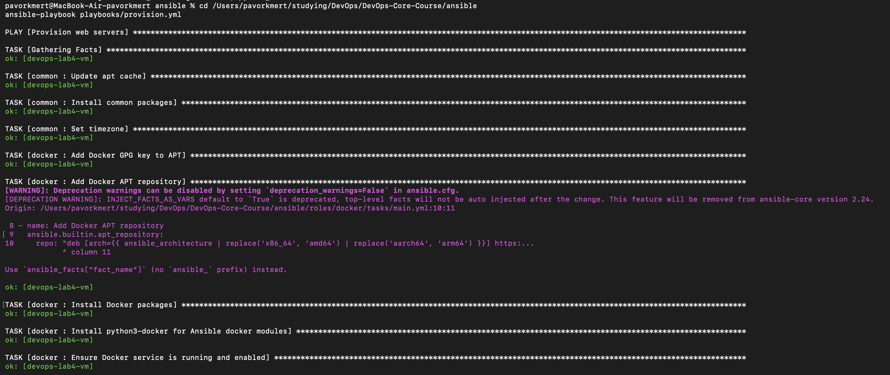
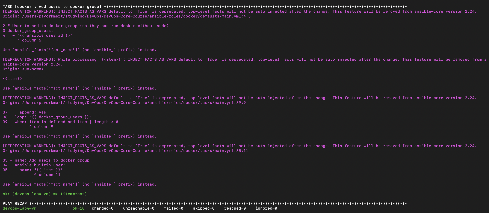
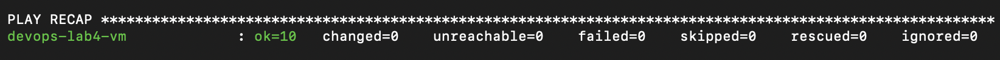
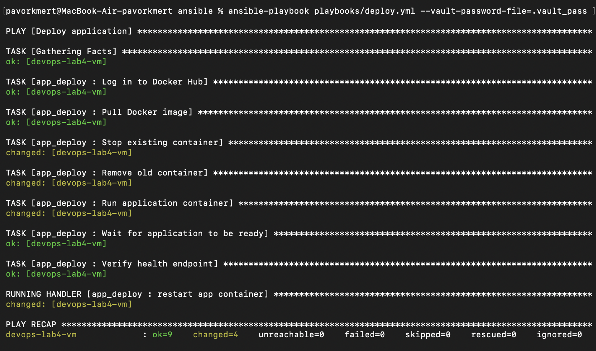
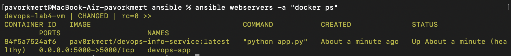
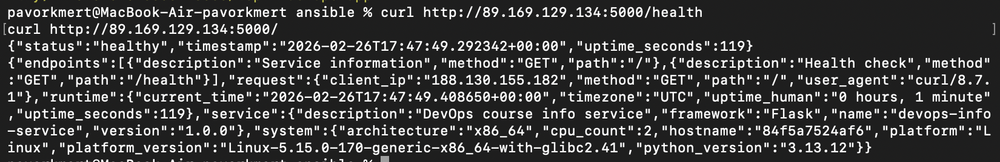

# Lab 05 — Ansible Fundamentals: Implementation Report

Report on Lab 5: configuration management with Ansible, roles for system provisioning and application deployment.

---

## Screenshot Checklist

Screenshots are embedded below in the relevant sections (sections 3 and 5).

| # | Description | File |
|---|-------------|------|
| 1 | First provision run (full output) | lab5-1-1.png, lab5-1-2.png |
| 2 | Second provision run (idempotency, changed=0) | lab5-2.png |
| 3 | Deploy playbook output | lab5-3.png |
| 4 | Container status (`docker ps`) | lab5-4.png |
| 5 | Health and root endpoint (`curl`) | lab5-5.png |

---

## 1. Architecture Overview

### Ansible version

- **Ansible:** 2.16+ (verify with `ansible --version`)
- **Target OS:** Ubuntu 22.04 LTS or 24.04 LTS (VM from Lab 4)

### Role structure

Role-based layout:

```
ansible/
├── inventory/
│   └── hosts.ini              # Static inventory (VM IP and user)
├── roles/
│   ├── common/                # Common packages and OS setup
│   │   ├── tasks/main.yml
│   │   └── defaults/main.yml
│   ├── docker/                # Docker installation
│   │   ├── tasks/main.yml
│   │   ├── handlers/main.yml
│   │   └── defaults/main.yml
│   └── app_deploy/            # Containerized app deployment
│       ├── tasks/main.yml
│       ├── handlers/main.yml
│       └── defaults/main.yml
├── playbooks/
│   ├── site.yml               # Full run: provision + deploy
│   ├── provision.yml          # Provisioning only (common + docker)
│   └── deploy.yml             # App deployment only
├── group_vars/
│   └── all.yml.example        # Variable template (real all.yml in Vault)
├── ansible.cfg
├── requirements.yml           # community.docker collection
└── docs/LAB05.md
```

### Why roles instead of a single playbook

- **Reusability:** Same roles can be used in different playbooks and projects.
- **Readability:** Logic is split by role (common, docker, app_deploy); easier to navigate and review.
- **Testing:** Roles can be tested independently (e.g. docker or app_deploy only).
- **Collaboration:** Different people can maintain different roles without conflicts in one large file.

---

## 2. Roles Documentation

### Role: common

| Aspect | Description |
|--------|-------------|
| **Purpose** | Basic server setup: apt cache update, install package set, set timezone. |
| **Variables (defaults)** | `common_packages` (e.g. python3-pip, curl, git, vim, htop, unzip, ca-certificates, gnupg, software-properties-common), `common_timezone` (default UTC). |
| **Handlers** | None. |
| **Dependencies** | No other roles. |

### Role: docker

| Aspect | Description |
|--------|-------------|
| **Purpose** | Install Docker from official repo: GPG key, repository, packages (docker-ce, docker-ce-cli, containerd.io, plugins), start and enable service, add user to docker group, install python3-docker for Ansible modules. |
| **Variables (defaults)** | `docker_group_users` (users for docker group, default `ansible_user_id`), `docker_apt_keyring`, `docker_packages`. |
| **Handlers** | `restart docker` — restart Docker service (notified when repo or packages change). |
| **Dependencies** | Should run after common role (curl, gnupg, ca-certificates already installed). |

### Role: app_deploy

| Aspect | Description |
|--------|-------------|
| **Purpose** | Deploy app in Docker: Docker Hub login (Vault credentials), pull image, stop/remove old container, run new container with ports and restart policy, wait for port, verify health endpoint. |
| **Variables (defaults)** | `app_container_name`, `app_port`, `app_internal_port`, `app_restart_policy`, `app_env`, `app_health_path`, `app_wait_timeout`. Variables `dockerhub_username`, `dockerhub_password`, `app_name`, `docker_image`, `docker_image_tag` are set in group_vars (Vault). |
| **Handlers** | `restart app container` — restart application container. |
| **Dependencies** | Requires docker role (Docker and python3-docker on target host). |

---

## 3. Idempotency Demonstration

### First provision.yml run

On the first run most tasks should show **changed** (yellow): apt cache update, package installs, Docker repo add, Docker install, service and user setup.

```bash
cd ansible
ansible-playbook playbooks/provision.yml
```

**Screenshot 1 — First provision run (full output):**





### Second provision.yml run

On the second run with no server changes, tasks should be **ok** (green) and **changed** should be zero (or minimal).

```bash
ansible-playbook playbooks/provision.yml
```

**Screenshot 2 — Second provision run (changed=0 in PLAY RECAP):**



### Idempotency analysis

- **First run:** apt cache, package list, repos, Docker packages, service and group state change — expected.
- **Second run:** `apt`, `apt_repository`, `service`, `user` modules check current state and make no changes when it already matches — hence all tasks **ok**, **changed=0**.
- **Idempotency** comes from using declarative modules with `state: present` / `state: started` / `state: absent`, instead of one-off commands like `apt-get install` or `systemctl start`, which would repeat changes or errors on every run.

---

## 4. Ansible Vault Usage

### Storing credentials

- Docker Hub credentials and app settings are stored in encrypted `group_vars/all.yml` (created and edited via Ansible Vault).
- Only a **template** is in the repo — `group_vars/all.yml.example` (no secrets). The real `all.yml` is created locally and encrypted:

```bash
cp group_vars/all.yml.example group_vars/all.yml
ansible-vault encrypt group_vars/all.yml
# or create from scratch: ansible-vault create group_vars/all.yml
```

- Encrypted `group_vars/all.yml` can be committed to Git; the Vault password must not be in the repo.

### Vault password management

- `.vault_pass` is used with password `lab05` (local use only; do not commit).
- `ansible.cfg` sets `vault_password_file = .vault_pass`, so the password is not typed interactively.
- **Encrypt variables once:** from the `ansible` directory run `./scripts/encrypt_vault.sh`. Then `group_vars/all.yml` is encrypted.
- To edit: `ansible-vault edit group_vars/all.yml` (replace `REPLACE_WITH_YOUR_DOCKERHUB_TOKEN` with your Docker Hub token).

### Encrypted file example

After `ansible-vault encrypt`, the file looks like this (unreadable without the password):

```text
$ cat group_vars/all.yml
$ANSIBLE_VAULT;1.1;AES256
663864396537386534...
```

### Why use Ansible Vault

- Keeps secrets (Docker Hub login/token) in the same repo as playbooks without plaintext in Git.
- Single mechanism for sensitive variables (passwords, tokens, keys).
- Deploy can be run from CI or any machine that has the Vault password, without a separate secrets manager at first.

---

## 5. Deployment Verification

### Deploy run

```bash
ansible-playbook playbooks/deploy.yml --vault-password-file=.vault_pass
```

**Screenshot 3 — Deploy playbook output:**



### Container check

```bash
ansible webservers -a "docker ps"
```

Expected: container named e.g. `devops-app`, port 5000:5000, status Up.

**Screenshot 4 — Container status:**



### Health and root endpoint

Use your Lab 4 VM IP:

```bash
curl http://<VM-IP>:5000/health
curl http://<VM-IP>:5000/
```

Expected: HTTP 200 and JSON with service/health info.

**Screenshot 5 — Health and root endpoint responses:**



### Handlers

- When the image or container config changes, the **restart app container** handler may run (if defined in the role and conditions are met). You can note in the report whether it ran in your runs.

---

## 6. Key Decisions

- **Why roles instead of one big playbook?** Roles give modularity, reusability, and clear structure; easier to maintain and to run only what you need (e.g. provision or deploy only).

- **How do roles improve reusability?** The same role (e.g. docker or common) can be used in different playbooks and for different host groups without copying tasks.

- **What makes a task idempotent?** Using modules that compare current state to desired state and only change when they differ (apt, service, file, docker_container, etc.), instead of one-off shell/command runs that do something every time.

- **Why are handlers useful?** Handlers run once at the end of the play when at least one notifying task has changed (e.g. restart Docker or container), avoiding repeated restarts and simplifying ordering.

- **Why use Ansible Vault?** To store secrets in the repo in encrypted form and avoid exposing them in Git and logs.

---

## 7. Challenges (Optional)

- **Issues during the lab:** e.g. installing `community.docker` collection, configuring SSH/inventory for Lab 4 VM, working with Vault.
- **Workarounds:** install collections via `requirements.yml`, edit `inventory/hosts.ini`, use `--ask-vault-pass` or `vault_password_file`.

---

## Quick Start

1. Install Ansible and collections:
   ```bash
   brew install ansible   # or apt install ansible
   cd ansible && ansible-galaxy collection install -r requirements.yml
   ```

2. Configure inventory: set VM IP and user in `inventory/hosts.ini` (from Lab 4).

3. Create and encrypt variables:
   ```bash
   cp group_vars/all.yml.example group_vars/all.yml
   ansible-vault encrypt group_vars/all.yml
   ansible-vault edit group_vars/all.yml   # set your dockerhub_username and token
   ```

4. Test connectivity and run provisioning:
   ```bash
   ansible all -m ping
   ansible-playbook playbooks/provision.yml
   ansible-playbook playbooks/provision.yml   # second run for idempotency check
   ```

5. Deploy the application:
   ```bash
   ansible-playbook playbooks/deploy.yml --vault-password-file=.vault_pass
   ```

6. Verify: `ansible webservers -a "docker ps"`, `curl http://<VM-IP>:5000/health`.

---

## 8. Bonus: Dynamic Inventory (Yandex Cloud)

Dynamic inventory uses the **community.general.yc_compute** plugin to discover VMs from Yandex Cloud instead of hardcoding IPs in `hosts.ini`. When a VM’s IP changes (e.g. after recreate), no manual inventory update is needed.

### Setup

1. **Install the collection** (includes `yc_compute`):
   ```bash
   ansible-galaxy collection install -r requirements.yml
   ```
   Install the Python SDK for Yandex Cloud if required:
   ```bash
   pip install yandexcloud
   ```

2. **Configure authentication** (same key as Lab 4):
   ```bash
   export YC_ANSIBLE_SERVICE_ACCOUNT_FILE="${YANDEX_SERVICE_ACCOUNT_KEY_FILE:-$HOME/.yandex/key.json}"
   ```
   Or run via the helper script (uses `$HOME/.yandex/key.json` or `YANDEX_SERVICE_ACCOUNT_KEY_FILE`):
   ```bash
   ./scripts/use_dynamic_inventory.sh ansible-inventory --graph
   ```
   The folder ID in `inventory/yandex.yml` is already set to the same value as in `terraform/run_terraform.sh`; change it if your folder differs.

3. **Use dynamic inventory** (without changing the default `ansible.cfg`):
   ```bash
   ansible-inventory -i inventory/yandex.yml --graph
   ansible all -i inventory/yandex.yml -m ping
   ansible-playbook -i inventory/yandex.yml playbooks/provision.yml
   ansible-playbook -i inventory/yandex.yml playbooks/deploy.yml --vault-password-file=.vault_pass
   ```

   To make it the default, in `ansible.cfg` set:
   ```ini
   inventory = inventory/yandex.yml
   ```

### How it works

- **Plugin:** `community.general.yc_compute` queries the Yandex Cloud API for compute instances in the given folder(s).
- **Filter:** Only instances with `status == 'RUNNING'` are included.
- **Connection:** `compose` sets `ansible_host` to the instance’s public IP (`network_interfaces[0].primary_v4_address.one_to_one_nat.address`) and `ansible_user` to `ubuntu`.
- **Groups:** All discovered hosts are placed in the `webservers` group so existing playbooks (e.g. `provision.yml`, `deploy.yml`) work unchanged.

### Benefits

- No manual IP updates when VMs are recreated or get new addresses.
- Single source of truth from the cloud provider.
- Same playbooks work with static (`hosts.ini`) or dynamic (`yandex.yml`) inventory.
