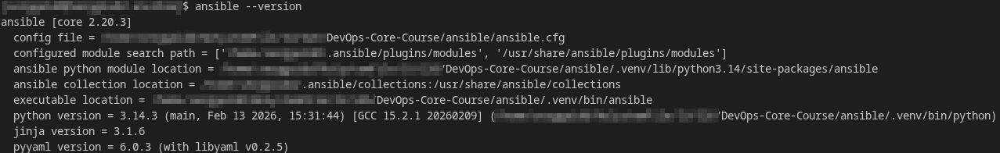
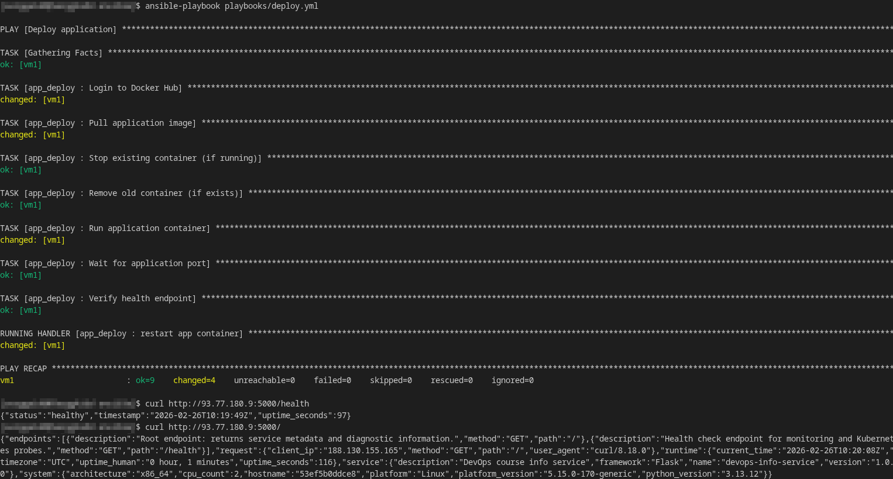
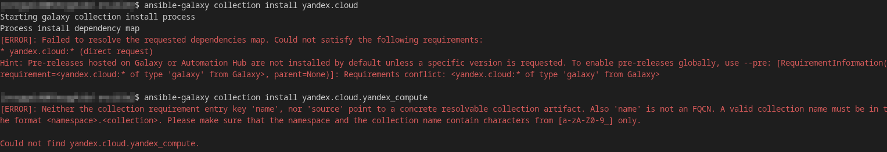
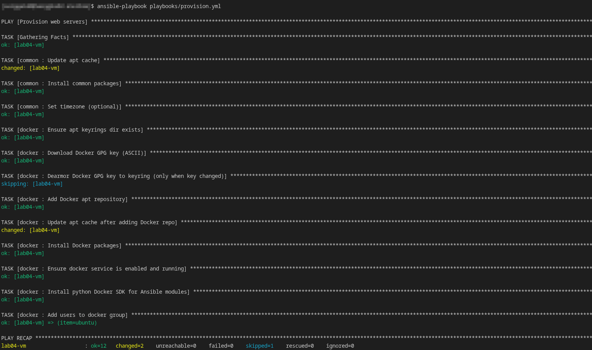
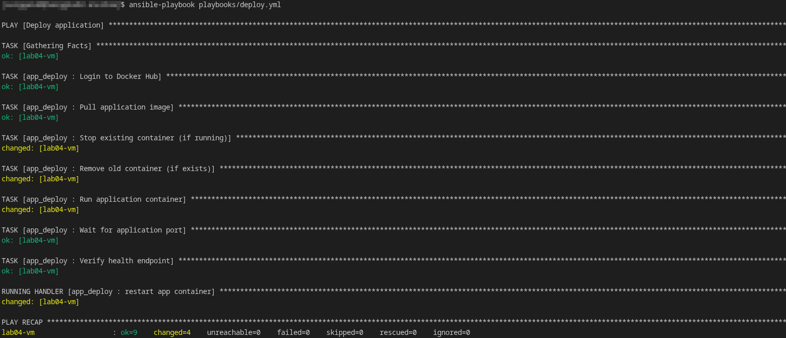

# LAB05 — Ansible Fundamentals 

## 1. Architecture Overview

### Ansible version used

### Target VM OS and version
- **OS:** Linux
- **Distro**: Ubuntu
- **Version:** 22.04 LTS

### Role structure explanation
The project is organized in "layers" (from the base OS to the application), which allows roles to share responsibilities (OS, platform, application), and also simplifies reuse, keeps playbooks short and readable, and helps ensure idempotency.

### Motivation for using roles instead of monolithic playbooks
- **Reusability:** a role can be applied across multiple projects/environments without copying YAML.
- **Maintainability:** smaller files are easier to read, test, and review.
- **Composition:** roles can be used to create different playbooks for different environments.
- **Idempotency and handlers:** it's easier to structure dependencies and service restarts.

---

## 2. Roles Documentation

### 2.1 Role: `common`

**Purpose** - basic VM preparation

**Variables (`roles/common/defaults/main.yml` file):**  
  - `common_packages` — list of packages to install (`curl`, `git`, `vim`, `htop`, `python3-pip`, etc.);
  - `common_timezone` — time zone (if `common_set_timezone`: is `true`).

**Tasks (`roles/common/tasks/main.yml` file):**  
- Updating `apt` cache (`apt update_cache`)
- Installing common packages (`apt state: present`)
- Setting timezone

**Handlers** - Not required

**Dependencies** - Not required

### 2.2 Role: `docker`

**Purpose** - installing and configuring Docker Engine.

**Variables (`roles/docker/defaults/main.yml` file):** 
  - `docker_apt_repo` — the source of the packages;
  - `docker_packages` — a list of Docker packages (`docker-ce`, `docker-ce-cli`, `containerd.io`, etc.);
  - `docker_users` — a list of users to add to the `docker` group.

**Tasks (`roles/docker/tasks/main.yml` file):**  
  - Creating `/etc/apt/keyrings` directory (`file state: directory`, mode `0755`);  
  - Downloading Docker GPG key (ASCII) to `/etc/apt/keyrings/docker.asc` (`get_url`, `register: docker_key_download`)  ;
  - Dearmoring GPG key to `/etc/apt/keyrings/docker.gpg` (`command: gpg --dearmor`, only when `docker_key_download.changed`);  
  - Adding Docker APT repository (`apt_repository repo: {{ docker_apt_repo }}`, `filename: docker`);  
  - Updating `apt` cache after repo add (`apt update_cache: true`);  
  - Installing Docker packages (`apt name: {{ docker_packages }} state: present`, `notify: restart docker`);  
  - Ensuring Docker service is running and enabled (`service name: docker state: started enabled: true`);  
  - Installing Python Docker SDK (`apt name: python3-docker state: present`)  
  - Adding users to `docker` group (`user groups: docker append: true`, `loop: {{ docker_users }}`);  

**Handlers (`roles/docker/handlers/main.yml` file)** - `restart docker` — restart the docker service (called by `notify` after config/package changes)

**Dependencies** - It's better to run it after `common`, but there is no hard dependency.

### 2.3 Role: `app_deploy`

**Purpose** - deploying a containerized application.

**Tasks (`roles/app_deploy/tasks/main.yml` file):**  
  - Logging in to Docker Hub (`docker_login` with `dockerhub_username`/`dockerhub_password`, `no_log: true`)  
  - Pulling application image (`docker_image name: {{ docker_image }} tag: {{ docker_image_tag }} source: pull`)  
  - Stopping existing container if running (`docker_container state: stopped`, `failed_when: false`)  
  - Removing old container if exists (`docker_container state: absent`, `failed_when: false`)  
  - Running application container (`docker_container state: started`, ports `{{ app_port }}:{{ app_port }}`, env `{{ app_env }}`, `notify: restart app container`)  
  - Waiting for application port to become available (`wait_for host: 127.0.0.1 port: {{ app_port }} timeout: {{ app_wait_timeout }}`)  
  - Verifying health endpoint (`uri url: http://127.0.0.1:{{ app_port }}{{ app_health_path }}` expecting `status_code: 200`)  

**Handlers (`roles/app_deploy/handlers/main.yml` file)** - `restart app container` (optional, if you need to restart the container when changes are made)

**Dependencies** - Depends on `docker` role (Docker Engine + python docker sdk must be installed).
---

## 3. Idempotency Demonstration

### Terminal output from FIRST provision.yml run

### Terminal output from SECOND provision.yml run

### Analysis
In the first run, Ansible was building the server: updating APT, installing base packages, adding the GPG key, and so on, so almost all fields were in the `changed` state. In the second run, the target state had already been reached, so almost all steps were `ok`, the key's dearmor was skipped (`skipping`, since the key hadn't changed), and `apt update_cache` again showed `changed`, because APT cache updates are often recorded as changes even when no actual package changes were made.

### Achieving role idempotency
  - Use stateful modules (`apt`, `service`, `user`, `file`, `apt_repository`) instead of "blind" shell commands.
  - Avoid using `force: true` unless necessary (otherwise it will be `changed` every time).
  - Commands like `gpg --dearmor` are executed using `creates:` or other conditions to avoid changing the state on reruns.
  - Handlers are run only when there are changes (`notify`).

---

## 4. Ansible Vault Usage
### Principle of secure storage of credentials
Secrets (Docker Hub username and token, image parameters, etc.) are stored in `group_vars/all.yml`, encrypted by Ansible Vault.

### Vault password management strategy
- The `.vault_pass` file is used (`chmod 600`), added to `.gitignore`.
- `vault_password_file = .vault_pass` is enabled in `ansible.cfg`.

### Encrypted file 

### The Importance of Ansible Vault
- Allows you to store secrets securely in the repository (encrypted).
- Prevents token/password leaks from plain-text configs.
- Simplifies team work (secrets are centralized, access is controlled by a Vault password). 

---

## 5. Deployment Verification

### Terminal output from deploy.yml run and Health-check

### Handler execution
In the previous screenshot, you can see that when changing the container/config, the handler (in this case `restart app container`) was executed once at the end, which shows up as `RUNNING HANDLER` in the Ansible output.

### Container status

---

## 6. Key Decisions

### Why use roles instead of plain playbooks?
Roles allow you to separate logic from playbooks, reuse code, and maintain your infrastructure as a modular set of “building blocks.”

### How do roles improve reusability?
A single role (e.g., `docker`, `common`) can be used for different projects/VMs. Only the variables change, while the logic remains the same.

### What makes a task idempotent?
A task is idempotent if running it again doesn't change the system once the desired state has been reached. In Ansible, this is achieved using modules that compare the before and after states.

### How do handlers improve efficiency?
The handler is executed only when real changes occur and once at the end of play, avoiding unnecessary service restarts.

### Why is Ansible Vault necessary?
Vault prevents secrets from being stored in plaintext and reduces the risk of secrets being compromised when publishing a repository.

---

## 7. Challenges

The main issue was implementing the bonus task, which involved the **YC Inventory plugin**. In my environment, `community.general.yc_compute` returned an empty inventory (0 hosts) even with correct authorization and FolderId value, so I used an alternative dynamic inventory based on the yc CLI and Python code.

---

# Bonus — Dynamic Inventory (Yandex Cloud)

## What is used and why
  - Target platform: **Yandex Cloud (Compute Cloud)**.
  - An attempt to use the proposed `yandex.cloud.yandex_compute` collection resulted in installation errors:
  - An attempt to use the [open source](https://raw.githubusercontent.com/st8f/community.general/yc_compute/plugins/inventory/yc_compute.py) community.general.yc_compute resulted in unstable operation in the current environment (inventory returned 0 hosts).
  - A dynamic inventory script based on the `yc` CLI was chosen as a stable solution:
    - The CLI is guaranteed to see the VM in the correct folder and correctly outputs JSON. 
    - The script generates inventory JSON for Ansible (group `webservers`, `ansible_host` = public NAT IP).

## Authentication
- Authentication is performed via the `yc` CLI (profile `sa-test`/service account key).
- The service account key is stored locally and is not committed to the repository.

## Mapping cloud metadata to Ansible variables
- `ansible_host` is taken from the public NAT IP (`one_to_one_nat.address`); if it's not available, it falls back to the private IP.
- `ansible_user` = `ubuntu`
- `ansible_python_interpreter` = `/usr/bin/python3`
- You can also pass `yc_instance_id` as a hostvar.

## Terminal output from `ansible-inventory --graph`

## Terminal output from running playbooks with dynamic inventory

## What happens when VM IP changes?
Each time `ansible-inventory` is run, the inventory is rebuilt based on the current YC data, so manually updating the IP in `hosts.ini` is not required.

## Benefits compared to static inventory
- No need to manually maintain up-to-date IP addresses.
- Convenient scaling across multiple VMs.
- Less human error when changing infrastructure.

