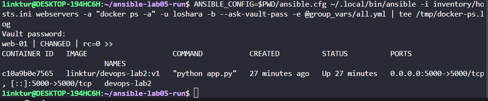
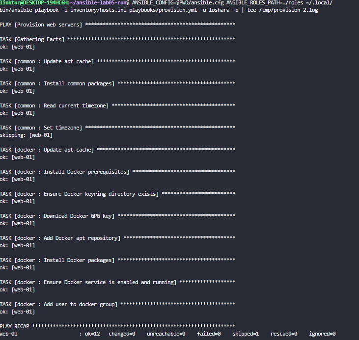

# LAB05 - Ansible Fundamentals

## 1. Architecture Overview

- **Ansible version:** 2.16+ (expected by lab, verify with `ansible --version`)
- **Target VM:** local VM from LAB04 (`10.241.1.215`)
- **Target OS:** Debian 13 (role logic also supports Ubuntu)
- **Project structure:** role-based layout (`common`, `docker`, `app_deploy`) with separate playbooks for provisioning and deploy.

Why roles instead of one monolithic playbook:
- roles isolate responsibilities by domain (base system, Docker, app deployment);
- variables, handlers and tasks stay reusable between labs/environments;
- support and debugging are easier because each role is independent.

## 2. Roles Documentation

### Role: `common`
- **Purpose:** base server preparation (apt cache, common packages, timezone).
- **Variables:**
  - `common_packages` - list of base packages.
  - `common_timezone` - desired timezone (`UTC` by default).
  - `common_apt_cache_valid_time` - apt cache TTL.
- **Handlers:** none.
- **Dependencies:** none.

### Role: `docker`
- **Purpose:** install and configure Docker Engine via official Docker repository.
- **Variables:**
  - `docker_user` - user added to `docker` group.
  - `docker_packages` - Docker related packages.
  - `docker_repo_distribution`, `docker_apt_release` - distro/release mapping for repo URL.
  - `docker_architecture_map` - architecture mapping for apt repo.
- **Handlers:**
  - `restart docker` - restarts Docker service when repository/packages/key change.
- **Dependencies:** none.

### Role: `app_deploy`
- **Purpose:** login to Docker Hub, pull image, recreate container when needed, verify app health.
- **Variables:**
  - `dockerhub_username`, `dockerhub_password` - credentials from Vault.
  - `docker_image`, `docker_image_tag` - deployment image settings.
  - `app_container_name`, `app_port`, `app_container_port`, `app_restart_policy`.
  - `app_env`, `app_healthcheck_path`.
- **Handlers:**
  - `restart application container` - restarts app container if image pull triggered handler and container existed.
- **Dependencies:** Docker must be installed first (`docker` role).

## 3. Idempotency Demonstration

Run from `ansible/`:

```bash
ansible-playbook playbooks/provision.yml
ansible-playbook playbooks/provision.yml
```

Paste output snippets below:

### First run (`provision.yml`)
```text
PLAY [Provision web servers] ***************************************************

TASK [Gathering Facts] *********************************************************
ok: [web-01]

TASK [common : Update apt cache] ***********************************************
ok: [web-01]

TASK [common : Install common packages] ****************************************
ok: [web-01]

TASK [common : Read current timezone] ******************************************
ok: [web-01]

TASK [common : Set timezone] ***************************************************
skipping: [web-01]

TASK [docker : Update apt cache] ***********************************************
ok: [web-01]

TASK [docker : Install Docker prerequisites] ***********************************
ok: [web-01]

TASK [docker : Ensure Docker keyring directory exists] *************************
ok: [web-01]

TASK [docker : Download Docker GPG key] ****************************************
ok: [web-01]

TASK [docker : Add Docker apt repository] **************************************
ok: [web-01]

TASK [docker : Install Docker packages] ****************************************
ok: [web-01]

TASK [docker : Ensure Docker service is enabled and running] *******************
ok: [web-01]

TASK [docker : Add user to docker group] ***************************************
ok: [web-01]

PLAY RECAP *********************************************************************
web-01                     : ok=12   changed=0    unreachable=0    failed=0    skipped=1    rescued=0    ignored=0
```

### Second run (`provision.yml`)
```text
PLAY [Provision web servers] ***************************************************

TASK [Gathering Facts] *********************************************************
ok: [web-01]

TASK [common : Update apt cache] ***********************************************
ok: [web-01]

TASK [common : Install common packages] ****************************************
ok: [web-01]

TASK [common : Read current timezone] ******************************************
ok: [web-01]

TASK [common : Set timezone] ***************************************************
skipping: [web-01]

TASK [docker : Update apt cache] ***********************************************
ok: [web-01]

TASK [docker : Install Docker prerequisites] ***********************************
ok: [web-01]

TASK [docker : Ensure Docker keyring directory exists] *************************
ok: [web-01]

TASK [docker : Download Docker GPG key] ****************************************
ok: [web-01]

TASK [docker : Add Docker apt repository] **************************************
ok: [web-01]

TASK [docker : Install Docker packages] ****************************************
ok: [web-01]

TASK [docker : Ensure Docker service is enabled and running] *******************
ok: [web-01]

TASK [docker : Add user to docker group] ***************************************
ok: [web-01]

PLAY RECAP *********************************************************************
web-01                     : ok=12   changed=0    unreachable=0    failed=0    skipped=1    rescued=0    ignored=0
```

Analysis:
- first run should show many `changed` tasks because packages/repos/services are applied first time;
- second run should be mostly `ok` because desired state already matches actual state;
- this is achieved by stateful modules (`apt`, `service`, `user`, `docker_container`) and conditional recreation logic.

## 4. Ansible Vault Usage

Sensitive variables are stored in encrypted `group_vars/all.yml`.

Create file:

```bash
cd ansible
ansible-vault create group_vars/all.yml
```

Use this content inside Vault file:

```yaml
---
dockerhub_username: "your-dockerhub-username"
dockerhub_password: "your-dockerhub-access-token"

app_name: "devops-lab2"
docker_image: "{{ dockerhub_username }}/{{ app_name }}"
docker_image_tag: "latest"
app_port: 5000
app_container_port: 5000
app_container_name: "{{ app_name }}"
```

Password strategy:
- use `--ask-vault-pass` for manual runs;
- optional: store password in `.vault_pass` locally and keep it out of git.

Why Vault is important:
- secrets can be committed safely in encrypted form;
- prevents plaintext credential leakage in repository history.

## 5. Deployment Verification

Run deploy:

```bash
cd ansible
ansible-galaxy collection install -r requirements.yml
ansible-playbook playbooks/deploy.yml --ask-vault-pass
ansible webservers -a "docker ps"
curl http://10.241.1.215:5000/health
curl http://10.241.1.215:5000/
```

Paste output snippets:

### `deploy.yml` output
```text
PLAY [Deploy application] ******************************************************

TASK [Gathering Facts] *********************************************************
ok: [web-01]

TASK [app_deploy : Validate required Docker Hub credentials] *******************
ok: [web-01] => {
    "changed": false,
    "msg": "All assertions passed"
}

TASK [app_deploy : Read current container information] *************************
ok: [web-01]

TASK [app_deploy : Log in to Docker Hub] ***************************************
ok: [web-01]

TASK [app_deploy : Pull application image] *************************************
ok: [web-01]

TASK [app_deploy : Stop existing container when redeploy is required] **********
skipping: [web-01]

TASK [app_deploy : Remove old container when redeploy is required] *************
skipping: [web-01]

TASK [app_deploy : Run application container] **********************************
changed: [web-01]

TASK [app_deploy : Wait for application port] **********************************
ok: [web-01]

TASK [app_deploy : Verify health endpoint] *************************************
ok: [web-01]

PLAY RECAP *********************************************************************
web-01                     : ok=8    changed=1    unreachable=0    failed=0    skipped=2    rescued=0    ignored=0
```

### `docker ps` output
```text
web-01 | CHANGED | rc=0 >>
CONTAINER ID   IMAGE                    COMMAND           CREATED          STATUS          PORTS                                          NAMES
c10a9b0e7565   linktur/devops-lab2:v1   "python app.py"   27 minutes ago   Up 27 minutes   0.0.0.0:5000->5000/tcp, [::]:5000->5000/tcp   devops-lab2
```

### Health checks
```text
curl http://10.241.1.215:5000/health
{"status":"healthy","timestamp":"2026-03-13T20:51:31.374Z","uptime_seconds":4768}

curl http://10.241.1.215:5000/
{"endpoints":[{"description":"Service information","method":"GET","path":"/"},{"description":"Health check","method":"GET","path":"/health"}],"request":{"client_ip":"10.241.1.148","method":"GET","path":"/","user_agent":"curl/7.81.0"},"runtime":{"current_time":"2026-03-13T20:51:31.383Z","timezone":"UTC","uptime_human":"1 hours, 19 minutes","uptime_seconds":4768},"service":{"description":"DevOps course info service","framework":"Flask","name":"devops-info-service","version":"1.0.0"},"system":{"architecture":"x86_64","cpu_count":1,"hostname":"c10a9b0e7565","platform":"Linux","platform_version":"Debian GNU/Linux 13 (trixie)","python_version":"3.13.12"}}
```

### Handler execution
```text
# if handler ran, paste TASK [app_deploy : restart application container] lines
```

## 6. Key Decisions

**Why roles instead of plain playbooks?**  
Roles isolate logic and keep playbooks thin. This gives clearer boundaries between provisioning and deployment and makes future changes safer.

**How do roles improve reusability?**  
Each role can be reused in other environments or combined with other playbooks. Variable defaults make behavior configurable without editing task code.

**What makes a task idempotent?**  
A task is idempotent when repeated runs converge to same state without extra changes. Using declarative modules (`state: present/started`) and conditions avoids unnecessary mutations.

**How do handlers improve efficiency?**  
Handlers run only when notified by changed tasks, so services are not restarted on every run. This reduces downtime and keeps runs predictable.

**Why is Ansible Vault necessary?**  
Vault protects secrets in version control and CI logs. It allows collaboration while keeping Docker Hub credentials encrypted.

## 7. Challenges (Optional)

- `ansible` may not be preinstalled on control node: install in WSL or Linux before running.
- Docker repo can require distro-specific release names; override `docker_apt_release` if needed.
- Ensure VM firewall allows `22` and `5000` from your workstation.

## 8. Screenshots



