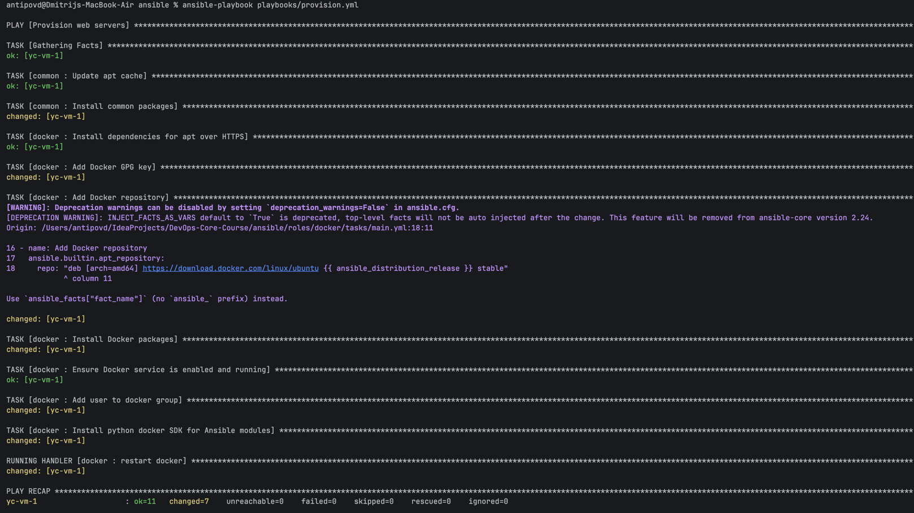
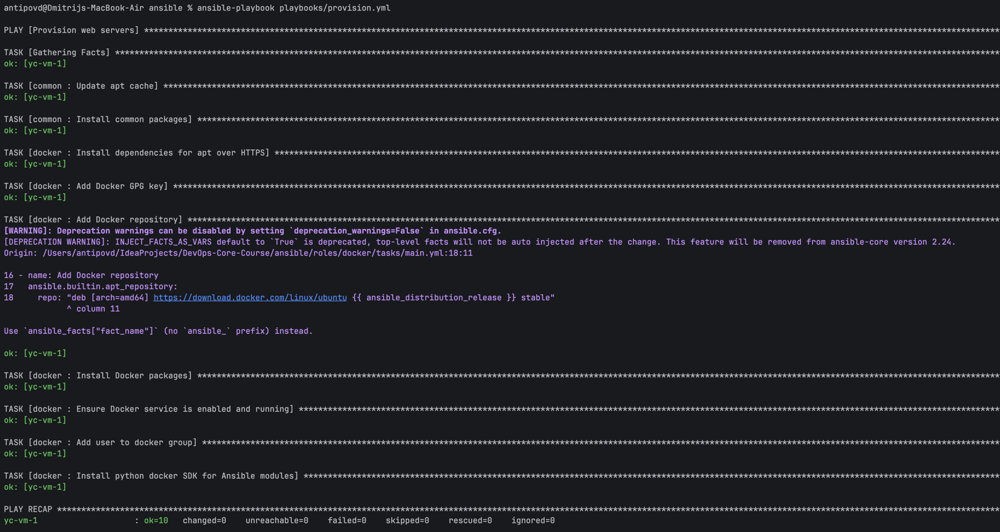
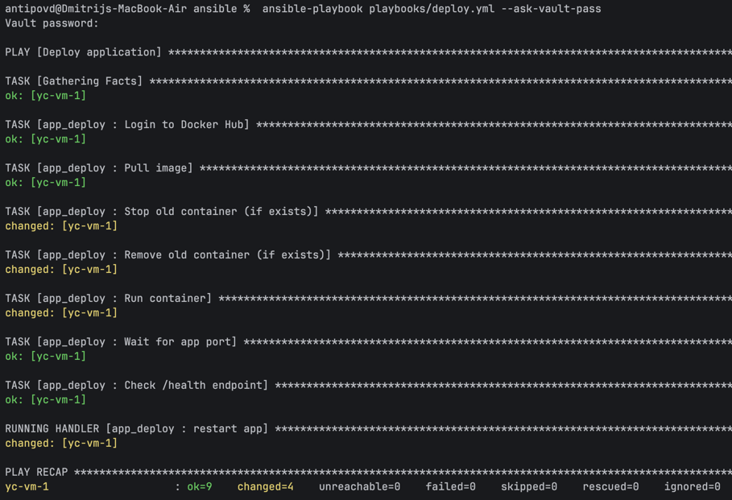
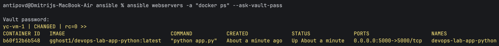
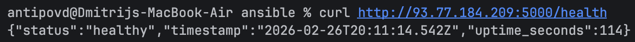

# Ansible Provisioning & Deployment

## Architecture Overview
- Ansible version: 2.20.3
- Target VM OS and version: Ubuntu 24.04.3 LTS
- This lab is organized using Ansible roles, which automatically load related tasks, handlers, defaults, and other artifacts based on a standard role directory structure.
  Playbooks are kept minimal and only define what to run (which roles) against which hosts, while roles contain the implementation details.
- Roles improve maintainability by separating responsibilities (base OS setup, Docker installation, application deployment) into reusable, well-scoped units.
  This also keeps playbooks clean and makes it easier to reuse the same role in other labs/projects by overriding variables instead of copying code.

## Roles Documentation
### 2.1 Role: common
#### Purpose
Prepare the operating system for automation by updating apt cache and installing essential baseline packages.

#### Key variables and defaults
File: roles/common/defaults/main.yml
- common_packages: list of packages to be installed

#### Tasks
File: roles/common/tasks/main.yml
- Update apt cache
- Install common packages

#### Handlers
None.

##### Dependencies
None.

### 2.2 Role: docker
#### Purpose
Install Docker Engine, enable and start Docker service, add a user to the docker group, and install python3-docker for Ansible Docker modules.

#### Key variables and defaults
File: roles/docker/defaults/main.yml
- docker_user: user to be added into docker group

#### Tasks
File: roles/docker/tasks/main.yml
- Add Docker GPG key
- Add Docker APT repository
- Install Docker packages
- Ensure service enabled and running
- Add user to docker group
- Install python3-docker

#### Handlers
File: roles/docker/handlers/main.yml
- restart docker

#### Dependencies
Recommended to run after common (baseline packages and system state), but no hard-coded dependency is required.

### 2.3 Role: app_deploy
#### Purpose
Authenticate to Docker Hub (securely via Ansible Vault), pull a container image, recreate the container with the desired configuration, wait for the service to be reachable, and verify the health endpoint.

#### Key variables and defaults
File: roles/app_deploy/defaults/main.yml
- app_port
- app_restart_policy
- app_env (environment variables)

#### Tasks
File: roles/app_deploy/tasks/main.yml
- Docker Hub login (no_log enabled)
- Pull image
- Stop/remove old container if present
- Run new container with port mapping and restart policy
- Wait for port
- Health check via HTTP

#### Handlers
File: roles/app_deploy/handlers/main.yml
- restart app

#### Dependencies
Depends on Docker being installed and running on the target host (so it should be executed after the docker role).

## Idempotency Demonstration


### What changed on the first run and why?
- common : Install common packages was changed because some baseline packages were not installed yet, so Ansible installed them to reach the desired state.
- docker : Add Docker GPG key was changed because the Docker repository signing key was not present on the VM and had to be added.
- docker : Add Docker repository was changed because the Docker APT repository entry did not exist, so Ansible created it.
- docker : Install Docker packages was changed because Docker Engine and related packages were missing and were installed during the first run.
- docker : Add user to docker group and docker : Install python docker SDK for Ansible modules were changed because the user needed group membership for non-root Docker usage and the python3-docker package was required for Ansible Docker modules.

### What did not change on the second run and why?
- common : Install common packages was ok because the required packages were already installed from the first run.
- docker : Add Docker GPG key and docker : Add Docker repository were ok because the key and repository were already present and correctly configured.
- docker : Install Docker packages was ok because Docker packages were already installed at the required state.
- docker : Ensure Docker service is enabled and running remained ok because the service was already enabled and started.
- docker : Add user to docker group and docker : Install python docker SDK for Ansible modules were ok because the user group membership and the python3-docker package were already in place.

### Why the roles are idempotent
The roles are idempotent because they rely on stateful Ansible modules (packages, repositories, services, users) that converge the server to a declared target state and report changed only when the current state differs from that desired state.
Additionally, the Docker restart handler ran on the first run because it was notified by tasks that changed, and handlers are designed to run after tasks complete and only when notified by changes, which avoids unnecessary restarts on subsequent runs.

## Ansible Vault Usage
Sensitive data (Docker Hub credentials) is stored in an encrypted variable file using Ansible Vault, so secrets can be kept out of plaintext while still being usable by automation.
This allows storing encrypted files in version control without exposing credentials. 

### Vault password management
Strategy used:
--ask-vault-pass (interactive prompt)

### Example of encrypted file
```text
$ANSIBLE_VAULT;1.1;AES256
65636336326336346437643335383935623035393366396334336634396236666130356662333237
3031343362643435313537353564643965623735313039300a326537353861653838373432323136
32353330303665373565313738323033373538646633366530386536393739343236346564626232
3131343233386263380a323937333433326366303735336539656435373038666530613836343534
64306464633338653931343665613538616432666165396537333331323765343664366331373735
61313863386335666535396164623164643061633164386133326465653136373965626136363463
34363836396637396435376533356630663332333433636435383733343832663963636565363864
33303163393066393435363563653863386463663835386230363238616430333432343030383532
63396466336135306565616163666633633239303536663937613864386537646362643233376437
35623739366463303537393065643936666631653739636663636138333563663163396263356561
63653237383935303637336439396131366338323664613131316166396131306330653930653366
32633262623939383637323135313665633330346436316631663037613635326563323333633637
36346139646366383566383930333630366663333930376662613761386433386661373833666466
34633136653035393334643933393336616137396531613537613664393366643030343930323334
34373461323439343034366231636363396161663834666331336231353233643630396631626139
66343238663361666161323162313038663165303932323238656132613636616538333761323434
3365
```

### Why Ansible Vault is important
Ansible Vault is important because it encrypts secrets (passwords/tokens/keys) and supports decrypting them only at runtime when the correct vault secret is provided. 

## Deployment Verification




## Key Decisions
### Why use roles instead of plain playbooks?
Roles provide a standardized way to package tasks, defaults, handlers, and templates, which improves readability and long-term maintainability.
They also keep playbooks short and focused on orchestration rather than implementation details.

### How do roles improve reusability?
A role can be applied to multiple hosts and projects by overriding variables, without duplicating task logic.
This enables consistent provisioning patterns across environments.

### What makes a task idempotent?
A task is idempotent when running it multiple times results in the same final state and the second run produces no changes if the desired state is already met.

### How do handlers improve efficiency?
Handlers are executed only when changes occur and are typically run once per play, even if multiple tasks notify them.
This avoids repeated service restarts during a single play execution.

### Why is Ansible Vault necessary?
Vault is necessary to encrypt sensitive information so that secrets are not stored in plaintext and can be safely committed to a repository while remaining usable during automation.