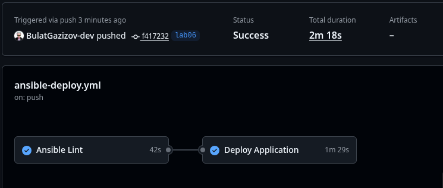
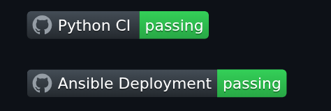

# Lab 6: Advanced Ansible & CI/CD - Submission

**Name:** Bulat Gazizov
**Date:** 2026-03-04
**Lab Points:** 10

---

## Task 1: Blocks & Tags (2 pts)

### My implementation details

Common Role: Package tasks in packages block, user tasks in users block – both with become: true at block level. Added rescue for apt failures (--fix-missing) and always block logging completion to /tmp.

Docker Role: Installation (docker_install) and config (docker_config) blocks. Nested block for GPG key with rescue (10s wait + retry). Always block ensures Docker service is running.

Tags Strategy: Role-level tags (common, docker) plus granular tags (packages, users, docker_install, docker_config) for selective execution.

Error Handling: Rescue blocks catch failures (apt issues, GPG timeouts); always blocks guarantee cleanup/service enablement.

```bash
ansible-playbook playbooks/provision.yml --tags "docker"

# Rescue error handling

PLAY [Provision web servers] *********************************************************************************************************

TASK [Gathering Facts] ***************************************************************************************************************
ok: [your-vm-name]

TASK [docker : Update apt cache] *****************************************************************************************************
ok: [your-vm-name]

TASK [docker : Install required system packages] *************************************************************************************
ok: [your-vm-name]

TASK [docker : Create keyrings directory] ********************************************************************************************
ok: [your-vm-name]

TASK [docker : Download Dockers official GPG key] ***********************************************************************************
ok: [your-vm-name]

TASK [docker : Add Docker repository to apt sources] *********************************************************************************
ok: [your-vm-name]

TASK [docker : Update apt cache after adding Docker repo] ****************************************************************************
[WARNING]: Failed to update cache after 1 retries due to E:The repository 'https://download.docker.com/linux/debian noble Release'
does not have a Release file., retrying
[WARNING]: Sleeping for 2 seconds, before attempting to refresh the cache again
[WARNING]: Failed to update cache after 2 retries due to W:Updating from such a repository can't be done securely, and is therefore
disabled by default., W:See apt-secure(8) manpage for repository creation and user configuration details., E:The repository
'https://download.docker.com/linux/debian noble Release' does not have a Release file., retrying
[WARNING]: Sleeping for 3 seconds, before attempting to refresh the cache again
[WARNING]: Failed to update cache after 3 retries due to W:Updating from such a repository can't be done securely, and is therefore
disabled by default., W:See apt-secure(8) manpage for repository creation and user configuration details., E:The repository
'https://download.docker.com/linux/debian noble Release' does not have a Release file., retrying
[WARNING]: Sleeping for 5 seconds, before attempting to refresh the cache again
[WARNING]: Failed to update cache after 4 retries due to W:Updating from such a repository can't be done securely, and is therefore
disabled by default., W:See apt-secure(8) manpage for repository creation and user configuration details., E:The repository
'https://download.docker.com/linux/debian noble Release' does not have a Release file., retrying
[WARNING]: Sleeping for 9 seconds, before attempting to refresh the cache again
[WARNING]: Failed to update cache after 5 retries due to W:Updating from such a repository can't be done securely, and is therefore
disabled by default., W:See apt-secure(8) manpage for repository creation and user configuration details., E:The repository
'https://download.docker.com/linux/debian noble Release' does not have a Release file., retrying
[WARNING]: Sleeping for 13 seconds, before attempting to refresh the cache again
fatal: [your-vm-name]: FAILED! => {"changed": false, "msg": "Failed to update apt cache after 5 retries: W:Updating from such a repository can't be done securely, and is therefore disabled by default., W:See apt-secure(8) manpage for repository creation and user configuration details., E:The repository 'https://download.docker.com/linux/debian noble Release' does not have a Release file."}

TASK [docker : Ensure Docker service is running and enabled] *************************************************************************
fatal: [your-vm-name]: FAILED! => {"changed": false, "msg": "Could not find the requested service docker: host"}

PLAY RECAP ***************************************************************************************************************************
your-vm-name               : ok=6    changed=0    unreachable=0    failed=2    skipped=0    rescued=0    ignored=0   

# After fixing error

ansible-playbook playbooks/provision.yml --tags "docker"

PLAY [Provision web servers] *********************************************************************************************************

TASK [Gathering Facts] ***************************************************************************************************************
ok: [your-vm-name]

TASK [docker : Update apt cache] *****************************************************************************************************
ok: [your-vm-name]

TASK [docker : Install required system packages] *************************************************************************************
ok: [your-vm-name]

TASK [docker : Create keyrings directory] ********************************************************************************************
ok: [your-vm-name]

TASK [docker : Download Dockers official GPG key] ***********************************************************************************
ok: [your-vm-name]

TASK [docker : Add Docker repository to apt sources] *********************************************************************************
changed: [your-vm-name]

TASK [docker : Update apt cache after adding Docker repo] ****************************************************************************
changed: [your-vm-name]

TASK [docker : Install Docker packages] **********************************************************************************************
changed: [your-vm-name]

TASK [docker : Ensure Docker service is running and enabled] *************************************************************************
ok: [your-vm-name]

TASK [docker : Add user to docker group] *********************************************************************************************
changed: [your-vm-name]

TASK [docker : Install python3-docker for Ansible docker modules] ********************************************************************
changed: [your-vm-name]

RUNNING HANDLER [docker : restart docker] ********************************************************************************************
changed: [your-vm-name]

PLAY RECAP ***************************************************************************************************************************
your-vm-name               : ok=12   changed=6    unreachable=0    failed=0    skipped=0    rescued=0    ignored=0   


# Check mode to see what would run
ansible-playbook playbooks/provision.yml --tags "docker" --check

PLAY [Provision web servers] *********************************************************************************************************

TASK [Gathering Facts] ***************************************************************************************************************
ok: [your-vm-name]

TASK [docker : Update apt cache] *****************************************************************************************************
ok: [your-vm-name]

TASK [docker : Install required system packages] *************************************************************************************
ok: [your-vm-name]

TASK [docker : Create keyrings directory] ********************************************************************************************
ok: [your-vm-name]

TASK [docker : Download Dockers official GPG key] ***********************************************************************************
ok: [your-vm-name]

TASK [docker : Add Docker repository to apt sources] *********************************************************************************
ok: [your-vm-name]

TASK [docker : Update apt cache after adding Docker repo] ****************************************************************************
changed: [your-vm-name]

TASK [docker : Install Docker packages] **********************************************************************************************
ok: [your-vm-name]

TASK [docker : Ensure Docker service is running and enabled] *************************************************************************
ok: [your-vm-name]

TASK [docker : Add user to docker group] *********************************************************************************************
ok: [your-vm-name]

TASK [docker : Install python3-docker for Ansible docker modules] ********************************************************************
ok: [your-vm-name]

PLAY RECAP ***************************************************************************************************************************
your-vm-name               : ok=11   changed=1    unreachable=0    failed=0    skipped=0    rescued=0    ignored=0   

# Run only docker installation tasks
ansible-playbook playbooks/provision.yml --tags "docker_install"

PLAY [Provision web servers] *********************************************************************************************************

TASK [Gathering Facts] ***************************************************************************************************************
ok: [your-vm-name]

TASK [docker : Update apt cache] *****************************************************************************************************
ok: [your-vm-name]

TASK [docker : Install required system packages] *************************************************************************************
ok: [your-vm-name]

TASK [docker : Create keyrings directory] ********************************************************************************************
ok: [your-vm-name]

TASK [docker : Download Dockers official GPG key] ***********************************************************************************
ok: [your-vm-name]

TASK [docker : Add Docker repository to apt sources] *********************************************************************************
ok: [your-vm-name]

TASK [docker : Update apt cache after adding Docker repo] ****************************************************************************
changed: [your-vm-name]

TASK [docker : Install Docker packages] **********************************************************************************************
ok: [your-vm-name]

TASK [docker : Ensure Docker service is running and enabled] *************************************************************************
ok: [your-vm-name]

PLAY RECAP ***************************************************************************************************************************
your-vm-name               : ok=9    changed=1    unreachable=0    failed=0    skipped=0    rescued=0    ignored=0   


```

### Research answers

- Q: What happens if rescue block also fails? \
If a task inside the rescue block fails, the entire block (including the original block and rescue) is marked as failed. The always block (if present) still executes, then play execution continues with the next task.

- Q: Can you have nested blocks? \
Yes, you can nest blocks. Each inner block can have its own rescue and always sections.

- Q: How do tags inherit to tasks within blocks? \
Tags applied to a block are inherited by all tasks inside that block. Tasks can also have their own additional tags.

## Task 2: Docker Compose (3 pts)

### My implementation

- Added Docker as a dependency in meta/main.yml so it auto-installs before web app deployment

- Use blocks with tags (app_deploy, compose) for organized, selective execution

- Added health checks to verify successful deployment

- Created Jinja2 template with dynamic variables

### Template code

```yaml
version: '3.8'

services:
  {{ app_name }}:
    image: {{ docker_image }}:{{ docker_tag }}
    container_name: {{ app_name }}
    ports:
      - "{{ app_port }}:{{ app_internal_port }}"
    environment:
      
      {{ key }}: {{ value }}
      
    restart: unless-stopped
```

### Before/after comparison

| Aspect | Before (`docker run`) | After (Docker Compose) |
| -------- | ---------------------- | ------------------------ |
| **Configuration** | Imperative commands in Ansible tasks | Declarative YAML template |
| **Multi-container** | Complex with multiple tasks | Simple service definitions |
| **Updates** | Manual container removal | `recreate: auto` handles changes |
| **Networks** | Manual creation | Auto-generated with DNS |
| **Environment** | Hardcoded in tasks | Template with variable substitution |
| **Idempotency** | Partial (check image exists) | Full (compares desired vs running state) |
| **Secrets** | Passed via Ansible | Vault variables in template |

```bash
ansible-playbook playbooks/deploy.yml

PLAY [Deploy application] *************************************************************************************************

TASK [Gathering Facts] ****************************************************************************************************
ok: [your-vm-name]

TASK [docker : Update apt cache] ******************************************************************************************
ok: [your-vm-name]

TASK [docker : Install required system packages] **************************************************************************
ok: [your-vm-name]

TASK [docker : Create keyrings directory] *********************************************************************************
ok: [your-vm-name]

TASK [docker : Download Dockers official GPG key] ************************************************************************
ok: [your-vm-name]

TASK [docker : Add Docker repository to apt sources] **********************************************************************
ok: [your-vm-name]

TASK [docker : Update apt cache after adding Docker repo] *****************************************************************
changed: [your-vm-name]

TASK [docker : Install Docker packages] ***********************************************************************************
ok: [your-vm-name]

TASK [docker : Ensure Docker service is running and enabled] **************************************************************
ok: [your-vm-name]

TASK [docker : Add user to docker group] **********************************************************************************
ok: [your-vm-name]

TASK [docker : Install python3-docker for Ansible docker modules] *********************************************************
ok: [your-vm-name]

TASK [web_app : Create application directory] *****************************************************************************
changed: [your-vm-name]

TASK [web_app : Template docker-compose.yml] ******************************************************************************
changed: [your-vm-name]

TASK [web_app : Deploy with Docker Compose] *******************************************************************************
[WARNING]: Docker compose: unknown None: /opt/app/docker-compose.yml: the attribute `version` is obsolete, it will be
ignored, please remove it to avoid potential confusion
changed: [your-vm-name]

TASK [web_app : Wait for application to be ready] *************************************************************************
ok: [your-vm-name]

TASK [web_app : Verify health endpoint] ***********************************************************************************
ok: [your-vm-name]

TASK [web_app : Display health check result] ******************************************************************************
ok: [your-vm-name] => {
    "msg": "Health check succeeded with status 200"
}

PLAY RECAP ****************************************************************************************************************
your-vm-name               : ok=17   changed=4    unreachable=0    failed=0    skipped=0    rescued=0    ignored=0   

```

#### Second run:

```bash
ansible-playbook playbooks/deploy.yml

PLAY [Deploy application] *************************************************************************************************

TASK [Gathering Facts] ****************************************************************************************************
ok: [your-vm-name]

TASK [docker : Update apt cache] ******************************************************************************************
ok: [your-vm-name]

TASK [docker : Install required system packages] **************************************************************************
ok: [your-vm-name]

TASK [docker : Create keyrings directory] *********************************************************************************
ok: [your-vm-name]

TASK [docker : Download Dockers official GPG key] ************************************************************************
ok: [your-vm-name]

TASK [docker : Add Docker repository to apt sources] **********************************************************************
ok: [your-vm-name]

TASK [docker : Update apt cache after adding Docker repo] *****************************************************************
changed: [your-vm-name]

TASK [docker : Install Docker packages] ***********************************************************************************
ok: [your-vm-name]

TASK [docker : Ensure Docker service is running and enabled] **************************************************************
ok: [your-vm-name]

TASK [docker : Add user to docker group] **********************************************************************************
ok: [your-vm-name]

TASK [docker : Install python3-docker for Ansible docker modules] *********************************************************
ok: [your-vm-name]

TASK [web_app : Create application directory] *****************************************************************************
ok: [your-vm-name]

TASK [web_app : Template docker-compose.yml] ******************************************************************************
changed: [your-vm-name]

TASK [web_app : Deploy with Docker Compose] *******************************************************************************
[WARNING]: Docker compose: unknown None: /opt/app/docker-compose.yml: the attribute `version` is obsolete, it will be
ignored, please remove it to avoid potential confusion
changed: [your-vm-name]

TASK [web_app : Wait for application to be ready] *************************************************************************
ok: [your-vm-name]

TASK [web_app : Verify health endpoint] ***********************************************************************************
ok: [your-vm-name]

TASK [web_app : Display health check result] ******************************************************************************
ok: [your-vm-name] => {
    "msg": "Health check succeeded with status 200"
}

PLAY RECAP ****************************************************************************************************************
your-vm-name               : ok=17   changed=3    unreachable=0    failed=0    skipped=0    rescued=0    ignored=0   

(.venv) bulatgazizov@fedora:~/Projects/DevOps-Core-Course/ansible$ ansible-playbook playbooks/deploy.yml

PLAY [Deploy application] *************************************************************************************************

TASK [Gathering Facts] ****************************************************************************************************
ok: [your-vm-name]

TASK [docker : Update apt cache] ******************************************************************************************
ok: [your-vm-name]

TASK [docker : Install required system packages] **************************************************************************
ok: [your-vm-name]

TASK [docker : Create keyrings directory] *********************************************************************************
ok: [your-vm-name]

TASK [docker : Download Dockers official GPG key] ************************************************************************
ok: [your-vm-name]

TASK [docker : Add Docker repository to apt sources] **********************************************************************
ok: [your-vm-name]

TASK [docker : Update apt cache after adding Docker repo] *****************************************************************
changed: [your-vm-name]

TASK [docker : Install Docker packages] ***********************************************************************************
ok: [your-vm-name]

TASK [docker : Ensure Docker service is running and enabled] **************************************************************
ok: [your-vm-name]

TASK [docker : Add user to docker group] **********************************************************************************
ok: [your-vm-name]

TASK [docker : Install python3-docker for Ansible docker modules] *********************************************************
ok: [your-vm-name]

TASK [web_app : Create application directory] *****************************************************************************
ok: [your-vm-name]

TASK [web_app : Template docker-compose.yml] ******************************************************************************
ok: [your-vm-name]

TASK [web_app : Deploy with Docker Compose] *******************************************************************************
[WARNING]: Docker compose: unknown None: /opt/app/docker-compose.yml: the attribute `version` is obsolete, it will be
ignored, please remove it to avoid potential confusion
ok: [your-vm-name]

TASK [web_app : Wait for application to be ready] *************************************************************************
ok: [your-vm-name]

TASK [web_app : Verify health endpoint] ***********************************************************************************
ok: [your-vm-name]

TASK [web_app : Display health check result] ******************************************************************************
ok: [your-vm-name] => {
    "msg": "Health check succeeded with status 200"
}

PLAY RECAP ****************************************************************************************************************
your-vm-name               : ok=17   changed=1    unreachable=0    failed=0    skipped=0    rescued=0    ignored=0   
```

#### Checking

```bash

ubuntu@compute-vm-2-1-20-ssd-1772646523189:~$ docker ps
CONTAINER ID   IMAGE                            COMMAND           CREATED         STATUS         PORTS                                         NAMES
dc595b2b8ccc   bulatgazizov/python_app:latest   "python app.py"   7 minutes ago   Up 7 minutes   0.0.0.0:8000->5000/tcp, [::]:8000->5000/tcp   app

ubuntu@compute-vm-2-1-20-ssd-1772646523189:~$ docker compose -f /opt/app/docker-compose.yml ps
WARN[0000] /opt/app/docker-compose.yml: the attribute `version` is obsolete, it will be ignored, please remove it to avoid potential confusion
NAME      IMAGE                            COMMAND           SERVICE   CREATED         STATUS         PORTS
app       bulatgazizov/python_app:latest   "python app.py"   app       8 minutes ago   Up 8 minutes   0.0.0.0:8000->5000/tcp, [::]:8000->5000/tcp

ubuntu@compute-vm-2-1-20-ssd-1772646523189:~$ curl http://localhost:8000
{"service":{"name":"devops-info-service","version":"1.0.0","description":"DevOps course info service","framework":"FastAPI"},"system":{"hostname":"dc595b2b8ccc","platform":"Linux","platform_version":"6.8.0-100-generic","architecture":"x86_64","cpu_count":2,"python_version":"3.12.12"},"runtime":{"uptime_seconds":506,"uptime_human":"0 hours, 8 minutes","current_time":"2026-03-04T19:31:45.985443+00:00","timezone":"UTC"},"request":{"client_ip":"172.18.0.1","user_agent":"curl/8.5.0","method":"GET","path":"/"},"endpoints":[{"path":"/openapi.json","description":"openapi","methods":["GET","HEAD"]},{"path":"/docs","description":"swagger_ui_html","methods":["GET","HEAD"]},{"path":"/docs/oauth2-redirect","description":"swagger_ui_redirect","methods":["GET","HEAD"]},{"path":"/redoc","description":"redoc_html","methods":["GET","HEAD"]},{"path":"/","description":"read_root","methods":["GET"]},{"path":"/health","description":"health","methods":["GET"]}]}

```

## Task 3: Wipe Logic (1 pt)

### Implementation explanation

- **Variable control**: `web_app_wipe: false` by default (in `defaults/main.yml`)
- **Tag isolation**: `web_app_wipe` tag for selective execution
- **Separate wipe file**: Clean separation of concerns
- **Logical ordering**: Wipe runs before deployment in main tasks
- **Double safety**: Both variable AND tag required for wipe to run

### Evidence

#### Scenario 1

```bash
ansible-playbook playbooks/deploy.yml

PLAY [Deploy application] *************************************************************************************************

TASK [Gathering Facts] ****************************************************************************************************
ok: [your-vm-name]

TASK [docker : Update apt cache] ******************************************************************************************
ok: [your-vm-name]

TASK [docker : Install required system packages] **************************************************************************
ok: [your-vm-name]

TASK [docker : Create keyrings directory] *********************************************************************************
ok: [your-vm-name]

TASK [docker : Download Dockers official GPG key] ************************************************************************
ok: [your-vm-name]

TASK [docker : Add Docker repository to apt sources] **********************************************************************
ok: [your-vm-name]

TASK [docker : Update apt cache after adding Docker repo] *****************************************************************
changed: [your-vm-name]

TASK [docker : Install Docker packages] ***********************************************************************************
ok: [your-vm-name]

TASK [docker : Ensure Docker service is running and enabled] **************************************************************
ok: [your-vm-name]

TASK [docker : Add user to docker group] **********************************************************************************
ok: [your-vm-name]

TASK [docker : Install python3-docker for Ansible docker modules] *********************************************************
ok: [your-vm-name]

TASK [web_app : Include wipe tasks] ***************************************************************************************
included: /home/bulatgazizov/Projects/DevOps-Core-Course/ansible/roles/web_app/tasks/wipe.yml for your-vm-name

TASK [web_app : Stop and remove containers with Docker Compose] ***********************************************************
skipping: [your-vm-name]

TASK [web_app : Remove docker-compose.yml file] ***************************************************************************
skipping: [your-vm-name]

TASK [web_app : Remove application directory] *****************************************************************************
skipping: [your-vm-name]

TASK [web_app : Optionally remove Docker images] **************************************************************************
skipping: [your-vm-name]

TASK [web_app : Log wipe completion] **************************************************************************************
skipping: [your-vm-name]

TASK [web_app : Create application directory] *****************************************************************************
ok: [your-vm-name]

TASK [web_app : Template docker-compose.yml] ******************************************************************************
ok: [your-vm-name]

TASK [web_app : Deploy with Docker Compose] *******************************************************************************
[WARNING]: Docker compose: unknown None: /opt/app/docker-compose.yml: the attribute `version` is obsolete, it will be
ignored, please remove it to avoid potential confusion
ok: [your-vm-name]

TASK [web_app : Wait for application to be ready] *************************************************************************
ok: [your-vm-name]

TASK [web_app : Verify health endpoint] ***********************************************************************************
ok: [your-vm-name]

TASK [web_app : Display health check result] ******************************************************************************
ok: [your-vm-name] => {
    "msg": "Health check succeeded with status 200"
}

PLAY RECAP ****************************************************************************************************************
your-vm-name               : ok=18   changed=1    unreachable=0    failed=0    skipped=5    rescued=0    ignored=0   


ubuntu@compute-vm-2-1-20-ssd-1772646523189:~$ docker ps
CONTAINER ID   IMAGE                            COMMAND           CREATED          STATUS          PORTS                                         NAMES
dc595b2b8ccc   bulatgazizov/python_app:latest   "python app.py"   26 minutes ago   Up 26 minutes   0.0.0.0:8000->5000/tcp, [::]:8000->5000/tcp   app
```

#### Scenario 2


```bash
ansible-playbook playbooks/deploy.yml \
  -e "web_app_wipe=true" \
  --tags web_app_wipe

PLAY [Deploy application] *************************************************************************************************

TASK [Gathering Facts] ****************************************************************************************************
ok: [your-vm-name]

TASK [web_app : Include wipe tasks] ***************************************************************************************
included: /home/bulatgazizov/Projects/DevOps-Core-Course/ansible/roles/web_app/tasks/wipe.yml for your-vm-name

TASK [web_app : Stop and remove containers with Docker Compose] ***********************************************************
[WARNING]: Docker compose: unknown None: /opt/app/docker-compose.yml: the attribute `version` is obsolete, it will be
ignored, please remove it to avoid potential confusion
changed: [your-vm-name]

TASK [web_app : Remove docker-compose.yml file] ***************************************************************************
changed: [your-vm-name]

TASK [web_app : Remove application directory] *****************************************************************************
changed: [your-vm-name]

TASK [web_app : Optionally remove Docker images] **************************************************************************
skipping: [your-vm-name]

TASK [web_app : Log wipe completion] **************************************************************************************
ok: [your-vm-name] => {
    "msg": [
        "Application app wiped successfully"
    ]
}

PLAY RECAP ****************************************************************************************************************
your-vm-name               : ok=6    changed=3    unreachable=0    failed=0    skipped=1    rescued=0    ignored=0   


ubuntu@compute-vm-2-1-20-ssd-1772646523189:~$ docker ps
CONTAINER ID   IMAGE     COMMAND   CREATED   STATUS    PORTS     NAMES
ubuntu@compute-vm-2-1-20-ssd-1772646523189:~$ ls /opt
containerd
```

#### Scenario 3

```bash
 ansible-playbook playbooks/deploy.yml \
  -e "web_app_wipe=true"

PLAY [Deploy application] *************************************************************************************************

TASK [Gathering Facts] ****************************************************************************************************
ok: [your-vm-name]

TASK [docker : Update apt cache] ******************************************************************************************
ok: [your-vm-name]

TASK [docker : Install required system packages] **************************************************************************
ok: [your-vm-name]

TASK [docker : Create keyrings directory] *********************************************************************************
ok: [your-vm-name]

TASK [docker : Download Dockers official GPG key] ************************************************************************
ok: [your-vm-name]

TASK [docker : Add Docker repository to apt sources] **********************************************************************
ok: [your-vm-name]

TASK [docker : Update apt cache after adding Docker repo] *****************************************************************
changed: [your-vm-name]

TASK [docker : Install Docker packages] ***********************************************************************************
ok: [your-vm-name]

TASK [docker : Ensure Docker service is running and enabled] **************************************************************
ok: [your-vm-name]

TASK [docker : Add user to docker group] **********************************************************************************
ok: [your-vm-name]

TASK [docker : Install python3-docker for Ansible docker modules] *********************************************************
ok: [your-vm-name]

TASK [web_app : Include wipe tasks] ***************************************************************************************
included: /home/bulatgazizov/Projects/DevOps-Core-Course/ansible/roles/web_app/tasks/wipe.yml for your-vm-name

TASK [web_app : Stop and remove containers with Docker Compose] ***********************************************************
fatal: [your-vm-name]: FAILED! => {"changed": false, "msg": "\"/opt/app\" is not a directory"}
...ignoring

TASK [web_app : Remove docker-compose.yml file] ***************************************************************************
ok: [your-vm-name]

TASK [web_app : Remove application directory] *****************************************************************************
ok: [your-vm-name]

TASK [web_app : Optionally remove Docker images] **************************************************************************
skipping: [your-vm-name]

TASK [web_app : Log wipe completion] **************************************************************************************
ok: [your-vm-name] => {
    "msg": [
        "Application app wiped successfully"
    ]
}

TASK [web_app : Create application directory] *****************************************************************************
changed: [your-vm-name]

TASK [web_app : Template docker-compose.yml] ******************************************************************************
changed: [your-vm-name]

TASK [web_app : Deploy with Docker Compose] *******************************************************************************
[WARNING]: Docker compose: unknown None: /opt/app/docker-compose.yml: the attribute `version` is obsolete, it will be
ignored, please remove it to avoid potential confusion
changed: [your-vm-name]

TASK [web_app : Wait for application to be ready] *************************************************************************
ok: [your-vm-name]

TASK [web_app : Verify health endpoint] ***********************************************************************************
ok: [your-vm-name]

TASK [web_app : Display health check result] ******************************************************************************
ok: [your-vm-name] => {
    "msg": "Health check succeeded with status 200"
}

PLAY RECAP ****************************************************************************************************************
your-vm-name               : ok=22   changed=4    unreachable=0    failed=0    skipped=1    rescued=0    ignored=1   


ubuntu@compute-vm-2-1-20-ssd-1772646523189:~$ docker ps
CONTAINER ID   IMAGE                            COMMAND           CREATED          STATUS          PORTS                                         NAMES    9e077dc54feb   bulatgazizov/python_app:latest   "python app.py"   41 seconds ago   Up 40 seconds   0.0.0.0:8000->5000/tcp, [::]:8000->5000/tcp   app
```

#### Scenario 4

```bash
ansible-playbook playbooks/deploy.yml --tags web_app_wipe

PLAY [Deploy application] *************************************************************************************************

TASK [Gathering Facts] ****************************************************************************************************
ok: [your-vm-name]

TASK [web_app : Include wipe tasks] ***************************************************************************************
included: /home/bulatgazizov/Projects/DevOps-Core-Course/ansible/roles/web_app/tasks/wipe.yml for your-vm-name

TASK [web_app : Stop and remove containers with Docker Compose] ***********************************************************
skipping: [your-vm-name]

TASK [web_app : Remove docker-compose.yml file] ***************************************************************************
skipping: [your-vm-name]

TASK [web_app : Remove application directory] *****************************************************************************
skipping: [your-vm-name]

TASK [web_app : Optionally remove Docker images] **************************************************************************
skipping: [your-vm-name]

TASK [web_app : Log wipe completion] **************************************************************************************
skipping: [your-vm-name]

PLAY RECAP ****************************************************************************************************************
your-vm-name               : ok=2    changed=0    unreachable=0    failed=0    skipped=5    rescued=0    ignored=0   

(.venv) bulatgazizov@fedora:~/Projects/DevOps-Core-Course/ansible$ ansible-playbook playbooks/deploy.yml \
  -e "web_app_wipe=true" \
  --tags web_app_wipe

PLAY [Deploy application] *************************************************************************************************

TASK [Gathering Facts] ****************************************************************************************************
ok: [your-vm-name]

TASK [web_app : Include wipe tasks] ***************************************************************************************
included: /home/bulatgazizov/Projects/DevOps-Core-Course/ansible/roles/web_app/tasks/wipe.yml for your-vm-name

TASK [web_app : Stop and remove containers with Docker Compose] ***********************************************************
[WARNING]: Docker compose: unknown None: /opt/app/docker-compose.yml: the attribute `version` is obsolete, it will be
ignored, please remove it to avoid potential confusion
changed: [your-vm-name]

TASK [web_app : Remove docker-compose.yml file] ***************************************************************************
changed: [your-vm-name]

TASK [web_app : Remove application directory] *****************************************************************************
changed: [your-vm-name]

TASK [web_app : Optionally remove Docker images] **************************************************************************
skipping: [your-vm-name]

TASK [web_app : Log wipe completion] **************************************************************************************
ok: [your-vm-name] => {
    "msg": [
        "Application app wiped successfully"
    ]
}

PLAY RECAP ****************************************************************************************************************
your-vm-name               : ok=6    changed=3    unreachable=0    failed=0    skipped=1    rescued=0    ignored=0   

```

### Research Questions

#### Q: Why use both variable AND tag? (Double safety mechanism)

**Answer:** This provides **two layers of protection** against accidental data loss:

- **Variable** (`web_app_wipe: false`) prevents wipe by default - even if someone runs with `--tags web_app_wipe`, nothing happens
- **Tag** (`web_app_wipe`) requires explicit intent - you must specifically request wipe tasks
- Together they ensure: "I really mean it" - both conditions must be satisfied for destructive actions

#### Q: What's the difference between `never` tag and this approach?

| Aspect | `never` Tag | Variable + Tag Approach |
| -------- | ------------- | ------------------------ |
| **Control** | Tag-based only | Both tag AND variable |
| **Safety** | Prevents accidental runs | Prevents accidental runs + requires explicit variable |
| **Flexibility** | Can't run unless specifically requested | Can run with tag OR variable separately |
| **Use case** | Debug tasks, rarely used | Destructive operations requiring confirmation |

The `never` tag would require `--tags web_app_wipe` to run, but doesn't have a variable safety net. Our approach is safer for destructive operations.

#### Q: Why must wipe logic come BEFORE deployment in main.yml?

**Answer:** For the **clean reinstallation scenario**:

- When `web_app_wipe=true`, we want: **remove old → install new**
- If wipe ran after deployment, it would remove what we just installed
- Order ensures proper workflow: start fresh, then deploy
- Also allows running wipe alone (with `--tags web_app_wipe`) without triggering deployment

#### Q: When would you want clean reinstallation vs. rolling update?

Clean reinstallation is preferred when making major version upgrades, configuration overhauls, or testing from a fresh state where you need to ensure no remnants of the old setup interfere. Rolling updates are better for production environments with live traffic where zero downtime is required and changes are minor (bug fixes, security patches).

#### Q: How would you extend this to wipe Docker images and volumes too?

**Answer:** Add optional tasks to the wipe block:

```yaml
- name: Remove Docker volumes
  docker_volume:
    name: "{{ item }}"
    state: absent
  loop: "{{ web_app_volumes | default([]) }}"
  when: web_app_remove_volumes | default(false) | bool
  ignore_errors: yes

- name: Remove Docker images
  docker_image:
    name: "{{ docker_image }}"
    tag: "{{ docker_tag }}"
    state: absent
    force_absent: yes
  when: web_app_remove_images | default(false) | bool

- name: Prune unused Docker resources
  command: docker system prune -f
  when: web_app_prune | default(false) | bool
  ignore_errors: yes
```


This gives granular control over what gets wiped.

## Task 4: CI/CD (3 pts)

### Workflow setup

- Path triggers - Only runs when Ansible files change

- Lint job - Validates syntax before deployment

- Self-hosted runner - Deploys to local machine without SSH

- Environment protection - Uses GitHub Environments for approval gates

- Verification step - Health checks after deployment

### Research Questions Answered

#### What are the security implications of storing SSH keys in GitHub Secrets?

Storing SSH keys in GitHub Secrets is **generally safe** but has risks:

- **Good**: Secrets are encrypted, not shown in logs, and only accessible to authorized users/workflows
- **Risks**: Anyone with write access to the repo can potentially steal secrets; compromised GitHub token = exposed keys
- **Best practice**: Use short-lived keys, restrict to specific IPs, and rotate them regularly

#### How would you implement a staging → production deployment pipeline?

**Simple pipeline approach:**

1. **Staging deploy** (automatic on push to `develop` branch)
2. **Manual approval** gate
3. **Production deploy** (triggered after approval)

#### What would you add to make rollbacks possible?

**Rollback mechanisms:**

1. **Version tagging** - Keep previous Docker images with version tags
2. **Backup compose files** - Save previous `docker-compose.yml` versions
3. **Rollback playbook tag** - Add `--tags rollback` that deploys previous version
4. **Health check validation** - Auto-rollback if health checks fail after deploy

#### How does self-hosted runner improve security compared to GitHub-hosted?

**Self-hosted advantages:**
- **Data privacy** - Code and secrets never leave your infrastructure
- **Network control** - Can access internal services without exposing them to internet
- **Compliance** - Meet regulatory requirements (data residency, etc.)
- **No third-party** - GitHub doesn't have access to your environment

**Trade-off**: You're responsible for securing the runner machine itself

### Evidence workflow

#### Successful workflow





```bash

WARNING  Rule ComplexityRule has an invalid version_changed field '', is should be a 'X.Y.Z' format value.
WARNING  Listing 1 violation(s) that are fatal
args[module]: Unsupported parameters for (basic.py) module: fix_broken. Supported parameters include: allow_change_held_packages, allow_downgrade, allow_unauthenticated, auto_install_module_deps, autoclean, autoremove, cache_valid_time, clean, deb, default_release, dpkg_options, fail_on_autoremove, force, force_apt_get, install_recommends, lock_timeout, only_upgrade, package, policy_rc_d, purge, state, update_cache, update_cache_retries, update_cache_retry_max_delay, upgrade (allow-downgrade, allow-downgrades, allow-unauthenticated, allow_downgrades, default-release, install-recommends, name, pkg, update-cache). (warning)
roles/common/tasks/main.yml:19 Task/Handler: Fix missing package sources on failure

Read documentation for instructions on how to ignore specific rule violations.

# Rule Violation Summary

  1 args profile:production tags:syntax,experimental

Passed: 0 failure(s), 1 warning(s) in 12 files processed of 12 encountered. Last profile that met the validation criteria was 'production'. Rating: 5/5 star
```

```bash
PLAY [Deploy application] ******************************************************
TASK [Gathering Facts] *********************************************************
ok: [your-vm-name]
TASK [web_app : Create application directory] **********************************
ok: [your-vm-name]
TASK [web_app : Template docker-compose.yml] ***********************************
ok: [your-vm-name]
TASK [web_app : Deploy with Docker Compose] ************************************
Warning: : Cannot parse event from line: 'time="2026-03-04T22:15:03Z"
level=warning msg="/opt/app/docker-compose.yml: the attribute `version` is
obsolete, it will be ignored, please remove it to avoid potential confusion"'.
Please report this at https://github.com/ansible-collections/community.docker/i
ssues/new?assignees=&labels=&projects=&template=bug_report.md
changed: [your-vm-name]
TASK [web_app : Wait for application to be ready] ******************************
ok: [your-vm-name]
TASK [web_app : Verify health endpoint] ****************************************
ok: [your-vm-name]
TASK [web_app : Display health check result] ***********************************
ok: [your-vm-name] => {
    "msg": "Health check succeeded with status 200"
}
PLAY RECAP *********************************************************************
your-vm-name               : ok=7    changed=1    unreachable=0    failed=0    skipped=0    rescued=0    ignored=0   
```

## Summary

### Overall reflection

Honestly, I'm exhausted. He's been working on it since morning. The lab is honestly poorly designed, with a lot of inconsistencies. Linter and workflow forced me to redo a lot.

### Total time spent

From morning to evening (didn't count)

### Key learnings

What an inconvenient thing this is...
