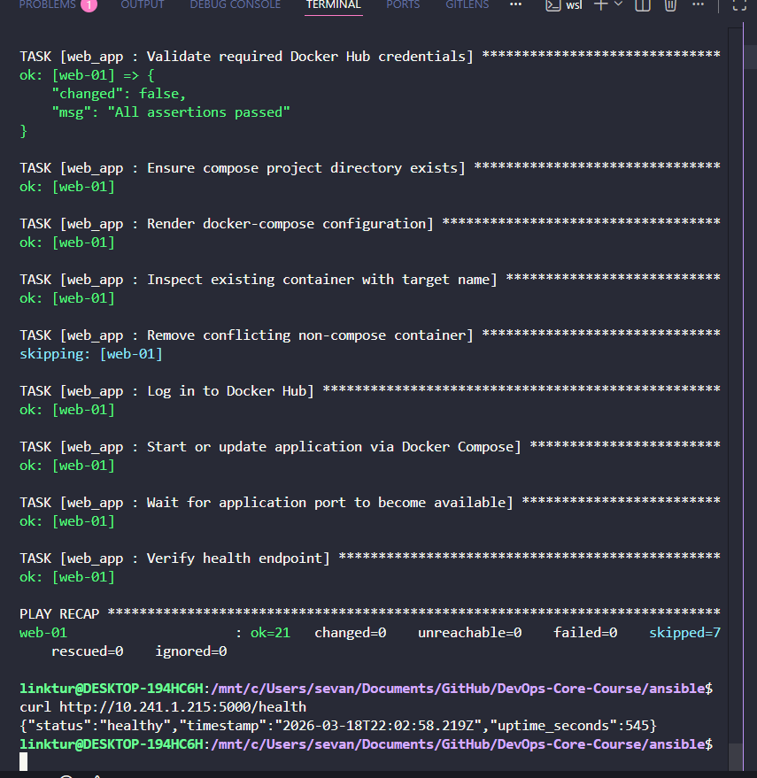

## 1. Overview

In this lab I improved Ansible project from Lab05.

I did:
- blocks, rescue, always
- tags for selective run
- Docker Compose deploy
- wipe logic (safe delete)
- GitHub Actions workflow for Ansible

Main files:
- `ansible/roles/common/tasks/main.yml`
- `ansible/roles/docker/tasks/main.yml`
- `ansible/roles/web_app/tasks/main.yml`
- `ansible/roles/web_app/tasks/wipe.yml`
- `ansible/roles/web_app/templates/docker-compose.yml.j2`
- `.github/workflows/ansible-deploy.yml`

## 2. Blocks and Tags

I added blocks and tags in roles:

- `common` role: tags `packages`, `users`
- `docker` role: tags `docker_install`, `docker_config`
- role-level tags: `common`, `docker`, `web_app`

List tags result:
- `common, docker, docker_config, docker_install, packages, users`

Selective run tests:
- `--tags docker` works
- `--skip-tags common` works

## 3. Docker Compose Migration

I renamed role `app_deploy` to `web_app`.

I changed deploy from `docker_container` to Docker Compose (`docker_compose_v2`).

I added:
- compose template with variables
- role dependency `web_app -> docker`
- health check after deploy

## 4. Wipe Logic

Safety logic:
- variable: `web_app_wipe` (default `false`)
- tag: `web_app_wipe`

Behavior:
- normal deploy: wipe tasks are skipped
- wipe-only command: removes app files and containers
- clean reinstall: wipe first, then deploy

## 5. CI/CD

I created workflow:
- file: `.github/workflows/ansible-deploy.yml`
- jobs: `lint` and `deploy`
- deploy uses SSH + secrets
- workflow has verification step with `curl`

I also added workflow badge in `README.md`.

## 6. Test Results (from terminal)

### Provision with tags
- `ansible-playbook playbooks/provision.yml --tags docker`
- Result: `ok=9 changed=0 failed=0`

### Deploy run 1
- `ansible-playbook playbooks/deploy.yml --vault-id @prompt`
- Result: `ok=22 changed=2 failed=0`

### Deploy run 2 (idempotency)
- `ansible-playbook playbooks/deploy.yml --vault-id @prompt`
- Result: `ok=21 changed=0 failed=0`

### Wipe only
- `ansible-playbook playbooks/deploy.yml --vault-id @prompt -e "web_app_wipe=true" --tags web_app_wipe`
- Result: `ok=8 changed=3 failed=0`

### Clean reinstall
- `ansible-playbook playbooks/deploy.yml --vault-id @prompt -e "web_app_wipe=true"`
- Result: `ok=25 changed=3 failed=0`

### Safety check (tag only, variable false)
- `ansible-playbook playbooks/deploy.yml --vault-id @prompt --tags web_app_wipe`
- Result: `ok=3 changed=0 skipped=6 failed=0`

### Service checks
- `curl http://10.241.1.215:5000/` -> app returns JSON
- `curl http://10.241.1.215:5000/health` -> `{"status":"healthy", ...}`

### Screenshot

## 7. Simple Research Answers

1. **Why variable + tag for wipe?**  
   For double safety. It is harder to delete app by mistake.

2. **Why wipe before deploy?**  
   So clean reinstall works in one command.

3. **Can we use Vault vars in templates?**  
   Yes, Vault vars work like normal Ansible vars after decrypt.

4. **`restart: always` vs `unless-stopped`?**  
   `always` always tries restart. `unless-stopped` does not restart container stopped by user.

## 8. Notes

- Warning about world-writable directory appears because project is in `/mnt/c/...`.
- It does not block lab execution.
- For cleaner setup, project can be moved to Linux FS (`~/...`).
