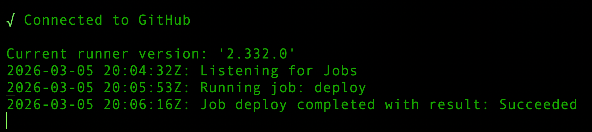
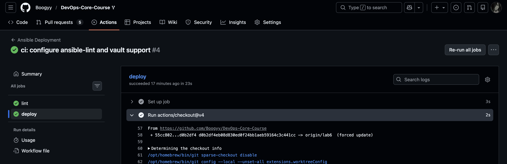
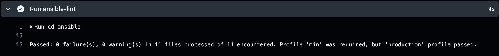

# Lab 6: Advanced Ansible & CI/CD - Submission

**Name:** George Lazutkin  
**Date:** 2026-03-05  
**Lab Points:** 10

# Task 1: Blocks & Tags (2 pts)

## Block Usage

Ansible **blocks** were introduced to group logically related tasks and provide structured error handling.

Each role now uses blocks with the following pattern:

```
block
tasks
rescue
error recovery
always
cleanup/logging
```

### Example

```yaml
- name: Install Docker packages
  block:

    - name: Update apt cache
      ansible.builtin.apt:
        update_cache: true

    - name: Install Docker packages
      ansible.builtin.apt:
        name: "{{ docker_packages }}"
        state: present

  rescue:
    - name: Retry apt update
      ansible.builtin.pause:
        seconds: 10

  always:
    - name: Ensure Docker service started
      ansible.builtin.service:
        name: docker
        state: started
```

Benefits:

* Improved error recovery
* Better grouping of related tasks
* Reduced duplication of directives such as `become`

---

## Tag Strategy

Tags were introduced to allow **selective execution of tasks**.

Tag structure used:

| Tag            | Purpose                   |
| -------------- | ------------------------- |
| common         | All common role tasks     |
| packages       | Package installation      |
| users          | User management           |
| docker         | Entire docker role        |
| docker_install | Docker installation tasks |
| docker_config  | Docker configuration      |
| app_deploy     | Application deployment    |
| compose        | Docker Compose tasks      |
| verify         | Health check tasks        |
| web_app_wipe   | Application cleanup       |

---

## Tagged Execution Examples

List all tags:

```bash
ansible-playbook playbooks/provision.yml --list-tags
```

Example output:

```
TASK TAGS: [common, docker, docker_config, docker_install, packages, users]
```

Run only Docker tasks:

```bash
ansible-playbook playbooks/provision.yml --tags docker
```

Run only package installation:

```bash
ansible-playbook playbooks/provision.yml --tags packages
```

Skip common role:

```bash
ansible-playbook playbooks/provision.yml --skip-tags common
```

---

## Rescue Block Demonstration

A demonstration block was added to intentionally trigger an error and verify the rescue mechanism.

Example output:

```
TASK [common : Force failure (demo)] FAILED
TASK [common : Rescue executed (demo)] ok
```

Play recap:

```
rescued=1
```

This proves the rescue logic successfully handles failures.

---

## Research Answers

### What happens if the rescue block also fails?

If the rescue block fails, the entire block execution fails and the playbook stops unless error handling such as `ignore_errors` is used.

---

### Can blocks be nested?

Yes. Ansible supports nested blocks which allows creating multi-level error handling structures.

---

### How do tags propagate inside blocks?

Tags applied to a block automatically apply to all tasks inside the block unless overridden.

---

# Task 2: Docker Compose Migration (3 pts)

## Motivation

The previous deployment used `docker_container` which managed a single container.

Docker Compose provides several advantages:

* Declarative container orchestration
* Easy multi-container setups
* Simplified updates
* Cleaner configuration
* Improved production readiness

---

## Role Rename

Role `app_deploy` was renamed to:

```
web_app
```

This makes the role more descriptive and prepares the infrastructure for multiple application types.

---

## Docker Compose Template

File:

```
roles/web_app/templates/docker-compose.yml.j2
```

Template:

```yaml
version: "3.8"

services:
  {{ app_name }}:
    image: "{{ docker_image }}:{{ docker_tag | default(docker_image_tag) }}"
    container_name: "{{ app_name }}

    ports:
      - "{{ app_port }}:{{ app_internal_port }}"

    environment:

      {{ k }}: "{{ v }}"


    restart: unless-stopped
```

The template dynamically generates the Compose file using Ansible variables.

---

## Role Dependency

The `web_app` role depends on the `docker` role.

File:

```
roles/web_app/meta/main.yml
```

```yaml
dependencies:
  - role: docker
```

This ensures Docker is installed automatically before application deployment.

---

## Deployment Implementation

Deployment tasks perform the following:

1. Create application directory `/opt/app_name`
2. Template docker-compose.yml
3. Run Docker Compose deployment
4. Wait for service port
5. Perform health check

Example task:

```yaml
community.docker.docker_compose_v2:
  project_src: "{{ compose_project_dir }}"
  pull: always
  state: present
```

---

## Idempotency Verification

First run (check ansible/docs/lab06_compose_deploy_run1.txt):

```
changed=2
```

Second run (check ansible/docs/lab06_compose_deploy_run2.txt):

```
changed=0
```

This confirms the deployment is idempotent.

---

## Deployment Verification

Container status:

```bash
docker ps
```

Output:

```bash
CONTAINER ID   IMAGE                                   COMMAND                  CREATED      STATUS       PORTS                    NAMES
61a2ddfd5031   egorlazutkin/devops-info-service:lab2   "uvicorn app:app --h…"   7 days ago   Up 6 hours   0.0.0.0:5000->5000/tcp   devops-info-service

```

Health endpoint test:

```bash
curl http://192.168.2.2:5000/health
```

Response (check ansible/docs/lab06_compose_health.txt):

```bash
{"status":"healthy","timestamp":"2026-03-05T17:24:14.436415+00:00","uptime_seconds":21215}
```

---

# Task 3: Wipe Logic (1 pt)

## Purpose

Wipe logic allows safe removal of deployed applications.

Use cases:

* Clean reinstallation
* Removing broken deployments
* Resetting environments

---

## Safety Mechanism

Wipe logic is **double-gated** using:

1. Variable
2. Tag

Conditions required to execute wipe:

```
web_app_wipe = true
AND
--tags web_app_wipe
```

This prevents accidental destruction of running services.

---

## Implementation

File:

```
roles/web_app/tasks/wipe.yml
```

Tasks include:

* Docker Compose down
* Removing docker-compose.yml
* Removing application directory
* Logging wipe completion

Example:

```yaml
when: web_app_wipe | bool
tags:
  - web_app_wipe
```

---

## Wipe Test Scenarios

### Scenario 1 — Normal deployment

```
ansible-playbook deploy.yml
```

Result (ansible/docs/lab06_deploy_normal.txt):

Wipe tasks skipped.

---

### Scenario 2 — Wipe only

```
ansible-playbook deploy.yml -e "web_app_wipe=true" --tags web_app_wipe
```

Result (ansible/docs/lab06_wipe_only.txt):

Application removed.

---

### Scenario 3 — Clean reinstall

```
ansible-playbook deploy.yml -e "web_app_wipe=true"
```

Result (ansible/docs/lab06_clean_reinstall.txt):

Old installation removed and new one deployed.

---

### Scenario 4 — Safety check

```
ansible-playbook deploy.yml --tags web_app_wipe
```

Result (ansible/docs/lab06_wipe_blocked.txt):

Wipe skipped because variable not set.

---

# Task 4: CI/CD Integration (3 pts)

## Workflow Architecture

A CI/CD pipeline was implemented using **GitHub Actions** to automatically validate and deploy the Ansible infrastructure.

The workflow ensures that every infrastructure change is automatically tested and deployed.

Pipeline stages:

```
Code Push
↓
Ansible Lint (syntax & best practices)
↓
Ansible Playbook Execution
↓
Deployment Verification
```

This pipeline guarantees:

* consistent deployments
* automated validation of Ansible code
* faster infrastructure updates
* full audit trail in GitHub Actions logs

---

# Workflow File

Location:

```
.github/workflows/ansible-deploy.yml
```

The workflow triggers automatically when Ansible code changes.

Trigger configuration:

```yaml
on:
  push:
    branches: [ master, main, lab6 ]
    paths:
      - 'ansible/**'
      - '.github/workflows/ansible-deploy.yml'
      - '!ansible/docs/**'
```

### Why path filters are used

Path filters prevent unnecessary pipeline runs when:

* documentation changes
* screenshots are added
* unrelated files are modified

This reduces CI execution time and improves efficiency.

---

# Workflow Jobs

## Lint Job

Runs on GitHub-hosted runner.

Purpose:

* validate Ansible syntax
* check best practices
* prevent broken playbooks from deploying

Steps:

1. Checkout repository
2. Install Python
3. Install Ansible + ansible-lint
4. Install required collections
5. Run ansible-lint

Example step:

```yaml
ansible-lint playbooks/*.yml
```

This stage ensures infrastructure code quality before deployment.

---

## Deploy Job

Runs on a **self-hosted GitHub Actions runner** installed on the local machine.

```
runs-on: self-hosted
```

Deployment steps:

1. Checkout repository
2. Install Ansible dependencies
3. Decrypt Ansible Vault variables
4. Execute deployment playbook
5. Verify application health

Deployment command:

```bash
ansible-playbook playbooks/deploy.yml \
  --vault-password-file /tmp/vault_pass
```

---

# Self-Hosted Runner

A **self-hosted runner** was configured on the local machine.

Advantages:

* direct access to the infrastructure
* no SSH connection overhead
* faster execution
* more realistic production setup

Runner logs confirm successful execution:



This confirms that the deployment was executed by the self-hosted runner.

---

# GitHub Secrets

Sensitive credentials are stored securely using **GitHub Secrets**.

Configured secrets:

| Secret                 | Purpose                                           |
| ---------------------- | ------------------------------------------------- |
| ANSIBLE_VAULT_PASSWORD | decrypt Vault variables                           |
| SSH_PRIVATE_KEY        | SSH authentication (if remote deployment is used) |
| VM_HOST                | target server address                             |
| VM_USER                | SSH username                                      |

Secrets are never stored in the repository and are securely injected during workflow execution.

Example usage:

```yaml
echo "${{ secrets.ANSIBLE_VAULT_PASSWORD }}" > /tmp/vault_pass
```

---

# Deployment Verification

After deployment the workflow verifies that the application is running.

Verification step:

```bash
curl -f http://VM_IP:5000
curl -f http://VM_IP:5000/health
```

Expected result:

```
HTTP 200 OK
```

If the health check fails the pipeline stops with an error.

This ensures that deployments are not only executed but also **validated automatically**.

---

# Status Badge

A GitHub Actions status badge was added to the repository README.

Example:


[](https://github.com/Boogyy/DevOps-Core-Course/actions/workflows/ansible-deploy.yml)


The badge displays the current pipeline status:

* ✅ passing
* ❌ failing

---

# Testing Results

The CI/CD pipeline was tested with multiple commits.

Observed behavior:

1. Push change to repository
2. GitHub Actions automatically triggers workflow
3. Lint stage validates Ansible code
4. Deploy stage runs Ansible playbook
5. Verification step confirms application health

Example runner output:

```
Running job: deploy
Job deploy completed with result: Succeeded
```

Application availability verified with:

```
curl -f http://192.168.2.2:5000
curl -f http://192.168.2.2:5000/health
```

Output:

```bash
{"service":{"name":"devops-info-service","version":"1.0.0","description":"DevOps course info service","framework":"FastAPI"},"system":{"hostname":"219905cd8e89","platform":"Linux","platform_version":"#181-Ubuntu SMP Sat Feb 7 00:27:41 UTC 2026","architecture":"aarch64","cpu_count":1,"python_version":"3.13.11"},"runtime":{"uptime_seconds":2030,"uptime_human":"0 hours, 33 minutes","current_time":"2026-03-05T20:31:38.591485+00:00","timezone":"UTC"},"request":{"client_ip":"192.168.2.1","user_agent":"curl/8.7.1","method":"GET","path":"/"},"endpoints":[{"path":"/","method":"GET","description":"Service information"},{"path":"/health","method":"GET","description":"Health check"}]}

{"status":"healthy","timestamp":"2026-03-05T20:31:46.446531+00:00","uptime_seconds":2038}
```

## CI/CD Workflow Run



## Ansible-lint Passing

The `lint` job validates Ansible syntax and best practices using **ansible-lint**.

### Lint Output


This confirms that the Ansible playbooks follow recommended practices and contain no syntax errors.

---

## Ansible-playbook Execution

### Deployment Logs

Insert a portion of the Ansible execution output.

```bash
TASK [app_deploy : Show health response (for logs)] ****************************
ok: [lab-vm] => {
    "msg": [
        "Health status: 200",
        "Health body: {\"status\":\"healthy\",\"timestamp\":\"2026-03-05T20:06:06.543832+00:00\",\"uptime_seconds\":498}"
    ]
}

PLAY RECAP *********************************************************************
lab-vm                     : ok=6    changed=0    unreachable=0    failed=0    skipped=2    rescued=0    ignored=0
```

This demonstrates that the playbook executed successfully without failures.

---

# Challenges & Solutions

## Docker registry connection issues

Problem: Docker image pulls failed while VPN was enabled.

Cause: VPN interfered with Docker registry networking.

Solution: VPN was disabled during deployment which restored connectivity.

---

## Docker Compose module compatibility

Problem: The old Docker Compose v1 module was deprecated.

Solution: The deployment was migrated to the supported module:

```
community.docker.docker_compose_v2
```
---

# Research Answers

## What are the security implications of storing SSH keys in GitHub Secrets?

GitHub Secrets store sensitive values in encrypted form and expose them only during workflow execution. However, workflows triggered from untrusted pull requests or forks may attempt to access these secrets. Therefore pipelines should restrict secret usage and avoid running deployment jobs for untrusted sources.

---

## How would you implement a staging → production pipeline?

A common approach uses two environments:

```

staging → automated tests → manual approval → production

```

Changes are deployed to staging first, tested automatically, and only after approval are promoted to production using protected environments.

---

## What would you add to make rollbacks possible?

Rollback can be implemented by versioning Docker images and storing previous deployment versions. If a deployment fails, the system can redeploy the previous stable image tag.

Example:

```

deploy version N
if failure → redeploy version N-1

```

---

## How does a self-hosted runner improve security compared to GitHub-hosted runners?

Self-hosted runners run inside the organization's infrastructure, providing full control over the execution environment and network access. This reduces exposure of credentials and allows secure interaction with internal systems.


---

# Summary

This lab implemented a complete **CI/CD pipeline for infrastructure automation using Ansible and GitHub Actions**.

Key improvements include:

* automated infrastructure validation with ansible-lint
* automated deployments triggered by Git commits
* secure handling of secrets using GitHub Secrets
* deployment verification through health checks
* self-hosted runner integration for faster and secure execution

The resulting pipeline enables reliable, repeatable, and auditable infrastructure deployments.

Total time spent: ~3 hours.

Key learnings:

* CI/CD for infrastructure automation
* GitHub Actions workflow design
* secure secret management
* automated deployment verification
* self-hosted runner configuration
