# Lab 06 — Advanced Ansible & CI/CD

## 1. Architecture Overview

**Ansible version:** 2.16.3

**Target VM:** Ubuntu 22.04 LTS on GCP (e2-micro, us-central1-a)

**Control node:** WSL Ubuntu on Windows (MINGW64)

**CI/CD:** GitHub Actions (self-hosted runner on target VM)

**Role structure:**

```
ansible/
├── inventory/
│   └── hosts.ini
├── roles/
│   ├── common/
│   │   ├── tasks/main.yml      # blocks: packages, users
│   │   └── defaults/main.yml
│   ├── docker/
│   │   ├── tasks/main.yml      # blocks: docker_install, docker_config
│   │   ├── handlers/main.yml
│   │   └── defaults/main.yml
│   └── web_app/                # renamed from app_deploy
│       ├── tasks/main.yml      # wipe + compose deploy
│       ├── tasks/wipe.yml      # wipe logic (variable + tag gate)
│       ├── templates/docker-compose.yml.j2
│       ├── handlers/main.yml
│       ├── defaults/main.yml
│       └── meta/main.yml       # dependency: docker
├── playbooks/
│   ├── provision.yml
│   └── deploy.yml
├── group_vars/
│   └── all.yml (encrypted)
└── ansible.cfg
```

---

## 2. Blocks & Tags (Task 1)

### common role

**Blocks:**

- `packages` — apt update + install, rescue (apt update retry), always (touch `/tmp/common_role_complete`)
- `users` — create application user

**Tags:** `packages`, `users`, `common` (role-level)

### docker role

**Blocks:**

- `docker_install` — prerequisites, GPG key, repo, install. Rescue: wait 10s + retry. Always: ensure docker service enabled
- `docker_config` — add user to docker group, install python3-docker

**Tags:** `docker_install`, `docker_config`, `docker` (role-level)

### Tag listing

```bash
ansible-playbook playbooks/provision.yml --list-tags
```

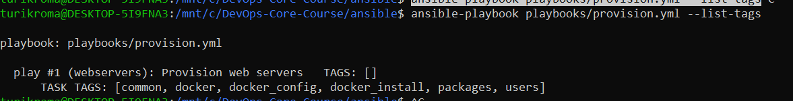

TASK TAGS: `[common, docker, docker_config, docker_install, packages, users]`

### Selective execution

**Run only docker tasks:**

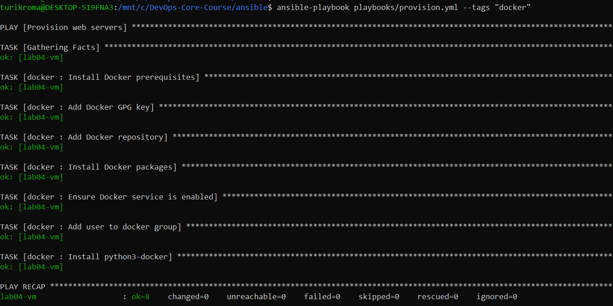

**Skip common role:**

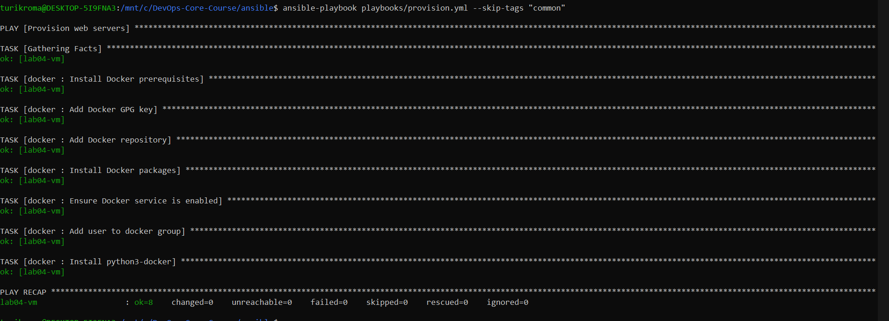

Both runs: `ok=8, changed=0` — only docker tasks executed, common skipped.

### Research answers

**Q: What happens if rescue block also fails?** Playbook fails entirely. Rescue is last chance — no nested rescue.

**Q: Can you have nested blocks?** Yes, blocks can contain other blocks.

**Q: How do tags inherit to tasks within blocks?** Tags on a block apply to all tasks inside it (block, rescue, always).

---

## 3. Docker Compose Migration (Task 2)

### Role rename

`app_deploy` → `web_app`. More descriptive, aligns with wipe logic naming (`web_app_wipe`).

### Docker Compose template

`roles/web_app/templates/docker-compose.yml.j2`:

```yaml
services:
  {{ web_app_name }}:
    image: {{ web_app_image }}:{{ web_app_tag }}
    container_name: {{ web_app_name }}
    ports:
      - "{{ web_app_port }}:{{ web_app_internal_port }}"
    restart: unless-stopped
```

**Variables (defaults/main.yml):**

- `web_app_name: devops-app`
- `web_app_image: roma3213/info_service`
- `web_app_tag: latest`
- `web_app_port: 5000`
- `web_app_internal_port: 5000`
- `web_app_compose_project_dir: /opt/{{ web_app_name }}`

### Role dependencies

`meta/main.yml` declares dependency on `docker` role. Running `deploy.yml` automatically provisions Docker first.

### Deployment

**First deploy:**

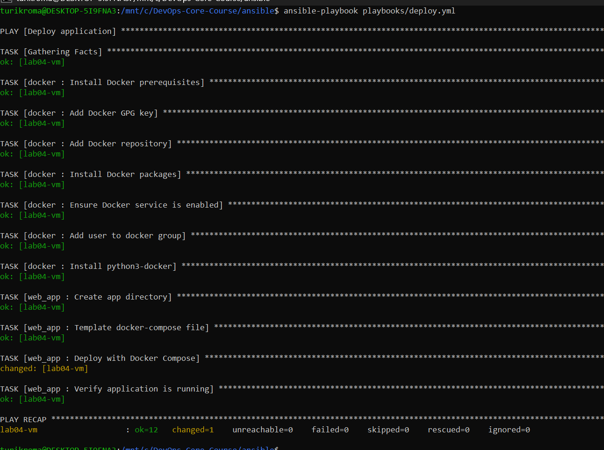

Result: `ok=12, changed=1` — compose file templated, container deployed.

**Idempotency (second run):**

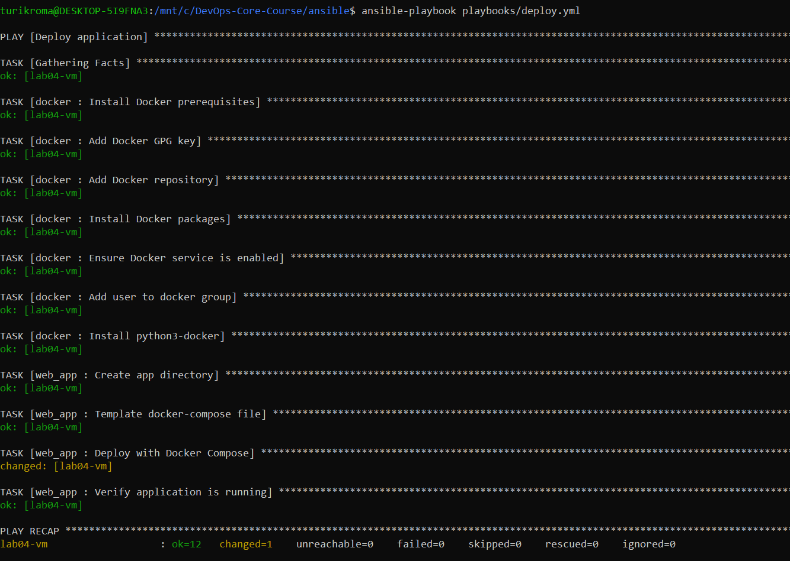

Result: `ok=12, changed=1` — only `docker_compose_v2` shows changed due to `pull: always`.

**Application response:**

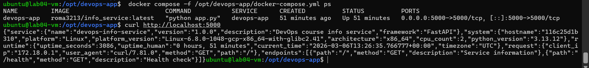

`curl http://localhost:5000` returns full service info JSON.

**Templated file on VM:**

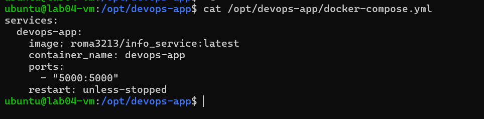

### Research answers

**Q: `restart: always` vs `restart: unless-stopped`?** Both restart on crash. Difference: `unless-stopped` won't auto-start after manual `docker stop` + daemon restart. `always` will.

**Q: Docker Compose networks vs Docker bridge?** Default bridge: containers see each other by IP only. Compose creates project-scoped bridge with DNS — containers resolve by service name. Isolation between projects.

**Q: Can you reference Vault variables in templates?** Yes. Ansible decrypts vault before Jinja2 rendering. Variables appear as plaintext in the rendered file on target — manage file permissions accordingly.

---

## 4. Wipe Logic (Task 3)

### Implementation

**Double safety mechanism:**

1. **Variable gate:** `web_app_wipe: false` (default)
2. **Tag gate:** `--tags web_app_wipe` must be specified

Both must be true for wipe to execute.

**File:** `roles/web_app/tasks/wipe.yml` — stops containers (`docker compose down`), removes compose file, removes app directory.

**Included at top of `main.yml`** (before deploy) to support clean reinstall: wipe → deploy.

### Test scenarios

**Scenario 1 — Normal deploy (wipe skipped):**

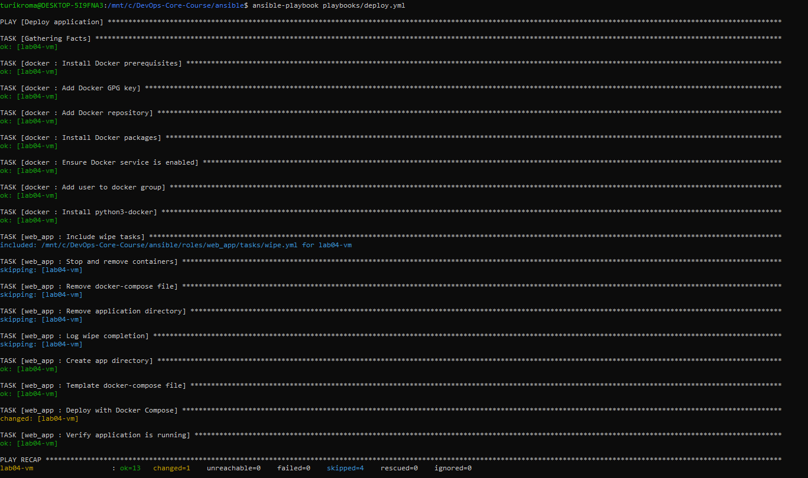

`skipped=4` — all wipe tasks skipped (variable is false).

**Scenario 2 — Wipe only:**

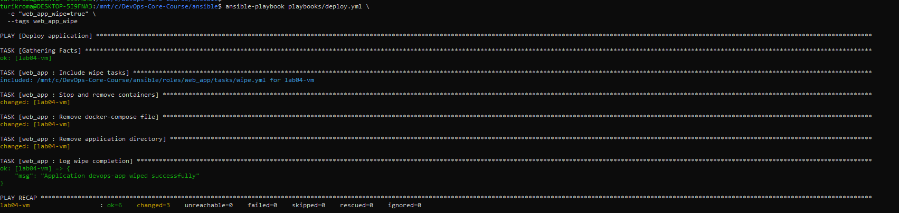

```bash
ansible-playbook deploy.yml -e "web_app_wipe=true" --tags web_app_wipe
```

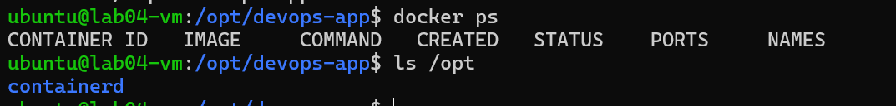

`docker ps` — empty. `/opt` — no app directory.

**Scenario 3 — Clean reinstall (wipe → deploy):**

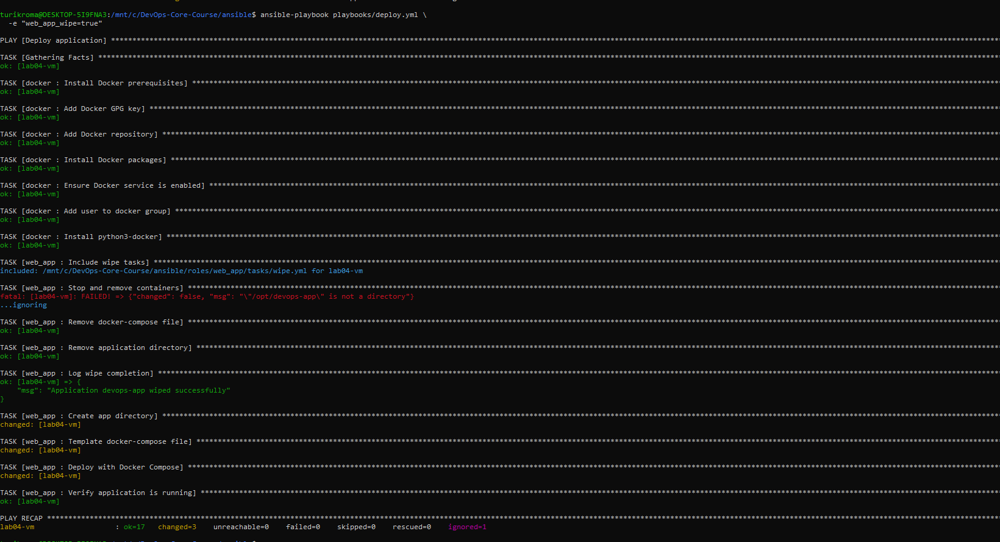

```bash
ansible-playbook deploy.yml -e "web_app_wipe=true"
```

Wipe runs first, then deploy. App running after:

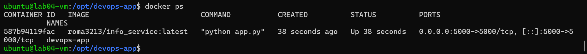

**Scenario 4a — Tag specified, variable false (blocked):**

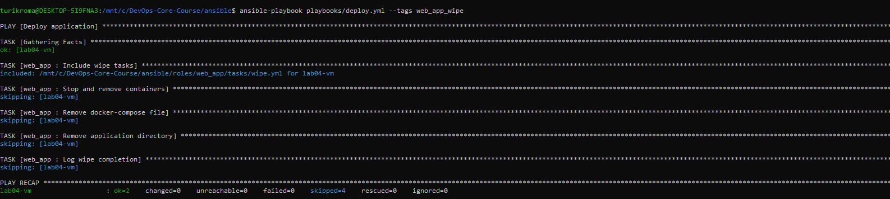

`skipped=4` — `when: web_app_wipe | bool` blocks execution even with tag.

### Research answers

**Q: Why use both variable AND tag?** Double safety. Variable alone could accidentally trigger on normal runs if set. Tag alone might run if someone uses `--tags all`. Both together = explicit intent required.

**Q: Difference from `never` tag?** `never` tag is ansible built-in — tasks with it never run unless explicitly tagged. Our approach is more flexible: allows clean reinstall scenario (wipe + deploy in one run) which `never` tag would prevent.

**Q: Why wipe before deployment in main.yml?** Enables clean reinstall: old app removed, then fresh deploy. Logical flow: remove old → install new.

**Q: When clean reinstall vs rolling update?** Clean reinstall for major version changes, config structure changes, or debugging. Rolling update for minor updates where state can be preserved.

**Q: How to extend wipe to images and volumes?** Add `docker image prune -f` and `docker volume rm` tasks to wipe.yml.

---

## 5. CI/CD with GitHub Actions (Task 4)

### Workflow architecture

```
Push to ansible/** → Lint (ubuntu-latest) → Deploy (self-hosted on VM)
```

**File:** `.github/workflows/ansible-deploy.yml`

**Jobs:**

1. `lint` — `ansible-lint playbooks/*.yml` on GitHub-hosted runner
2. `deploy` — `ansible-playbook deploy.yml` on self-hosted runner (target VM)

### Self-hosted runner

Installed on target VM (`104.197.249.40`). Runner executes ansible locally, connects to localhost via SSH.

### Secrets

- `ANSIBLE_VAULT_PASSWORD` — vault decryption password

### Path filters

```yaml
paths:
  - "ansible/**"
  - "!ansible/docs/**"
  - ".github/workflows/ansible-deploy.yml"
```

Docs changes don't trigger deployment.

### Successful run

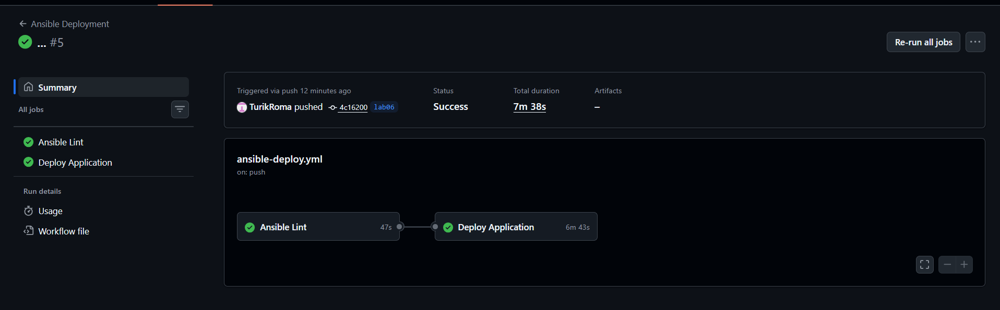

Ansible Lint (47s) + Deploy Application (6m 43s). Status: **Success**.

### Status badge

Added to `README.md`:

```markdown
[]
```

### Research answers

**Q: Security implications of SSH keys in GitHub Secrets?** Secrets are encrypted, only exposed during workflow runs. Risk: compromised repo = compromised VM access. Mitigation: use deploy keys with limited scope, rotate regularly. Self-hosted runner avoids this — no SSH key needed.

**Q: Staging → production pipeline?** Add environments in GitHub: staging deploys on push, production requires manual approval. Separate inventory files per environment.

**Q: Rollbacks?** Deploy previous image tag: `-e "web_app_tag=previous_version"`. Or git revert + CI/CD auto-deploys.

**Q: Self-hosted vs GitHub-hosted security?** Self-hosted: no secrets leave your infrastructure, faster, but runner must be secured. GitHub-hosted: secrets transmitted to external runner, but ephemeral (destroyed after run).

---

## 6. Challenges

- **Self-hosted runner on e2-micro — slow deploys:** First CI/CD run took 17+ minutes — `apt-get update` and package installation very slow on 1GB RAM VM. Subsequent runs faster since packages already cached.
- **Self-hosted runner SSH to localhost:** Runner runs on the same VM it deploys to. Ansible connects via SSH — needed to generate SSH key and add to `authorized_keys` for self-connection: `ssh-keygen` + `cat ~/.ssh/id_rsa.pub >> ~/.ssh/authorized_keys`. Workflow passes `-e "ansible_host=localhost"` so inventory stays unchanged for WSL.
- **ansible-lint 54 errors:** FQCN (`apt` → `ansible.builtin.apt`), truthy (`yes/no` → `true/false`), key ordering, variable prefix (`app_name` → `web_app_name`), `ignore_errors` → `failed_when: false`, empty `site.yml`. All fixed in one pass.
