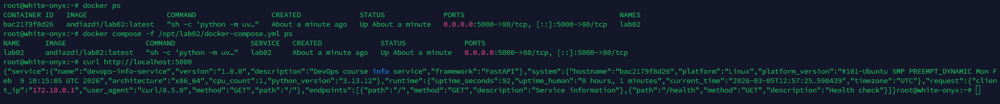
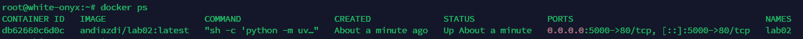
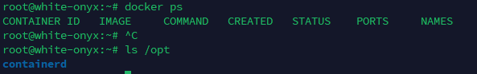

```bash
ansible-playbook playbooks/provision.yml --tags "docker" --ask-vault-pass
Vault password: 

PLAY [Provision web servers] *******************************************************************************************************************************************************************************************************

TASK [Gathering Facts] *************************************************************************************************************************************************************************************************************
ok: [white-onyx]

TASK [docker : Install prerequisite packages for Docker repository] ****************************************************************************************************************************************************************
ok: [white-onyx]

TASK [docker : Create directory for Docker GPG key] ********************************************************************************************************************************************************************************
ok: [white-onyx]

TASK [docker : Add Docker official GPG key] ****************************************************************************************************************************************************************************************
ok: [white-onyx]

TASK [docker : Add Docker repository] **********************************************************************************************************************************************************************************************
ok: [white-onyx]

TASK [docker : Install Docker packages] ********************************************************************************************************************************************************************************************
ok: [white-onyx]

TASK [docker : Ensure Docker service is enabled] ***********************************************************************************************************************************************************************************
ok: [white-onyx]

TASK [docker : Ensure Docker service is started and enabled] ***********************************************************************************************************************************************************************
ok: [white-onyx]

TASK [docker : Add user to docker group] *******************************************************************************************************************************************************************************************
ok: [white-onyx]

TASK [docker : Install python3-docker for Ansible Docker modules] ******************************************************************************************************************************************************************
ok: [white-onyx]

TASK [docker : Log Docker configuration completion] ********************************************************************************************************************************************************************************
changed: [white-onyx]

PLAY RECAP *************************************************************************************************************************************************************************************************************************
white-onyx                 : ok=11   changed=1    unreachable=0    failed=0    skipped=0    rescued=0    ignored=0
```

```bash
ansible-playbook playbooks/provision.yml --skip-tags "common" --ask-vault-pass
Vault password: 

PLAY [Provision web servers] *******************************************************************************************************************************************************************************************************

TASK [Gathering Facts] *************************************************************************************************************************************************************************************************************
ok: [white-onyx]

TASK [docker : Install prerequisite packages for Docker repository] ****************************************************************************************************************************************************************
ok: [white-onyx]

TASK [docker : Create directory for Docker GPG key] ********************************************************************************************************************************************************************************
ok: [white-onyx]

TASK [docker : Add Docker official GPG key] ****************************************************************************************************************************************************************************************
ok: [white-onyx]

TASK [docker : Add Docker repository] **********************************************************************************************************************************************************************************************
ok: [white-onyx]

TASK [docker : Install Docker packages] ********************************************************************************************************************************************************************************************
ok: [white-onyx]

TASK [docker : Ensure Docker service is enabled] ***********************************************************************************************************************************************************************************
ok: [white-onyx]

TASK [docker : Ensure Docker service is started and enabled] ***********************************************************************************************************************************************************************
ok: [white-onyx]

TASK [docker : Add user to docker group] *******************************************************************************************************************************************************************************************
ok: [white-onyx]

TASK [docker : Install python3-docker for Ansible Docker modules] ******************************************************************************************************************************************************************
ok: [white-onyx]

TASK [docker : Log Docker configuration completion] ********************************************************************************************************************************************************************************
changed: [white-onyx]

PLAY RECAP *************************************************************************************************************************************************************************************************************************
white-onyx                 : ok=11   changed=1    unreachable=0    failed=0    skipped=0    rescued=0    ignored=0
```

```bash
ansible-playbook playbooks/provision.yml --tags "packages" --ask-vault-pass
Vault password: 

PLAY [Provision web servers] *******************************************************************************************************************************************************************************************************

TASK [Gathering Facts] *************************************************************************************************************************************************************************************************************
ok: [white-onyx]

TASK [common : Update apt cache] ***************************************************************************************************************************************************************************************************
ok: [white-onyx]

TASK [common : Install common packages] ********************************************************************************************************************************************************************************************
ok: [white-onyx]

TASK [common : Set system timezone] ************************************************************************************************************************************************************************************************
ok: [white-onyx]

TASK [common : Log package installation completion] ********************************************************************************************************************************************************************************
changed: [white-onyx]

PLAY RECAP *************************************************************************************************************************************************************************************************************************
white-onyx                 : ok=5    changed=1    unreachable=0    failed=0    skipped=0    rescued=0    ignored=0
```

```bash
ansible-playbook playbooks/provision.yml --tags "docker" --check --ask-vault-pass
Vault password: 

PLAY [Provision web servers] *******************************************************************************************************************************************************************************************************

TASK [Gathering Facts] *************************************************************************************************************************************************************************************************************
ok: [white-onyx]

TASK [docker : Install prerequisite packages for Docker repository] ****************************************************************************************************************************************************************
ok: [white-onyx]

TASK [docker : Create directory for Docker GPG key] ********************************************************************************************************************************************************************************
ok: [white-onyx]

TASK [docker : Add Docker official GPG key] ****************************************************************************************************************************************************************************************
ok: [white-onyx]

TASK [docker : Add Docker repository] **********************************************************************************************************************************************************************************************
ok: [white-onyx]

TASK [docker : Install Docker packages] ********************************************************************************************************************************************************************************************
ok: [white-onyx]

TASK [docker : Ensure Docker service is enabled] ***********************************************************************************************************************************************************************************
ok: [white-onyx]

TASK [docker : Ensure Docker service is started and enabled] ***********************************************************************************************************************************************************************
ok: [white-onyx]

TASK [docker : Add user to docker group] *******************************************************************************************************************************************************************************************
ok: [white-onyx]

TASK [docker : Install python3-docker for Ansible Docker modules] ******************************************************************************************************************************************************************
ok: [white-onyx]

TASK [docker : Log Docker configuration completion] ********************************************************************************************************************************************************************************
changed: [white-onyx]

PLAY RECAP *************************************************************************************************************************************************************************************************************************
white-onyx                 : ok=11   changed=1    unreachable=0    failed=0    skipped=0    rescued=0    ignored=0
```

```bash
ansible-playbook playbooks/provision.yml --tags "docker_install" --ask-vault-pass
Vault password: 

PLAY [Provision web servers] *******************************************************************************************************************************************************************************************************

TASK [Gathering Facts] *************************************************************************************************************************************************************************************************************
ok: [white-onyx]

TASK [docker : Install prerequisite packages for Docker repository] ****************************************************************************************************************************************************************
ok: [white-onyx]

TASK [docker : Create directory for Docker GPG key] ********************************************************************************************************************************************************************************
ok: [white-onyx]

TASK [docker : Add Docker official GPG key] ****************************************************************************************************************************************************************************************
ok: [white-onyx]

TASK [docker : Add Docker repository] **********************************************************************************************************************************************************************************************
ok: [white-onyx]

TASK [docker : Install Docker packages] ********************************************************************************************************************************************************************************************
ok: [white-onyx]

TASK [docker : Ensure Docker service is enabled] ***********************************************************************************************************************************************************************************
ok: [white-onyx]

PLAY RECAP *************************************************************************************************************************************************************************************************************************
white-onyx                 : ok=7    changed=0    unreachable=0    failed=0    skipped=0    rescued=0    ignored=0
```

```bash
ansible-playbook playbooks/provision.yml --list-tags --ask-vault-pass
Vault password: 

playbook: playbooks/provision.yml

  play #1 (webservers): Provision web servers   TAGS: []
      TASK TAGS: [common, docker, docker_config, docker_install, packages]
```

#### What happens if rescue block also fails?
Playbook execution stops with failure. The always block still executes before stopping. 

#### Can you have nested blocks?
Yes, blocks can be nested. Each level can have its own rescue/always sections.

#### How do tags inherit to tasks within blocks?
Tags applied to block inherit to all tasks within. Individual tasks can have additional tags.


```bash
ansible-playbook playbooks/deploy.yml --ask-vault-pass
Vault password: 

PLAY [Deploy application] **********************************************************************************************************************************************************************************************************

TASK [Gathering Facts] *************************************************************************************************************************************************************************************************************
ok: [white-onyx]

TASK [docker : Install prerequisite packages for Docker repository] ****************************************************************************************************************************************************************
ok: [white-onyx]

TASK [docker : Create directory for Docker GPG key] ********************************************************************************************************************************************************************************
ok: [white-onyx]

TASK [docker : Add Docker official GPG key] ****************************************************************************************************************************************************************************************
ok: [white-onyx]

TASK [docker : Add Docker repository] **********************************************************************************************************************************************************************************************
ok: [white-onyx]

TASK [docker : Install Docker packages] ********************************************************************************************************************************************************************************************
ok: [white-onyx]

TASK [docker : Ensure Docker service is enabled] ***********************************************************************************************************************************************************************************
ok: [white-onyx]

TASK [docker : Ensure Docker service is started and enabled] ***********************************************************************************************************************************************************************
ok: [white-onyx]

TASK [docker : Add user to docker group] *******************************************************************************************************************************************************************************************
ok: [white-onyx]

TASK [docker : Install python3-docker for Ansible Docker modules] ******************************************************************************************************************************************************************
ok: [white-onyx]

TASK [docker : Log Docker configuration completion] ********************************************************************************************************************************************************************************
changed: [white-onyx]

TASK [web_app : Create application directory] **************************************************************************************************************************************************************************************
changed: [white-onyx]

TASK [web_app : Template docker-compose.yml] ***************************************************************************************************************************************************************************************
changed: [white-onyx]

TASK [web_app : Log in to Docker Hub] **********************************************************************************************************************************************************************************************
ok: [white-onyx]

TASK [web_app : Pull latest Docker image] ******************************************************************************************************************************************************************************************
ok: [white-onyx]

TASK [web_app : Stop existing docker-compose services] *****************************************************************************************************************************************************************************
changed: [white-onyx]

TASK [web_app : Deploy with docker-compose] ****************************************************************************************************************************************************************************************
changed: [white-onyx]

TASK [web_app : Wait for application to start] *************************************************************************************************************************************************************************************
ok: [white-onyx]

TASK [web_app : Verify health endpoint] ********************************************************************************************************************************************************************************************
ok: [white-onyx]

TASK [web_app : Display deployment status] *****************************************************************************************************************************************************************************************
ok: [white-onyx] => {
    "msg": "Application lab02 deployed successfully on port 5000"
}

PLAY RECAP *************************************************************************************************************************************************************************************************************************
white-onyx                 : ok=20   changed=5    unreachable=0    failed=0    skipped=0    rescued=0    ignored=0
```

```bash
ansible-playbook playbooks/deploy.yml --ask-vault-pass
Vault password: 

PLAY [Deploy application] **********************************************************************************************************************************************************************************************************

TASK [Gathering Facts] *************************************************************************************************************************************************************************************************************
ok: [white-onyx]

TASK [docker : Install prerequisite packages for Docker repository] ****************************************************************************************************************************************************************
ok: [white-onyx]

TASK [docker : Create directory for Docker GPG key] ********************************************************************************************************************************************************************************
ok: [white-onyx]

TASK [docker : Add Docker official GPG key] ****************************************************************************************************************************************************************************************
ok: [white-onyx]

TASK [docker : Add Docker repository] **********************************************************************************************************************************************************************************************
ok: [white-onyx]

TASK [docker : Install Docker packages] ********************************************************************************************************************************************************************************************
ok: [white-onyx]

TASK [docker : Ensure Docker service is enabled] ***********************************************************************************************************************************************************************************
ok: [white-onyx]

TASK [docker : Ensure Docker service is started and enabled] ***********************************************************************************************************************************************************************
ok: [white-onyx]

TASK [docker : Add user to docker group] *******************************************************************************************************************************************************************************************
ok: [white-onyx]

TASK [docker : Install python3-docker for Ansible Docker modules] ******************************************************************************************************************************************************************
ok: [white-onyx]

TASK [docker : Log Docker configuration completion] ********************************************************************************************************************************************************************************
changed: [white-onyx]

TASK [web_app : Create application directory] **************************************************************************************************************************************************************************************
ok: [white-onyx]

TASK [web_app : Template docker-compose.yml] ***************************************************************************************************************************************************************************************
ok: [white-onyx]

TASK [web_app : Log in to Docker Hub] **********************************************************************************************************************************************************************************************
ok: [white-onyx]

TASK [web_app : Pull latest Docker image] ******************************************************************************************************************************************************************************************
ok: [white-onyx]

TASK [web_app : Stop existing docker-compose services] *****************************************************************************************************************************************************************************
changed: [white-onyx]

TASK [web_app : Deploy with docker-compose] ****************************************************************************************************************************************************************************************
changed: [white-onyx]

TASK [web_app : Wait for application to start] *************************************************************************************************************************************************************************************
ok: [white-onyx]

TASK [web_app : Verify health endpoint] ********************************************************************************************************************************************************************************************
ok: [white-onyx]

TASK [web_app : Display deployment status] *****************************************************************************************************************************************************************************************
ok: [white-onyx] => {
    "msg": "Application lab02 deployed successfully on port 5000"
}

PLAY RECAP *************************************************************************************************************************************************************************************************************************
white-onyx                 : ok=20   changed=3    unreachable=0    failed=0    skipped=0    rescued=0    ignored=0
```

```bash
ansible-playbook playbooks/deploy.yml --ask-vault-pass
Vault password: 

PLAY [Deploy application] **********************************************************************************************************************************************************************************************************

TASK [Gathering Facts] *************************************************************************************************************************************************************************************************************
ok: [white-onyx]

TASK [docker : Install prerequisite packages for Docker repository] ****************************************************************************************************************************************************************
ok: [white-onyx]

TASK [docker : Create directory for Docker GPG key] ********************************************************************************************************************************************************************************
ok: [white-onyx]

TASK [docker : Add Docker official GPG key] ****************************************************************************************************************************************************************************************
ok: [white-onyx]

TASK [docker : Add Docker repository] **********************************************************************************************************************************************************************************************
ok: [white-onyx]

TASK [docker : Install Docker packages] ********************************************************************************************************************************************************************************************
ok: [white-onyx]

TASK [docker : Ensure Docker service is enabled] ***********************************************************************************************************************************************************************************
ok: [white-onyx]

TASK [docker : Ensure Docker service is started and enabled] ***********************************************************************************************************************************************************************
ok: [white-onyx]

TASK [docker : Add user to docker group] *******************************************************************************************************************************************************************************************
ok: [white-onyx]

TASK [docker : Install python3-docker for Ansible Docker modules] ******************************************************************************************************************************************************************
ok: [white-onyx]

TASK [docker : Log Docker configuration completion] ********************************************************************************************************************************************************************************
changed: [white-onyx]

TASK [web_app : Create application directory] **************************************************************************************************************************************************************************************
ok: [white-onyx]

TASK [web_app : Template docker-compose.yml] ***************************************************************************************************************************************************************************************
ok: [white-onyx]

TASK [web_app : Log in to Docker Hub] **********************************************************************************************************************************************************************************************
ok: [white-onyx]

TASK [web_app : Pull latest Docker image] ******************************************************************************************************************************************************************************************
ok: [white-onyx]

TASK [web_app : Stop existing docker-compose services] *****************************************************************************************************************************************************************************
changed: [white-onyx]

TASK [web_app : Deploy with docker-compose] ****************************************************************************************************************************************************************************************
changed: [white-onyx]

TASK [web_app : Wait for application to start] *************************************************************************************************************************************************************************************
ok: [white-onyx]

TASK [web_app : Verify health endpoint] ********************************************************************************************************************************************************************************************
ok: [white-onyx]

TASK [web_app : Display deployment status] *****************************************************************************************************************************************************************************************
ok: [white-onyx] => {
    "msg": "Application lab02 deployed successfully on port 5000"
}

PLAY RECAP *************************************************************************************************************************************************************************************************************************
white-onyx                 : ok=20   changed=3    unreachable=0    failed=0    skipped=0    rescued=0    ignored=0
```



#### Difference between `restart: always` and `restart: unless-stopped`? 
`always` restarts even if manually stopped. `unless-stopped` respects manual stops. Preferred for production.

#### Docker Compose networks vs Docker bridge networks?
Compose creates isolated networks per project with automatic DNS resolution by service name. Bridge networks require manual configuration.

#### Can Ansible Vault variables be used in templates?
Yes, Vault variables are decrypted before template rendering, allowing secure secret injection.

```dockerfile
services:
  {{ app_name }}:
    image: {{ docker_image }}:{{ docker_image_tag }}
    container_name: {{ app_name }}
    ports:
      - "{{ app_port }}:{{ app_internal_port }}"

    environment:

      {{ key }}: "{{ value }}"


    restart: unless-stopped
    networks:
      - app_network

networks:
  app_network:
    driver: bridge
```

```bash
ansible-playbook playbooks/deploy.yml --ask-vault-pass
Vault password: 

PLAY [Deploy application] **********************************************************************************************************************************************************************************************************

TASK [Gathering Facts] *************************************************************************************************************************************************************************************************************
ok: [white-onyx]

TASK [docker : Install prerequisite packages for Docker repository] ****************************************************************************************************************************************************************
ok: [white-onyx]

TASK [docker : Create directory for Docker GPG key] ********************************************************************************************************************************************************************************
ok: [white-onyx]

TASK [docker : Add Docker official GPG key] ****************************************************************************************************************************************************************************************
ok: [white-onyx]

TASK [docker : Add Docker repository] **********************************************************************************************************************************************************************************************
ok: [white-onyx]

TASK [docker : Install Docker packages] ********************************************************************************************************************************************************************************************
ok: [white-onyx]

TASK [docker : Ensure Docker service is enabled] ***********************************************************************************************************************************************************************************
ok: [white-onyx]

TASK [docker : Ensure Docker service is started and enabled] ***********************************************************************************************************************************************************************
ok: [white-onyx]

TASK [docker : Add user to docker group] *******************************************************************************************************************************************************************************************
ok: [white-onyx]

TASK [docker : Install python3-docker for Ansible Docker modules] ******************************************************************************************************************************************************************
ok: [white-onyx]

TASK [docker : Log Docker configuration completion] ********************************************************************************************************************************************************************************
changed: [white-onyx]

TASK [web_app : Include wipe tasks] ************************************************************************************************************************************************************************************************
included: /mnt/c/Users/Almaz/PycharmProjects/DevOps/ansible/roles/web_app/tasks/wipe.yml for white-onyx

TASK [web_app : Stop and remove containers] ****************************************************************************************************************************************************************************************
skipping: [white-onyx]

TASK [web_app : Remove docker-compose.yml file] ************************************************************************************************************************************************************************************
skipping: [white-onyx]

TASK [web_app : Remove application directory] **************************************************************************************************************************************************************************************
skipping: [white-onyx]

TASK [web_app : Log wipe completion] ***********************************************************************************************************************************************************************************************
skipping: [white-onyx]

TASK [web_app : Create application directory] **************************************************************************************************************************************************************************************
ok: [white-onyx]

TASK [web_app : Template docker-compose.yml] ***************************************************************************************************************************************************************************************
ok: [white-onyx]

TASK [web_app : Log in to Docker Hub] **********************************************************************************************************************************************************************************************
ok: [white-onyx]

TASK [web_app : Pull latest Docker image] ******************************************************************************************************************************************************************************************
ok: [white-onyx]

TASK [web_app : Stop existing docker-compose services] *****************************************************************************************************************************************************************************
changed: [white-onyx]

TASK [web_app : Deploy with docker-compose] ****************************************************************************************************************************************************************************************
changed: [white-onyx]

TASK [web_app : Wait for application to start] *************************************************************************************************************************************************************************************
ok: [white-onyx]

TASK [web_app : Verify health endpoint] ********************************************************************************************************************************************************************************************
ok: [white-onyx]

TASK [web_app : Display deployment status] *****************************************************************************************************************************************************************************************
ok: [white-onyx] => {
    "msg": "Application lab02 deployed successfully on port 5000"
}

PLAY RECAP *************************************************************************************************************************************************************************************************************************
white-onyx                 : ok=21   changed=3    unreachable=0    failed=0    skipped=4    rescued=0    ignored=0
```


```bash
ansible-playbook playbooks/deploy.yml \
  -e "web_app_wipe=true" \
  --tags web_app_wipe --ask-vault-pass
Vault password: 

PLAY [Deploy application] **********************************************************************************************************************************************************************************************************

TASK [Gathering Facts] *************************************************************************************************************************************************************************************************************
ok: [white-onyx]

TASK [web_app : Include wipe tasks] ************************************************************************************************************************************************************************************************
included: /mnt/c/Users/Almaz/PycharmProjects/DevOps/ansible/roles/web_app/tasks/wipe.yml for white-onyx

TASK [web_app : Stop and remove containers] ****************************************************************************************************************************************************************************************
changed: [white-onyx]

TASK [web_app : Remove docker-compose.yml file] ************************************************************************************************************************************************************************************
changed: [white-onyx]

TASK [web_app : Remove application directory] **************************************************************************************************************************************************************************************
changed: [white-onyx]

TASK [web_app : Log wipe completion] ***********************************************************************************************************************************************************************************************
ok: [white-onyx] => {
    "msg": "Application lab02 wiped successfully from /opt/lab02"
}

PLAY RECAP *************************************************************************************************************************************************************************************************************************
white-onyx                 : ok=6    changed=3    unreachable=0    failed=0    skipped=0    rescued=0    ignored=0
```




```bash
ansible-playbook playbooks/deploy.yml --tags web_app_wipe --ask-vault-pass
Vault password: 

PLAY [Deploy application] **********************************************************************************************************************************************************************************************************

TASK [Gathering Facts] *************************************************************************************************************************************************************************************************************
ok: [white-onyx]

TASK [web_app : Include wipe tasks] ************************************************************************************************************************************************************************************************
included: /mnt/c/Users/Almaz/PycharmProjects/DevOps/ansible/roles/web_app/tasks/wipe.yml for white-onyx

TASK [web_app : Stop and remove containers] ****************************************************************************************************************************************************************************************
skipping: [white-onyx]

TASK [web_app : Remove docker-compose.yml file] ************************************************************************************************************************************************************************************
skipping: [white-onyx]

TASK [web_app : Remove application directory] **************************************************************************************************************************************************************************************
skipping: [white-onyx]

TASK [web_app : Log wipe completion] ***********************************************************************************************************************************************************************************************
skipping: [white-onyx]

PLAY RECAP *************************************************************************************************************************************************************************************************************************
white-onyx                 : ok=2    changed=0    unreachable=0    failed=0    skipped=4    rescued=0    ignored=0
```

```bash
ansible-playbook playbooks/deploy.yml \
  -e "web_app_wipe=true" \
  --tags web_app_wipe --ask-vault-pass
Vault password: 

PLAY [Deploy application] **********************************************************************************************************************************************************************************************************

TASK [Gathering Facts] *************************************************************************************************************************************************************************************************************
ok: [white-onyx]

TASK [web_app : Include wipe tasks] ************************************************************************************************************************************************************************************************
included: /mnt/c/Users/Almaz/PycharmProjects/DevOps/ansible/roles/web_app/tasks/wipe.yml for white-onyx

TASK [web_app : Stop and remove containers] ****************************************************************************************************************************************************************************************
changed: [white-onyx]

TASK [web_app : Remove docker-compose.yml file] ************************************************************************************************************************************************************************************
changed: [white-onyx]

TASK [web_app : Remove application directory] **************************************************************************************************************************************************************************************
changed: [white-onyx]

TASK [web_app : Log wipe completion] ***********************************************************************************************************************************************************************************************
ok: [white-onyx] => {
    "msg": "Application lab02 wiped successfully from /opt/lab02"
}

PLAY RECAP *************************************************************************************************************************************************************************************************************************
white-onyx                 : ok=6    changed=3    unreachable=0    failed=0    skipped=0    rescued=0    ignored=0
```

### Research Answers

#### Why use both variable AND tag?
Prevents accidental deletion. Variable provides programmatic control, tag provides CLI safety gate.

#### Difference from 'never' tag?
`never` tag is Ansible built-in, always skipped unless explicitly called. Our approach provides explicit conditional control.

#### Why wipe before deployment in main.yml?
Enables clean reinstall use case: single playbook run removes old, then installs new.

#### Clean reinstall vs rolling update?
Clean reinstall: Complete state reset, removes all data. Rolling update: Preserves state, updates in-place.

#### Extending to images and volumes?
Add tasks with `docker_image` and `docker_volume` modules, gated by separate variables for granular control.
