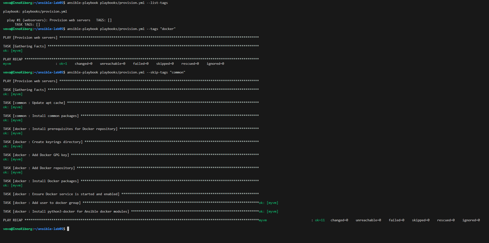
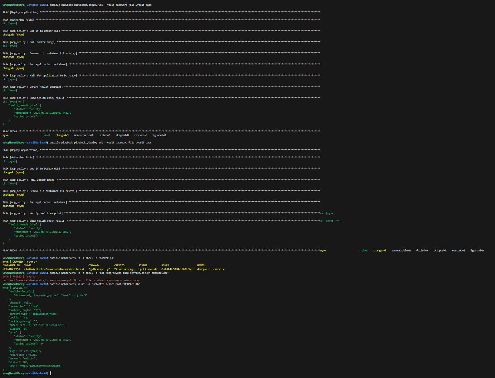
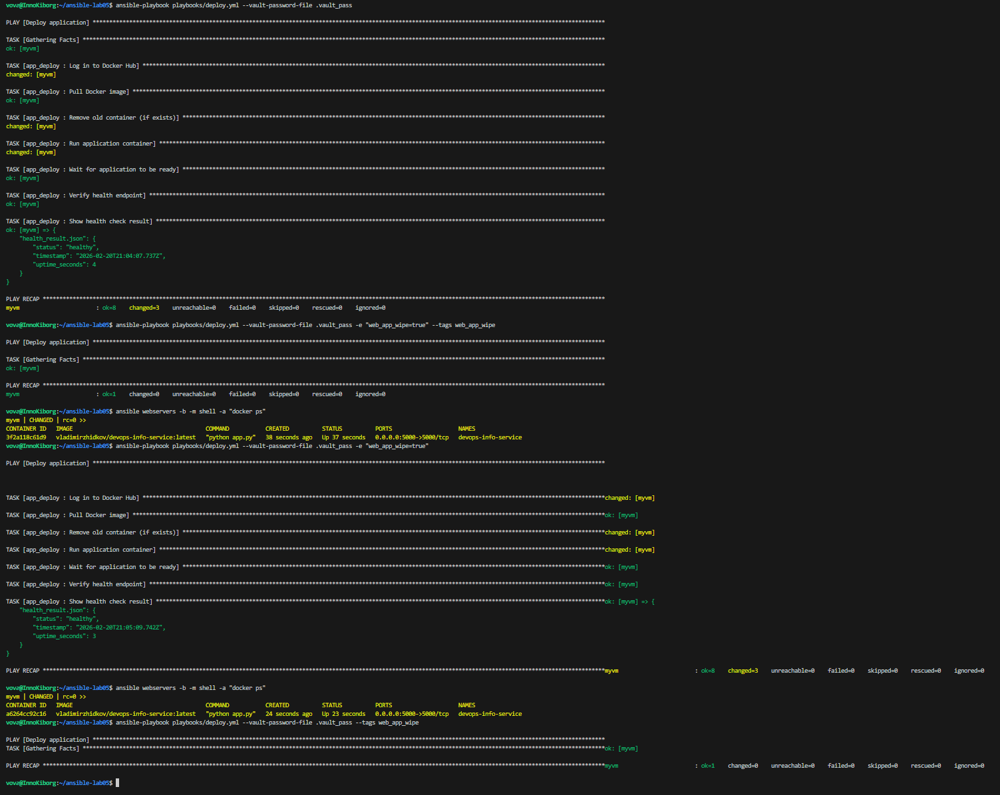

# Lab 6: Advanced Ansible & CI/CD

**Name:** Vladimir Zhidkov
**Date:** 2026-02-20
**Lab Points:** 10

---

## Task 1: Blocks & Tags (2 pts)

### Block Usage

All roles refactored with blocks for logical grouping and error handling.

#### `common` role

- **Package block** (`tags: packages`): Groups apt cache update and package installation. Rescue block runs `apt-get update --fix-missing` on failure. Always block logs completion to `/tmp/ansible_common_done.log`.

#### `docker` role

- **Install block** (`tags: docker_install`): Groups all Docker installation tasks (prerequisites, GPG key, repo, packages). Rescue block waits 10 seconds and retries on failure.
- **Config block** (`tags: docker_config`): Groups service start, user group, python3-docker. Always block ensures Docker service is enabled.

#### `web_app` role

- **Deploy block** (`tags: app_deploy, compose`): Groups Docker login, compose template, pull, deploy, health check. Rescue block logs failure details and fails the play.

### Tag Strategy

| Tag | Scope | Description |
|-----|-------|-------------|
| `packages` | common | Package installation |
| `common` | common role | Entire common role |
| `docker` | docker role | Entire docker role |
| `docker_install` | docker | Docker installation tasks |
| `docker_config` | docker | Docker configuration tasks |
| `app_deploy` | web_app | Deployment tasks |
| `compose` | web_app | Docker Compose tasks |
| `web_app_wipe` | web_app | Wipe/cleanup tasks |

### Tag Execution Examples

```bash
# Run only docker installation
ansible-playbook playbooks/provision.yml --tags "docker_install"

# Skip common role
ansible-playbook playbooks/provision.yml --skip-tags "common"

# List all tags
ansible-playbook playbooks/provision.yml --list-tags
```

### Evidence



### Research Answers

- **What happens if rescue block also fails?** The play fails entirely. Ansible does not have a "rescue of rescue" — the always block still runs though.
- **Can you have nested blocks?** Yes, blocks can be nested within other blocks for more granular error handling.
- **How do tags inherit to tasks within blocks?** Tags applied at block level are inherited by all tasks inside the block. Tasks can also have their own additional tags.

---

## Task 2: Docker Compose (3 pts)

### Migration from `docker run` to Docker Compose

Renamed `app_deploy` → `web_app` role. Replaced `community.docker.docker_container` module with Docker Compose template + `docker compose` CLI.

### Template Structure

**`roles/web_app/templates/docker-compose.yml.j2`:**
```yaml
version: '3.8'

services:
  {{ app_name }}:
    image: {{ docker_image }}:{{ docker_image_tag }}
    container_name: {{ app_name }}
    ports:
      - "{{ app_port }}:{{ app_internal_port }}"
    restart: {{ app_restart_policy }}
    environment:
      APP_NAME: "{{ app_name }}"
```

### Role Dependencies

**`roles/web_app/meta/main.yml`** declares `docker` as a dependency, so running only `deploy.yml` automatically ensures Docker is installed first.

### Before/After Comparison

| Aspect | Before (Lab 5) | After (Lab 6) |
|--------|----------------|----------------|
| Deployment | `docker run` via community.docker | Docker Compose template |
| Config | Ansible variables inline | `docker-compose.yml.j2` template |
| Management | Individual docker commands | `docker compose up/down` |
| Error handling | None | Block/rescue/always |
| Tags | None | `app_deploy`, `compose` |
| Wipe logic | None | `web_app_wipe` variable + tag |

### Evidence



---

## Task 3: Wipe Logic (1 pt)

### Implementation

Wipe logic uses **double gating** — both a variable (`web_app_wipe: true`) AND a tag (`web_app_wipe`) must be active for wipe to execute.

**`roles/web_app/tasks/wipe.yml`** performs:
1. `docker compose down --remove-orphans`
2. Remove docker-compose.yml
3. Remove application directory
4. Remove Docker image (optional)

### Test Scenarios

**Scenario 1: Normal deployment** — wipe does NOT run (tag not specified, variable false by default).

**Scenario 2: Wipe only:**
```bash
ansible-playbook playbooks/deploy.yml -e "web_app_wipe=true" --tags web_app_wipe
```
Result: App removed, no redeployment.

**Scenario 3: Clean reinstallation:**
```bash
ansible-playbook playbooks/deploy.yml -e "web_app_wipe=true"
```
Result: Wipe runs first, then fresh deployment.

**Scenario 4: Tag without variable:**
```bash
ansible-playbook playbooks/deploy.yml --tags web_app_wipe
```
Result: Wipe tasks are included but skipped (`when: web_app_wipe | bool` is false).

### Research Answers

1. **Why use both variable AND tag?** Double safety — variable prevents accidental execution even if tag is specified, and tag prevents wipe from running during normal deploys.
2. **Difference from `never` tag?** The `never` tag requires `--tags never` to run, while this approach allows combining wipe with deployment (clean reinstall scenario).
3. **Why wipe before deployment?** Enables clean reinstallation workflow: remove old → install new, all in one playbook run.
4. **Clean reinstall vs rolling update?** Clean reinstall ensures no leftover state; rolling update is faster but may carry forward old configs.
5. **Extending wipe to include volumes?** Add `docker volume prune -f` or target specific volumes in the wipe block.

### Evidence



---

## Task 4: CI/CD (3 pts)

### Workflow Architecture

**`.github/workflows/ansible-deploy.yml`:**

```
Push to ansible/** → Lint Job → Deploy Job → Verify
```

**Lint job:** Installs `ansible-lint`, checks all playbooks for best practices.

**Deploy job:** Configures SSH, creates vault password from GitHub Secret, runs `ansible-playbook deploy.yml`, verifies health endpoint.

### GitHub Secrets Required

| Secret | Purpose |
|--------|---------|
| `ANSIBLE_VAULT_PASSWORD` | Decrypt vault-encrypted variables |
| `SSH_PRIVATE_KEY` | SSH access to target VM |
| `VM_HOST` | Target VM IP address |
| `VM_PORT` | SSH port (e.g., 2223) |
| `VM_USER` | SSH username |

### Path Filters

Workflow triggers only on changes to `ansible/**` (excluding `ansible/docs/**`), preventing unnecessary runs on documentation changes.

### Security

- Vault password stored in GitHub Secrets (never in code)
- SSH key cleaned up in `always` block
- Temporary files removed after use

### Research Answers

1. **Security of SSH keys in GitHub Secrets:** Encrypted at rest, only available to workflows in the repo. Risk: anyone with push access can exfiltrate them via workflow. Mitigate with branch protection and required reviews.
2. **Staging → production pipeline:** Add environments in GitHub Actions with separate secrets, require manual approval for production.
3. **Rollbacks:** Tag Docker images with commit SHA, keep previous image; add rollback playbook that deploys previous tag.
4. **Self-hosted vs GitHub-hosted:** Self-hosted has direct network access (no SSH needed), secrets don't leave infrastructure, but requires maintenance.

---

## Task 5: Documentation

This file serves as the complete Lab 6 documentation.

### File Structure After Lab 6

```
ansible/
├── ansible.cfg
├── inventory/
│   └── hosts.ini
├── roles/
│   ├── common/
│   │   ├── tasks/main.yml          # Refactored with blocks & tags
│   │   └── defaults/main.yml
│   ├── docker/
│   │   ├── tasks/main.yml          # Refactored with blocks & tags
│   │   ├── handlers/main.yml
│   │   └── defaults/main.yml
│   └── web_app/                    # Renamed from app_deploy
│       ├── tasks/
│       │   ├── main.yml            # Docker Compose deployment
│       │   └── wipe.yml            # Wipe logic
│       ├── handlers/main.yml
│       ├── defaults/main.yml
│       ├── templates/
│       │   └── docker-compose.yml.j2
│       └── meta/main.yml           # Role dependencies
├── playbooks/
│   ├── site.yml
│   ├── provision.yml               # Tags: common, docker
│   └── deploy.yml                  # Tags: app_deploy, web_app_wipe
├── group_vars/
│   └── all.yml                     # Ansible Vault encrypted
└── docs/
    ├── LAB05.md
    └── LAB06.md
.github/
└── workflows/
    └── ansible-deploy.yml          # CI/CD pipeline
```

---

## Challenges & Solutions

- **Rename `app_deploy` → `web_app`**: Required updating all playbook role references.
- **Docker Compose on Ubuntu 22.04**: Used `docker-compose-plugin` (v2) instead of standalone `docker-compose` (v1). Commands use `docker compose` (space, not hyphen).
- **Wipe logic safety**: Implemented double gating (variable + tag) to prevent accidental data loss.
- **CI/CD SSH access**: GitHub-hosted runners need SSH key + host scanning; self-hosted runners have direct access.

---

## Summary

- Refactored all 3 roles with blocks, rescue/always, and comprehensive tag strategy
- Migrated from `docker run` to Docker Compose with Jinja2 templating
- Implemented role dependencies (`web_app` depends on `docker`)
- Created double-gated wipe logic for safe cleanup
- Built CI/CD pipeline with ansible-lint + automated deployment
