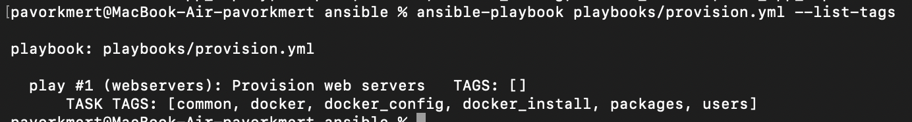
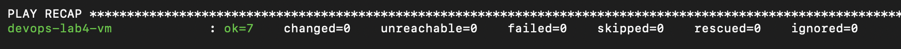
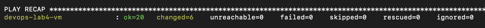
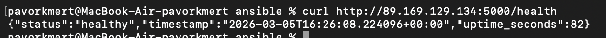
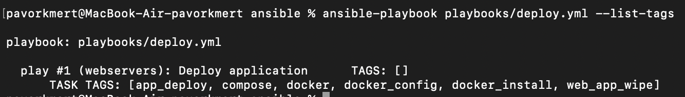
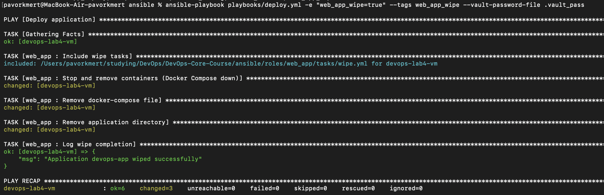
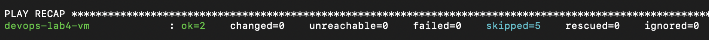

# Lab 6 — Advanced Ansible & CI/CD: Implementation Report

I completed Lab 6 by refactoring the Ansible roles with blocks and tags, migrating deployment to Docker Compose, implementing wipe logic, and adding GitHub Actions workflows. I also did the bonus: multi-app deployment (Python and Go) and separate CI/CD workflows for each app. Below is what I did and the results.

---

## 1. Overview

I used Ansible 2.16+, the community.docker collection, Docker Compose v2 (plugin), Jinja2 for templates, and GitHub Actions. I refactored the **common** and **docker** roles with blocks, rescue/always sections, and tags; created the **web_app** role (replacing app_deploy) with a templated Docker Compose deployment; implemented wipe logic gated by a variable and a tag; and added two workflows: one for the Python app (ansible-deploy) and one for the Go bonus app (ansible-deploy-bonus), each running ansible-lint and then deploying via SSH with Vault and verifying with curl.

---

## 2. Blocks & Tags

### 2.1 Common role

I refactored `roles/common/tasks/main.yml` into blocks. I put the apt cache update and package installation into a block with tag `packages` (and `common`). I added a rescue block that retries apt update and package install on failure, and an always block that writes a completion log to `/tmp/ansible-common-packages.log`. I grouped user-related tasks in a block with tag `users` and an always block that logs to `/tmp/ansible-common-users.log`. The timezone task stays separate with tag `common`. I applied `become: true` at the block level. In `playbooks/provision.yml` I assigned the role tags `common`, `packages`, and `users`.

### 2.2 Docker role

I refactored `roles/docker/tasks/main.yml` into two blocks. The first block (tags `docker`, `docker_install`) contains: add Docker GPG key, add APT repository, install Docker packages and python3-docker. I added a rescue block that waits 10 seconds then retries apt update and the Docker repo/package steps. The always block ensures the Docker service is started and enabled. The second block (tags `docker`, `docker_config`) adds users to the docker group.

### 2.3 Web app role

The deployment block in `roles/web_app/tasks/main.yml` has tags `app_deploy` and `compose`. The wipe tasks are included with tag `web_app_wipe`.

### 2.4 Execution and evidence

I ran `ansible-playbook playbooks/provision.yml --list-tags` and `ansible-playbook playbooks/provision.yml --tags "docker"` to confirm selective execution. Screenshots are below.

### 2.5 Research answers

- **What happens if the rescue block also fails?** Ansible marks the play as failed and does not run the remaining tasks in the play unless we use something like `ignore_errors` or a higher-level rescue.
- **Can you have nested blocks?** Yes. Inner blocks can define their own rescue and always sections.
- **How do tags inherit to tasks within blocks?** Tags set on a block apply to every task inside that block. Tasks can define additional tags.

---

## 3. Docker Compose Migration

### 3.1 Rename and structure

I created the **web_app** role (the lab asked to rename app_deploy to web_app). I updated `playbooks/deploy.yml` and `playbooks/site.yml` to use the `web_app` role and removed the old app_deploy role.

### 3.2 Template and variables

I added `roles/web_app/templates/docker-compose.yml.j2` that uses Jinja2 variables: `app_name`, `docker_image`, `docker_tag` (or `docker_image_tag`), `app_port`, `app_internal_port`, `app_restart_policy`, `app_env`. The template defines a single service with the given image, ports, environment (PORT plus `app_env`), and restart policy. I did not include the `version` key because Compose v2 ignores it and warns otherwise.

### 3.3 Role dependencies

I created `roles/web_app/meta/main.yml` with a dependency on the `docker` role so that running only the web_app role (e.g. via `playbooks/deploy.yml`) runs the docker role first.

### 3.4 Deployment tasks

In `roles/web_app/tasks/main.yml` I implemented the deploy block: Docker Hub login, create the app directory (`compose_project_dir`), template the docker-compose file into that directory, remove any existing container with the same name (to avoid conflict with a previous docker run–style deployment), then run `community.docker.docker_compose_v2` with `project_src` set to `compose_project_dir`, `state: present`, and `pull: always`. After that I wait for the app port and verify the health endpoint with `uri`. I wrapped this in a rescue block that logs a deployment failure message.

### 3.5 Variables

I set defaults in `roles/web_app/defaults/main.yml` (e.g. `app_name`, `docker_image`, `docker_tag`, `app_port`, `app_internal_port`, `compose_project_dir`, `web_app_wipe: false`). Sensitive values come from vault-encrypted `group_vars/all.yml` (Docker Hub credentials and any overrides).

### 3.6 Before/after

Previously the app was deployed with the `docker_container` module (pull image, stop/remove old container, run new container). Now deployment is declarative: a single Compose file is templated and applied with `docker_compose_v2`, and the same role can deploy different apps by changing variables.

### 3.7 Idempotency and verification

I ran `playbooks/deploy.yml` twice. The second run showed mostly `ok` with a small number of `changed` (e.g. two tasks). I verified on the VM with `docker ps` and `curl` to the app port (5000 in my vault). Evidence is in section 6.

---

## 4. Wipe Logic

### 4.1 Implementation

I added `roles/web_app/tasks/wipe.yml` with a block that runs only when `web_app_wipe | default(false) | bool` is true, and tagged it with `web_app_wipe`. The block first checks if `compose_project_dir` exists; if it does, it runs `community.docker.docker_compose_v2` with `state: absent` to stop and remove the stack. Then it removes the docker-compose file and the application directory, and logs wipe completion. I included this file at the top of `roles/web_app/tasks/main.yml` so that when `web_app_wipe=true` and the play runs without tag filter, wipe runs first and deploy runs after. I set `web_app_wipe: false` in the role defaults.

### 4.2 Test scenarios

I ran all four scenarios. (1) Normal deploy without wipe: `ansible-playbook playbooks/deploy.yml` — wipe tasks were skipped, app deployed. (2) Wipe only: `ansible-playbook playbooks/deploy.yml -e "web_app_wipe=true" --tags web_app_wipe` — only wipe ran, app and directory removed. (3) Clean reinstall: `ansible-playbook playbooks/deploy.yml -e "web_app_wipe=true"` — wipe ran first, then deploy; app was running afterward. (4) Tag without variable: `ansible-playbook playbooks/deploy.yml --tags web_app_wipe` — wipe tasks were skipped by the `when` condition, deploy ran as usual.

### 4.3 Research answers

- **Why use both variable and tag?** The variable ensures wipe does not run by default. The tag lets me run only wipe (with variable set) or only deploy. Both must be satisfied for wipe to run, so it is an explicit choice.
- **What is the difference between the `never` tag and this approach?** The `never` tag is a built-in tag that is never included. Here I use a positive gate (variable + tag) that is explicit and documented.
- **Why must wipe logic come before deployment in main.yml?** So that one playbook run can do “wipe then deploy” (clean reinstall) without a second invocation.
- **When would you want clean reinstallation vs. rolling update?** Clean reinstall for major upgrades or when the desired state is “remove everything and install fresh.” Rolling update when we want minimal downtime and in-place updates.
- **How would you extend this to wipe Docker images and volumes too?** I would add tasks in `wipe.yml` (e.g. `docker_image` with `state: absent`, or `docker_compose_v2` with options to remove volumes) and keep the same `when` and tag so they only run when wipe is requested.

---

## 5. CI/CD Integration

### 5.1 Workflow

I created `.github/workflows/ansible-deploy.yml`. It triggers on push and pull_request to `main`/`master` when paths such as `ansible/vars/app_python.yml`, `ansible/playbooks/deploy.yml`, `ansible/playbooks/deploy_python.yml`, or `ansible/roles/common`, `docker`, `web_app` change. The **lint** job runs ansible-lint on all playbooks. The **deploy** job runs only on push, after lint: it sets up SSH, builds `inventory/ci_hosts.ini` from secrets, runs `playbooks/deploy_python.yml` (Python app on port 8000) with Vault, then verifies with curl on port 8000. For the bonus Go app I added `.github/workflows/ansible-deploy-bonus.yml`, which triggers on changes to `ansible/vars/app_bonus.yml`, `ansible/playbooks/deploy_bonus.yml`, or `ansible/roles/web_app`; it runs lint on `deploy_bonus.yml`, deploys with `playbooks/deploy_bonus.yml`, and verifies on port 8001.

### 5.2 Secrets

I added four repository secrets in GitHub: `ANSIBLE_VAULT_PASSWORD`, `SSH_PRIVATE_KEY`, `VM_HOST`, and `VM_USER`.

### 5.3 Badge

I added the workflow status badge to `ansible/README.md`.

### 5.4 Evidence

### 5.5 Research answers

- **What are the security implications of storing SSH keys in GitHub Secrets?** They are encrypted at rest and only exposed to the workflow process during the run. Keys can be rotated if compromised; using short-lived or deploy-only keys limits exposure.
- **How would you implement a staging → production deployment pipeline?** Use separate inventories or `VM_HOST`/`VM_USER` per environment, different workflows or jobs, and optionally manual approval for production.
- **What would you add to make rollbacks possible?** Run the same deploy playbook with an extra variable for the previous image tag (e.g. `docker_tag=previous`), or add a dedicated rollback workflow that sets the tag and runs deploy.
- **How does a self-hosted runner improve security compared to GitHub-hosted?** The runner runs on my infrastructure; GitHub does not SSH into my VM. Secrets are still in GitHub, but execution and network access are on my side.

---

## 6. Testing Results

I ran provision and deploy, then deploy again for idempotency. I ran the tag examples (list-tags and --tags "docker") and all four wipe scenarios. I confirmed the app responds on the VM with curl. Screenshots below.

---

## 7. Challenges & Solutions

- **Conflict with existing container:** On the first deploy with the new role, Docker Compose failed because a container named `devops-app` already existed from the old app_deploy (docker run) setup. I added a task before “Deploy with Docker Compose” that removes an existing container with the same name using `community.docker.docker_container` with `state: absent`, so the playbook works even when migrating from the old role.
- **Wipe when directory missing:** Running wipe when `/opt/devops-app` did not exist caused `docker_compose_v2` to fail (“is not a directory”). I added a `stat` task and run “Docker Compose down” only when the directory exists, so wipe does not error when the app was already removed.
- **Port in CI verify:** For multi-app, the main workflow deploys the Python app on port 8000 and verifies there; the bonus workflow deploys the Go app on port 8001 and verifies there.

---

## 8. Summary

I refactored the common and docker roles with blocks, rescue/always, and tags; added the web_app role with a Docker Compose template and dependency on docker; implemented wipe logic with variable and tag; and added GitHub Actions workflows for lint and deploy with verification. I ran all required playbook and wipe scenarios and captured the evidence in this report. I also completed the bonus: multi-app deployment (vars and deploy_python/deploy_bonus/deploy_all) and separate CI/CD workflows for the Python and Go apps.

---

## 9. Bonus Part 1 — Multi-App Deployment

I reused the same `web_app` role for both the Python app and the Go (bonus) app by passing different variables per playbook.

I added `ansible/vars/app_python.yml` with `app_name: devops-python`, `docker_image: "{{ dockerhub_username }}/devops-info-service"`, `app_port: 8000`, `app_internal_port: 8000`, and `compose_project_dir: "/opt/devops-python"`. I added `ansible/vars/app_bonus.yml` with `app_name: devops-go`, `docker_image: "{{ dockerhub_username }}/devops-info-service-go"`, `app_port: 8001`, `app_internal_port: 8080`, and `compose_project_dir: "/opt/devops-go"` so both apps can run on the same host without port conflicts.

I created `playbooks/deploy_python.yml` and `playbooks/deploy_bonus.yml`, each with `hosts: webservers`, `vars_files` pointing at the corresponding vars file, and the `web_app` role. I created `playbooks/deploy_all.yml` that uses two `include_role` tasks for `web_app`: the first with Python app vars (port 8000, devops-python), the second with Go app vars (port 8001, devops-go). Credentials come from group_vars (vault), so no extra vars_files are needed in deploy_all.

Wipe logic is app-specific because `app_name` and `compose_project_dir` are set per playbook or per include_role. Running `deploy_python.yml -e "web_app_wipe=true" --tags web_app_wipe` wipes only the Python app; the same with `deploy_bonus.yml` wipes only the Go app; `deploy_all.yml -e "web_app_wipe=true" --tags web_app_wipe` wipes both (each include_role runs wipe with its own vars).

---

## 10. Bonus Part 2 — Multi-App CI/CD

I added a separate workflow for the bonus app so that Python and Go deployments can be triggered independently by path.

`.github/workflows/ansible-deploy.yml` (main) triggers on changes to `ansible/vars/app_python.yml`, `ansible/playbooks/deploy.yml`, `ansible/playbooks/deploy_python.yml`, and the common, docker, and web_app roles. It deploys with `playbooks/deploy_python.yml` and verifies on port 8000.

`.github/workflows/ansible-deploy-bonus.yml` triggers on changes to `ansible/vars/app_bonus.yml`, `ansible/playbooks/deploy_bonus.yml`, and the web_app role. It runs ansible-lint on `deploy_bonus.yml`, deploys with `playbooks/deploy_bonus.yml`, and verifies on port 8001. So a change to the bonus app vars or playbook runs only the bonus workflow; a change to the web_app role runs both workflows (as required by the lab). I added the bonus workflow badge to `ansible/README.md`.
