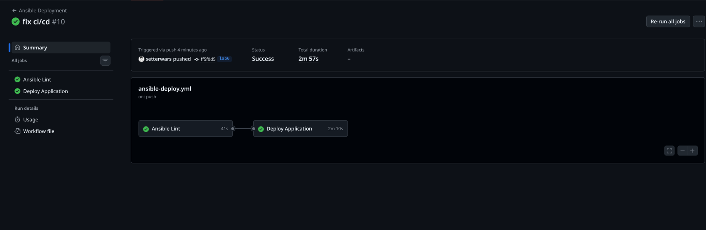

# Task 1 

## Testing blocks and tags 

- `ansible-playbook playbooks/provision.yml --tags "docker"`

```bash
➜  ansible git:(lab6) ✗         ansible-playbook playbooks/provision.yml --tags "docker"

PLAY [Provision web server] ****************************************************

TASK [Gathering Facts] *********************************************************
ok: [vm1]

TASK [docker : Install prerequisites for Docker] *******************************
ok: [vm1]

TASK [docker : Create directory for keyrings] **********************************
ok: [vm1]

TASK [docker : Add Docker GPG key] *********************************************
changed: [vm1]

TASK [docker : Add Docker repository] ******************************************
changed: [vm1]

TASK [docker : Update apt cache after adding docker repo] **********************
changed: [vm1]

TASK [docker : Install Docker packages] ****************************************
changed: [vm1]

TASK [docker : Ensure Docker service is enabled (install cleanup)] *************
ok: [vm1]

TASK [docker : Ensure Docker service is running and enabled] *******************
ok: [vm1]

TASK [docker : Add user to docker group] ***************************************
changed: [vm1]

TASK [docker : Install python3-docker for Ansible modules] *********************
changed: [vm1]

TASK [docker : Ensure Docker service is enabled (configuration cleanup)] *******
ok: [vm1]

RUNNING HANDLER [docker : Restart Docker] **************************************
changed: [vm1]

RUNNING HANDLER [docker : Update apt cache] ************************************
changed: [vm1]

PLAY RECAP *********************************************************************
vm1                        : ok=14   changed=8    unreachable=0    failed=0    skipped=0    rescued=0    ignored=0  
```

- `ansible-playbook playbooks/provision.yml --skip-tags "common"`

```bash
➜  ansible git:(lab6) ✗ ansible-playbook playbooks/provision.yml --skip-tags "common"

PLAY [Provision web server] ****************************************************

TASK [Gathering Facts] *********************************************************
ok: [vm1]

TASK [docker : Install prerequisites for Docker] *******************************
ok: [vm1]

TASK [docker : Create directory for keyrings] **********************************
ok: [vm1]

TASK [docker : Add Docker GPG key] *********************************************
ok: [vm1]

TASK [docker : Add Docker repository] ******************************************
ok: [vm1]

TASK [docker : Update apt cache after adding docker repo] **********************
changed: [vm1]

TASK [docker : Install Docker packages] ****************************************
ok: [vm1]

TASK [docker : Ensure Docker service is enabled (install cleanup)] *************
ok: [vm1]

TASK [docker : Ensure Docker service is running and enabled] *******************
ok: [vm1]

TASK [docker : Add user to docker group] ***************************************
ok: [vm1]

TASK [docker : Install python3-docker for Ansible modules] *********************
ok: [vm1]

TASK [docker : Ensure Docker service is enabled (configuration cleanup)] *******
ok: [vm1]

PLAY RECAP *********************************************************************
vm1                        : ok=12   changed=1    unreachable=0    failed=0    skipped=0    rescued=0    ignored=0   
```

- `ansible-playbook playbooks/provision.yml --tags "packages"`

```bash
➜  ansible git:(lab6) ✗ ansible-playbook playbooks/provision.yml --tags "packages"

PLAY [Provision web server] ****************************************************

TASK [Gathering Facts] *********************************************************
ok: [vm1]

TASK [common : Update apt cache] ***********************************************
ok: [vm1]

TASK [common : Install essential package] **************************************
changed: [vm1]

TASK [common : Cleanup apt temporary files] ************************************
changed: [vm1]

PLAY RECAP *********************************************************************
vm1                        : ok=4    changed=2    unreachable=0    failed=0    skipped=0    rescued=0    ignored=0  
```

- `ansible-playbook playbooks/provision.yml --tags "docker" --check`

```bash
➜  ansible git:(lab6) ✗ ansible-playbook playbooks/provision.yml --tags "docker" --check

PLAY [Provision web server] ****************************************************

TASK [Gathering Facts] *********************************************************
ok: [vm1]

TASK [docker : Install prerequisites for Docker] *******************************
ok: [vm1]

TASK [docker : Create directory for keyrings] **********************************
ok: [vm1]

TASK [docker : Add Docker GPG key] *********************************************
ok: [vm1]

TASK [docker : Add Docker repository] ******************************************
ok: [vm1]

TASK [docker : Update apt cache after adding docker repo] **********************
changed: [vm1]

TASK [docker : Install Docker packages] ****************************************
ok: [vm1]

TASK [docker : Ensure Docker service is enabled (install cleanup)] *************
ok: [vm1]

TASK [docker : Ensure Docker service is running and enabled] *******************
ok: [vm1]

TASK [docker : Add user to docker group] ***************************************
ok: [vm1]

TASK [docker : Install python3-docker for Ansible modules] *********************
ok: [vm1]

TASK [docker : Ensure Docker service is enabled (configuration cleanup)] *******
ok: [vm1]

PLAY RECAP *********************************************************************
vm1                        : ok=12   changed=1    unreachable=0    failed=0    skipped=0    rescued=0    ignored=0
```

- `ansible-playbook playbooks/provision.yml --tags "docker_install"`

```bash
➜  ansible git:(lab6) ✗ ansible-playbook playbooks/provision.yml --tags "docker_install"

PLAY [Provision web server] ****************************************************

TASK [Gathering Facts] *********************************************************
ok: [vm1]

TASK [docker : Install prerequisites for Docker] *******************************
ok: [vm1]

TASK [docker : Create directory for keyrings] **********************************
ok: [vm1]

TASK [docker : Add Docker GPG key] *********************************************
ok: [vm1]

TASK [docker : Add Docker repository] ******************************************
ok: [vm1]

TASK [docker : Update apt cache after adding docker repo] **********************
changed: [vm1]

TASK [docker : Install Docker packages] ****************************************
ok: [vm1]

TASK [docker : Ensure Docker service is enabled (install cleanup)] *************
ok: [vm1]

PLAY RECAP *********************************************************************
vm1                        : ok=8    changed=1    unreachable=0    failed=0    skipped=0    rescued=0    ignored=0 
```

# Task 2 

## Docker compose deployment success output `ansible-playbook playbooks/deploy.yml --ask-vault-pass`

```bash
ansible git:(lab6) ✗  ansible-playbook playbooks/deploy.yml --ask-vault-pass
Vault password: 

PLAY [Deploy application] ***********************************************************************

TASK [Gathering Facts] **************************************************************************
ok: [vm1]

TASK [docker : Install prerequisites for Docker] ************************************************
ok: [vm1]

TASK [docker : Create directory for keyrings] ***************************************************
ok: [vm1]

TASK [docker : Add Docker GPG key] **************************************************************
ok: [vm1]

TASK [docker : Add Docker repository] ***********************************************************
ok: [vm1]

TASK [docker : Update apt cache after adding docker repo] ***************************************
changed: [vm1]

TASK [docker : Install Docker packages] *********************************************************
ok: [vm1]

TASK [docker : Ensure Docker service is enabled (install cleanup)] ******************************
ok: [vm1]

TASK [docker : Ensure Docker service is running and enabled] ************************************
ok: [vm1]

TASK [docker : Add user to docker group] ********************************************************
ok: [vm1]

TASK [docker : Install python3-docker for Ansible modules] **************************************
ok: [vm1]

TASK [docker : Ensure Docker service is enabled (configuration cleanup)] ************************
ok: [vm1]

TASK [web_app : Validate deployment variables] **************************************************
ok: [vm1] => {
    "changed": false,
    "msg": "All assertions passed"
}

TASK [web_app : Log in to Docker Hub (optional)] ************************************************
ok: [vm1]

TASK [web_app : Create app directory] ***********************************************************
ok: [vm1]

TASK [web_app : Template docker-compose file] ***************************************************
changed: [vm1]

TASK [web_app : Deploy with docker-compose v2] **************************************************
[WARNING]: Docker compose: unknown None: /opt/devops-info-service-python/docker-compose.yml: the attribute `version` is obsolete, it will be ignored, please remove it to avoid potential confusion
changed: [vm1]

TASK [web_app : Wait for application port to be ready] ******************************************
ok: [vm1]

TASK [web_app : Verify health endpoint] *********************************************************
ok: [vm1]

PLAY RECAP **************************************************************************************
vm1                        : ok=19   changed=3    unreachable=0    failed=0    skipped=0    rescued=0    ignored=0   


```

## Idempotency proof

Running the playbook a second time should report no changes:

```bash
➜  ansible git:(lab6) ✗ ansible-playbook playbooks/deploy.yml --ask-vault-pass
Vault password: 

PLAY [Deploy application] ***********************************************************************

TASK [Gathering Facts] **************************************************************************
ok: [vm1]

TASK [docker : Install prerequisites for Docker] ************************************************
ok: [vm1]

TASK [docker : Create directory for keyrings] ***************************************************
ok: [vm1]

TASK [docker : Add Docker GPG key] **************************************************************
ok: [vm1]

TASK [docker : Add Docker repository] ***********************************************************
ok: [vm1]

TASK [docker : Update apt cache after adding docker repo] ***************************************
changed: [vm1]

TASK [docker : Install Docker packages] *********************************************************
ok: [vm1]

TASK [docker : Ensure Docker service is enabled (install cleanup)] ******************************
ok: [vm1]

TASK [docker : Ensure Docker service is running and enabled] ************************************
ok: [vm1]

TASK [docker : Add user to docker group] ********************************************************
ok: [vm1]

TASK [docker : Install python3-docker for Ansible modules] **************************************
ok: [vm1]

TASK [docker : Ensure Docker service is enabled (configuration cleanup)] ************************
ok: [vm1]

TASK [web_app : Validate deployment variables] **************************************************
ok: [vm1] => {
    "changed": false,
    "msg": "All assertions passed"
}

TASK [web_app : Log in to Docker Hub (optional)] ************************************************
ok: [vm1]

TASK [web_app : Create app directory] ***********************************************************
ok: [vm1]

TASK [web_app : Template docker-compose file] ***************************************************
ok: [vm1]

TASK [web_app : Deploy with docker-compose v2] **************************************************
[WARNING]: Docker compose: unknown None: /opt/devops-info-service-python/docker-compose.yml: the attribute `version` is obsolete, it will be ignored, please remove it to avoid potential confusion
ok: [vm1]

TASK [web_app : Wait for application port to be ready] ******************************************
ok: [vm1]

TASK [web_app : Verify health endpoint] *********************************************************
ok: [vm1]

PLAY RECAP **************************************************************************************
vm1                        : ok=19   changed=1    unreachable=0    failed=0    skipped=0    rescued=0    ignored=0   

➜  ansible git:(lab6) ✗ 
```

## Application running and accessible

On the target VM you can verify with docker commands and curl:

```bash
ssh ubuntu@46.21.247.137

```

- `docker ps` output

```bash
ubuntu@fhmaimbcudd2ug6q50st:~$ docker ps 
CONTAINER ID   IMAGE                                        COMMAND           CREATED         STATUS         PORTS                                         NAMES
883bed247d38   zsalavat/devops-info-service-python:latest   "python app.py"   4 minutes ago   Up 3 minutes   0.0.0.0:5000->5000/tcp, [::]:5000->5000/tcp   devops-info-service-python
```

- `docker-compose -f /opt/{{ app_name }}/docker-compose.yml ps` output

```bash

ubuntu@fhmaimbcudd2ug6q50st:~$ docker-compose -f /opt/devops-info-service-python/docker-compose.yml ps
      Name                    Command               State           Ports
-------------------------------------------------------------------------------
devops-info-service-python    python app.py           Up      0.0.0.0:5000->5000/tcp
```

# Task 3 — Wipe Logic Implementation (1 pt)

## 3.1 Understanding Wipe Logic
Controlled cleanup is essential when you're rebuilding or decommissioning the web
application.  The pattern implemented here supports the following use cases:

* clean reinstallation (wipe old → deploy new)
* testing from a fresh state
* rolling back to a known good configuration
* decommissioning an application
* releasing disk space prior to an upgrade

The mechanism uses **two safety gates**:

* a boolean variable (`web_app_wipe`) which defaults to `false`
* a task-level tag (`web_app_wipe`) that must also be specified on the CLI

The variable ensures the wipe will never run accidentally when someone simply
runs the normal playbook; the tag prevents cleanup when the flag is true but you
're not intending to execute that block (for example during a deploy-only run).
This is much safer than relying on the special `never` tag which cannot be
combined with a conditional, and would still execute if you used `--tags all`.

By placing the wipe include *before* the deployment block in `tasks/main.yml` we
allow a single invocation with `-e "web_app_wipe=true"` to perform a complete
clean‑install (first delete everything, then deploy anew).  Without this
ordering the old container might remain in place while the new one is started.

In contrast, a rolling update (changing an image tag, scaling, etc.) simply
omits the wipe; you only need a clean reinstall when you want to be sure that
no leftover configuration, volumes or images remain.

Extending the wipe role is straightforward: add additional steps to remove
Docker images (`docker_image` module with `state: absent`) or prune volumes
(`community.docker.docker_volume`) under the same `when`/`tags` guard.

## 3.2 Wipe implementation
The new file `roles/web_app/tasks/wipe.yml` contains the logic:

```yaml
- name: Wipe web application
  block:
    - name: Stop and remove containers
      community.docker.docker_compose_v2:
        project_src: "{{ compose_project_dir }}"
        state: absent
      ignore_errors: true

    - name: Remove docker-compose file
      file:
        path: "{{ compose_project_dir }}/docker-compose.yml"
        state: absent
      ignore_errors: true

    - name: Remove application directory
      file:
        path: "{{ compose_project_dir }}"
        state: absent
      ignore_errors: true

    - name: Log wipe completion
      debug:
        msg: "Application {{ app_name }} wiped successfully"

  when: web_app_wipe | bool
  tags:
    - web_app_wipe
```

`tasks/main.yml` is updated so the wipe include runs first:

```yaml
- name: Include wipe tasks
  include_tasks: wipe.yml
  tags:
    - web_app_wipe

- name: Validate deployment variables
  …
```

and `roles/web_app/defaults/main.yml` now contains the control variable with
helpful comments:

```yaml
# Wipe Logic Control
web_app_wipe: false  # Default: do not wipe the installation
# Set to true to remove the application completely before (or instead of) deploying.
#   * Wipe only:    ansible-playbook playbooks/deploy.yml -e "web_app_wipe=true" --tags web_app_wipe
#   * Clean install: ansible-playbook playbooks/deploy.yml -e "web_app_wipe=true"
```

## 3.3 Testing the wipe logic

### Scenario 1 – normal deployment (wipe skipped)
```bash
ansible-playbook playbooks/deploy.yml --ask-vault-pass

…
TASK [web_app : Include wipe tasks] … included: …/wipe.yml for vm1
TASK [web_app : Stop and remove containers] … skipping: [vm1]
TASK [web_app : Remove docker-compose file] … skipping: [vm1]
TASK [web_app : Remove application directory] … skipping: [vm1]
TASK [web_app : Log wipe completion] … skipping: [vm1]
… deployment tasks run normally …
``` 

### Scenario 2 – wipe only (variable + tag)
```bash
ansible-playbook playbooks/deploy.yml --ask-vault-pass -e "web_app_wipe=true" --tags web_app_wipe

TASK [web_app : Include wipe tasks] … included
TASK [web_app : Stop and remove containers] … changed
TASK [web_app : Remove docker-compose file] … changed
TASK [web_app : Remove application directory] … changed
TASK [web_app : Log wipe completion] … ok: {"msg": "Application devops-info-service-python wiped successfully"}
``` 

### Scenario 3 – clean reinstall (wipe then deploy)
```bash
ansible-playbook playbooks/deploy.yml --ask-vault-pass -e "web_app_wipe=true"

…wipe steps execute (first task may warn if directory missing, ignored)…
…then deployment tasks proceed and service is started again.
``` 

### Scenario 4a – tag provided but variable false
```bash
ansible-playbook playbooks/deploy.yml --ask-vault-pass --tags web_app_wipe

TASK [web_app : Stop and remove containers] … skipping
… all wipe tasks skipped; nothing is removed.
``` 

### Scenario 4b – variable true, tag specified (same as scenario 2)

the playbook runs only the wipe block and skips deployment; this is useful when
you want to clear state without bringing the service back up.

### Verification
After a clean reinstall the container is running again on the expected port:

```bash
$ ssh ubuntu@46.21.247.137
$ docker ps
devops-info-service-python 0.0.0.0:5000->5000/tcp …
``` 

## 3.4 Research notes

* **Why both variable and tag?**  The double‑gate prevents accidental data loss.  A
  tag alone could be triggered by `--tags all` or when running other tasks; a
  variable alone could be forgotten and lead to wipes during a normal deploy.  The
  conditional plus tag requires intent on two axes.
* **Difference from `never` tag:**  `never` is a hard exclusion that can't be
  combined with a `when` condition; it's essentially the opposite of the tag used
  here.  Our pattern allows the same logic to be guarded by a boolean and keeps the
  wipe tasks in the normal playbook rather than segregating them entirely.
* **Ordering:**  wipe logic must come before deployment so that `-e "web_app_wipe=true"`
  performs a clean start (remove whatever is there and then install anew).  If the
  include were at the end the deployment would run while old resources still
  existed.
* **Clean reinstall vs rolling update:**  use clean reinstall when you want to
  guarantee zero residual state – often useful in CI, when switching between
  branches, or when an upgrade has irreconcilable changes.  Rolling updates are
  appropriate for minor version bumps where preserving data or cache is
  beneficial.
* **Extending for images/volumes:**  simply add additional tasks inside the wipe
  block, for example a `community.docker.docker_image` step with `state: absent`
  to purge the image or a `community.docker.docker_volume` task to delete named
  volumes.  You could also run `docker system prune` via the `command` module if
  you want to reclaim disk space generically.


# Task 4

This section documents the CI/CD pipeline we built using GitHub Actions and provides
answers for the research questions at the end of the lab.

## Implement Deployment Step

Two versions are shown above; the same job can run on `runs-on: self-hosted`
when a local runner is registered.  The steps handle checking out the code,
installing Python/Ansible, configuring SSH (if necessary), decrypting the
vault and running the playbook.

For a **self-hosted runner** the SSH setup stage is unnecessary; the runner can
reach the target host directly.

For a **GitHub-hosted runner** the SSH key is injected from a secret and the
host’s fingerprint is added to `~/.ssh/known_hosts` so the deployment can
communicate securely with the VM.

## Add Verification Step

After the playbook runs we wait briefly and then issue two HTTP requests to the
service.  If either `curl` command fails the job exits with a non‑zero status,
causing the workflow to be marked as failed.

```yaml
- name: Verify Deployment
  run: |
    sleep 10  # Wait for app to start
    curl -f http://${{ secrets.VM_HOST }}:8000 || exit 1
    curl -f http://${{ secrets.VM_HOST }}:8000/health || exit 1
```

## Path Filters Best Practice

Using path filters ensures the Ansible workflow only runs when relevant files
change, which saves build minutes and keeps logs focused.  Other workflows can
exist for unrelated areas (e.g. tests, docs) and each can have their own filter
set.  Example configuration is shown earlier in the `on:` section.

## Add Status Badge


```markdown
[](https://github.com/setterwars/DevOps-Core-Course/actions/workflows/ansible-deploy.yml)
```


## Testing CI/CD

## Research Questions

### Security implications of storing SSH keys in GitHub Secrets
Secrets are encrypted at rest and only exposed to workflows; however, anyone
with write access to the repository or a compromised Actions workflow could
decode them.  Access should be restricted and keys rotated regularly.  Using a
self‑hosted runner avoids storing SSH keys entirely since the runner already
has network access to the target.

### Implementing a staging → production deployment pipeline
Create two separate inventory files or workspaces and two workflows (or job
matrix) targeting each environment.  Use branch naming conventions (`staging` vs
`main`) or manual approval steps.  Promotion can be achieved by merging a tag or
triggering a downstream workflow once staging checks pass.

### Making rollbacks possible
Maintain previous playbook releases or keep versions of the Docker image.  Add
a `rollback` tag or job that runs `ansible-playbook` with a prior `image:`
tag or runs `docker compose` to bring up a known good revision.  Keeping
`--check` and `--diff` options available helps review changes before applying
them.

### How does self-hosted runner improve security compared to GitHub-hosted?
Self-hosted runners live inside your network or cloud environment and communicate
with GitHub; they never expose credentials or SSH keys to the public runner pool.
You have full control over their OS, installed software, and network access,
reducing the attack surface.  They also avoid the need to inject sensitive data
into a shared runner, lowering the risk of secrets leakage.

## CI/CD screenshots

