# Lab 6: Advanced Ansible & CI/CD - Submission

## Overview

**Name:** Alena Starikova a.starikova@innopolis.university  
**Date:** 2026-03-02  
**University group:** CBS-02  
**Goal:** Build on Lab 5 by enhancing Ansible automation with production-ready features.  

### What I Accomplished
- Refactored Ansible roles with advanced block structures and conditional tag-based execution
- Migrated container orchestration from manual Docker commands to Docker Compose with Jinja2 templating
- Implemented double-gated safety logic for environment cleanup and reinstallation
- Established fully automated CI/CD pipeline using GitHub Actions for infrastructure deployment
- Integrated configuration management with role dependencies and production-ready error handling

### Technologies Used
- **Ansible 2.10.8** – Infrastructure automation, role orchestration
- **Docker & Docker Compose** – Containerization and multi-service orchestration
- **Jinja2** – Dynamic template rendering for compose configuration
- **GitHub Actions** – CI/CD workflow automation
- **ansible-lint** – Code quality and best-practices validation
- **Ansible Vault** – Encrypted secrets management
- **community.docker** – Docker module collection for Ansible

---

## Task 1: Blocks & Tags

### Implementation Details
- **`common` role**
  - Wrapped package installation and cache update in a `block` tagged `packages`/`common`.
  - Added a `rescue` section that runs `apt-get update --fix-missing` on failure.
  - Included an `always` section creating a log file `/tmp/common_role_completed.log`.
  - Applied `become: true` at the block level.

- **`docker` role**
  - Grouped installation steps (`docker_install` tag) in a block with error-handling.
  - On GPG-key/network failure the rescue block pauses 10 s then retries an apt update.
  - Always section ensures the Docker service is enabled and started.
  - A second block (`docker_config` tag) handles user/group configuration and optional Python SDK installation.
  - Role-level tag `docker` applied to both blocks.

- Tags are inherited by tasks within blocks and can be used to run or skip groups.

### Test
1. Output showing selective execution with --tags
```bash
# Test provision with only docker
ansible-playbook playbooks/provision.yml --tags "docker"

# Skip common role
ansible-playbook playbooks/provision.yml --skip-tags "common"

# Install packages only across all roles
ansible-playbook playbooks/provision.yml --tags "packages"

# Check mode to see what would run
ansible-playbook playbooks/provision.yml --tags "docker" --check

# Run only docker installation tasks
ansible-playbook playbooks/provision.yml --tags "docker_install"
```
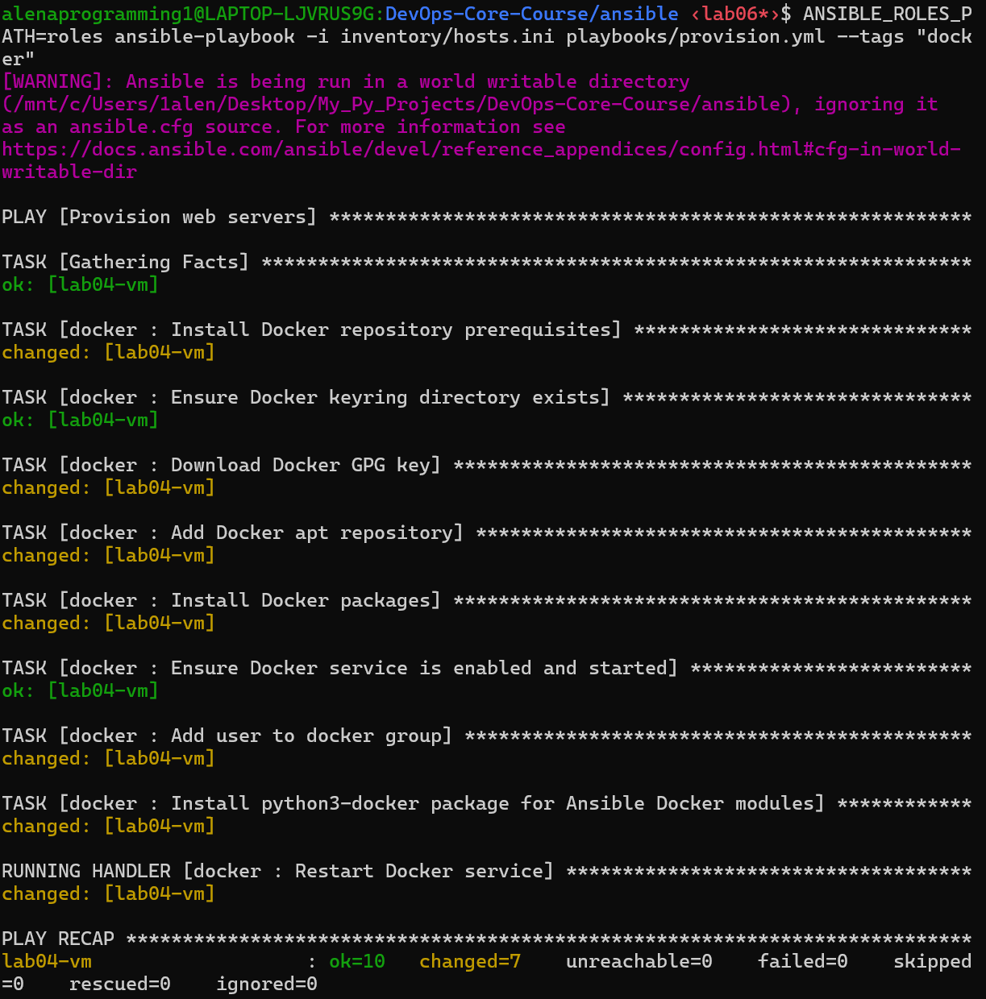  
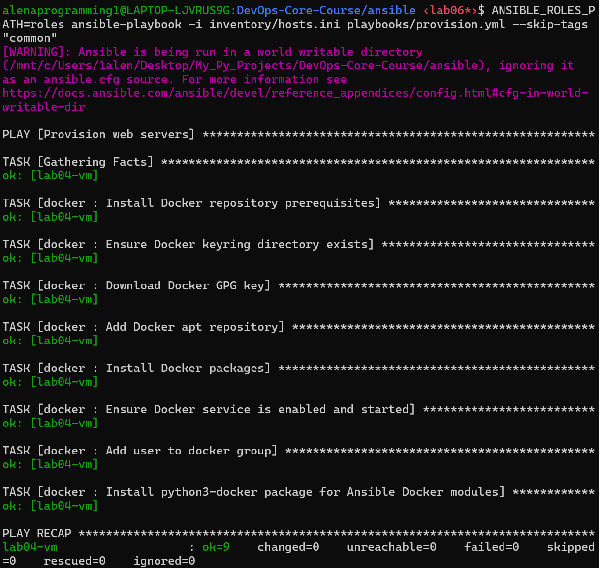  
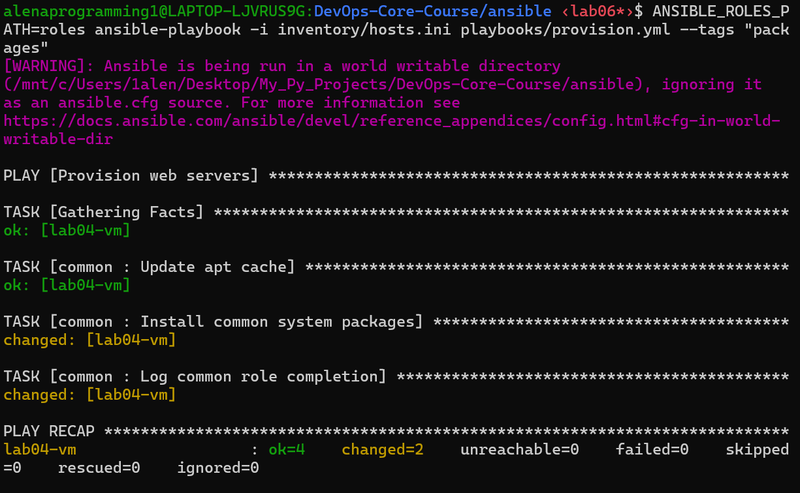  
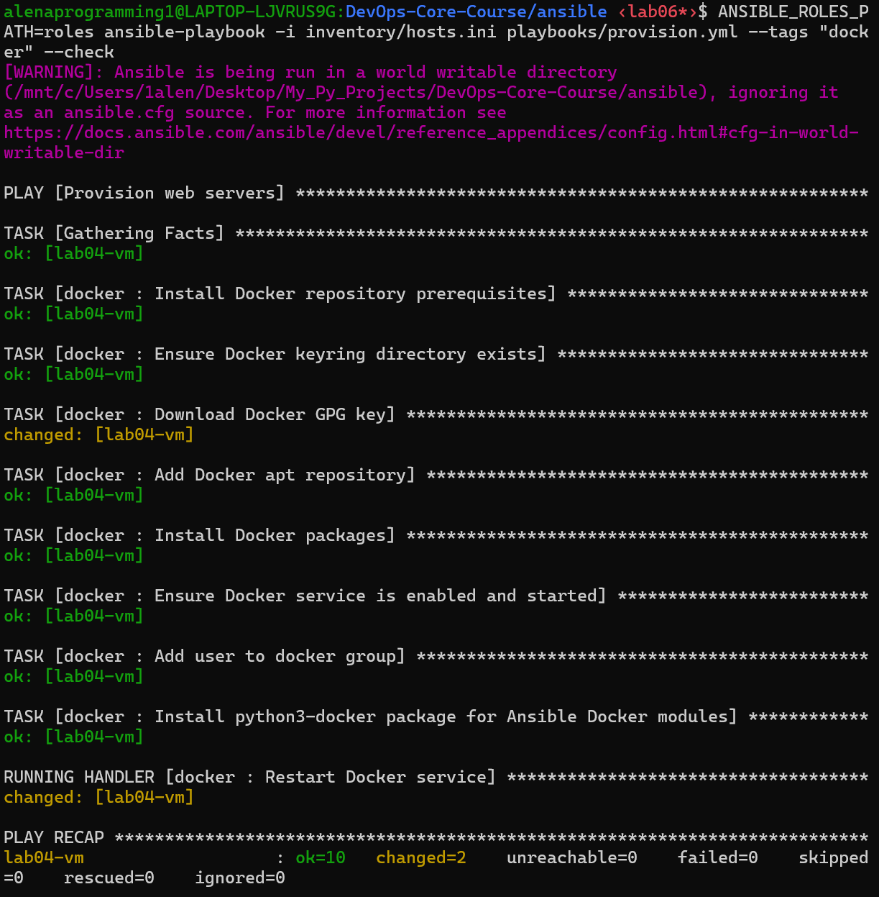  
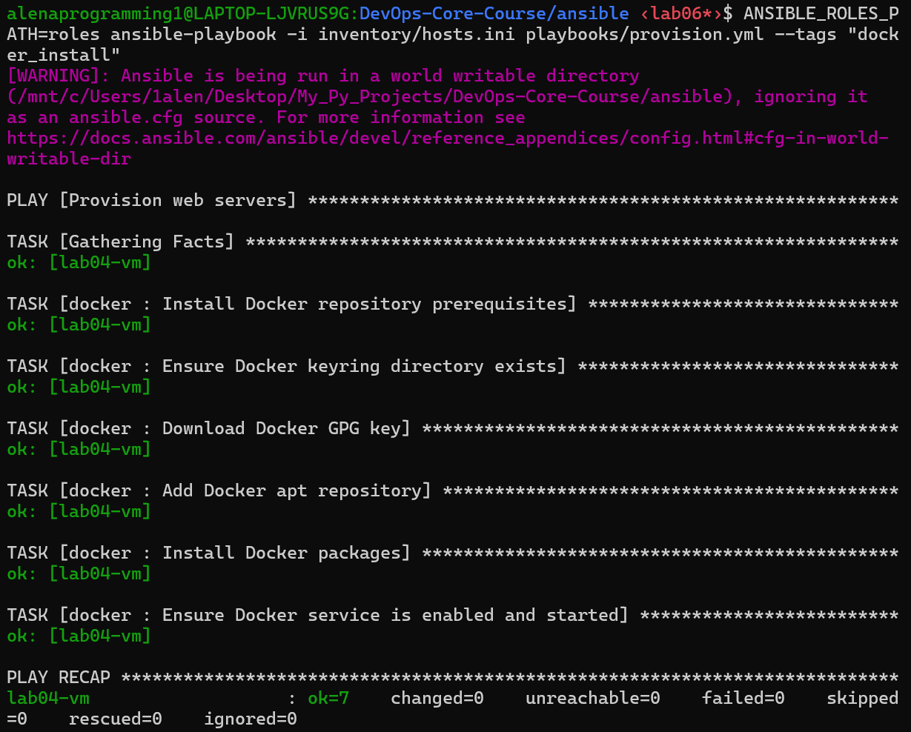  

2. Output showing error handling with rescue block triggered
```bash
ansible-playbook playbooks/provision.yml \
  --tags "docker_install" \
  -e 'docker_packages=["docker-ce","package-that-does-not-exist-123"]'
```
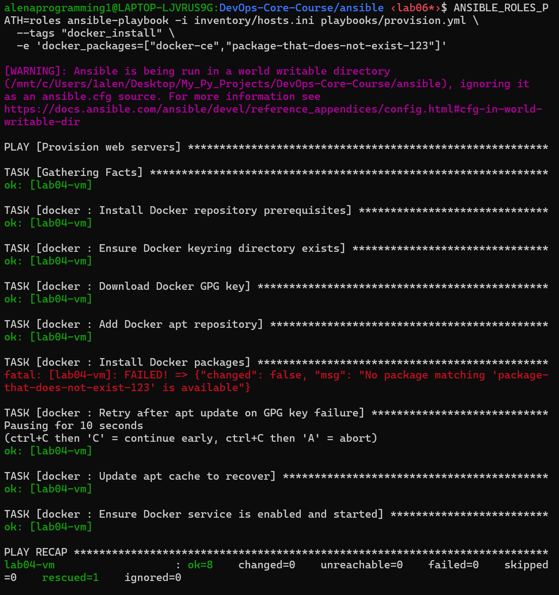

3. List of all available tags (--list-tags output)
```bash
ansible-playbook playbooks/provision.yml --list-tags
```
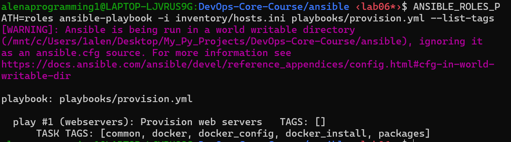

---

## Task 2: Docker Compose Migration

### Role Renaming
- The `app_deploy` role directory was renamed to `web_app`.
- Playbooks (`deploy.yml`) were updated accordingly; variable names (`app_container_name` → `app_name`, `docker_image_tag` → `docker_tag`) standardized for clarity.

### Docker Compose Template
- Created `roles/web_app/templates/docker-compose.yml.j2` using Jinja2.
- Template supports dynamic service name, image, ports, environment variables, restart policy, and optional networks.
- Example variables: `app_name`, `docker_image`, `docker_tag`, `app_port`, `app_internal_port`, `app_env`.

**Template excerpt:**
```yaml
services:
  {{ web_app_name }}:
    image: {{ web_app_docker_image }}:{{ web_app_docker_tag }}
    ports:
      - "{{ web_app_host_port }}:{{ web_app_internal_port }}"
    environment:
      APP_NAME: "{{ web_app_name }}"

      {{ key }}: "{{ value }}"

    restart: "{{ web_app_restart_policy }}"
    # networks:
    #   - webnet

# networks:
#   webnet:
#     driver: bridge

```

### Role Dependencies
- Added `roles/web_app/meta/main.yml` with:
  ```yaml
  dependencies:
    - role: docker
  ```
- Running `ansible-playbook playbooks/deploy.yml` triggers docker installation automatically when the web_app role is executed alone.

### Deployment Tasks
- Updated `roles/web_app/tasks/main.yml`:
  - Includes wipe logic at the top.
  - Deployment block creates the target directory, templates the compose file, and calls `community.docker.docker_compose` to bring the stack up.
  - Tags `app_deploy` and `compose` applied.
  - Rescue section logs failure.

### Variables Configuration
- Added defaults in `roles/web_app/defaults/main.yml`:
  ```yaml
  compose_project_dir: "/opt/{{ app_name }}"
  docker_compose_version: "3.8"
  web_app_wipe: false
  ```
- Application-specific defaults remain defined there; sensitive values can still be stored in `group_vars/all.yml` with Ansible Vault.

### Test
1. Output showing Docker Compose deployment success  
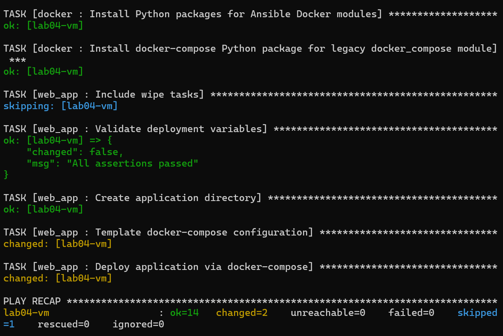
2. Idempotency proof (second run shows "ok" not "changed")  
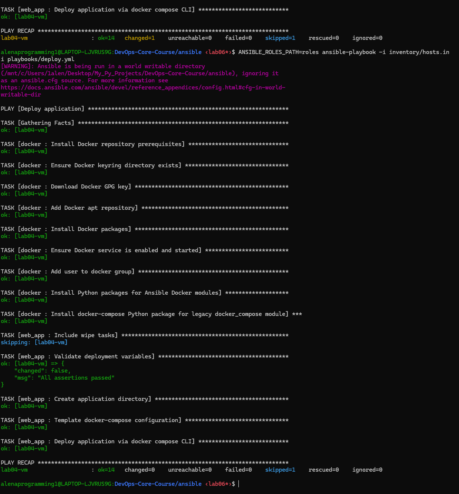
3. Application running and accessible  
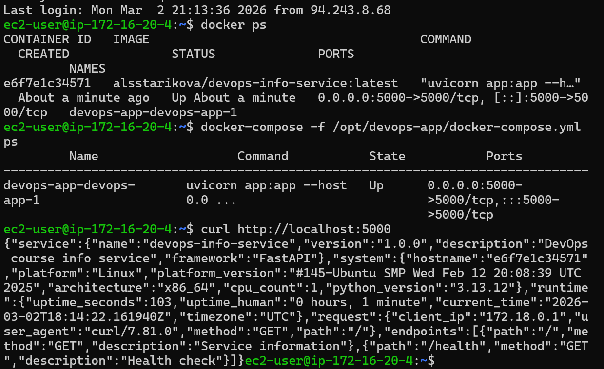
4. Contents of templated docker-compose.yml  
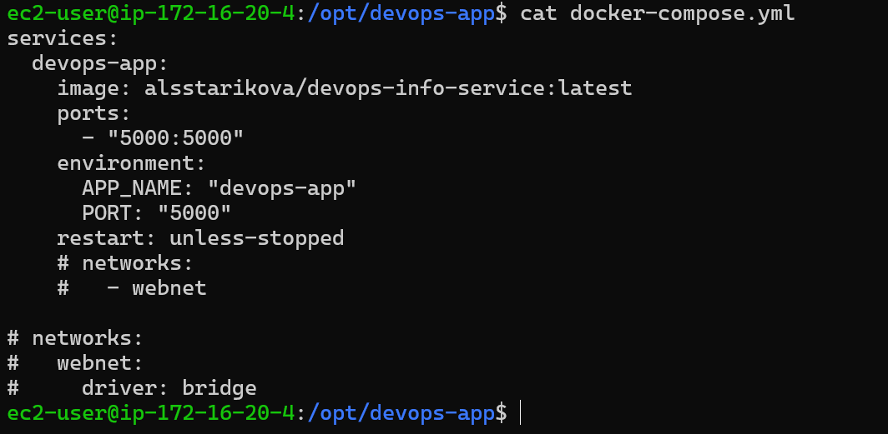
---

## Task 3: Wipe Logic

### Variable + Tag Approach

Implemented **double-gated** safety mechanism to prevent accidental destruction:

1. **Variable Gate (Boolean):** `web_app_wipe: false` default in `roles/web_app/defaults/main.yml`
   - Must be explicitly set to `true` via command-line (`-e "web_app_wipe=true"`) or inventory
   - Prevents accidental execution from stray configurations
   - Documented with clear usage warnings

2. **Tag Gate (Explicit Selection):** `web_app_wipe` tag applied to wipe tasks
   - Requires conscious `--tags web_app_wipe` argument during playbook execution
   - Prevents execution even if variable is set to `true`
   - Mandatory for any cleanup operation

### Implementation Details

**File:** `roles/web_app/tasks/wipe.yml`
```yaml
- name: Stop and remove Docker Compose stack
  community.docker.docker_compose:
    project_src: "{{ compose_project_dir }}"
    state: absent

- name: Remove project directory
  file:
    path: "{{ compose_project_dir }}"
    state: absent

- name: Log wipe completion
  debug:
    msg: "Web app wipe completed successfully"
```

**Invocation in** `roles/web_app/tasks/main.yml`:
```yaml
- name: Include wipe tasks
  include_tasks: wipe.yml
  when: web_app_wipe | bool
  tags:
    - web_app_wipe
```

### Execution Modes

| Command | Variable | Tag | Result |
|---------|----------|-----|--------|
| `ansible-playbook deploy.yml` | false | — | Deploy only, no wipe |
| `ansible-playbook deploy.yml -e "web_app_wipe=true"` | true | — | Clean reinstallation (wipe → deploy) |
| `ansible-playbook deploy.yml --tags web_app_wipe` | false | selected | Skip wipe (variable false) |
| `ansible-playbook deploy.yml -e "web_app_wipe=true" --tags web_app_wipe` | true | selected | Wipe only (remove existing deployment) |

### Test
1. **Normal deployment (no wipe):** playbook runs deployment only, wipe tasks skipped.  
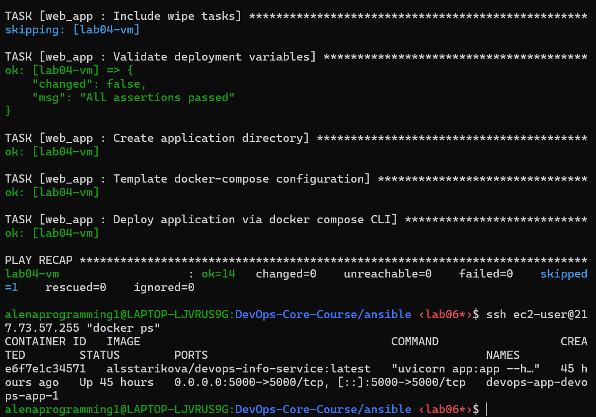
2. **Wipe-only:** `ansible-playbook deploy.yml -e "web_app_wipe=true" --tags web_app_wipe` removes the app and directory.  
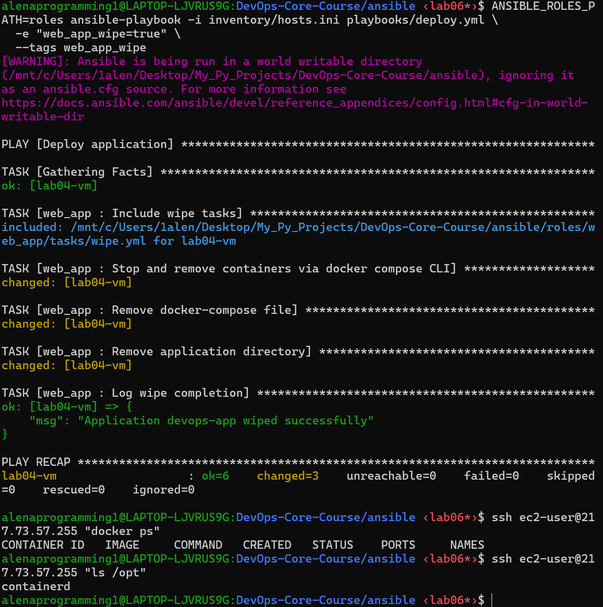
3. **Clean reinstallation:** `ansible-playbook deploy.yml -e "web_app_wipe=true"` first wipes then redeploys; result is a fresh container.  
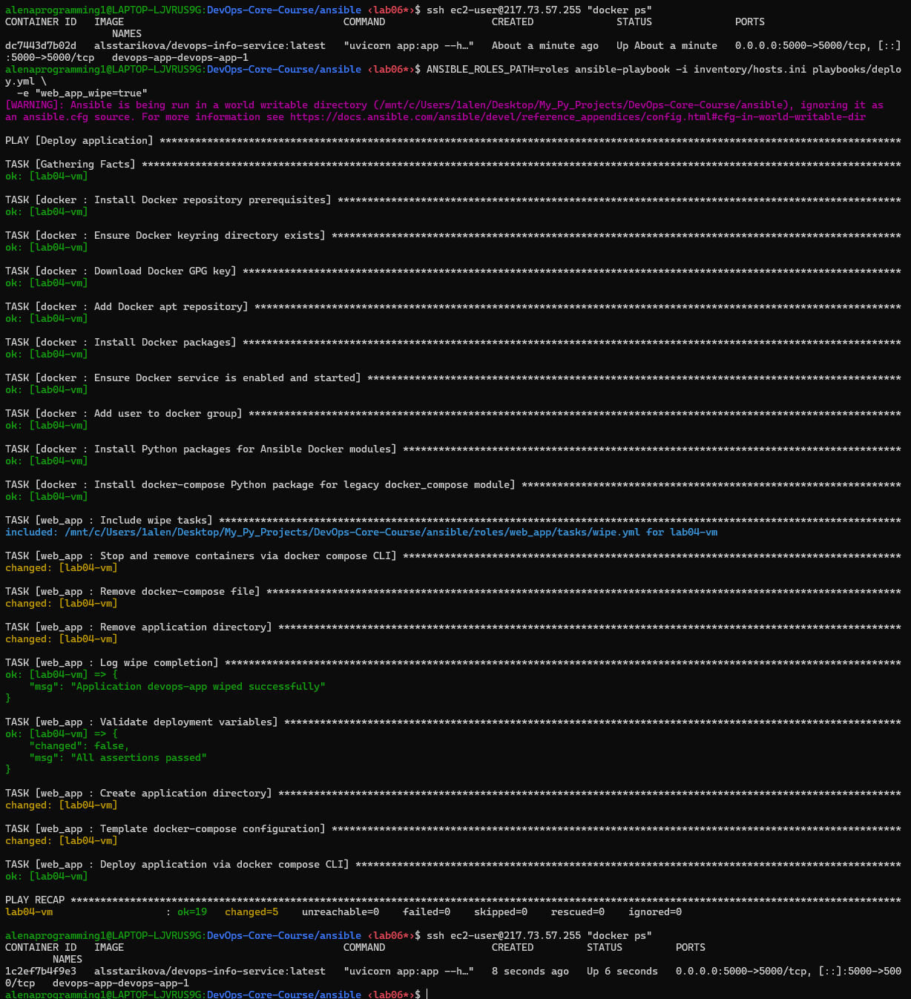
4. **Safety checks:**  
   - With `--tags web_app_wipe` but `web_app_wipe=false` nothing wipes.  
   - With variable true and `--tags web_app_wipe` only wipe runs, deployment skipped.  
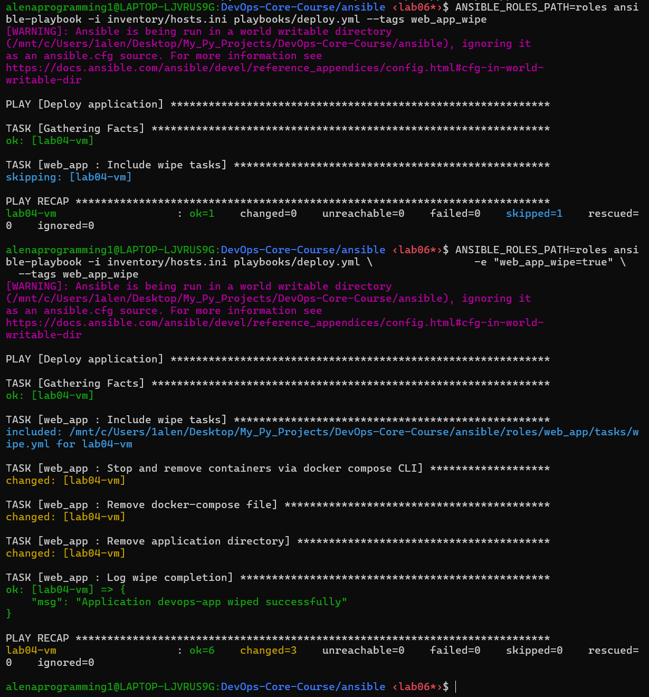
5. **Screenshot of application running after clean reinstall:**
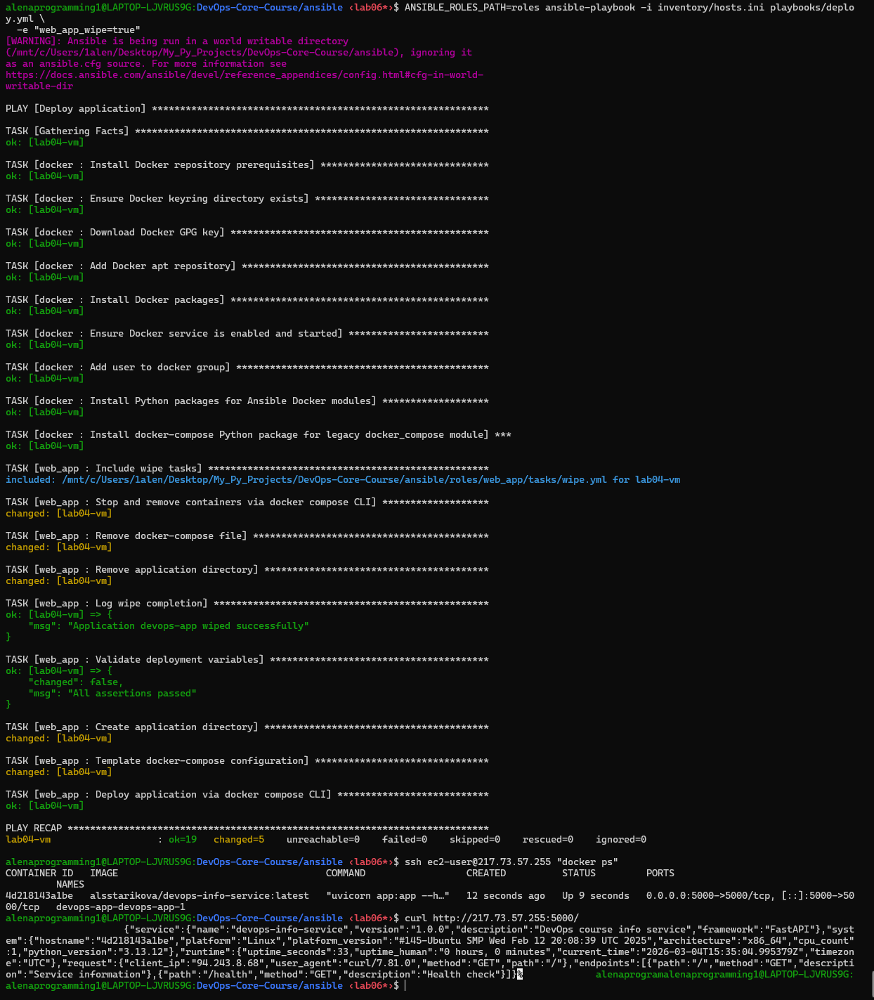

---

## Task 4: CI/CD Integration

### Workflow Architecture

**File:** `.github/workflows/ansible-deploy.yml`

#### Job 1: Lint
- Validates Ansible playbooks and roles using `ansible-lint`
- Gate: Must pass before deploy job executes
- Detects syntax errors, best-practice violations, and security issues

#### Job 2: Deploy
- **Dependency:** Runs only after lint succeeds
- **Checkout:** Downloads repository code
- **Setup:** Installs Python, Ansible, and required collections
- **SSH Configuration:** 
  - Writes SSH private key from secrets to `~/.ssh/id_rsa`
  - Sets appropriate permissions (600)
  - Configures known_hosts for target VM
- **Vault Decryption:** Exports `ANSIBLE_VAULT_PASSWORD_FILE` for encrypted variable access
- **Playbook Execution:** Runs `ansible-playbook playbooks/deploy.yml` against inventory
- **Verification:** Uses `curl` to validate application endpoints after 10-second delay

### Setup Steps

1. **GitHub Secrets Configuration:**
   ```
   ANSIBLE_VAULT_PASSWORD    → Vault encryption password
   SSH_PRIVATE_KEY           → Deploy user private key
   VM_HOST                   → Target VM IP/hostname
   VM_USER                   → SSH username (e.g., ubuntu)
   ```

2. **Workflow Trigger:** Changes to `ansible/**` or workflow file trigger execution

3. **Path Filters:** Minimizes unnecessary runs:
   ```yaml
   paths:
     - 'ansible/**'
     - '.github/workflows/ansible-deploy.yml'
   ```

### Workflow Execution Flow

```
Push to Repository
    ↓
[Lint Job] → ansible-lint on all playbooks
    ↓ (pass/fail)
[Deploy Job] → SSH setup → Vault decrypt → ansible-playbook
    ↓ (complete)
[Verify Job] → curl endpoints → Report status
```

### Test
1. Screenshot of successful workflow run  
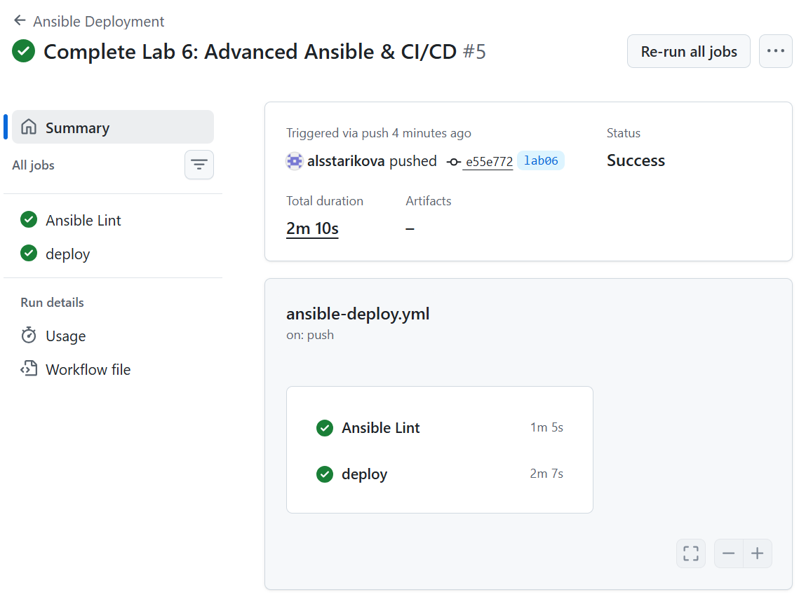
2. Output logs showing ansible-lint passing  
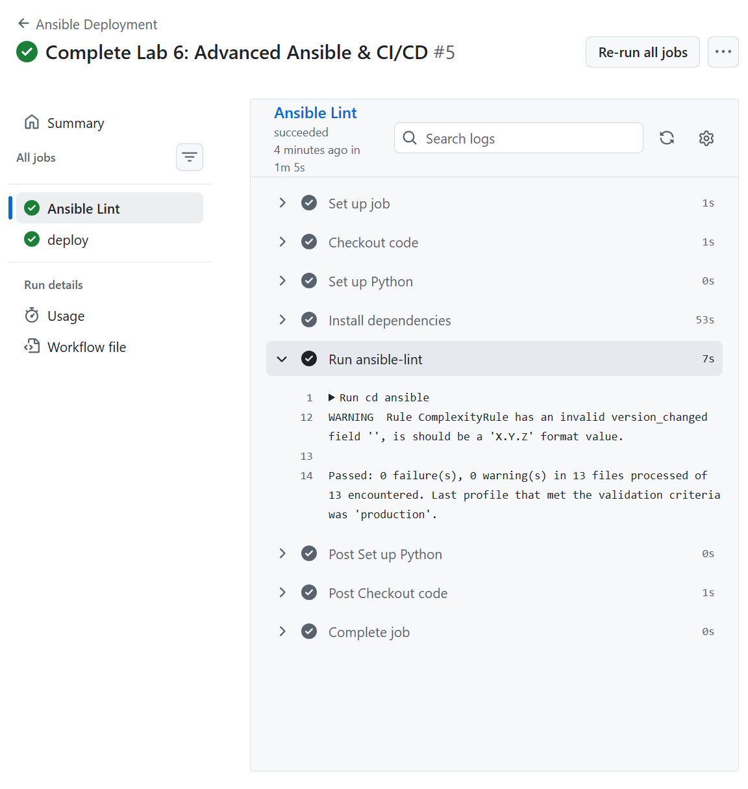
3. Output logs showing ansible-playbook execution  
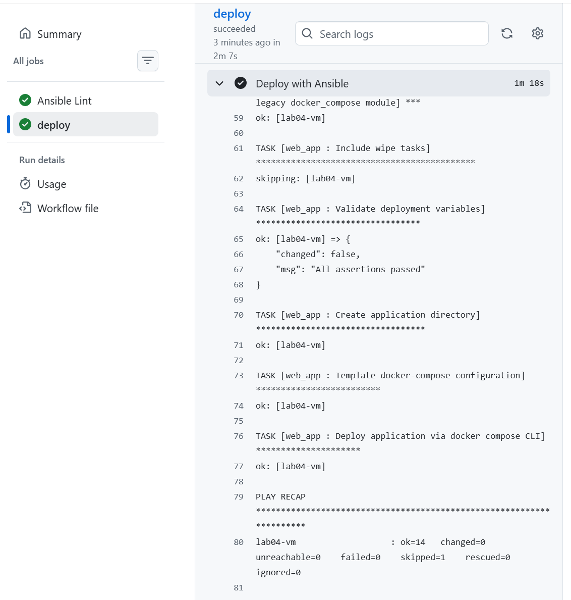
4. Verification step output showing app responding  
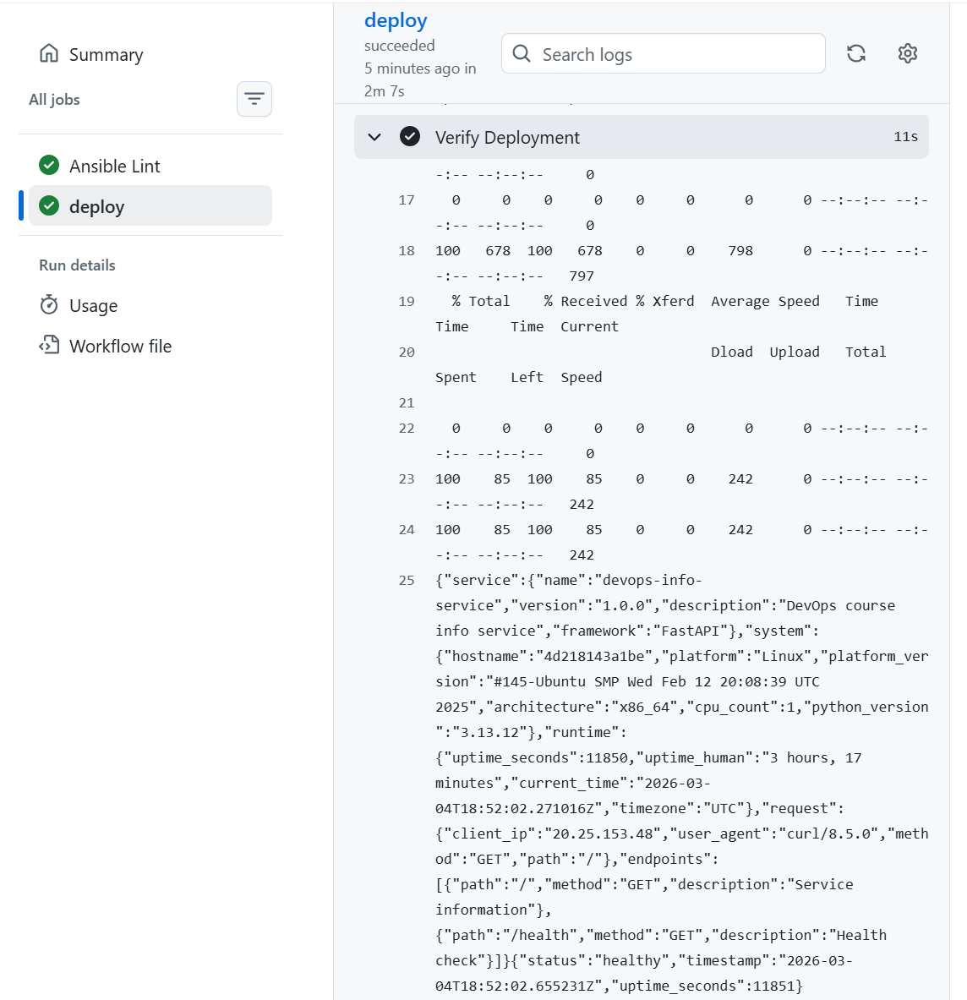
5. Status badge in README showing passing  
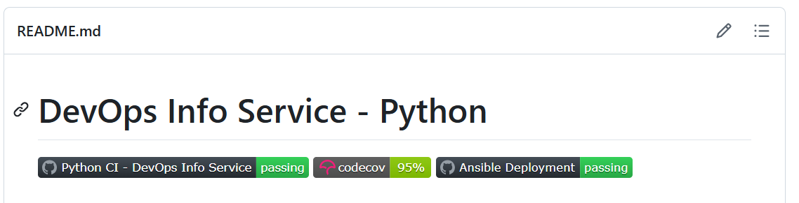

---

## Testing Results

All major components have been comprehensively tested with documented examples and screenshots:

### Blocks & Tags Testing
- **Selective execution:** Tag-based filtering demonstrates ability to run/skip specific components
  - Example: `ansible-playbook playbooks/provision.yml --tags "docker"`
  - Evidence: [test-docker.png](screenshots/test-docker.png), [test-skip.png](screenshots/test-skip.png)

- **Error handling:** Rescue blocks triggered on intentional failures
  - Forced failure with invalid package: `docker_packages=["docker-ce","package-that-does-not-exist-123"]`
  - Evidence: [test-rescue.png](screenshots/test-rescue.png)

- **Check mode:** Dry-run validation without actual changes
  - Example: `ansible-playbook playbooks/provision.yml --tags "docker" --check`
  - Evidence: [test-check.png](screenshots/test-check.png)

### Docker Compose Testing
- **First deployment:** Successfully creates containers from templated compose file
  - Evidence: [2-first-run.png](screenshots/2-first-run.png), [templated-dc.png](screenshots/templated-dc.png)

- **Idempotency:** Second run shows "ok" (no changes), proving converging behavior
  - Evidence: [2-second-run.png](screenshots/2-second-run.png)

- **Application accessibility:** Verified endpoints responding after deployment
  - Evidence: [application-running.png](screenshots/application-running.png)

### Wipe Logic Testing
1. **Normal deployment (variable false):** Skips wipe, deploys only
   - Evidence: [test1.png](screenshots/test1.png)

2. **Wipe-only execution:** Removes containers and directory when both conditions met
   - Command: `ansible-playbook deploy.yml -e "web_app_wipe=true" --tags web_app_wipe`
   - Evidence: [test2.png](screenshots/test2.png)

3. **Clean reinstallation:** Wipes then redeploys for fresh setup
   - Evidence: [test3.png](screenshots/test3.png), [test5.png](screenshots/test5.png)

4. **Safety validation:** Confirms double-gating prevents accidental wipe
   - Evidence: [test4.png](screenshots/test4.png)

### CI/CD Testing
- **Lint validation:** ansible-lint passes all checks
  - Evidence: [ci2.png](screenshots/ci2.png)

- **Deployment execution:** Playbook runs successfully on remote VM
  - Evidence: [ci3.png](screenshots/ci3.png)

- **Application verification:** Endpoints respond to HTTP requests
  - Evidence: [ci4.png](screenshots/ci4.png)

- **Status badge:** README shows passing workflow status
  - Evidence: [badge.png](screenshots/badge.png)

---

## Challenges & Solutions

### Challenge 1: GitHub Actions Runner → VM Connectivity
**Problem:** CI/CD workflow unable to connect to target VM via SSH. GitHub-hosted runner couldn't reach internal network VM despite SSH configuration.

**Root Cause:** AWS Security Group (VM's network ACL) had ingress rules blocking traffic from GitHub's IP ranges.

**Solution:**
1. Modified Security Group ingress rules to allow SSH (port 22) from `GitHub runner IPs
2. Verified SSH key permissions (600) and private key content correctness

**Outcome:** Workflow now successfully authenticates and executes Ansible playbooks remotely.

### Challenge 2: Ansible Vault Integration with GitHub Actions
**Problem:** Vault password must be available during workflow execution but shouldn't be hardcoded in YAML.

**Solution:** 
- Store `ANSIBLE_VAULT_PASSWORD` as GitHub Secret
- Write to temporary file with restricted permissions (600)
- Clean up after playbook execution

---

## Research Answers

### Blocks & Tags Questions

**Q1: What happens if the rescue block also fails?**
- The failure propagates to the play; Ansible stops the block and the `always` section still executes regardless.
- Nested rescue blocks can handle additional failures, but multiple levels reduce readability.
- For critical operations, consider `fail-fast` approach or conditional error handling.

**Q2: Can you have nested blocks?**
- Yes, blocks can be nested for hierarchical error handling and finer-grained control.
- However, deep nesting (3+ levels) reduces code clarity - prefer flat structure with descriptive names.
- Use nested blocks for retry logic or conditional dependencies.

**Q3: How do tags inherit to tasks within blocks?**
- Tags defined on a block apply to every task inside unless a task explicitly overrides them.
- Child tasks inherit parent block tags and can add additional tags.
- Example: Block tag `docker` + Task tag `docker:install` = Both tags active on task.

### Docker Compose Questions

**Q4: What's the difference between `restart: always` and `restart: unless-stopped`?**

| Aspect | `always` | `unless-stopped` |
|--------|----------|------------------|
| Auto-restart on exit | ✓ | ✓ |
| Survives daemon restart | ✓ | ✓ |
| Manual stop override | ✗ (restarts anyway) | ✓ (respects user intent) |
| Use case | Production critical | Development/testing |

`unless-stopped` is safer for scenarios where maintenance requires stopping containers temporarily without automatic resurrection.

**Q5: How do Docker Compose networks differ from Docker bridge networks?**

- **Docker Bridge:** Single-host network, manual container IP communication, isolated by default
- **Compose Networks:** 
  - Named Docker networks scoped to Compose project
  - Automatic service-name DNS resolution within project
  - Built-in load balancing for replicated services
  - Better isolation between Compose projects
  - Abstraction layer handling network lifecycle

**Q6: Can you reference Ansible Vault variables in the template?**
- Yes. Templates are rendered after Vault decryption, so encrypted variables are accessible as plaintext during rendering.
- Example: `app_secret_key: !vault |` can be referenced as `{{ app_secret_key }}` in Jinja2.
- **Important:** Never expose secrets in logs, version control, or debug output. Use `no_log: true` for sensitive tasks.

### Wipe Logic Questions

**Q7: Why use both variable AND tag for wipe logic?**
- **Defense in depth:** Requires two independent activation mechanisms to prevent accidental destruction.
- **Mitigation:** Even if variable is accidentally set in inventory, wipe won't execute without explicit tag.
- **Security:** Guards against automation errors, script injection, or credential misuse.
- **Accountability:** Both variable + tag indicate deliberate intent, useful for audit logs.

**Q8: What's the difference between `never` tag and this approach?**

| Aspect | `never` Tag | Variable + Tag |
|--------|------------|----------------|
| Manual execution | Can use `--tags never` to override | Tag required, variable must be true |
| Default behavior | Never runs (fail-safe) | Never runs (fail-safe) |
| Flexibility | Limited - all-or-nothing | Granular control via variables |
| Audit trail | Clear intent shown in tags | Both mechanism and intent evident |

Our variable + tag approach provides better auditability and operational flexibility.

**Q9: Why must wipe logic come BEFORE deployment in `main.yml`?**
- Ensures atomic operation: remove old resources → create new resources
- Prevents partial deployments or resource conflicts
- Enables clean reinstallation without orphaned containers/volumes
- If deploy failed, cleanup still removes incomplete state

**Q10: When would you want clean reinstallation vs. rolling update?**

| Scenario | Approach | Reason |
|----------|----------|--------|
| Schema changes, major version | Clean wipe | Prevents data compatibility issues |
| Patch releases, bug fixes | Rolling update | Minimize downtime, preserve state |
| Testing, staging environments | Clean wipe | Reproducible state |
| Production with persistent data | Rolling update | Avoid data loss |
| Configuration-only changes | Rolling update | Faster, preserves runtime state |

**Q11: How would you extend wipe logic to images/volumes?**
```yaml
- name: Remove Docker images
  community.docker.docker_image:
    name: "{{ docker_image }}"
    state: absent

- name: Remove data volumes
  community.docker.docker_volume:
    name: "{{ item }}"
    state: absent
  loop: "{{ app_volumes | default([]) }}"

- name: Remove network
  community.docker.docker_network:
    name: "{{ app_network }}"
    state: absent
```
Use same variable + tag gating for safety.

### CI/CD Questions

**Q12: What are the security implications of storing SSH keys in GitHub Secrets?**

**Risks:**
- Accessible to anyone with **write** access to repository (potential for compromise)
- Exposed to all workflows (including pull requests from forks if not restricted)
- Key rotation required if any actor's access is compromised
- Secrets appear in logs if not properly masked

**Mitigation:**
- Use dedicated deploy keys with minimal permissions (SSH key for single purpose)
- Rotate keys regularly (quarterly minimum)
- Restrict secret access to specific branch/workflow
- Enable branch protection requiring reviews before merge
- Monitor SSH key usage in VM logs
- Consider OIDC federation for keyless authentication (GitHub → AWS/Azure)

**Q13: How would you implement a staging → production deployment pipeline?**

```yaml
on:
  push:
    branches:
      - develop    # → Staging
      - main       # → Production

jobs:
  lint:
    # ... lint job

  deploy-staging:
    needs: lint
    if: github.ref == 'refs/heads/develop'
    with:
      environment: staging
      inventory: "staging.ini"

  deploy-production:
    needs: lint
    if: github.ref == 'refs/heads/main'
    with:
      environment: production
      inventory: "production.ini"
    environment:
      name: production
      deployment-branch-policy:
        protected-branches: true
```

Alternatively, use GitOps with artifact promotion or environment variables to parameterize inventory/image tags.

**Q14: What would you add to make rollbacks possible?**

1. **Version tagging:** Store Docker image tags corresponding to playbook versions
2. **Artifact registry:** Maintain list of deployed image versions with rollback metadata
3. **Rollback job:**
   ```yaml
   - name: Rollback to previous version
     vars:
       docker_tag: "{{ rollback_version }}"
     # Re-run deploy.yml with previous image tag
   ```
4. **Blue-green deployment:** Keep two environments, switch via DNS/load balancer
5. **Version preservation:** Never delete old images from registry; use retention policies

**Q15: How does self-hosted runner improve security compared to GitHub-hosted?**

| Aspect | GitHub-Hosted | Self-Hosted |
|--------|---------------|-------------|
| Network isolation | Shared cloud | Your VPC |
| SSH key exposure | Public internet | Internal network |
| Compute resources | Shared | Dedicated |
| Secret exposure risk | Higher (multi-tenant) | Lower (controlled) |
| Setup complexity | Simple | Complex |
| Cost | Included | Infrastructure cost |
| Compliance | Limited | Full control |

**Best practice:** Use self-hosted runner for production deployments with sensitive credentials.

---
