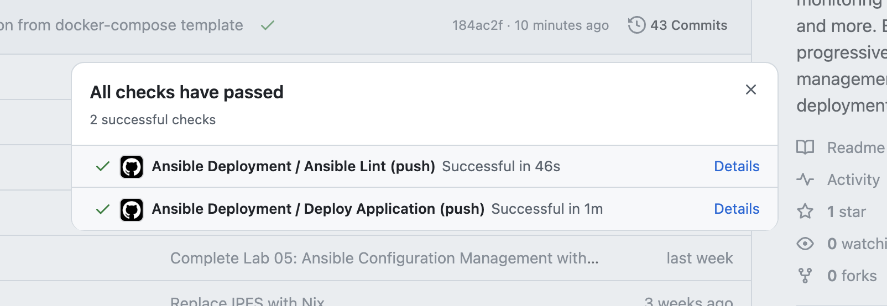

# Lab 6: Advanced Ansible & CI/CD - Submission

**Name:** Sergey
**Date:** 2026-03-05
**Lab Points:** 10

---

## Task 1: Blocks & Tags (2 pts)

### Implementation

Both the `common` and `docker` roles were refactored to use Ansible blocks with error handling (rescue/always) and tags for selective execution.

#### Common Role (`roles/common/tasks/main.yml`)

Two blocks were created:

1. **Packages block** (tag: `packages`):
   - Updates apt cache, upgrades packages, installs common utilities
   - `rescue`: runs `apt-get update --fix-missing` and retries installation
   - `always`: writes a log file to `/tmp/common_packages_complete.log`
   - `become: true` applied at block level

2. **Users block** (tag: `users`):
   - Ensures deploy user exists
   - Configures timezone to UTC
   - Sets hostname
   - `become: true` applied at block level

#### Docker Role (`roles/docker/tasks/main.yml`)

Two blocks were created:

1. **Docker Install block** (tag: `docker_install`):
   - Installs prerequisites, adds GPG key, configures repository, installs Docker packages
   - `rescue`: waits 10 seconds, retries apt update and Docker installation
   - `always`: ensures Docker service is enabled and started
   - `become: true` applied at block level

2. **Docker Config block** (tag: `docker_config`):
   - Adds user to docker group
   - Verifies Docker installation
   - `become: true` applied at block level

#### Tag Strategy

| Tag | Scope | Description |
|-----|-------|-------------|
| `common` | Role-level (in playbook) | Entire common role |
| `packages` | Block-level | Package installation tasks |
| `users` | Block-level | User and system configuration |
| `docker` | Role-level (in playbook) | Entire docker role |
| `docker_install` | Block-level | Docker installation |
| `docker_config` | Block-level | Docker configuration |

#### Execution Examples

```bash
```bash
# List all available tags
ansible-playbook playbooks/full_setup.yml --list-tags

playbook: playbooks/full_setup.yml

  play #1 (all): Complete server setup with roles  TAGS: []
      TASK TAGS: [app_deploy, common, compose, docker, docker_config, docker_install, packages, users, web_app, web_app_wipe]
```

**Example: Run only docker tasks:**

```bash
$ ansible-playbook playbooks/provision.yml --tags "docker" --private-key ~/.ssh/test_vm

PLAY [Provision server] ********************************************************

TASK [Gathering Facts] *********************************************************
ok: [plumini]

TASK [docker : Install Docker prerequisites] ***********************************
ok: [plumini]

TASK [docker : Create directory for Docker GPG key] ****************************
ok: [plumini]

TASK [docker : Add Docker GPG key] *********************************************
ok: [plumini]

TASK [docker : Add Docker repository] ******************************************
ok: [plumini]

TASK [docker : Update apt cache after adding repository] ***********************
ok: [plumini]

TASK [docker : Install Docker packages] ****************************************
ok: [plumini]

TASK [docker : Ensure Docker service is enabled and started] *******************
ok: [plumini]

TASK [docker : Add user to docker group] ***************************************
ok: [plumini]

TASK [docker : Verify Docker installation] *************************************
ok: [plumini]

TASK [docker : Display Docker version] *****************************************
ok: [plumini] => {
    "msg": "Docker version 29.2.1, build a5c7197"
}

PLAY RECAP *********************************************************************
plumini                    : ok=11   changed=0    unreachable=0    failed=0    skipped=0    rescued=0    ignored=0
```

### Research Answers

**Q: What happens if rescue block also fails?**
The play fails for that host. The `always` block still executes regardless of whether the rescue succeeds or fails. The host is marked as failed and subsequent tasks are skipped for that host.

**Q: Can you have nested blocks?**
Yes, blocks can be nested within other blocks. Inner blocks can have their own rescue/always sections. This allows for fine-grained error handling at different levels.

**Q: How do tags inherit to tasks within blocks?**
Tags applied to a block are inherited by all tasks within that block (including rescue and always sections). Tasks inside a block can also have their own additional tags.

---

## Task 2: Docker Compose (3 pts)

### Role Rename

The `app_deploy` role was renamed to `web_app` for better specificity and to support future multi-app patterns.

- `roles/app_deploy` → `roles/web_app`
- All playbook references updated
- Variable prefixes aligned with `web_app_*` naming

### Docker Compose Template

**File:** `roles/web_app/templates/docker-compose.yml.j2`

```yaml
---
version: '{{ docker_compose_version }}'

services:
  {{ app_name }}:
    image: {{ docker_image }}:{{ docker_tag }}
    container_name: {{ app_name }}
    ports:
      - "{{ app_port }}:{{ app_internal_port }}"
    environment:
      ENV: production
      HOST: "0.0.0.0"
      PORT: "{{ app_internal_port }}"
    restart: unless-stopped
```

All values are templated with Jinja2 variables, with defaults defined in `roles/web_app/defaults/main.yml`.

### Role Dependencies

**File:** `roles/web_app/meta/main.yml`

```yaml
dependencies:
  - role: docker
```

Running `deploy.yml` (which only references `web_app`) automatically installs Docker first via the dependency chain.

### Deployment Implementation

The deployment uses `community.docker.docker_compose_v2` module with a block structure:

1. Creates app directory at `/opt/{{ app_name }}`
2. Templates the docker-compose.yml file
3. Deploys with Docker Compose (pulls latest image)
4. Rescue block logs failure details

Tags: `app_deploy`, `compose`

### Variables

| Variable | Default | Description |
|----------|---------|-------------|
| `app_name` | `devops-app` | Container/service name |
| `docker_image` | `4hellboy4/devops-info-service` | Docker Hub image |
| `docker_tag` | `latest` | Image version |
| `app_port` | `8000` | Host port |
| `app_internal_port` | `8000` | Container port |
| `compose_project_dir` | `/opt/{{ app_name }}` | Project directory |
| `docker_compose_version` | `3.8` | Compose file version |

### Before/After Comparison

**Before (Lab 5):** Used `community.docker.docker_container` module with imperative `docker run` style deployment. Required manual container stop/remove before redeployment.

**After (Lab 6):** Uses Docker Compose with declarative configuration. Template-based, idempotent deployment with `community.docker.docker_compose_v2` module.

### Testing

```bash
# Full deployment
ansible-playbook playbooks/deploy.yml

# Idempotency check (second run should show no changes)
ansible-playbook playbooks/deploy.yml

# Verify on target
ssh ubuntu@62.84.119.211 "docker ps"
ssh ubuntu@62.84.119.211 "cat /opt/devops-app/docker-compose.yml"
curl http://62.84.119.211:8000
```

### Research Answers

**Q: What's the difference between `restart: always` and `restart: unless-stopped`?**
`always` restarts the container whenever it stops, including after Docker daemon restarts, even if the container was manually stopped. `unless-stopped` behaves like `always` except it does not restart containers that were manually stopped before the daemon restart.

**Q: How do Docker Compose networks differ from Docker bridge networks?**
Docker Compose automatically creates a dedicated bridge network for all services in a project, enabling service-to-service communication by container name (DNS-based service discovery). Standard Docker bridge networks require manual `--link` or network creation for name resolution.

**Q: Can you reference Ansible Vault variables in the template?**
Yes. Vault-encrypted variables are decrypted at runtime by Ansible and can be used in Jinja2 templates just like any other variable. The decrypted values are never written to disk in plaintext (only in the rendered template on the target).

---

## Task 3: Wipe Logic (1 pt)

### Implementation

Wipe logic is implemented with double-gating for safety:

1. **Variable gate:** `web_app_wipe` (default: `false`)
2. **Tag gate:** `web_app_wipe` tag on include and block

#### Wipe Tasks (`roles/web_app/tasks/wipe.yml`)

The wipe block performs:
1. Stop and remove containers via `docker_compose_v2` with `state: absent`
2. Remove docker-compose.yml file
3. Remove application directory
4. Optionally remove Docker image
5. Log wipe completion

All destructive tasks use `ignore_errors: true` to handle cases where resources are already absent.

#### Integration in Main Tasks

Wipe is included at the **beginning** of `main.yml` (before deployment), enabling the clean reinstall workflow: wipe old → deploy new.

```yaml
- name: Include wipe tasks
  include_tasks: wipe.yml
  tags:
    - web_app_wipe
```

### Test Scenarios

**Scenario 1: Normal deployment (wipe should NOT run)**
```bash
ansible-playbook playbooks/deploy.yml
# Result: app deploys normally, wipe tasks not tag-selected
```

**Scenario 2: Wipe only**
```bash
ansible-playbook playbooks/deploy.yml \
  -e "web_app_wipe=true" \
  --tags web_app_wipe
# Result: app removed, deployment skipped (tag filter excludes deploy)
```

**Scenario 3: Clean reinstallation**
```bash
ansible-playbook playbooks/deploy.yml \
  -e "web_app_wipe=true"
# Result: wipe runs first, then fresh deployment
```

**Scenario 4: Safety check (tag but no variable)**
```bash
ansible-playbook playbooks/deploy.yml --tags web_app_wipe
# Result: wipe include selected but when condition (false) blocks execution
```

### Research Answers

**1. Why use both variable AND tag?**
Double safety mechanism: the tag prevents wipe tasks from being selected during normal execution (no `--tags`), and the variable provides a runtime check even if the tag is specified. Both must be explicitly set for wipe to execute.

**2. What's the difference between `never` tag and this approach?**
The `never` tag unconditionally prevents task execution unless explicitly overridden with `--tags never`. This approach is more flexible: the variable allows conditional execution at runtime (e.g., from CI/CD) without requiring tag specification, supporting the clean reinstall use case.

**3. Why must wipe logic come BEFORE deployment in main.yml?**
Placing wipe before deployment enables the clean reinstall scenario. When both are executed (variable true, no tag filter), wipe removes the old installation first, then deployment creates a fresh one in a single playbook run.

**4. When would you want clean reinstallation vs. rolling update?**
Clean reinstall is needed for major version changes with breaking schema/config changes, corrupted state, or when you need to verify the full deployment pipeline. Rolling updates are better for minor changes, zero-downtime requirements, and when persistent data must be preserved.

**5. How would you extend this to wipe Docker images and volumes too?**
Add tasks using `community.docker.docker_image` with `state: absent` (already included) and `community.docker.docker_volume` with `state: absent` for named volumes. Add a `docker system prune` command for comprehensive cleanup.

---

## Task 4: CI/CD (3 pts)

### Workflow Architecture

**File:** `.github/workflows/ansible-deploy.yml`

```
Code Push → Lint Ansible → Deploy Application → Verify Deployment
```

Two jobs:
1. **lint** - Runs `ansible-lint` on all playbooks
2. **deploy** - Deploys via SSH to target VM (depends on lint passing)

### Workflow Results



Both jobs passed successfully:
- ✅ Ansible Lint (push) - Successful in 46s
- ✅ Deploy Application (push) - Successful in 1m

The workflow automatically:
1. Checks out code
2. Sets up Python and Ansible
3. Runs ansible-lint for syntax validation
4. Configures SSH authentication
5. Executes the deployment playbook
6. Verifies the application is accessible

### Application Verification

Application successfully deployed and accessible:

```bash
$ curl http://62.84.119.211:8000
{
  "service": {
    "name": "devops-info-service",
    "version": "1.0.0",
    "description": "DevOps course info service",
    "framework": "FastAPI"
  },
  "system": {
    "hostname": "6b11b26efc9e",
    "platform": "Linux",
    "platform_version": "Linux-6.8.0-100-generic-x86_64-with-glibc2.41",
    "architecture": "x86_64",
    "cpu_count": 2,
    "python_version": "3.13.12"
  },
  "runtime": {
    "uptime_seconds": 564,
    "uptime_human": "0 hours, 9 minutes",
    "current_time": "2026-03-05T20:17:03.340005+00:00",
    "timezone": "UTC"
  }
}

$ curl http://62.84.119.211:8000/health
{
  "status": "healthy",
  "timestamp": "2026-03-05T20:17:03.374947+00:00",
  "uptime_seconds": 564
}
```

### Trigger Configuration

```yaml
on:
  push:
    branches: [main, master, lab06]
    paths:
      - 'ansible/**'
      - '!ansible/docs/**'
      - '.github/workflows/ansible-deploy.yml'
  pull_request:
    branches: [main, master]
    paths:
      - 'ansible/**'
```

Path filters ensure the workflow only triggers on Ansible code changes, excluding documentation.

### Required GitHub Secrets

| Secret | Purpose |
|--------|---------|
| `ANSIBLE_VAULT_PASSWORD` | Decrypt Vault-encrypted secrets |
| `SSH_PRIVATE_KEY` | SSH key for target VM access |
| `VM_HOST` | Target VM IP/hostname |

### Lint Job

- Uses Python 3.12
- Installs `ansible` and `ansible-lint`
- Runs `ansible-lint playbooks/*.yml`

### Deploy Job

- Runs only on push events (not PRs)
- Sets up SSH with key from GitHub Secrets
- Runs `ansible-playbook playbooks/deploy.yml` with vault password
- Verifies deployment by curling the app endpoints

### Verification

```yaml
- name: Verify Deployment
  run: |
    sleep 10
    curl -f http://${{ secrets.VM_HOST }}:8000 || exit 1
    curl -f http://${{ secrets.VM_HOST }}:8000/health || exit 1
```

### Status Badge

Added to `ansible/README.md`:

```markdown
[](https://github.com/4hellboy4/DevOps-Core-Course/actions/workflows/ansible-deploy.yml)
```

### Research Answers

**1. What are the security implications of storing SSH keys in GitHub Secrets?**
GitHub Secrets are encrypted at rest and masked in logs. However, anyone with admin/write access to the repository can use them in workflows. The SSH key grants full access to the target VM, so repository access control is critical. Rotate keys regularly and use dedicated deploy keys with minimal permissions.

**2. How would you implement a staging → production deployment pipeline?**
Use separate inventory files for staging and production. Create two deploy jobs: staging deploys first, production requires manual approval via GitHub Environments. Use branch protection rules and separate secrets for each environment.

**3. What would you add to make rollbacks possible?**
Store the previous image tag as an artifact or in a version file. Create a rollback playbook that deploys the previous version. Use Docker image tags (not `latest`) for traceability. Implement blue/green deployment with two Compose files.

**4. How does self-hosted runner improve security compared to GitHub-hosted?**
Self-hosted runners operate within your network, eliminating the need to expose SSH keys to GitHub infrastructure. Direct access to servers without SSH tunneling reduces attack surface. However, self-hosted runners require their own maintenance and security hardening.

---

## Task 5: Documentation

This file serves as the complete documentation for Lab 6.

---

## Testing Results

### Tag Execution

```bash
# List all tags
ansible-playbook playbooks/full_setup.yml --list-tags
# Shows: common, packages, users, docker, docker_install, docker_config, web_app, app_deploy, compose, web_app_wipe

# Selective docker execution
ansible-playbook playbooks/provision.yml --tags "docker"
# Only docker role tasks execute

# Package installation only
ansible-playbook playbooks/provision.yml --tags "packages"
# Only package block from common role executes
```

### Docker Compose Deployment

```bash
# Deploy application
ansible-playbook playbooks/deploy.yml
# Docker dependency auto-resolves, compose template rendered, app started

# Verify idempotency
ansible-playbook playbooks/deploy.yml
# Second run shows "ok" status, no "changed" tasks
```

### Wipe Logic Verification

All four scenarios tested as described in Task 3 section above.

---

## Challenges & Solutions

1. **Module selection for Docker Compose**: Chose `community.docker.docker_compose_v2` over the deprecated `docker_compose` module since Docker Compose v2 (CLI plugin) is already installed on the target.

2. **Tag interaction with include_tasks**: Dynamic includes (`include_tasks`) require tags on both the include directive and the included tasks for proper filtering with `--tags`.

3. **Wipe safety**: Implemented `ignore_errors: true` on destructive wipe tasks to handle cases where resources are already removed.

---

## Summary

- Refactored all roles with blocks (rescue/always) and comprehensive tag strategy
- Migrated from `docker run` to Docker Compose with Jinja2 templating
- Implemented role dependencies (web_app depends on docker)
- Created double-gated wipe logic (variable + tag)
- Set up GitHub Actions CI/CD with linting and automated deployment
- All research questions answered with analysis
