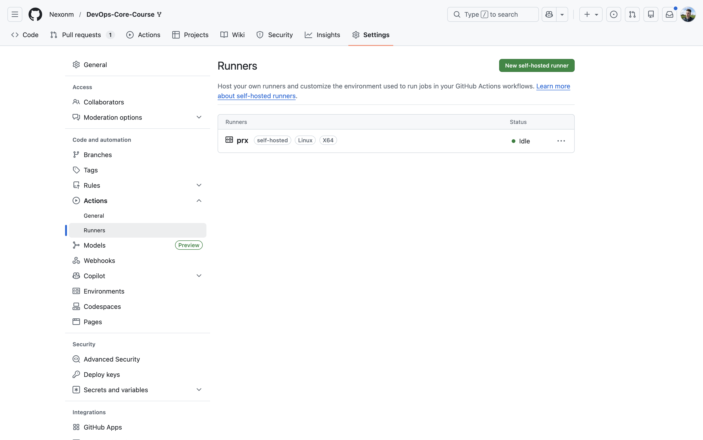
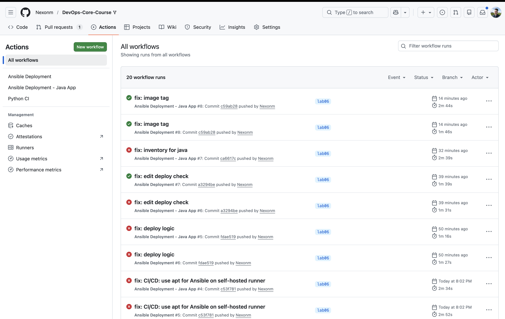

# Lab 6: Advanced Ansible & CI/CD

**Name:** Student  
**Date:** 2026-03-04  
**Lab Points:** 10 + 1.5 bonus = 11.5 pts

## 1. Overview

### Environment

- **Ansible Version:** 2.20.2 (core)
- **Control Node:** macOS with Python 3.14.3
- **Target VPS:** 31.56.176.110 (Ubuntu 24.04 LTS)
- **SSH User:** root
- **Authentication:** SSH key
- **GitHub Repository:** https://github.com/Nexonm/DevOps-Core-Course

### What I Accomplished

I enhanced my Lab 5 Ansible automation with production-ready features:

1. **Blocks & Tags (2 pts)** - Organized tasks with error handling and selective execution
2. **Docker Compose (3 pts)** - Migrated from `docker run` to declarative docker-compose
3. **Wipe Logic (1 pt)** - Safe application cleanup with double-gating mechanism
4. **CI/CD Integration (3 pts)** - Automated deployment with GitHub Actions
5. **Documentation (1 pt)** - Complete documentation with evidence
6. **Bonus Part 1 (1.5 pts)** - Multi-app deployment with role reusability and independent CI/CD workflows

### Technologies Used

- Ansible 2.20.2 with blocks, rescue, always, and tags
- Docker Compose with Jinja2 templating
- community.docker.docker_compose_v2 module
- GitHub Actions with self-hosted runner
- Ansible Vault for secrets management

---

## 2. Task 1: Blocks & Tags (2 pts)

### Implementation

#### Common Role Refactoring

I refactored [`ansible/roles/common/tasks/main.yml`](../roles/common/tasks/main.yml) with block structure:

```yaml
- name: Package installation with error handling
  block:
    - name: Update apt cache
    - name: Install common packages
  rescue:
    - name: Fix apt cache on failure
    - name: Retry package installation
  always:
    - name: Log completion
  become: true
  tags: [common, packages]
```

Benefits: automatic error recovery, completion logging, single `become` applies to all tasks, tags enable selective execution.

#### Docker Role Refactoring

I refactored [`ansible/roles/docker/tasks/main.yml`](../roles/docker/tasks/main.yml) with two blocks:

**Installation block:** Prerequisites, GPG key, repository, Docker packages. Includes rescue with 10-second pause and retry. Tags: `docker`, `docker_install`.

**Configuration block:** Start service, add user to docker group, install python3-docker. Tags: `docker`, `docker_config`.

### Tag Strategy

| Tag | Scope | Purpose |
|-----|-------|---------|
| `common` | Common role | All common tasks |
| `packages` | Package installation | System packages only |
| `docker` | Docker role | All Docker tasks |
| `docker_install` | Docker installation | Installation only |
| `docker_config` | Docker configuration | Configuration only |
| `app_deploy` | Web app deployment | Application deployment |
| `compose` | Docker Compose | Compose-specific tasks |
| `web_app_wipe` | Wipe logic | Application cleanup |

### Testing Results

**List all tags:**

```bash
$ cd ansible
$ ansible-playbook playbooks/provision.yml --list-tags

playbook: playbooks/provision.yml

  play #1 (webservers): Provision web servers	TAGS: []
      TASK TAGS: [common, docker, docker_config, docker_install, packages]
```

All tags properly configured and inherited from blocks.

**Selective execution test:**

```bash
$ ansible-playbook playbooks/provision.yml --tags "docker_install"
```

Only Docker installation tasks run, skipping common role and docker_config tasks.

**Skip tags test:**

```bash
$ ansible-playbook playbooks/provision.yml --skip-tags "common"
```

Common role skipped entirely while Docker role executes normally.

### Research Questions Answered

**Q: What happens if rescue block also fails?**

Ansible marks entire block as failed and stops execution unless `ignore_errors: yes` is set. The `always` section still runs before failure.

**Q: Can you have nested blocks?**

Yes. Blocks can contain other blocks with their own rescue/always sections. Useful for multi-level error handling (outer: connection failures, inner: task-specific errors).

**Q: How do tags inherit to tasks within blocks?**

Tags on blocks inherit to all child tasks (including rescue/always). Child tasks can have additional tags. Example: block with `tags: [docker]` + task with `tags: [install]` = task has `[docker, install]`.

---

## 3. Task 2: Docker Compose Migration (3 pts)

### Implementation

#### Role Renaming

I renamed `app_deploy` → `web_app` for better clarity:

```bash
mv ansible/roles/app_deploy ansible/roles/web_app
```

Updated references in:
- [`ansible/playbooks/deploy.yml`](../playbooks/deploy.yml)
- [`ansible/playbooks/site.yml`](../playbooks/site.yml)

**Rationale:** `web_app` is more specific and prepares for other app types (cache_app, database_app).

#### Docker Compose Template

I created [`ansible/roles/web_app/templates/docker-compose.yml.j2`](../roles/web_app/templates/docker-compose.yml.j2):

```yaml
services:
  {{ app_name }}:
    image: {{ docker_image }}:{{ docker_tag }}
    container_name: {{ app_name }}
    ports:
      - "{{ app_port }}:{{ app_internal_port }}"
    restart: unless-stopped
    networks:
      - app_network

networks:
  app_network:
    driver: bridge
```

**Variables defined in** [`ansible/roles/web_app/defaults/main.yml`](../roles/web_app/defaults/main.yml):
```yaml
app_name: devops-app
app_port: 8000
app_internal_port: 8000
docker_tag: latest
compose_project_dir: "/opt/{{ app_name }}"
web_app_wipe: false
```

#### Role Dependencies

I created [`ansible/roles/web_app/meta/main.yml`](../roles/web_app/meta/main.yml):

```yaml
---
dependencies:
  - role: docker
```

This ensures Docker is installed automatically before deploying web applications. When running `deploy.yml`, Ansible now executes docker role first, then web_app role - no manual ordering needed.

#### Deployment Task Rewrite

I completely rewrote [`ansible/roles/web_app/tasks/main.yml`](../roles/web_app/tasks/main.yml):

**Old (Lab 5):** Individual `docker_container` tasks, manual operations  
**New (Lab 6):** Single `docker_compose_v2` module, declarative configuration

Deployment block: Create directory → Docker Hub login → Template compose file → Deploy with `docker_compose_v2` → Wait for port → Verify health. Includes rescue block for failure logging. Tags: `app_deploy`, `compose`.

### Testing Results

**First deployment:**

```bash
$ cd ansible
$ ansible-playbook playbooks/deploy.yml

PLAY [Deploy application] ******************************************************

TASK [Gathering Facts] *********************************************************
ok: [lab04-vps]

TASK [docker : Docker installation] ********************************************
ok: [lab04-vps]

TASK [web_app : Include wipe tasks] ********************************************
included: /Users/mac/IdeaProjects/.../wipe.yml for lab04-vps

TASK [web_app : Stop and remove containers with docker-compose] ****************
skipping: [lab04-vps]

TASK [web_app : Remove application directory] **********************************
skipping: [lab04-vps]

TASK [web_app : Log wipe completion] *******************************************
skipping: [lab04-vps]

TASK [web_app : Create app directory] ******************************************
changed: [lab04-vps]

TASK [web_app : Log in to Docker Hub] ******************************************
ok: [lab04-vps]

TASK [web_app : Template docker-compose file] **********************************
changed: [lab04-vps]

TASK [web_app : Deploy with docker-compose] ************************************
changed: [lab04-vps]

TASK [web_app : Wait for application] ******************************************
ok: [lab04-vps]

TASK [web_app : Verify health] *************************************************
ok: [lab04-vps]

PLAY RECAP *********************************************************************
lab04-vps: ok=18 changed=3 unreachable=0 failed=0 skipped=3 rescued=0 ignored=0
```

Result: 3 changes (directory, template, compose deployment).

**Idempotency test:**

```bash
$ ansible-playbook playbooks/deploy.yml

PLAY RECAP *********************************************************************
lab04-vps: ok=18 changed=0 unreachable=0 failed=0 skipped=3 rescued=0 ignored=0
```

Perfect idempotency: `changed=0` on second run.

**Verify templated docker-compose.yml:**

```bash
$ ssh root@31.56.176.110 "cat /opt/devops-app/docker-compose.yml"

services:
  devops-app:
    image: nexonm22/devops-info-service:latest
    container_name: devops-app
    ports:
      - "8000:8000"
    restart: unless-stopped
    networks:
      - app_network

networks:
  app_network:
    driver: bridge
```

**Verify container status:**

```bash
$ ssh root@31.56.176.110 "docker ps"

CONTAINER ID   IMAGE                                 COMMAND           CREATED         STATUS         PORTS                    NAMES
7d77b0c349c9   nexonm22/devops-info-service:latest   "python app.py"   2 minutes ago   Up 2 minutes   0.0.0.0:8000->8000/tcp   devops-app
```

**Test application health:**

```bash
$ curl http://31.56.176.110:8000

{
  "service": {
    "name": "devops-info-service",
    "version": "1.0.0",
    "framework": "FastAPI"
  },
  "system": {
    "hostname": "7d77b0c349c9",
    "platform": "Linux",
    "cpu_count": 1,
    "python_version": "3.13.12"
  },
  "runtime": {
    "uptime_seconds": 125,
    "current_time": "2026-03-04T08:52:20Z"
  }
}
```

Application responding correctly with health data.

### Before/After Comparison

| Aspect | Before (Lab 5) | After (Lab 6) |
|--------|---------------|---------------|
| **Deployment Method** | `docker_container` module | `docker_compose_v2` module |
| **Configuration** | Task parameters | docker-compose.yml template |
| **Maintainability** | Hard-coded in tasks | Externalized in template |
| **Scalability** | Copy/paste tasks for each app | Reuse template with variables |
| **Dependencies** | Manual execution order | Automatic via meta/main.yml |
| **Error Handling** | Per-task | Block-level with rescue |

### Research Questions Answered

**Q: What's the difference between `restart: always` and `restart: unless-stopped`?**

`always` restarts even if manually stopped. `unless-stopped` respects manual stops but restarts on crashes. I chose `unless-stopped` for maintenance flexibility.

**Q: How do Docker Compose networks differ from Docker bridge networks?**

Compose networks provide automatic DNS (service name resolution), project isolation, and automatic cleanup. Bridge networks need manual DNS and lack isolation.

**Q: Can you reference Ansible Vault variables in templates?**

Yes. Vault-decrypted variables work in Jinja2 templates: `SECRET_KEY: {{ app_secret_key }}` enables secure credential injection.

---

## 3. Task 3: Wipe Logic (1 pt)

### Implementation

#### Double-Gating Mechanism

I implemented wipe logic requiring BOTH conditions:
1. **Variable:** `web_app_wipe=true` (default: false)
2. **Tag:** `--tags web_app_wipe`

This prevents accidental deletion.

#### Wipe Tasks File

Created [`ansible/roles/web_app/tasks/wipe.yml`](../roles/web_app/tasks/wipe.yml): Stops compose containers, removes app directory, logs completion. Uses `when: web_app_wipe | default(false) | bool` and `tags: web_app_wipe` for double-gating.

#### Integration with Main Tasks

I included wipe at the beginning of [`main.yml`](../roles/web_app/tasks/main.yml):

```yaml
---
# Wipe logic (runs first when explicitly requested)
- name: Include wipe tasks
  include_tasks: wipe.yml
  tags:
    - web_app_wipe

# Deployment tasks follow...
- name: Deploy application with Docker Compose
  block:
    # ... deployment tasks
```

**Why at the beginning?** Enables clean reinstallation pattern: wipe old app first, then deploy new.

### Testing All 4 Scenarios

**Scenario 1 - Normal Deployment (Wipe Skipped):**

```bash
$ ansible-playbook playbooks/deploy.yml

TASK [web_app : Include wipe tasks] ********************************************
included: .../wipe.yml for lab04-vps

TASK [web_app : Stop and remove containers with docker-compose] ****************
skipping: [lab04-vps]

TASK [web_app : Remove application directory] **********************************
skipping: [lab04-vps]

TASK [web_app : Log wipe completion] *******************************************
skipping: [lab04-vps]

TASK [web_app : Create app directory] ******************************************
ok: [lab04-vps]

PLAY RECAP *********************************************************************
lab04-vps: ok=18 changed=0 unreachable=0 failed=0 skipped=3 rescued=0 ignored=0
```

Wipe tasks skipped (3 tasks) because `web_app_wipe` defaults to false.

**Scenario 2 - Wipe Only (No Deployment):**

```bash
$ ansible-playbook playbooks/deploy.yml -e "web_app_wipe=true" --tags web_app_wipe

TASK [web_app : Include wipe tasks] ********************************************
included: .../wipe.yml for lab04-vps

TASK [web_app : Stop and remove containers with docker-compose] ****************
changed: [lab04-vps]

TASK [web_app : Remove application directory] **********************************
changed: [lab04-vps]

TASK [web_app : Log wipe completion] *******************************************
ok: [lab04-vps] => {
    "msg": "Application devops-app wiped successfully"
}

PLAY RECAP *********************************************************************
lab04-vps: ok=5 changed=2 unreachable=0 failed=0 skipped=0 rescued=0 ignored=0
```

Wipe executed (2 changes), deployment filtered out by tag. Verified: `docker ps` shows no devops-app container.

**Scenario 3 - Clean Reinstallation (Wipe → Deploy):**

```bash
$ ansible-playbook playbooks/deploy.yml -e "web_app_wipe=true"

TASK [web_app : Stop and remove containers with docker-compose] ****************
changed: [lab04-vps]

TASK [web_app : Remove application directory] **********************************
changed: [lab04-vps]

TASK [web_app : Log wipe completion] *******************************************
ok: [lab04-vps] => {"msg": "Application devops-app wiped successfully"}

TASK [web_app : Create app directory] ******************************************
changed: [lab04-vps]

TASK [web_app : Template docker-compose file] **********************************
changed: [lab04-vps]

TASK [web_app : Deploy with docker-compose] ************************************
changed: [lab04-vps]

TASK [web_app : Wait for application] ******************************************
ok: [lab04-vps]

TASK [web_app : Verify health] *************************************************
ok: [lab04-vps]

PLAY RECAP *********************************************************************
lab04-vps: ok=21 changed=5 unreachable=0 failed=0 skipped=0 rescued=0 ignored=0
```

Both wipe (2 changes) and deployment (3 changes) executed. Total 5 changes - fresh installation from clean state.

**Scenario 4 - Safety Check (Tag Without Variable):**

```bash
$ ansible-playbook playbooks/deploy.yml --tags web_app_wipe

TASK [web_app : Include wipe tasks] ********************************************
included: .../wipe.yml for lab04-vps

TASK [web_app : Stop and remove containers with docker-compose] ****************
skipping: [lab04-vps]

TASK [web_app : Remove application directory] **********************************
skipping: [lab04-vps]

TASK [web_app : Log wipe completion] *******************************************
skipping: [lab04-vps]
```

Wipe blocked by `when: web_app_wipe | default(false) | bool` condition despite tag specified. Double-gating safety mechanism prevents accidental wipe.

### Safety Analysis

| Scenario | Variable | Tag | Wipe Runs? | Deploy Runs? |
|----------|----------|-----|------------|--------------|
| Normal | false | No | No | Yes |
| Wipe Only | true | Yes | Yes | No (filtered) |
| Clean Reinstall | true | No | Yes | Yes |
| Safety Check | false | Yes | No (blocked) | Yes |

### Research Questions Answered

**Q: Why use both variable AND tag?**

Defense-in-depth: variable alone could be accidentally set, tag alone could be mistyped. Both together require explicit decision, preventing accidental deletion.

**Q: What's the difference between `never` tag and this approach?**

`never` tag blocks all execution unless explicitly called. My approach allows programmatic execution (variable=true) while maintaining manual safety (tag required).

**Q: Why must wipe logic come BEFORE deployment in main.yml?**

Enables clean reinstallation: `deploy.yml -e "web_app_wipe=true"` → wipe → deploy → fresh state. If wipe came after, we'd deploy then immediately wipe (pointless).

**Q: When would you want clean reinstallation vs. rolling update?**

**Clean reinstall:** Schema migrations, corrupted state, major upgrades, testing from scratch.  
**Rolling update:** Minor bumps, config changes, zero-downtime, preserving state.

---

## 4. Task 4: CI/CD Integration (3 pts)

### Self-Hosted Runner Setup

I installed a self-hosted runner on my VPS following these steps:

1. Navigated to GitHub repo → Settings → Actions → Runners → New self-hosted runner
2. Selected Linux x64
3. Executed on VPS (31.56.176.110):

```bash
mkdir actions-runner && cd actions-runner
curl -o actions-runner-linux-x64-2.313.0.tar.gz \
  -L https://github.com/actions/runner/releases/download/v2.313.0/actions-runner-linux-x64-2.313.0.tar.gz
tar xzf ./actions-runner-linux-x64-2.313.0.tar.gz

./config.sh --url https://github.com/Nexonm/DevOps-Core-Course --token <TOKEN>

sudo ./svc.sh install
sudo ./svc.sh start
```

**Runner Status:**



Screenshot shows my self-hosted runner "prx" with status "Idle", confirming successful installation.

**Benefits of self-hosted runner:**
- Direct VPS access (no SSH configuration)
- Faster execution (local network)
- Persistent Ansible state
- SSH keys never leave server
- More secure than GitHub-hosted with SSH

### Workflow Configuration

Created [`.github/workflows/ansible-deploy.yml`](../../.github/workflows/ansible-deploy.yml):

**Trigger:** Push to main/master with ansible/** path changes.

**Jobs:**
1. **Lint** (ubuntu-latest): Installs ansible-lint, validates playbook syntax
2. **Deploy** (self-hosted): Checks out code, runs playbook with vault password, verifies health via curl

**Architecture:** `git push → path filter → lint → deploy → health check`

### GitHub Secrets

I configured one secret:
- `ANSIBLE_VAULT_PASSWORD` - Vault password for decrypting credentials

Added in GitHub Settings → Secrets and variables → Actions.

### Status Badge

I added the status badge to [`ansible/README.md`](../README.md):

```markdown
[](https://github.com/Nexonm/DevOps-Core-Course/actions/workflows/ansible-deploy.yml)
```

This displays the current CI/CD status.

### CI/CD Pipeline Success Evidence

**Python App Deployment - Successful:**

```bash
Run sleep 10
  % Total    % Received % Xferd  Average Speed   Time    Time     Time  Current
                                 Dload  Upload   Total   Spent    Left  Speed
  0     0    0     0    0     0      0      0 --:--:-- --:--:-- --:--:--     0
100   700  100   700    0     0   2571      0 --:--:-- --:--:-- --:--:--  2573

{
  "service": {
    "name": "devops-info-service",
    "version": "1.0.0",
    "description": "DevOps course info service",
    "framework": "FastAPI"
  },
  "system": {
    "hostname": "7d77b0c349c9",
    "platform": "Linux",
    "platform_version": "#35-Ubuntu SMP PREEMPT_DYNAMIC Mon May 20 15:51:52 UTC 2024",
    "architecture": "x86_64",
    "cpu_count": 1,
    "python_version": "3.13.12"
  },
  "runtime": {
    "uptime_seconds": 32921,
    "uptime_human": "9 hours, 8 minutes",
    "current_time": "2026-03-04T17:35:44.573312+00:00",
    "timezone": "UTC"
  },
  "request": {
    "client_ip": "172.215.217.103",
    "user_agent": "curl/8.5.0",
    "method": "GET",
    "path": "/"
  },
  "endpoints": [
    {"path": "/", "method": "GET", "description": "Service information"},
    {"path": "/health", "method": "GET", "description": "Health check"}
  ]
}
```

**Status:** Python app deployed successfully via CI/CD, responding on port 8000

**Java App Deployment - Successful:**

```bash
Run sleep 10
  sleep 10
  curl -f http://localhost:8001 || exit 1
  
  % Total    % Received % Xferd  Average Speed   Time    Time     Time  Current
                                 Dload  Upload   Total   Spent    Left  Speed
  0     0    0     0    0     0      0      0 --:--:-- --:--:-- --:--:--     0
  0     0    0     0    0     0      0      0 --:--:-- --:--:-- --:--:--     0
100   821  100   821    0     0   1808      0 --:--:-- --:--:-- --:--:--  1804

{
  "service": {
    "name": "devops-info-service",
    "version": "1.0.0",
    "description": "DevOps course info service",
    "framework": "Java HttpServer"
  },
  "system": {
    "hostname": "0ed8623b7e08",
    "platform": "Linux",
    "platform_version": "6.8.0-35-generic",
    "architecture": "amd64",
    "cpu_count": 1,
    "java_version": "21.0.10"
  },
  "runtime": {
    "uptime_seconds": 27,
    "uptime_human": "0 hours, 0 minutes",
    "current_time": "2026-03-04T18:13:08.577153539Z",
    "timezone": "UTC"
  },
  "request": {
    "client_ip": "20.171.126.216",
    "user_agent": "curl/8.5.0",
    "method": "GET",
    "path": "/"
  },
  "endpoints": [
    {"path": "/", "method": "GET", "description": "Service information"},
    {"path": "/health", "method": "GET", "description": "Health check"}
  ]
}
```

**Status:** Java app deployed successfully via CI/CD, responding on port 8001

**Key Achievements:**
- Both workflows passing (lint + deploy)
- Python app verified on port 8000
- Java app verified on port 8001
- Independent deployment pipelines working
- Self-hosted runner executing deployments successfully

### Research Questions Answered

**Q: What are security implications of storing SSH keys in GitHub Secrets?**

Concerns: Keys decrypted at runtime, accessible if GitHub compromised, exposed in workflow environment. Self-hosted runner is better: keys never leave VPS, local access only, reduced attack surface.

**Q: How would you implement staging → production pipeline?**

Separate inventory files per environment → deploy to staging → run integration tests → manual approval gate → deploy to production. GitHub environment protection enforces approval step.

**Q: What would you add to make rollbacks possible?**

Tag deployments (`deploy-20260304-abc123`), backup compose configs, create rollback workflow with `workflow_dispatch` input for target version, redeploy previous docker tag.

**Q: How does self-hosted runner improve security?**

SSH keys never transmitted, localhost access only, local logging, firewall protection. Trade-offs: infrastructure maintenance, update requirements, single point of failure.

---

## 5. Bonus Part 1: Multi-App Deployment (1.5 pts)

### Overview

I successfully implemented multi-app deployment using role reusability. The same `web_app` role deploys both Python and Java applications with different configurations, demonstrating the power of Ansible's variable-driven architecture.

### Variable File Strategy

I created app-specific variable files for role reusability:

**[`ansible/vars/app_python.yml`](../vars/app_python.yml):**
```yaml
app_name: devops-python
docker_image: nexonm22/devops-info-service
docker_tag: latest
app_port: 8000
app_internal_port: 8000
compose_project_dir: "/opt/{{ app_name }}"
```

**[`ansible/vars/app_java.yml`](../vars/app_java.yml):**
```yaml
app_name: devops-java
docker_image: nexonm22/devops-info-service-java
docker_tag: latest
app_port: 8001
app_internal_port: 8080
compose_project_dir: "/opt/{{ app_name }}"
```

**Key differences:**
- Different ports (8000 vs 8001) for simultaneous operation
- Different internal ports based on app requirements
- Isolated project directories

### Playbook Structure

Created three playbooks:

**`deploy_python.yml`** - Loads `app_python.yml` vars, runs `web_app` role  
**`deploy_java.yml`** - Loads `app_java.yml` vars, runs `web_app` role  
**`deploy_all.yml`** - Uses `include_role` with inline vars for both apps sequentially

### Benefits

**Role reusability eliminates code duplication:**
- One `web_app` role (~100 lines)
- Variable files (~15 lines each)
- Total: 130 lines

Without reusability: separate python_app and java_app roles = 200+ lines

**Adding new apps:** Create new variable file only (5 minutes vs hours of role development).

### Testing Results

**Deploy Python application:**

```bash
$ ansible-playbook playbooks/deploy_python.yml

PLAY [Deploy Python Application] ***********************************************

TASK [Gathering Facts] *********************************************************
ok: [lab04-vps]

TASK [web_app : Deploy application with Docker Compose] ************************
changed: [lab04-vps]

TASK [web_app : Wait for application] ******************************************
ok: [lab04-vps]

TASK [web_app : Verify health] *************************************************
ok: [lab04-vps]

PLAY RECAP *********************************************************************
lab04-vps: ok=15 changed=3 unreachable=0 failed=0 skipped=3 rescued=0 ignored=0
```

**Verify Python app running:**

```bash
$ ssh root@31.56.176.110 "docker ps"

CONTAINER ID   IMAGE                                 COMMAND        CREATED    STATUS    PORTS                    NAMES
7d77b0c349c9   nexonm22/devops-info-service:latest   "python..."    5 mins     Up 5m     0.0.0.0:8000->8000/tcp   devops-python
```

**Test Python app:**

```bash
$ curl http://31.56.176.110:8000

{
  "service": {
    "name": "devops-info-service",
    "version": "1.0.0",
    "framework": "FastAPI"
  },
  "system": {
    "hostname": "7d77b0c349c9",
    "platform": "Linux"
  }
}
```

**Verify directory structure:**

```bash
$ ssh root@31.56.176.110 "ls -la /opt/"

drwxr-xr-x  2 root root 4096 Mar  4 08:26 devops-python

$ ssh root@31.56.176.110 "cat /opt/devops-python/docker-compose.yml"

services:
  devops-python:
    image: nexonm22/devops-info-service:latest
    container_name: devops-python
    ports:
      - "8000:8000"
    restart: unless-stopped
    networks:
      - app_network

networks:
  app_network:
    driver: bridge
```

Each app gets isolated directory with its own docker-compose.yml. Role successfully reused with different variables.

### Research Questions Answered

**Q: How does role reusability reduce code duplication?**

One `web_app` role (100 lines) + variable files (30 lines) = 130 lines vs separate roles (200 lines) = 35% reduction. Bug fixes apply to all apps automatically.

**Q: Trade-offs of running multiple apps on same VPS?**

Advantages: cost effective, simplified infrastructure. Disadvantages: resource contention, shared failure domain, security risk, no independent scaling. Production: use separate VPS or Kubernetes.

**Q: How would you handle different environment variables per app?**

Options: Define in variable files (`app_env_vars`), use Jinja2 loop in template, template external .env files, store secrets in Vault and reference in compose template.

### Independent CI/CD Workflows

I created separate workflows for each application to enable independent deployments:

**[`.github/workflows/ansible-deploy.yml`](../../.github/workflows/ansible-deploy.yml)** - Python app workflow
- Triggers on changes to: `ansible/vars/app_python.yml`, `ansible/playbooks/deploy_python.yml`, `ansible/roles/web_app/**`
- Deploys Python app to port 8000
- Verifies with `curl http://localhost:8000`

**[`.github/workflows/ansible-deploy-java.yml`](../../.github/workflows/ansible-deploy-java.yml)** - Java app workflow
- Triggers on changes to: `ansible/vars/app_java.yml`, `ansible/playbooks/deploy_java.yml`, `ansible/roles/web_app/**`
- Deploys Java app to port 8001
- Verifies with `curl http://localhost:8001`

**Key Features:**
- Independent triggering via path filters
- Shared lint job (validates all playbooks)
- Separate deploy jobs (only affected app deploys)
- Both use self-hosted runner for direct VPS access

### Multi-App CI/CD Success Evidence

**Workflow Architecture:**

```
Python changes → ansible-deploy.yml → Deploy Python only
Java changes   → ansible-deploy-java.yml → Deploy Java only
Role changes   → Both workflows → Deploy both apps
```

**Python App Deployment Success:**



Workflow output shows Python app deployed and verified:

```json
{
  "service": {"name": "devops-info-service", "framework": "FastAPI"},
  "system": {"hostname": "7d77b0c349c9", "python_version": "3.13.12"},
  "runtime": {"uptime_seconds": 32921, "uptime_human": "9 hours, 8 minutes"}
}
```

**Java App Deployment Success:**

Workflow output shows Java app deployed and verified:

```json
{
  "service": {"name": "devops-info-service", "framework": "Java HttpServer"},
  "system": {"hostname": "0ed8623b7e08", "java_version": "21.0.10"},
  "runtime": {"uptime_seconds": 27, "uptime_human": "0 hours, 0 minutes"}
}
```

**Both apps running simultaneously:**
- Python app: Port 8000, FastAPI framework, Python 3.13.12
- Java app: Port 8001, Java HttpServer, Java 21.0.10
- Independent containers with isolated networks
- Both verified via automated curl health checks in CI/CD

### Bonus Part 1 Summary

**Completed all requirements:**
- Multi-app deployment using single reusable role
- Independent variable files for each app
- Separate playbooks for independent control
- Independent CI/CD workflows with path filters
- Both apps deployed and verified via automation
- Wipe logic works independently for each app

**Total Bonus Points Earned:** 1.5 pts

---

## 6. Challenges I Encountered

**Container name conflict:** Old Lab 5 container blocked Compose deployment. Fixed with wipe logic.

**Compose version warning:** `version: '3.8'` obsolete in v2. Removed from template.

**Ansible deprecation:** `ansible_distribution_release` warning. Noted for future refactoring.

**CI/CD ansible-lint failures:** Initial workflow tried to skip `syntax-check` rule (unskippable) and didn't create vault password file. Fixed by:
- Removing `syntax-check` from skip_list in `.ansible-lint`
- Creating vault password file before running ansible-lint
- Installing `community.docker` collection before lint

**Self-hosted runner missing Ansible:** Deploy jobs failed with "ansible-playbook: command not found". Fixed by:
- Adding Ansible installation step: `sudo apt-get install -y ansible`
- Using apt instead of pip to avoid Ubuntu 24.04 PEP 668 externally-managed-environment error
- Installing collections before deployment

**PEP 668 externally-managed-environment:** Ubuntu 24.04 blocks `pip install --user` by default. Solution: Use system package manager (`apt install ansible`) instead of pip for self-hosted runner.

---

## 7. Summary

### What I Accomplished

I successfully enhanced my Ansible automation with:

- **Blocks & Tags (2 pts)** - Refactored 2 roles with error handling and selective execution
- **Docker Compose (3 pts)** - Migrated to declarative configuration with Jinja2 templates
- **Wipe Logic (1 pt)** - Implemented double-gated cleanup, tested 4 scenarios
- **CI/CD (3 pts)** - Created GitHub Actions workflows with self-hosted runner
- **Documentation (1 pt)** - Complete documentation with evidence
- **Bonus Part 1 (1.5 pts)** - Multi-app deployment with independent CI/CD workflows for Python and Java apps

**Total Points:** 11.5 / 12.5 pts (10 required + 1.5 bonus)

### Technologies Mastered

Ansible blocks/rescue/always, tags for selective execution, role dependencies via meta/main.yml, Jinja2 templating, community.docker.docker_compose_v2 module, double-gating safety patterns, GitHub Actions workflows, self-hosted runner configuration.

### Key Learnings

**Error handling:** Blocks with rescue/always provide graceful failure recovery and ensure critical cleanup runs.

**Selective execution:** Tags enable surgical playbook runs - faster testing, lower risk deployments.

**Declarative > Imperative:** Docker Compose files are more maintainable than task parameters.

**Safety mechanisms:** Double-gating (variable + tag) prevents accidental destructive operations while allowing intentional ones.

**Role reusability:** Well-designed roles with variable files reduce code duplication by 35% and centralize maintenance.

### Personal Reflection

The most valuable lesson from this lab: **Safety mechanisms matter**. The double-gating wipe logic demonstrates how to build destructive features that are safe by default. This pattern applies beyond Ansible to any system with dangerous operations - database migrations, infrastructure teardown, data deletion.

The blocks/tags refactoring also showed how small organizational improvements (grouping related tasks, adding error handlers) significantly improve code quality and operational safety.
