# Lab 6 — Advanced Ansible & CI/CD (Local VM + Self-hosted Runner)

**Student:** Alexander Rozanov  
**Email:** al.rozanov@innopolis.university  
**Group:** CBS-02  

---

## 1. Goal
Lab 6 extends the Ansible solution with:
- refactoring to **blocks**, **tags**, and error handling (**rescue/always**)
- deployment via **Docker Compose v2**
- safe **wipe** logic (double protection)
- **CI/CD** in GitHub Actions with a **self-hosted runner** for deployment

The deployment host is a **local VMware VM** behind NAT. A GitHub-hosted runner cannot reach it directly, therefore deployment is executed on a **self-hosted runner installed on the VM**.

---

## 2. Task 1 — Blocks & Tags (2 pts)

### 2.1 Role: `common` (blocks + rescue/always + tags)
```yaml
---
- name: Common | packages block
  become: true
  tags: [common, packages]
  block:
    - name: Update apt cache
      ansible.builtin.apt:
        update_cache: true
        cache_valid_time: 3600

    - name: Install common packages
      ansible.builtin.apt:
        name: "{{ common_packages }}"
        state: present
  rescue:
    - name: Apt update (rescue)
      ansible.builtin.apt:
        update_cache: true
        cache_valid_time: 0
  always:
    - name: Write common completion log (always)
      ansible.builtin.copy:
        dest: /tmp/ansible-common-complete.log
        content: "common role completed on {{ ansible_date_time.iso8601 }}\n"
        mode: "0644"

- name: Common | users block
  become: true
  tags: [common, users]
  block:
    - name: Ensure devops user exists
      ansible.builtin.user:
        name: "{{ common_devops_user | default('devops') }}"
        groups: sudo
        append: true
        state: present

    - name: Passwordless sudo for devops (lab automation)
      ansible.builtin.copy:
        dest: /etc/sudoers.d/90-devops-nopasswd
        content: "{{ common_devops_user | default('devops') }} ALL=(ALL) NOPASSWD:ALL\n"
        mode: "0440"
        validate: "visudo -cf %s"
```

### 2.2 Role: `docker` (blocks + rescue/always + tags)
```yaml
---
- name: Docker | install block
  become: true
  tags: [docker, docker_install]
  block:
    - name: Ensure apt cache is updated
      ansible.builtin.apt:
        update_cache: true
        cache_valid_time: 3600

    - name: Create keyrings directory
      ansible.builtin.file:
        path: /etc/apt/keyrings
        state: directory
        mode: "0755"

    - name: Download Docker GPG key
      ansible.builtin.get_url:
        url: https://download.docker.com/linux/ubuntu/gpg
        dest: /etc/apt/keyrings/docker.asc
        mode: "0644"

    - name: Add Docker apt repo
      ansible.builtin.apt_repository:
        repo: >-
          deb [arch={{ docker_apt_arch }} signed-by=/etc/apt/keyrings/docker.asc]
          https://download.docker.com/linux/ubuntu
          {{ ansible_distribution_release }} stable
        state: present
        filename: docker

    - name: Install Docker packages
      ansible.builtin.apt:
        name: "{{ docker_packages }}"
        state: present
        update_cache: true
  rescue:
    - name: Wait before retry (rescue)
      ansible.builtin.pause:
        seconds: 10

    - name: Retry apt cache update (rescue)
      ansible.builtin.apt:
        update_cache: true

    - name: Retry Docker GPG key download (rescue)
      ansible.builtin.get_url:
        url: https://download.docker.com/linux/ubuntu/gpg
        dest: /etc/apt/keyrings/docker.asc
        mode: "0644"
  always:
    - name: Ensure docker service enabled and started (always)
      ansible.builtin.service:
        name: docker
        enabled: true
        state: started

- name: Docker | config block
  become: true
  tags: [docker, docker_config]
  block:
    - name: Add user to docker group
      ansible.builtin.user:
        name: "{{ docker_user }}"
        groups: docker
        append: true
```

### 2.3 Commands used to validate tags (examples)
```bash
ansible-playbook playbooks/provision.yml --list-tags
ansible-playbook playbooks/provision.yml --tags "docker"
ansible-playbook playbooks/provision.yml --tags "packages"
ansible-playbook playbooks/provision.yml --tags "docker_install"
ansible-playbook playbooks/provision.yml --skip-tags "common"
```

**Evidence**
- List tags: 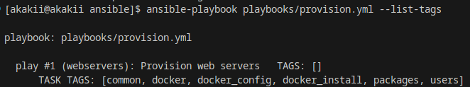
- `--tags docker`: 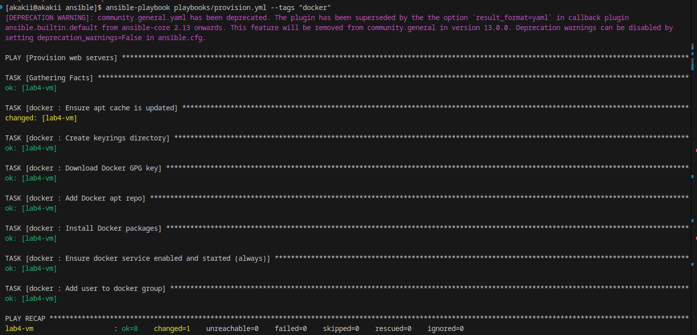
- `--tags packages`: 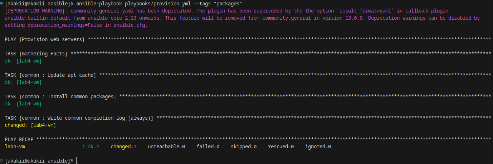
- `--tags docker_install`: 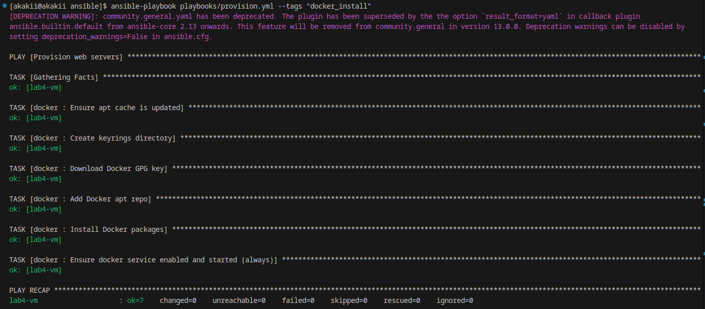
- `--skip-tags common`: 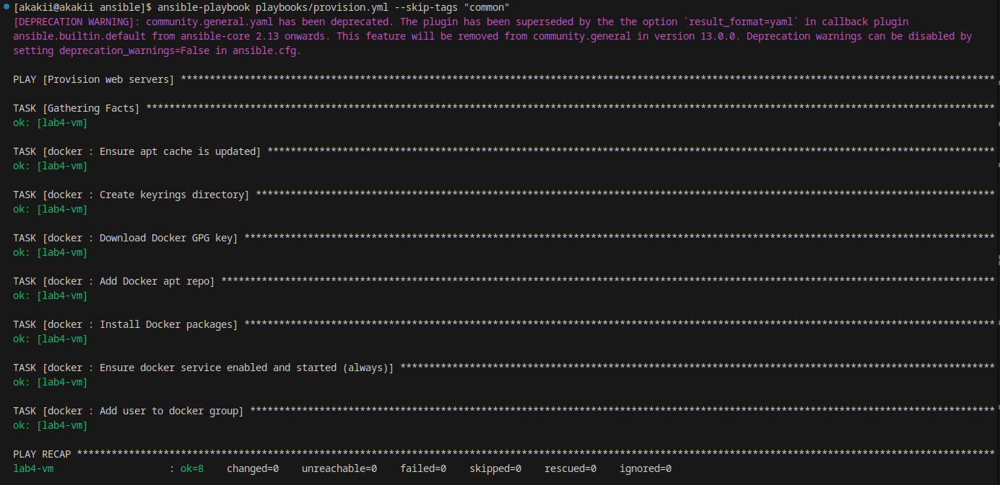

---

## 3. Task 2 — Docker Compose v2 Deployment + Role Rename (3 pts)

### 3.1 Playbooks updated to use role `web_app`
`playbooks/provision.yml`:
```yaml
---
- name: Provision web servers
  hosts: webservers
  become: true

  roles:
    - common
    - docker
```

`playbooks/deploy.yml`:
```yaml
---
- name: Deploy application
  hosts: webservers
  become: true

  roles:
    - web_app
```

### 3.2 Role: `web_app` (Docker Compose v2 deployment)
Key tasks:
- render Compose file from template
- login to Docker Hub using Vault variables
- deploy with `community.docker.docker_compose_v2`
- verify `/health` endpoint

```yaml
---
- name: Include wipe tasks
  ansible.builtin.include_tasks: wipe.yml
  tags: [web_app_wipe]

- name: Ensure compose project dir exists
  ansible.builtin.file:
    path: "{{ web_app_compose_project_dir }}"
    state: directory
    mode: "0755"
  become: true
  tags: [web_app]

- name: Render docker-compose.yml from template
  ansible.builtin.template:
    src: docker-compose.yml.j2
    dest: "{{ web_app_compose_project_dir }}/docker-compose.yml"
    mode: "0644"
  become: true
  tags: [web_app]

- name: Docker Hub login (Vault)
  community.docker.docker_login:
    username: "{{ web_app_vault_dockerhub_username }}"
    password: "{{ web_app_vault_dockerhub_token }}"
  no_log: true
  tags: [web_app]

- name: Deploy with Docker Compose v2
  community.docker.docker_compose_v2:
    project_src: "{{ web_app_compose_project_dir }}"
    pull: always
    state: present
    recreate: auto
    remove_orphans: true
  become: true
  tags: [web_app]

- name: Verify app health
  ansible.builtin.uri:
    url: "http://localhost:{{ web_app_port }}/health"
    status_code: 200
  register: web_app_health
  retries: 15
  delay: 2
  until: web_app_health.status == 200
  tags: [web_app]
```

### 3.3 Docker Compose template used
`roles/web_app/templates/docker-compose.yml.j2`:
```yaml
services:
  {{ web_app_name }}:
    image: {{ web_app_docker_image }}:{{ web_app_docker_tag }}
    container_name: {{ web_app_name }}
    ports:
      - "{{ web_app_port }}:{{ web_app_internal_port }}"
    environment:
      HOST: "0.0.0.0"
      PORT: "{{ web_app_internal_port }}"
      APP_SECRET_KEY: '{{ web_app_secret_key | to_json }}'
    restart: unless-stopped
```

**Evidence**
- Docker state after completion: 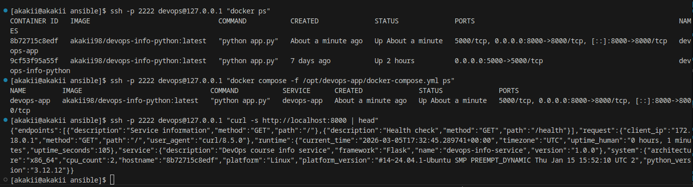
- First deploy run: 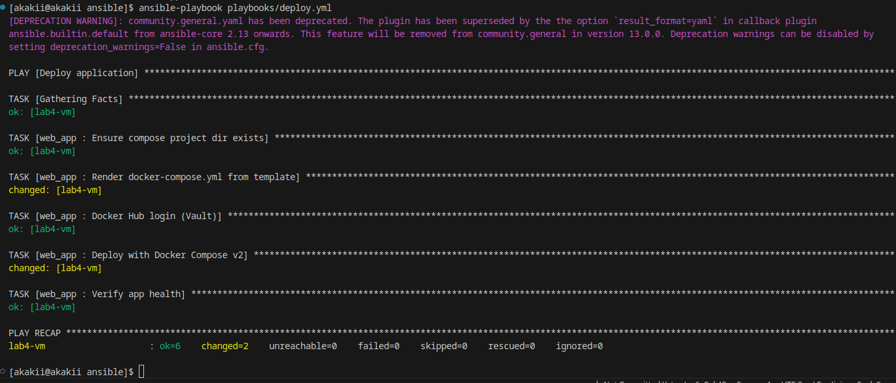
- Second deploy run (idempotency): 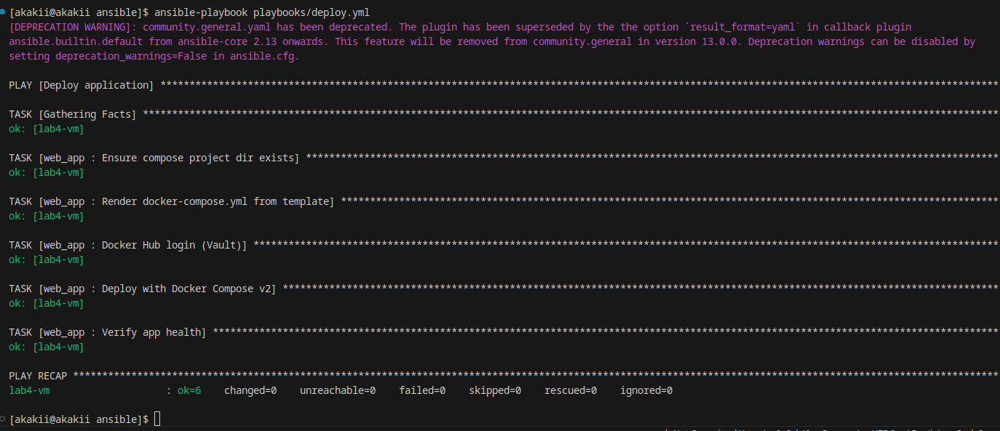

---

## 4. Task 3 — Wipe Logic (1 pt)

Wipe is protected by:
- an explicit variable `web_app_wipe=true`
- an explicit tag `--tags web_app_wipe`

`roles/web_app/tasks/wipe.yml`:
```yaml
---
- name: Wipe | stop and remove compose project
  community.docker.docker_compose_v2:
    project_src: "{{ web_app_compose_project_dir }}"
    state: absent
    remove_orphans: true
  become: true
  when: web_app_wipe | bool

- name: Wipe | remove project directory
  ansible.builtin.file:
    path: "{{ web_app_compose_project_dir }}"
    state: absent
  become: true
  when: web_app_wipe | bool
```

**Evidence**
- Deploy without wipe: 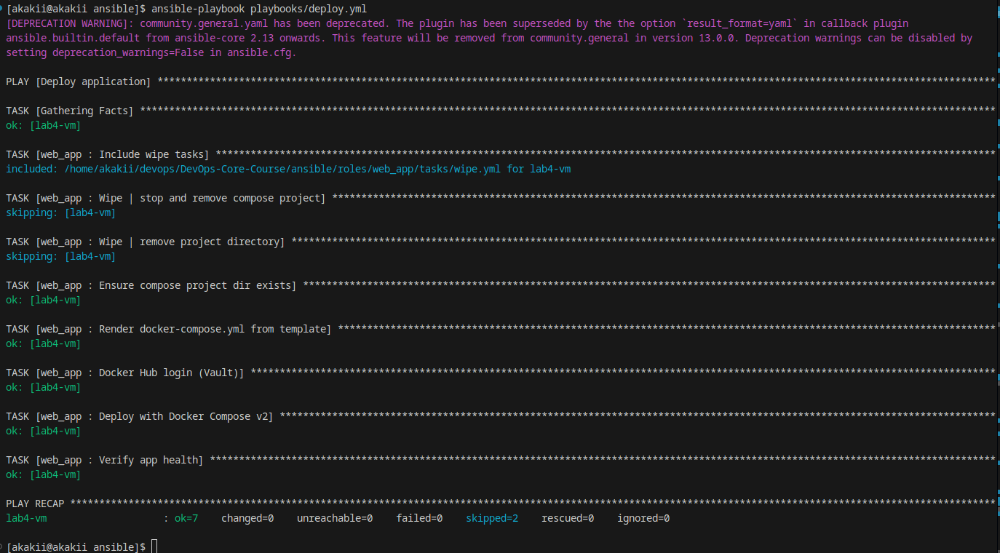
- Wipe only (tag + var): 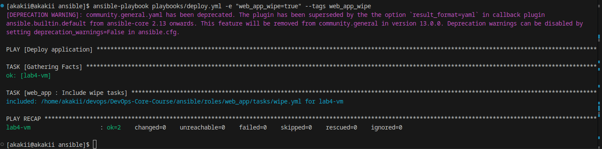
- Wipe + deploy (clean reinstall): 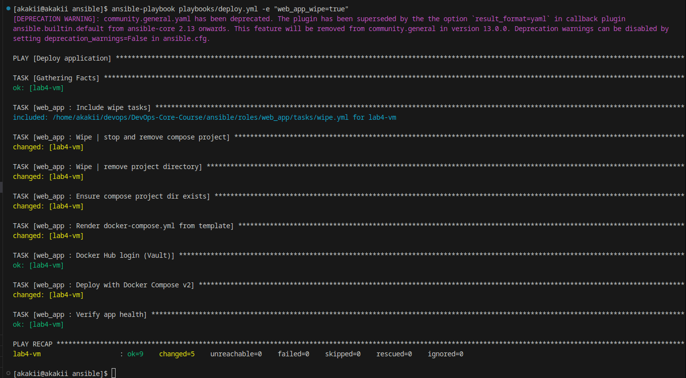

---

## 5. Task 4 — CI/CD with GitHub Actions (3 pts)

### 5.1 Why self-hosted runner is required
The managed node is a **local NAT VM**, so GitHub-hosted runners cannot connect to it via SSH.  
Deployment is performed on a **self-hosted runner installed on the VM**, and Ansible uses a **local inventory** (`ansible_connection=local`) for deployment jobs.

### 5.2 Workflow (key steps excerpt)
> The workflow is stored as `.github/workflows/ansible-deploy.yml`. Below is the essential structure (lint + deploy on self-hosted runner):

```yaml
name: Ansible Deployment

on:
  push:
    branches: [ main, master ]
    paths:
      - 'ansible/**'
      - '!ansible/docs/**'
      - '.github/workflows/ansible-deploy.yml'
  pull_request:
    branches: [ main, master ]
    paths:
      - 'ansible/**'
      - '!ansible/docs/**'

jobs:
  lint:
    runs-on: ubuntu-latest
    steps:
      - uses: actions/checkout@v4
      - uses: actions/setup-python@v5
        with:
          python-version: '3.12'
      - run: |
          pip install ansible ansible-lint
          ansible-galaxy collection install community.docker community.general
      - run: |
          echo "${{ secrets.ANSIBLE_VAULT_PASSWORD }}" > ansible/.vault_pass
          chmod 600 ansible/.vault_pass
      - run: |
          cd ansible
          ansible-lint playbooks/*.yml

  deploy:
    needs: lint
    runs-on: self-hosted
    steps:
      - uses: actions/checkout@v4
      - run: |
          echo "${{ secrets.ANSIBLE_VAULT_PASSWORD }}" > ansible/.vault_pass
          chmod 600 ansible/.vault_pass
      - run: |
          cd ansible
          ansible-playbook -i inventory/hosts.local.ini playbooks/deploy.yml
      - run: |
          curl -f http://localhost:8000/health

```

**Evidence**
- GitHub menu: add new runner: 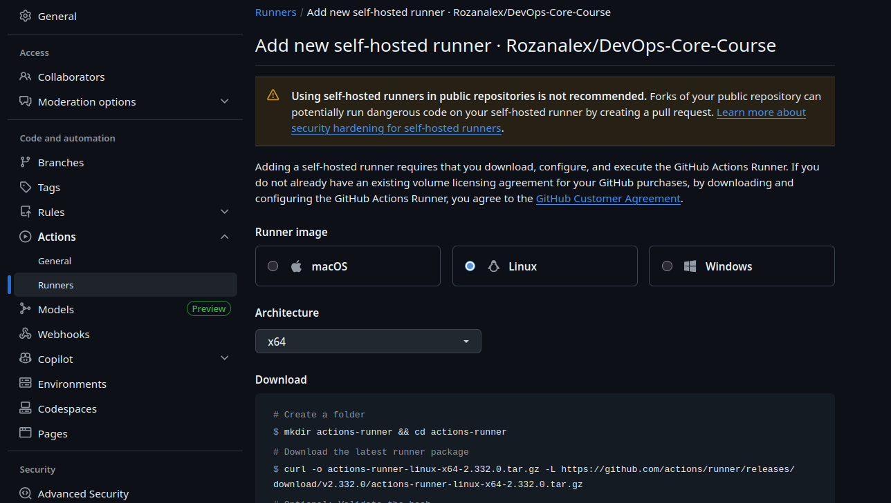
- Runner registered successfully: 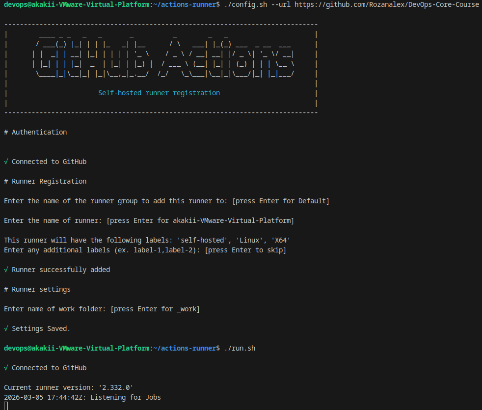
- Successful GitHub Actions run: 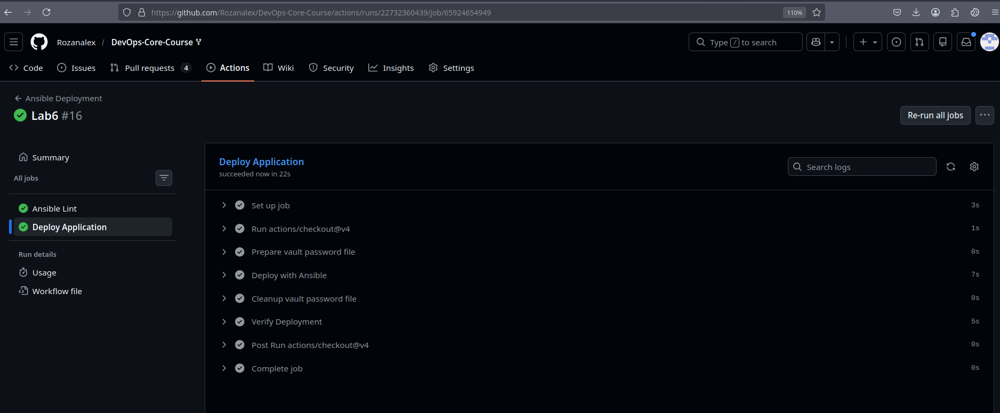

---

## 6. Completion Checklist
- [x] Task 1: blocks + tags + selective execution (`--tags`, `--skip-tags`)
- [x] Task 2: role renamed to `web_app`, deployment via Docker Compose v2, idempotency shown
- [x] Task 3: safe wipe logic (variable + explicit wipe tag)
- [x] Task 4: CI/CD implemented using a self-hosted runner on a local NAT VM
