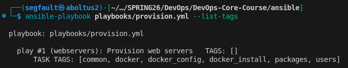
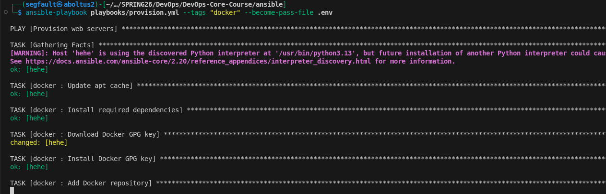

# Lab 6 — Advanced Ansible & CI/CD

### Task 1: Blocks & Tags
#### Implementation Details
In this task, I refactored Ansible roles using blocks and tags to make the playbooks easier to read and manage. Blocks were used to group related tasks together and apply common settings such as become, when, and tags. Error handling was added using rescue blocks, and always blocks were used to run tasks that should execute regardless of success or failure

#### Tag Strategy

The following tags were used:
- common – entire common role
- packages – package installation tasks
- users – user management tasks
- docker – entire docker role
- docker_install – Docker installation tasks
- docker_config – Docker configuration tasks

These tags allow specific tasks to be executed when running the playbook

#### Evidence

List all tags:
```bash
ansible-playbook playbooks/provision.yml --list-tags
```
Example output:
```bash
play #1 (webservers): Provision web servers   TAGS: []
      TASK TAGS: [common, docker, docker_config, docker_install, packages, users]
```
Run only Docker tasks:
```bash
ansible-playbook playbooks/provision.yml --tags "docker"
```
Run only package tasks:
```bash
ansible-playbook playbooks/provision.yml --tags "packages"
```
Run only Docker installation:
```bash
ansible-playbook playbooks/provision.yml --tags "docker_install"
```
Skip the common role:
```bash
ansible-playbook playbooks/provision.yml --skip-tags "common"
```

#### Tags listing



#### Second run


#### Docker-tasks execution



#### Research Answers

##### What happens if the rescue block also fails?
If the rescue block fails, the playbook will fail. However, the always section will still run

##### Can you have nested blocks?
Yes, Ansible supports nested blocks. A block can contain another block if more complex task grouping is needed

##### How do tags inherit in blocks?
Tags applied to a block are automatically applied to all tasks inside that block. This means you do not need to add the same tag to every task  

### Task 2: Upgrade to Docker Compose
#### Implementation Details

In this task, I upgraded app deployment from `docker run` to Docker Compose. Docker Compose allows the container configuration to be written in a file instead of long command-line commands. This makes deployments easier to manage, update, and reproduce

Example template:
```
version: '3.8'

services:
  {{ app_name }}:
    image: {{ docker_image }}:{{ docker_tag }}
    container_name: {{ app_name }}
    ports:
      - "{{ app_port }}:{{ app_internal_port }}"
    environment:
      APP_NAME: "{{ app_name }}"
      APP_PORT: "{{ app_internal_port }}"
    restart: unless-stopped
```

This allows the application configuration to be changed easily by modifying variables

#### Role Dependency
The testiks role depends on the docker role so Docker is installed before deploying the application

File `roles/testiks/meta/main.yml`
Example configuration:
```yml
---
dependencies:
  - role: docker
```
This ensures Docker is always installed before attempting to deploy containers

#### Before / After Comparison

##### Before
```bash
docker run -d \
-p 8000:8000 \
--name devops-app \
your_dockerhub_username/devops-info-service:latest
```

This approach requires long commands and is harder to maintain or update

##### After (Docker Compose):
```bash
services:
  devops-app:
    image: your_dockerhub_username/devops-info-service:latest
    ports:
      - "8000:8000"
    restart: unless-stopped
```
Using Docker Compose provides a declarative configuration, meaning the desired state of the container is defined in a file

Advantages of this approach:
- easier configuration management
- reusable templates with variables
- better support for multi-container setups
- simpler updates and redeployments

#### Evidence
```bash
$ ansible-playbook playbooks/deploy.yml --become-password-file .env --ask-vault-pass
Vault password: 

PLAY [Deploy application] **************************************************************************************************************

TASK [Gathering Facts] *****************************************************************************************************************
[WARNING]: Host 'hehe' is using the discovered Python interpreter at '/usr/bin/python3.12', but future installation of another Python interpreter could cause a different interpreter to be discovered. See https://docs.ansible.com/ansible-core/2.20/reference_appendices/interpreter_discovery.html for more information.
ok: [hehe]

TASK [docker : Install required system packages] ***************************************************************************************
ok: [hehe]

TASK [docker : Create keyrings directory] **********************************************************************************************
ok: [hehe]

TASK [docker : Add Docker GPG key] *****************************************************************************************************
ok: [hehe]

TASK [docker : Add Docker repository] **************************************************************************************************
ok: [hehe]

TASK [docker : Install Docker packages] ************************************************************************************************
ok: [hehe]

TASK [docker : Ensure Docker service is enabled] ***************************************************************************************
ok: [hehe]

TASK [docker : Add user to docker group] ***********************************************************************************************
ok: [hehe]

TASK [docker : Install python docker module] *******************************************************************************************
ok: [hehe]

TASK [testiks : Create application directory] ******************************************************************************************
changed: [hehe]

TASK [testiks : Template docker-compose.yml] *******************************************************************************************
changed: [hehe]

TASK [testiks : Login to Docker Hub] ***************************************************************************************************
changed: [hehe]

TASK [testiks : Start containers with Docker Compose] **********************************************************************************
changed: [hehe]

PLAY RECAP *****************************************************************************************************************************
hehe              : ok=15   changed=4    unreachable=0    failed=0    skipped=0    rescued=0    ignored=0   
```

#### Accessibility Verification
```bash
┌──(segfault㉿aboltus2)-[~/Downloads]
└─$ ssh debil@192.168.0.152
debil@192.168.0.152's password: 
Linux hehe 6.12.73+deb13-amd64 #1 SMP PREEMPT_DYNAMIC Debian 6.12.73-1 (2026-02-17) x86_64

The programs included with the Debian GNU/Linux system are free software;
the exact distribution terms for each program are described in the
individual files in /usr/share/doc/*/copyright.

Debian GNU/Linux comes with ABSOLUTELY NO WARRANTY, to the extent
permitted by applicable law.
Last login: Thu Mar  5 20:38:39 2026 from 192.168.0.145
debil@hehe:~$ docker ps
CONTAINER ID   IMAGE                 COMMAND           CREATED         STATUS         PORTS                              NAMES
d3ec91cbb47e   cacucoh/testiks:1.0   "python app.py"   4 minutes ago   Up 4 minutes   0.0.0.0:5000->5000/tcp, 8000/tcp   TESTIKS
debil@hehe:~$ 
debil@hehe:~$ curl -s http://localhost:5000/ | jq .
{
  "endpoints": [
    {
      "description": "Service information",
      "method": "GET",
      "path": "/"
    },
    {
      "description": "Health check",
      "method": "GET",
      "path": "/health"
    }
  ],
  "request": {
    "client_ip": "172.17.0.1",
    "method": "GET",
    "path": "/",
    "user_agent": "curl/8.14.1"
  },
  "runtime": {
    "current_time": "2026-03-05T20:46:09.269567+00:00",
    "timezone": "UTC",
    "uptime_human": "49 hours, 27 minutes",
    "uptime_seconds": 178058
  },
  "service": {
    "description": "DevOps course info service",
    "framework": "Flask",
    "name": "devops-info-service",
    "version": "1.0.0"
  },
  "system": {
    "architecture": "x86_64",
    "cpu_count": 1,
    "hostname": "d3ec91cbb47e",
    "platform": "Linux",
    "platform_version": "#1 SMP PREEMPT_DYNAMIC Debian 6.12.73-1 (2026-02-17)",
    "python_version": "3.12.12"
  }
}

```

### Task 4: CI/CD
#### GitHub Actions Workflow

#### Secrets
These secrets are in GitHub repository settings:
- ANSIBLE_VAULT_PASSWORD
- SSH_PK
- SERVER_IP

```yml
name: Ansible Deployment

on:
  push:
    branches: [ main, master, ci-cd ]
    paths:
      - 'ansible/**'
      - '.github/workflows/ansible-deploy.yml'
  workflow_dispatch:  # manual trigger

jobs:
  deploy:
    runs-on: ubuntu-latest
    
    steps:
    - name: Checkout code
      uses: actions/checkout@v3
      
    - name: Set up Python
      uses: actions/setup-python@v4
      with:
        python-version: '3.12'
        
    - name: Install Ansible & dependencies
      run: |
        python -m pip install --upgrade pip
        pip install ansible ansible-lint community.docker
        ansible --version
        
    - name: Create Vault password file
      run: echo "${{ secrets.ANSIBLE_VAULT_PASSWORD }}" > .vault_pass

    - name: Setup SSH key
      run: |
        mkdir -p ~/.ssh
        echo "${{ secrets.SSH_PRIVATE_KEY }}" > ~/.ssh/id_ed25519
        chmod 600 ~/.ssh/id_ed25519
        ssh-keyscan -H ${{ secrets.SERVER_IP }} >> ~/.ssh/known_hosts

    - name: Run Ansible lint
      run: |
        cd ansible
        ansible-lint playbooks/*.yml

    - name: Run Ansible deployment (full)
      run: |
        cd ansible
        ansible-playbook playbooks/deploy.yml \
          -i inventory/hosts.ini \
          --vault-password-file ../.vault_pass \
          --tags "app_deploy,compose"

    - name: Optional: Run Wipe Logic
      if: github.event.inputs.run_wipe == 'true'
      run: |
        cd ansible
        ansible-playbook playbooks/deploy.yml \
          -i inventory/hosts.ini \
          --vault-password-file ../.vault_pass \
          --tags "wipe"

    - name: Verify Application
      run: |
        sleep 10
        curl -f http://${{ secrets.SERVER_IP }}:5000 || exit 1
        curl -f http://${{ secrets.SERVER_IP }}:5000/health || exit 1
```

### Documentation