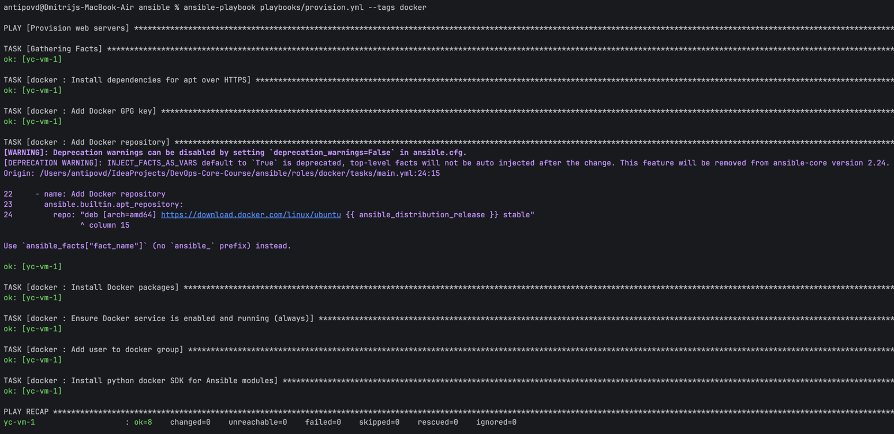
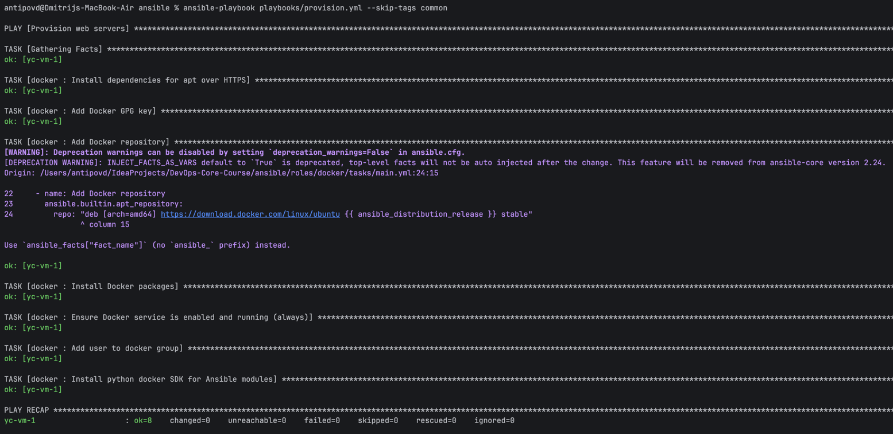
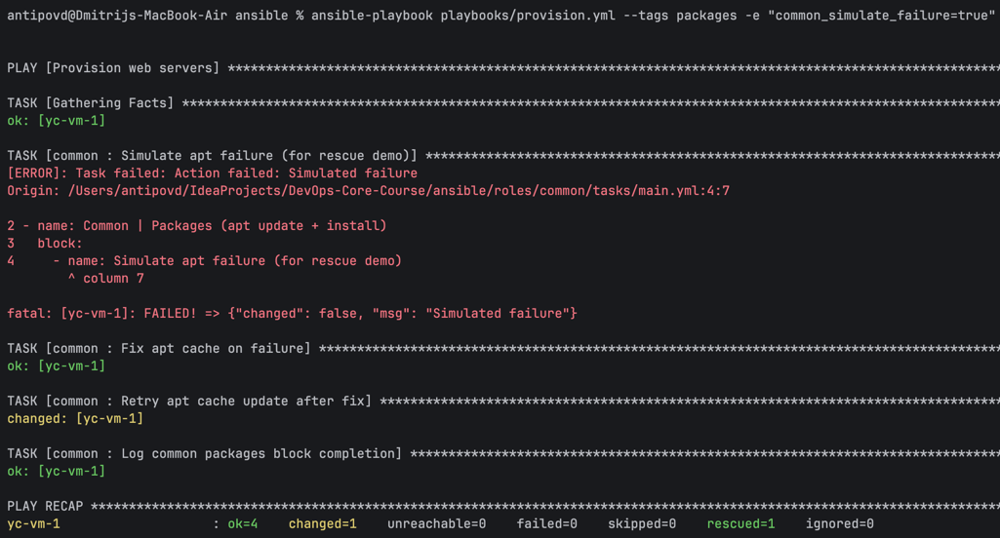
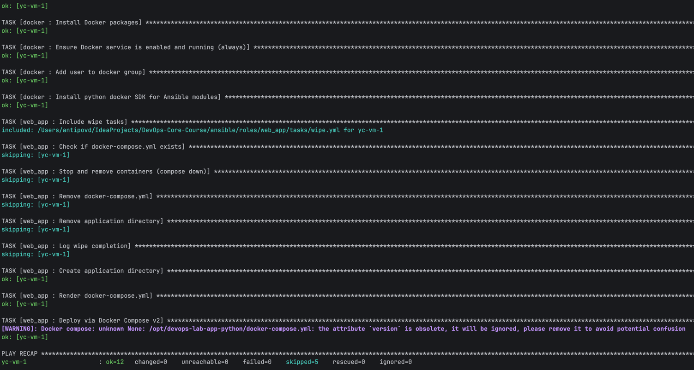
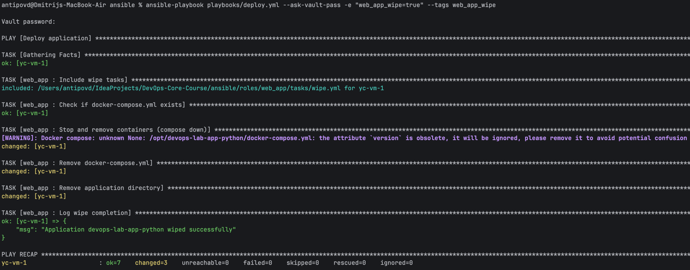
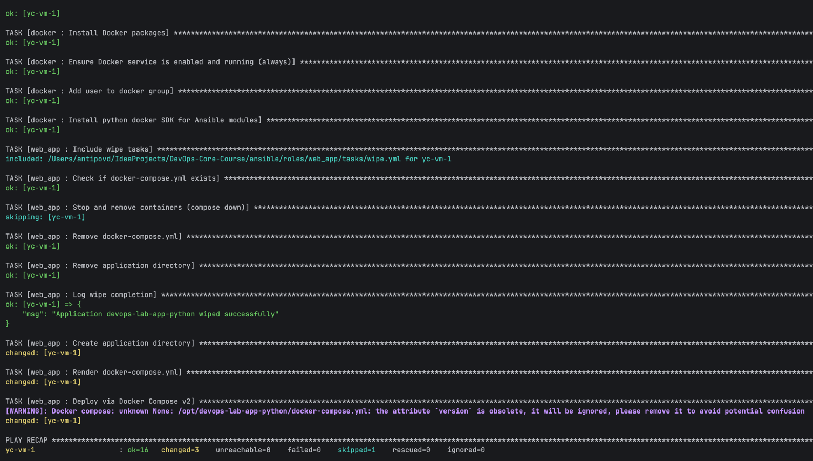
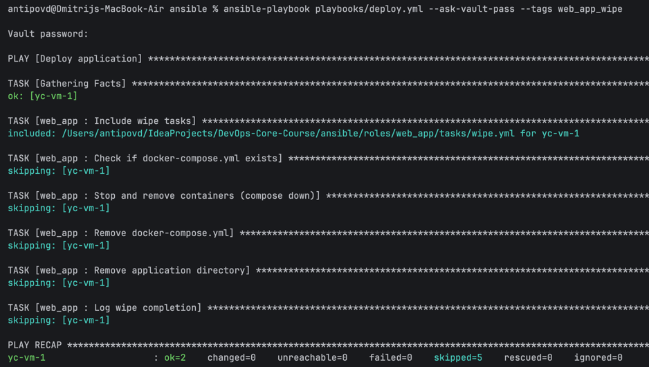
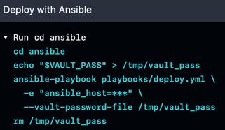
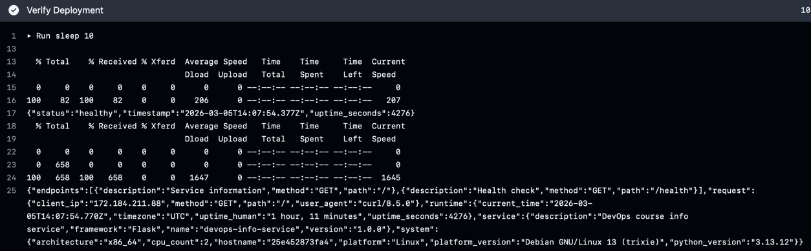

# LAB06 
## 1. Overview

### What was accomplished
In this lab I refactored Ansible roles using **blocks** and **tags**, migrated the application deployment from single-container Docker run logic to **Docker Compose**, implemented safe **wipe logic** (controlled by variable + tag), and integrated the deployment into **GitHub Actions CI/CD**.

### Technologies used
- Ansible (control node: macOS, target node: Ubuntu VM in Yandex Cloud)
- Ansible Roles, Blocks (`block/rescue/always`), Tags
- Ansible Vault for secrets
- Docker Engine on target VM
- Docker Compose via `community.docker.docker_compose_v2`
- GitHub Actions workflow for lint + deploy + verify

**Evidence**
- Ansible version: 2.20.3
- Target OS: Ubuntu 24.04.3 LTS

## 2. Blocks & Tags
### Block usage per role
#### Role: `common`
Goal: group common provisioning tasks and add error handling.
- Packages block: apt cache update + package install.
- Rescue logic: recovery if apt update fails.
- Always section: write completion marker to `/tmp` for traceability.

File(s):
- `roles/common/tasks/main.yml`

#### Role: `docker`
Goal: separate installation vs configuration and add robustness.
- docker_install block: repository, GPG key, package installation.
- Rescue logic: wait + retry on GPG key/network issues.
- Always section: ensure Docker service is enabled and running.

File(s):
- `roles/docker/tasks/main.yml`

### Tag strategy
Tags were designed to enable selective execution at role and task-group levels. Tags are inherited by tasks inside blocks, so tagging a block or role applies to all nested tasks.

Tag map
- `common` (entire `common` role)
- `packages` (package-related tasks)
- `users` (user management tasks)
- `docker` (entire `docker` role)
- `docker_install` (installation-only tasks)
- `docker_config` (configuration-only tasks)
- `app_deploy`, `compose` (web_app deployment tasks)
- `web_app_wipe` (wipe tasks only)

### Execution examples (with evidence)
1. List tags:
    ```bash
    ansible-playbook playbooks/provision.yml --list-tags
    ```
    Output:
    ```text
    playbook: playbooks/provision.yml
    
      play #1 (webservers): Provision web servers   TAGS: []
          TASK TAGS: [common, docker, docker_config, docker_install, packages, users]
    ```
2. Run only Docker role:
    
3. Skip common role:
    
4. Error handling evidence (rescue triggered)
    

## 3. Docker Compose Migration
### Why Docker Compose
Docker Compose provides a declarative configuration for container stacks (services, ports, environment variables) and makes updates reproducible by changing a single YAML file rather than repeating imperative docker run commands.

### Before vs After (high-level)
- Before: role deployed a single container using `docker_container` and manual parameters.
- After: role generates a `docker-compose.yml` from a `Jinja2` template and applies it using `community.docker.docker_compose_v2`.

### Template structure
Template file:
- `roles/web_app/templates/docker-compose.yml.j2`

### Supported variables:
- docker_compose_version
- app_name
- docker_image, docker_image_tag
- app_port, app_internal_port
- web_app_env (environment map)

### Role rename and updated references
- Renamed role directory from app_deploy to web_app
- Updated playbooks and docs to reference web_app

### Role dependencies (Docker before App)
Role dependency file:
- `roles/web_app/meta/main.yml`

This ensures Docker is installed before the application deploy runs, even when running only the `web_app` role.

## 4. Wipe Logic
### Purpose
Wipe logic allows clean removal of the deployed application for fresh reinstallations, testing from a clean state, and safe decommissioning.

### Safety mechanism: variable + tag
Wipe tasks are gated by:
- a boolean variable web_app_wipe: false by default
- a dedicated tag web_app_wipe

This “double safety” prevents accidental deletion during normal runs.

### Implementation details
Files:
- `roles/web_app/defaults/main.yml` (contains web_app_wipe: false)
- `roles/web_app/tasks/main.yml` (includes wipe tasks first)
- `roles/web_app/tasks/wipe.yml` (actual wipe implementation)

### Test results (all 4 scenarios)
1. Scenario 1: Normal deployment (wipe must NOT run)
    ```bash
    ansible-playbook playbooks/deploy.yml --ask-vault-pass
    ```
    
2. Scenario 2: Wipe only
    ```bash
    ansible-playbook playbooks/deploy.yml --ask-vault-pass -e "web_app_wipe=true" --tags web_app_wipe
    ```
    
3. Scenario 3: Clean reinstall (wipe → deploy)
    ```bash
    ansible-playbook playbooks/deploy.yml --ask-vault-pass -e "web_app_wipe=true"
    ```
    
4. Scenario 4: Tag specified but variable false (wipe should NOT run)
    ```bash
    ansible-playbook playbooks/deploy.yml --ask-vault-pass --tags web_app_wipe
    ```
    

## 5. CI/CD Integration
### Workflow architecture
Pipeline:
- Checkout code
- Install Ansible + collections
- Run ansible-lint
- Deploy playbook
- Verify application with curl (timeouts)

### Setup steps
Created GitHub Secrets:
- ANSIBLE_VAULT_PASSWORD
- SSH_PRIVATE_KEY
- VM_HOST

### Vault handling in CI
Because `group_vars/all.yml` is encrypted, CI must provide a vault password file (non-interactive). Otherwise Ansible (and ansible-lint syntax-check) fails with “Attempting to decrypt but no vault secrets found”.


### Verification step (timeouts)
To avoid hanging requests, health checks use --max-time.

Commands used:
```bash
curl -f --max-time 15 http://${{ secrets.VM_HOST }}:5000/health
curl -f --max-time 15 http://${{ secrets.VM_HOST }}:5000/
```


## 6. Testing Results
### Idempotency verification
- Provision:
    ```text
    --- first execution ansible-playbook playbooks/provision.yml --ask-vault-pass
    PLAY RECAP ***************************************************************************************************************************************************************************************************
    yc-vm-1                    : ok=13   changed=2    unreachable=0    failed=0    skipped=0    rescued=0    ignored=0   
    --- second execution ansible-playbook playbooks/provision.yml --ask-vault-pass
    PLAY RECAP ***************************************************************************************************************************************************************************************************
    yc-vm-1                    : ok=13   changed=0    unreachable=0    failed=0    skipped=0    rescued=0    ignored=0   
    ```
- Deploy:
    ```text
    --- first execution ansible-playbook playbooks/deploy.yml --ask-vault-pass
    PLAY RECAP ***************************************************************************************************************************************************************************************************
    yc-vm-1                    : ok=12   changed=2    unreachable=0    failed=0    skipped=4    rescued=0    ignored=0   
    --- second execution ansible-playbook playbooks/deploy.yml --ask-vault-pass
    PLAY RECAP ***************************************************************************************************************************************************************************************************
    yc-vm-1                    : ok=12   changed=0    unreachable=0    failed=0    skipped=4    rescued=0    ignored=0   
    ```

### Application accessibility
From local machine (or runner):

```bash
curl http://93.77.189.124:5000/health
curl http://93.77.189.124:5000
```
Outputs:
```text
{"status":"healthy","timestamp":"2026-03-05T15:30:06.698Z","uptime_seconds":1227}
{
    "endpoints":[
        {
            "description":"Service information",
            "method":"GET",
            "path":"/"
        },
        {
            "description":"Health check",
            "method":"GET",
            "path":"/health"
        }
    ],
    "request":{
        "client_ip":"46.191.225.28",
        "method":"GET",
        "path":"/",
        "user_agent":"curl/8.7.1"
    },
    "runtime":{
        "current_time":"2026-03-05T15:30:11.303Z",
        "timezone":"UTC",
        "uptime_human":"0 hours, 20 minutes",
        "uptime_seconds":1231
    },
    "service":{
        "description":"DevOps course info service",
        "framework":"Flask",
        "name":"devops-info-service",
        "version":"1.0.0"
    },
    "system":{
        "architecture":"x86_64",
        "cpu_count":2,
        "hostname":"fc83cad57258",
        "platform":"Linux",
        "platform_version":"Debian GNU/Linux 13 (trixie)",
        "python_version":"3.13.12"
    }
}
```

## 7. Challenges & Solutions
### Challenge 1: Vault variables undefined / decryption errors
- Problem: vaulted variables were not available when no vault secrets were provided, especially in CI and ad-hoc commands.
- Solution: provide vault password via `ANSIBLE_VAULT_PASSWORD_FILE` (CI).

### Challenge 2: ansible-lint formatting and rules
- Problem: failures due to YAML formatting (truthy values, brackets spacing), missing play names, and disallowed patterns (ignore_errors).
- Solution: normalize YAML (`true`/`false`, no spaces in []), name all plays, replace ignore_errors with conditions (stat + when) or failed_when, and apply `# noqa` only when justified.

### Challenge 3: Docker Compose variable naming
- Problem: missing variables (e.g., `docker_tag`) caused template rendering to fail.
- Solution: define defaults in role defaults and use consistent naming (`web_app_*` prefix inside role).

## 8. Research Answers
### Blocks & Tags
- Q: What happens if rescue block also fails?

    If both the main block and the rescue tasks fail, the play fails; always still runs.

- Q: Can you have nested blocks?

    Yes, blocks can be nested to model complex logic and multi-level error handling.

- Q: How do tags inherit to tasks within blocks?

    Tags applied at block/play/role level are inherited by tasks inside the block; tag selection also affects rescue/always execution depending on what is tagged. 

### Docker Compose
- Q: Difference between restart: always and unless-stopped?

    always restarts a container regardless of manual stops, while unless-stopped restarts except when the container was explicitly stopped by the user.

- Q: How do Docker Compose networks differ from default bridge networks?

    Compose creates project-scoped networks and service-level DNS by default, enabling service discovery by name inside the compose project, while the default bridge is a generic Docker network.

- Q: Can you reference Ansible Vault variables in the template?

    Yes. Vault-encrypted variables are decrypted at runtime (when vault secret is provided) and can be used like normal variables inside Jinja2 templates. 

### Wipe Logic
- Q: Why use both variable AND tag?

    This is a double safety mechanism: even if someone runs the deploy playbook, wipe will not run unless explicitly enabled and/or targeted.

- Q: Difference between the special “never” tag and this approach?

    This approach does not rely on never; instead it enforces explicit intent via conditions and tags, which is easier to reason about and test in CI.

- Q: Why must wipe logic come before deployment in main.yml?

    To support the clean reinstall workflow: remove old deployment first, then apply the new desired state.

- Q: When would you want clean reinstall vs rolling update?

    Clean reinstall is useful for testing and eliminating drift; rolling updates are preferred for minimizing downtime in production.

- Q: How to extend wipe to images/volumes?

    Add optional tasks to remove images and volumes (gated by additional variables/tags) to avoid accidental data loss.