# Lab 6: Advanced Ansible & CI/CD

**Name:** egrapa\
**Date:** 2026-03-05\
**Lab Points:** 10 + 0 bonus

------------------------------------------------------------------------

# Overview

In this lab I extended the Ansible automation from the previous
assignment and implemented several production-style improvements:

-   refactoring roles using blocks, rescue and always
-   adding tags for selective execution
-   migrating container deployment from docker run to Docker Compose
-   implementing safe wipe logic for clean reinstallation
-   integrating CI/CD with GitHub Actions

The infrastructure is deployed to a cloud VM and managed through Ansible
playbooks.

------------------------------------------------------------------------

# Task 1 --- Blocks & Tags

## Implementation

The provisioning roles were refactored to use Ansible blocks for
grouping related tasks and applying shared directives.

### common role

`roles/common/tasks/main.yml` now contains two main blocks.

**packages block**

-   installs required packages
-   runs with `become: true`
-   tagged with `packages`
-   includes rescue logic for apt cache failures

If updating the apt cache fails, a rescue step runs:

    apt-get update --fix-missing

The block also includes an `always` section that writes a log file:

    /tmp/common_packages.log

------------------------------------------------------------------------

### users block

User management tasks were grouped into a separate block:

-   tagged `users`
-   loops through `common_users`
-   allows configurable shell and groups

------------------------------------------------------------------------

### docker role

Docker installation was split into two blocks.

**docker_install**

-   install prerequisites
-   add Docker repository
-   install Docker packages

**docker_config**

-   configure Docker group
-   add user to docker group

The install block includes a rescue section that retries the apt update
if the Docker GPG key download fails.

------------------------------------------------------------------------

# Evidence --- Tag System

### List available tags

Command executed:

``` bash
ansible-playbook playbooks/provision.yml --list-tags
```

**Output**

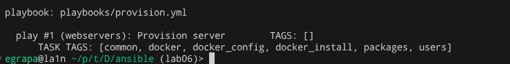

------------------------------------------------------------------------

### Selective execution of docker tasks

Command executed:

``` bash
ansible-playbook playbooks/provision.yml --tags docker --list-tasks
```

**Output**

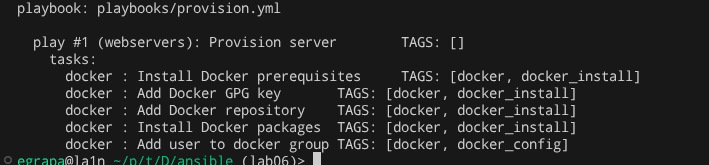

------------------------------------------------------------------------

# Task 2 --- Docker Compose Migration

## Role Refactoring

The role `app_deploy` was renamed to **web_app**.

Reasons:

-   clearer role purpose
-   easier extension for future services
-   consistent naming for wipe logic

------------------------------------------------------------------------

## Docker Compose Template

A template was created:

    roles/web_app/templates/docker-compose.yml.j2

Example structure:

    services:
      {{ app_name }}:
        image: {{ docker_image }}:{{ docker_tag }}
        ports:
          - "{{ app_port }}:{{ app_internal_port }}"
        restart: unless-stopped

Variables are defined in `group_vars/all.yml`.

------------------------------------------------------------------------

# Deployment Evidence

### Syntax validation

Command executed:

``` bash
ansible-playbook playbooks/deploy.yml --syntax-check
```

Output:

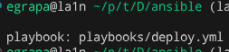

------------------------------------------------------------------------

### Deployment run

Command executed:

``` bash
ansible-playbook playbooks/deploy.yml
```

Output:
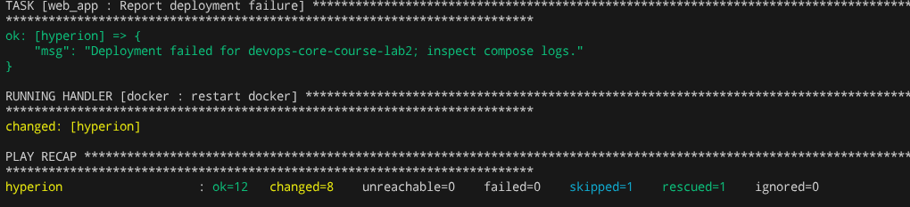
Failed because of
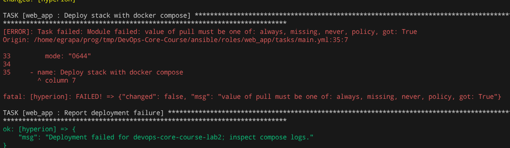
So I changed and ran again
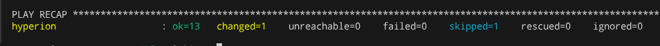

(Had to fix a docker compose file, since I used legacy legacy option)

------------------------------------------------------------------------

### Idempotency verification

Look at prev run - only the fixed part changed

------------------------------------------------------------------------

### Container verification

Command executed on the VM:

``` bash
docker ps
```

Output:
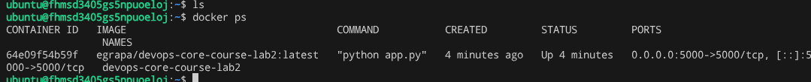

------------------------------------------------------------------------

### Application accessibility

Command executed:

``` bash
curl http://VM_IP:5000
```

Output:
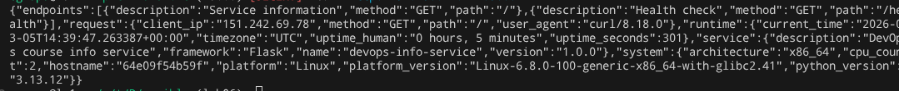

------------------------------------------------------------------------

# Task 3 --- Wipe Logic

## Implementation

The wipe logic allows removing the deployed application safely.

The mechanism uses two conditions:

1.  variable ```web_app_wipe=true```

2.  tag ```web_app_wipe```

Both must be provided for wipe-only runs.

------------------------------------------------------------------------

# Wipe Logic Testing

## Scenario 1 --- Normal deployment

Command:

    ansible-playbook playbooks/deploy.yml

Result:

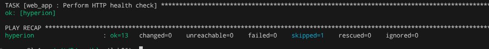

------------------------------------------------------------------------

## Scenario 2 --- Wipe only

Command:

    ansible-playbook playbooks/deploy.yml -e "web_app_wipe=true" --tags web_app_wipe

Output:

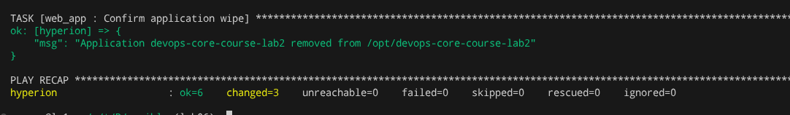

------------------------------------------------------------------------

## Scenario 3 --- Clean reinstall

Command:

    ansible-playbook playbooks/deploy.yml -e "web_app_wipe=true"

Output:
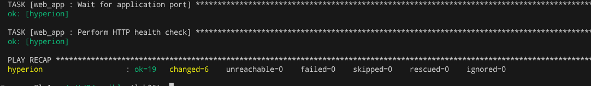

------------------------------------------------------------------------

# Task 4 --- CI/CD with GitHub Actions

## Workflow Overview

Workflow file:

    .github/workflows/ansible-deploy.yml

Pipeline steps:

1.  checkout repository
2.  install Ansible
3.  run ansible-lint
4.  run deployment playbook
5.  verify application with curl

------------------------------------------------------------------------

# CI/CD Evidence

### ansible-lint execution


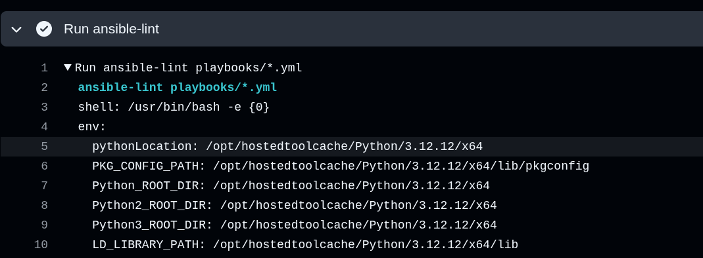

------------------------------------------------------------------------

### Workflow run screenshot

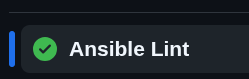

------------------------------------------------------------------------

### Deployment
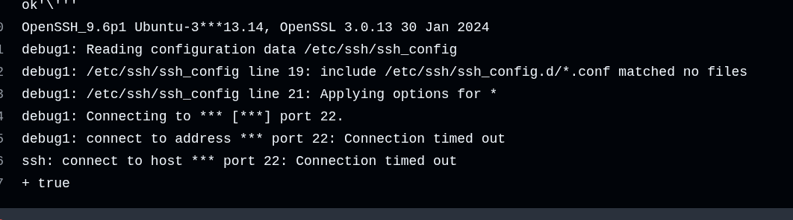
Unfortunetly my server is not reachable from github runner, so I guess I will have fail for Deployment CI state, sorry:(

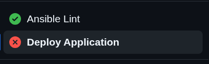

------------------------------------------------------------------------

# Challenges

Temporary directory permission issue with Ansible:

    ANSIBLE_LOCAL_TEMP=/tmp

Role rename required updating playbooks and variable references.

Docker compose module required installing `community.docker` collection.

Server IP block from github runner

------------------------------------------------------------------------

# Summary

In this lab I improved the infrastructure automation by introducing:

-   block-based task organization
-   tag-based selective execution
-   Docker Compose deployment
-   wipe logic for clean reinstall
-   CI/CD automation with GitHub Actions

These changes improve maintainability, reliability and reproducibility
of the deployment process.

------------------------------------------------------------------------

**Time spent:** \~5 hours\
**Main learning outcome:** deeper understanding of Ansible execution
control, Docker Compose automation and CI/CD integration.