# Lab 6: Advanced Ansible & CI/CD - Submission

**Name:** Sergey Aitov
**Date:** 2026-03-05  
**Lab Points:** 10 + 0 bonus  

---

## Task 1: Blocks & Tags (2 pts)
### Implementation
**1. Role `common`**
- Tasks are divided into logical blocks:
    - **Packages**: APT cache update + package installation (tag `packages`)
    - **Users**: user/group/SSH key creation (tag `users`)
- Added error handling for APT cache updates:
    - If an error occurs, `apt-get update --fix-missing` is executed in `rescue`
- In `always`, a log is created in `/tmp` so that the completion of the block is visible

**2. Role `docker`**
- Tasks are divided into blocks:
    - **docker_install**: Installing a repository/packages/SDK (tag `docker_install`)
    - **docker_config**: Post-configuration (docker group, adding a user) (tag `docker_config`)
- Added `rescue` for network/temporary errors (wait + retry)
- `always` ensures the docker service is enabled/startedr

**3. Tags**
- The following strategy is used:
    - `common` / `docker` — role-level tags
    - `packages`, `users`, `docker_install`, `docker_config` — dotted tags on blocks

### Results
1. Only docker
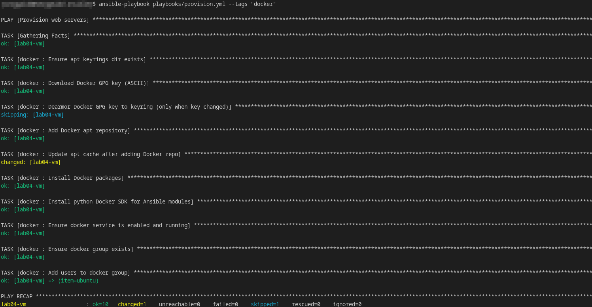
2. Skip common

3. Only packages from common
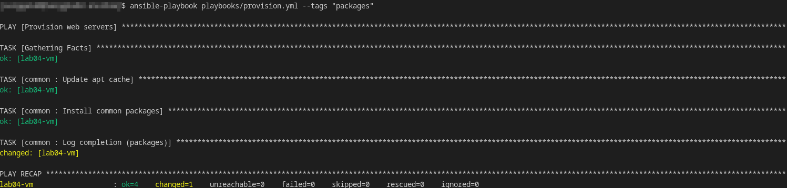
4. Check-mode for docker
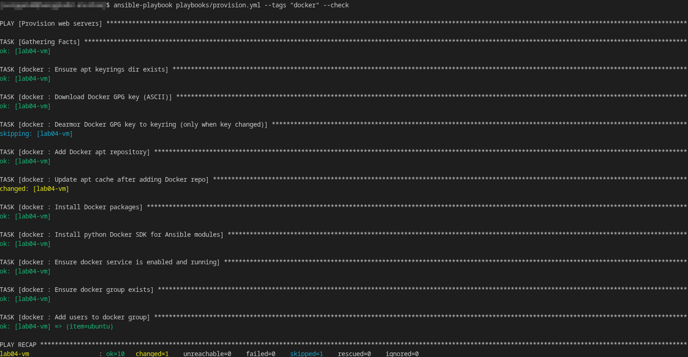
5. Only docker install
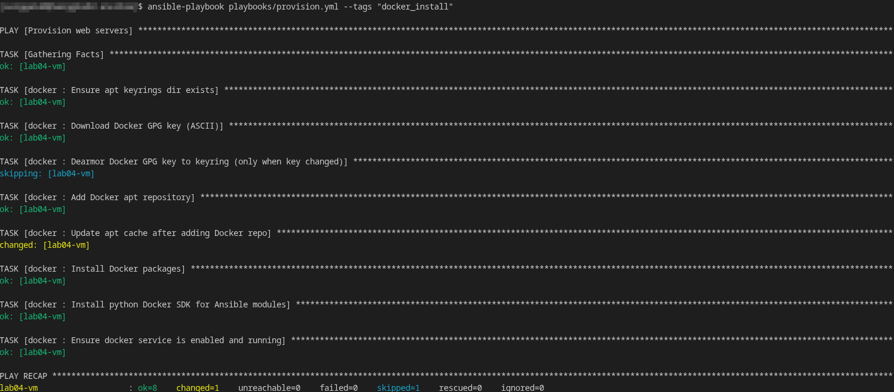
6. `rescue` triggered (error/retry) 
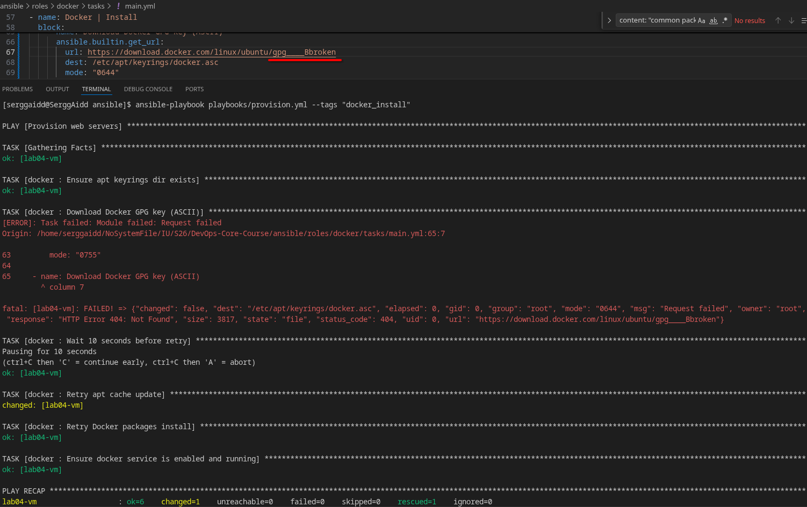

### Research answers:
**What happens if rescue block also fails?**  
If an error occurs within `rescue` (and isn't handled), the playbook will fail at the `rescue` task. However, the `always` section will still be executed (if defined), and then play execution will terminate with an error.

**Can you have nested blocks?**  
Yes. You can use another block inside a block (nesting is allowed). This is convenient when you need to "group groups" and apply different rescue/always statements at different levels, but it shouldn't be overused—it reduces readability.

**How do tags inherit to tasks within blocks?**  
Tags set at the block level apply to all tasks within the block (and to `rescue/always`). However, a task can have its own tags; in these cases, they are "added" to the inherited tags.

---

## Task 2: Docker Compose (3 pts)

### Implementation
**Migration from `docker_container` to Docker Compose v2**
- The `app_deploy` role has been renamed to **`web_app`**
- Added the `roles/web_app/templates/docker-compose.yml.j2` template
- Deployment is performed via `community.docker.docker_compose_v2`
- Added a role dependency: `roles/web_app/meta/main.yml` → depends on the `docker` role

### Template (docker-compose.yml.j2)
- service named `{{ app_name }}`
- `image: {{ docker_image }}:{{ docker_tag }}`
- `ports: "{{ app_port }}:{{ app_internal_port }}"`
- `environment:` is generated as a mapping (if variables are present)
- `restart: unless-stopped`

### Role dependence
`roles/web_app/meta/main.yml` ensures that Docker is installed before deploying the application, even if you only run `deploy.yml`.

### Before/After
- **Before (Lab 5):** `docker_login` + `docker_image` + `docker_container`
- **After (Lab 6):**
    - Project directory: `/opt/{{ app_name }}`
    - Generating `docker-compose.yml`
    - `docker_compose_v2: state: present, pull: always`

### Evidence
- First deploy:  
  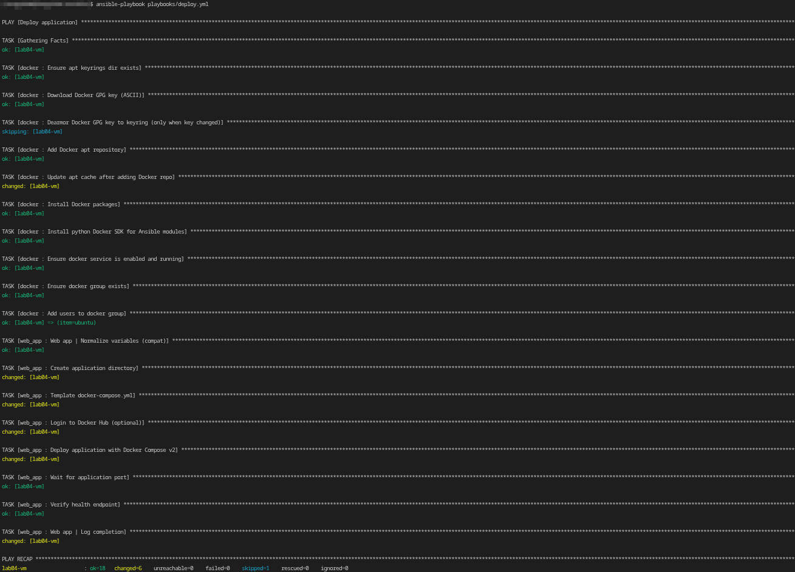
- Second deploy (idempotency):  
  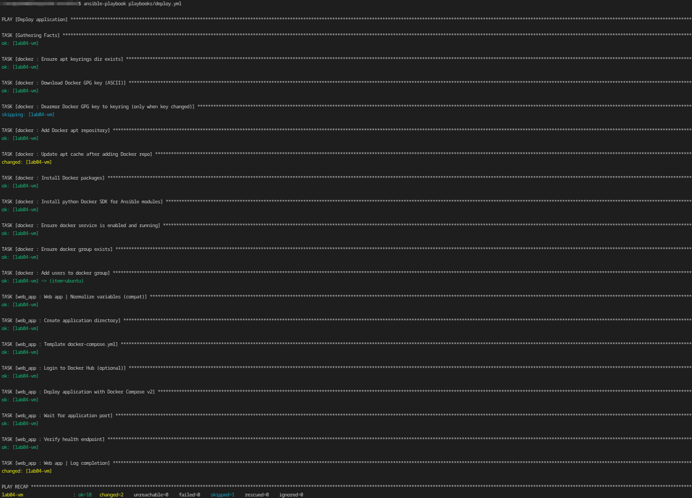
- Checking on VM:  
  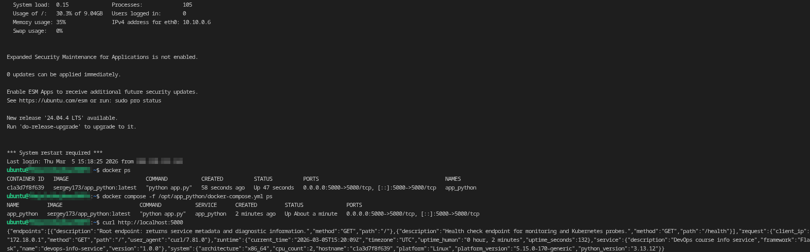

---

## Task 3: Wipe Logic (1 pt)

### Implementation
1. Made the wipe "two-factor":
- **Variable-gate:** `web_app_wipe: false` by default
- **Tag-gate:** Wipe metrics only when `--tags web_app_wipe`

2. File: `roles/web_app/tasks/wipe.yml`
- Check for the existence of the project directory (`stat`)
- `docker_compose_v2 state: absent` (only if the directory exists)
- Delete `docker-compose.yml` and the project directory
- Log in `/tmp/web_app_wipe_done.log`

3. File: `roles/web_app/tasks/main.yml`
- `include_tasks: wipe.yml` is at the very beginning before deployment

### Test scenarios

**Scenario 1:**
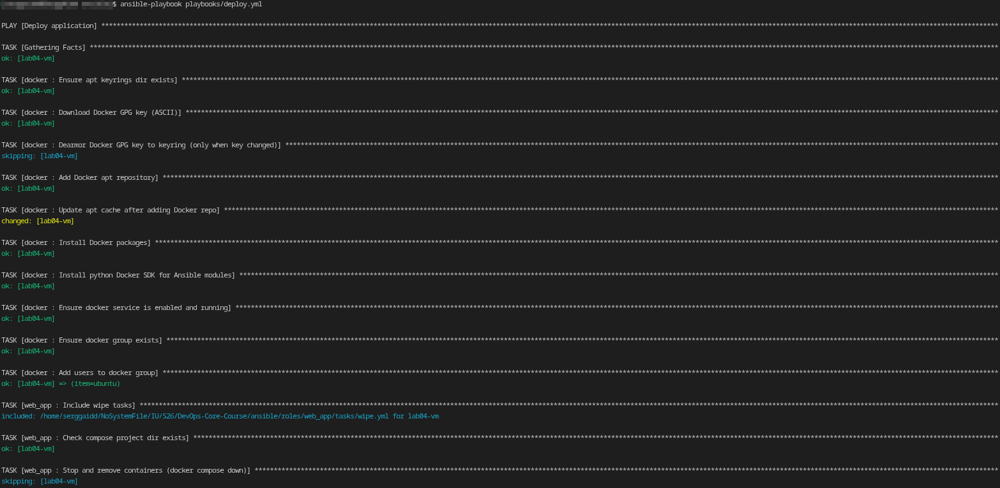
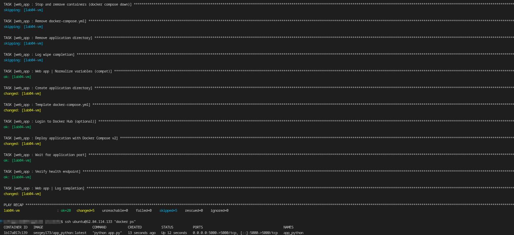

**Scenario 2:**
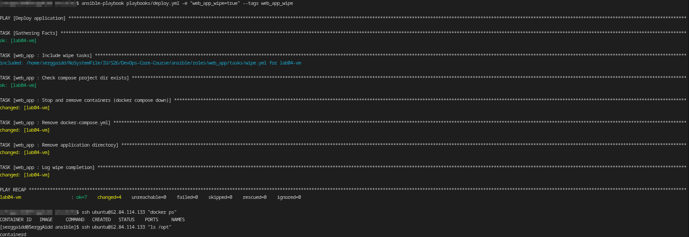

**Scenario 3:**
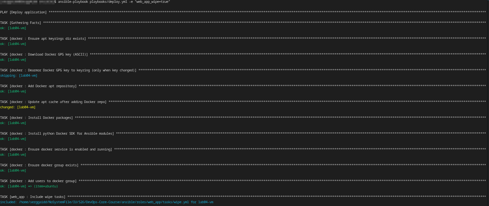
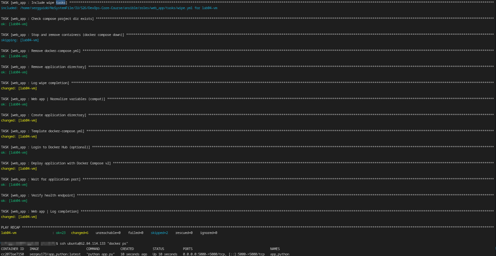

**Scenario 4:**
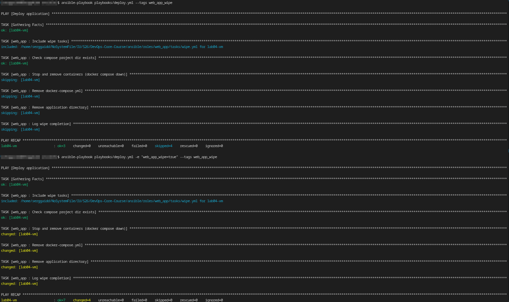

### Research answers

1. **Why use both variable AND tag?**  
This is "double protection" against accidental deletion: even if someone forgets and sets the variable, without the tag, wipe will not occur; and vice versa - even if someone runs `--tags web_app_wipe`, as long as the variable is false, wipe will not occur.

2. **What's the difference between `never` tag and this approach?**  
`never` completely blocks tasks unless `--tags never` (or the combined variants) is explicitly specified, but this is a more "magical" mechanism. The variable+tag approach is transparent and manageable: the logic in `when` + tag is easier to explain and document.

3. **Why must wipe logic come BEFORE deployment in main.yml?**  
To support the "clean reinstall" scenario with a single run: wipe cleans the old installation, then deploys from scratch. If wipe is run afterward, the newly deployed application will be deleted.

4. **When would you want clean reinstallation vs. rolling update?**  
- Clean reinstall: a complete configuration/structure overhaul, "fixing" drift, and removing junk/broken artifacts.
- Rolling update: when it's important to avoid downtime and you can update gradually.

5. **How would you extend this to wipe Docker images and volumes too?**  
Add additional tasks:
- `docker image rm ...` (or `community.docker.docker_image state: absent`)
- removing volumes/networks in compose (`docker_compose_v2 state: absent` + `remove_volumes: true` if necessary)
- neat whitelist by name (to avoid deleting other people's images/volumes)

---

## Task 4: CI/CD (3 pts)

### Implementation
Implemented GitHub Actions workflow `.github/workflows/ansible-deploy.yml` (Approach B: GitHub-hosted runner + SSH):
- Trigger:
    - `push` to branches `main/master/lab*`
    - changes in `ansible/**`, except `ansible/docs/**`
- Jobs:
    - **lint**: `ansible-lint` (uses `ansible/.ansible-lint`)
    - **deploy**:
        - YC CLI installation
        - auth setup via Service Account key
        - dynamic inventory via `ansible/inventory/yandex_cloud.py`
        - SSH key from GitHub Secrets
        - `ansible-playbook playbooks/deploy.yml`
        - `curl` check `/health` and `/`

### Secrets (use in GitHub → Settings → Secrets and variables → Actions)

- `ANSIBLE_VAULT_PASSWORD`
- `SSH_PRIVATE_KEY` (without passphrase)
- `YC_SERVICE_ACCOUNT_KEY_JSON`
- `YC_CLOUD_ID`
- `YC_FOLDER_ID`
- `YC_ZONE`

### Evidence
- Successful run workflow:  
  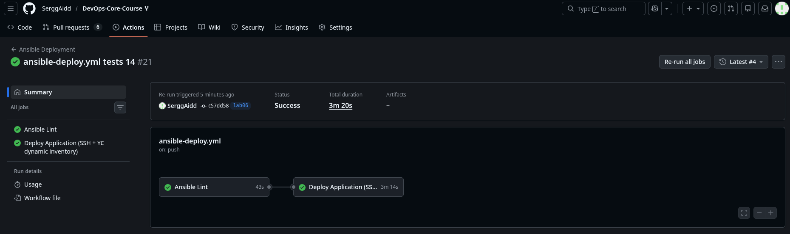
- ansible-lint passed:  
  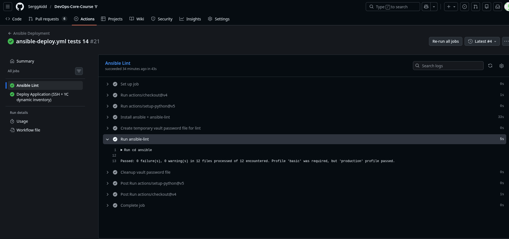

- ansible-playbook execution:  
  

- verify (app responding):  
  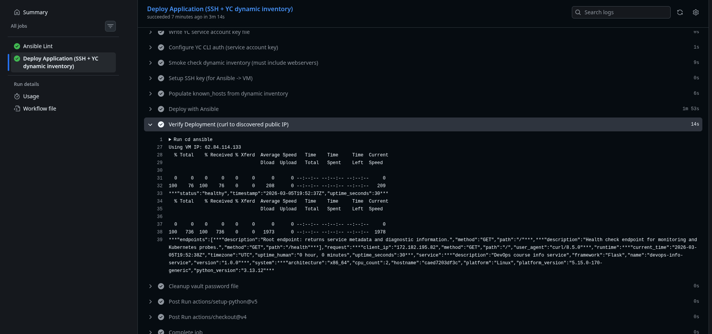

### Research answers

1) **What are the security implications of storing SSH keys in GitHub Secrets?**  
- If a repository/Actions is compromised, a key can be accessed through a workflow if it is registered insecurely or used in action components.
- Key permissions must be minimal (a separate key for CI), rotation must be enabled, output must be disabled (`no_log`/do not print criteria), and access to secrets must be restricted.

2) **How would you implement a staging → production deployment pipeline?**  
- Two environments (two inventories/vars), two jobs (or two workflows):
    - PR/merge -> deploy to staging -> tests/verify
    - manual approval (environment protection) -> deploy to production
- Separate variables/secrets at the GitHub Environments level.

3) **What would you add to make rollbacks possible?**  
- Image versioning: deploy a specific `docker_tag` (e.g., via git sha).
- A separate rollback playbook/tag that deploys the previous tag.
- Store the "last successful" tag in the artifact/labels registry.

4) **Почему self-hosted runner безопаснее**  
- No need to open SSH to the outside (deploy locally).
- Fewer secrets in the workflow (SSH keys can be removed).
- Control over the environment, network, and access (runner inside the perimeter).
---

---

## Bonus Part 1: Multi-App (1.5 pts)

Not implemented.

---

## Bonus Part 2: Multi-App CI/CD (1 pt)

Not implemented.

---

## Summary

**Results:** Implemented advanced Ansible practices (blocks/tags), deployed via Docker Compose v2, performed a secure wipe, and automated deployment via GitHub Actions with dynamic YC inventory.

**Total time spent:** ~8 hours (role refactoring, migration to Compose, debugging wipe and CI/CD).

**Key learnings:**
- blocks/rescue/always as a "failover framework" in playbooks
- tags as a way to fine-tune debugging and safely launch dangerous operations
- Docker Compose as a declarative deployment and simplified maintenance
- practical CI/CD integration: vault, secrets, dynamic inventory, verify checks
