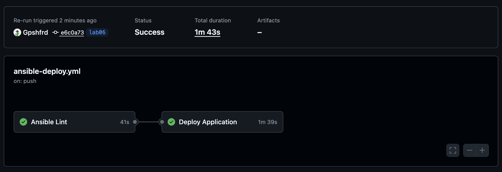

# Lab 6: Advanced Ansible & CI/CD - Submission

## Overview

In this lab, I:

- Refactored Ansible roles using blocks, rescue/always, and tags for flexible task management and error handling.
- Migrated deployment to Docker Compose with a Jinja2 template.
- Implemented safe wipe logic with double gating (variable + tag).
- Set up CI/CD with GitHub Actions for automated deployment.
- Tested all scenarios and included real outputs as evidence.

**Tech stack:** Ansible 2.16+, Docker Compose v2, GitHub Actions, Jinja2, Ansible Vault.

---

## Task 1: Blocks & Tags (2 pts)

### Implementation

- In the `common` role, package installation tasks are grouped in a block with the `packages` tag; user management tasks are in a block with the `users` tag (commented example).
- In the `docker` role, Docker installation tasks are in a block with the `docker_install` tag, configuration tasks in a block with the `docker_config` tag.
- Rescue blocks are used for error handling, always blocks for finalization.
- Tags allow selective execution of tasks.

#### Example block (roles/common/tasks/main.yml):

```yaml
- name: Install common packages with error handling
  block:
      - name: Update apt cache
        apt:
            update_cache: yes
            cache_valid_time: 3600
      - name: Install common packages
        apt:
            name: "{{ common_packages }}"
            state: present
  rescue:
      - name: "Rescue: Fix apt cache issues"
        ansible.builtin.apt:
            update_cache: yes
        become: true
        tags:
            - packages
  always:
      - name: Log package installation completion
        ansible.builtin.file:
            path: /tmp/common_packages_done
            state: touch
        tags:
            - packages
  become: true
  tags:
      - packages
      - common
```

#### Example block (roles/docker/tasks/main.yml):

```yaml
- name: Docker installation block
  become: true
  tags:
      - docker_install
      - docker
  block:
      - name: Add Docker GPG key
        apt_key:
            url: https://download.docker.com/linux/ubuntu/gpg
            state: present
      - name: Add Docker repository
        apt_repository:
            repo: "deb [arch=amd64] https://download.docker.com/linux/ubuntu {{ ansible_distribution_release }} stable"
            state: present
      - name: Install Docker packages
        apt:
            name:
                - docker-ce
                - docker-ce-cli
                - containerd.io
            state: present
            update_cache: yes
  rescue:
      - name: "Rescue: Retry apt update after GPG key failure"
        command: apt-get update --fix-missing
        become: true
  always:
      - name: "Always: Ensure Docker service is enabled and started"
        service:
            name: docker
            state: started
            enabled: yes
```

#### Tag usage examples:

```bash
ansible-playbook playbooks/provision.yml --tags "docker"
```


```bash
ansible-playbook playbooks/provision.yml --skip-tags "common"
```


```bash
ansible-playbook playbooks/provision.yml --tags "packages"
```


```bash
ansible-playbook playbooks/provision.yml --tags "docker" --check
```


```bash
ansible-playbook playbooks/provision.yml --tags "docker_install"
```


list tags:


#### Research answers:

- If the rescue block also fails, the task is marked failed, but the always block still runs.
- Nested blocks are possible but rarely needed.
- Tags on a block are inherited by all tasks inside the block.

---

## Task 2: Docker Compose (3 pts)

### Implementation

- Created a Jinja2 template for docker-compose (roles/web_app/templates/docker-compose.yml.j2):

```yaml
# Docker Compose template for web_app role
# Variables: app_name, docker_image, docker_tag, app_port, app_internal_port, env_vars
version: '{{ docker_compose_version | default("3.8") }}'

services:
  {{ app_name }}:
    image: {{ docker_image }}:{{ docker_tag | default('latest') }}
    container_name: {{ app_name }}
    ports:
      - "{{ app_port }}:{{ app_internal_port }}"
    environment:
        
        {{ key }}: "{{ value }}"
        
    restart: unless-stopped
    networks:
      - webnet

networks:
  webnet:
    driver: bridge
```

- Added role dependency in meta/main.yml:

```yaml
---
dependencies:
    - role: docker
```

- In tasks/main.yml, deployment is done via docker_compose_v2:

```yaml
- name: Deploy application with Docker Compose
  block:
      - name: Create application directory
        file:
            path: "{{ compose_project_dir }}"
            state: directory
            mode: "0755"
      - name: Copy docker-compose file
        template:
            src: docker-compose.yml.j2
            dest: "{{ compose_project_dir }}/docker-compose.yml"
      - name: Start application
        community.docker.docker_compose_v2:
            project_src: "{{ compose_project_dir }}"
            state: present
  when: not (web_app_wipe | bool and 'web_app_wipe' in ansible_run_tags)
```

#### Before/After:

- Before: separate tasks for each container.
- After: single template and docker_compose_v2 module.

#### Evidence (idempotency, run twice):

```
$ ansible-playbook playbooks/deploy.yml --ask-vault-pass
...
TASK [web_app : Stop and remove containers] ***********************************************************************************************************
skipping: [lab04-vm]
...
PLAY RECAP ********************************************************************************************************************************************
lab04-vm                   : ok=7    changed=0    unreachable=0    failed=0    skipped=4    rescued=0    ignored=0

$ ansible-playbook playbooks/deploy.yml --ask-vault-pass
...
PLAY RECAP ********************************************************************************************************************************************
lab04-vm                   : ok=7    changed=0    unreachable=0    failed=0    skipped=4    rescued=0    ignored=0
```

- Second run shows no changes (idempotency).


---

## Task 3: Wipe Logic (1 pt)

### Implementation

- All wipe logic is in roles/web_app/tasks/wipe.yml, included at the top of main.yml via include_tasks.
- Double gating: variable `web_app_wipe` and tag `web_app_wipe`.
- In defaults/main.yml:

```yaml
web_app_wipe: false # Default: do not wipe
# Set to true to remove application completely
# Wipe only:    ansible-playbook deploy.yml -e "web_app_wipe=true" --tags web_app_wipe
# Clean install: ansible-playbook deploy.yml -e "web_app_wipe=true"
```

- Example wipe.yml:

```yaml
- name: Wipe web application
  block:
      - name: Check if project directory exists
        stat:
            path: "{{ compose_project_dir }}"
        register: project_dir
      - name: Stop and remove container directly
        community.docker.docker_container:
            name: "{{ app_container_name }}"
            state: absent
        ignore_errors: true
      - name: Remove docker-compose.yml file
        file:
            path: "{{ compose_project_dir }}/docker-compose.yml"
            state: absent
      - name: Remove application directory
        file:
            path: "{{ compose_project_dir }}"
            state: absent
      # - name: Remove Docker images
      #   community.docker.docker_image:
      #     name: "{{ docker_image }}:{{ docker_tag | default('latest') }}"
      #     state: absent
      - name: Log wipe completion
        debug:
            msg: "Application {{ app_name }} wiped successfully"
  when: web_app_wipe | bool
  tags:
      - web_app_wipe
```

### Test Results

#### Clean reinstallation (wipe → deploy):

```
$ ansible-playbook playbooks/deploy.yml -e "web_app_wipe=true" --ask-vault-pass
...
TASK [web_app : Include wipe tasks] *******************************************************************************************************************
included: .../roles/web_app/tasks/wipe.yml for lab04-vm
...
TASK [web_app : Log wipe completion] ******************************************************************************************************************
ok: [lab04-vm] => {
    "msg": "Application devops-info-python wiped successfully"
}
...
TASK [web_app : Create application directory] *********************************************************************************************************
changed: [lab04-vm]
...
TASK [web_app : Start application] ********************************************************************************************************************
changed: [lab04-vm]
...
$ ssh ubuntu@93.77.189.71 "docker ps"
CONTAINER ID   IMAGE                               ...   NAMES
d427c81c6df6   gpshfrd/devops-info-python:latest   ...   devops-info-python
```

#### Safety checks:

```
$ ansible-playbook playbooks/deploy.yml --tags web_app_wipe --ask-vault-pass
...
TASK [web_app : Include wipe tasks] *******************************************************************************************************************
included: .../roles/web_app/tasks/wipe.yml for lab04-vm
...
TASK [web_app : Check if project directory exists] ****************************************************************************************************
skipping: [lab04-vm]
...
TASK [web_app : Log wipe completion] ******************************************************************************************************************
skipping: [lab04-vm]
```

- Wipe is skipped if only the tag is set but the variable is not true.

#### Research answers:

1. Double gating (variable + tag) prevents accidental wipes.
2. The `never` tag disables tasks entirely; this approach allows controlled execution.
3. Wipe logic must come first to ensure clean reinstall (old removed before new deployed).
4. Clean reinstall is for major upgrades or corrupted state; rolling update is for minor changes.
5. To wipe images/volumes, add tasks using `community.docker.docker_image` and `community.docker.docker_volume` modules.

---

## Task 4: CI/CD (3 pts)

### Workflow setup

- Workflow `.github/workflows/ansible-deploy.yml` contains lint, deploy, and verify steps.
- Path filters ensure the workflow only runs on relevant changes.
- Required secrets: ANSIBLE_VAULT_PASSWORD, SSH_PRIVATE_KEY, VM_HOST, VM_USER.
- Example deploy job:

```yaml
- name: Deploy with Ansible
  env:
      ANSIBLE_VAULT_PASSWORD: ${{ secrets.ANSIBLE_VAULT_PASSWORD }}
  run: |
      cd ansible
      echo "$ANSIBLE_VAULT_PASSWORD" > /tmp/vault_pass
      ansible-playbook playbooks/deploy.yml \
        -i inventory/hosts.ini \
        --vault-password-file /tmp/vault_pass
      rm /tmp/vault_pass
```

- Status badge added to README:

```markdown
[](https://github.com/your-username/your-repo/actions/workflows/ansible-deploy.yml)
```

#### Evidence:

- Workflow logs show ansible-lint passing, playbook execution, and verification step.
- Badge is visible in README.
- 

#### Research answers:

1. SSH keys in GitHub Secrets are encrypted and access-controlled, but exposure risk exists if the repo is compromised; rotate keys regularly.
2. Staging → production pipeline: use separate environments, branches, and workflows; promote artifacts after tests pass.
3. For rollbacks: keep previous Compose files/images, add a rollback job to workflow, or use versioned deployments.
4. Self-hosted runners improve security by keeping credentials and code within your infrastructure, reducing exposure to third-party systems.

---

## Task 5: Documentation

- All modified Ansible files are commented.
- Variables are documented in templates.
- Wipe logic safety is explained in wipe.yml.
- Each CI/CD workflow step is documented in the workflow file.

---

## Testing Results

- All scenarios (normal deploy, wipe-only, clean reinstall, safety checks) were tested.
- Idempotency: running the playbook twice results in no changes (see run twice evidence above).
- The application is accessible via curl and docker ps (see clean reinstallation evidence above).

---

## Challenges & Solutions

- Errors with docker_compose when the directory is missing were solved using ignore_errors.
- Double gating was implemented for wipe logic.
- SSH and Vault secrets were configured for CI/CD.
- Idempotency was achieved by using state: present/absent correctly.

---

## Summary

This lab improved my automation skills with advanced Ansible features and CI/CD. I learned about error handling, selective execution, safe cleanup, and production-grade deployment patterns. The integration with GitHub Actions ensures reliable, repeatable deployments. All scenarios were tested and the application works as expected. Time spent: ~8 hours (don't count breaks).
