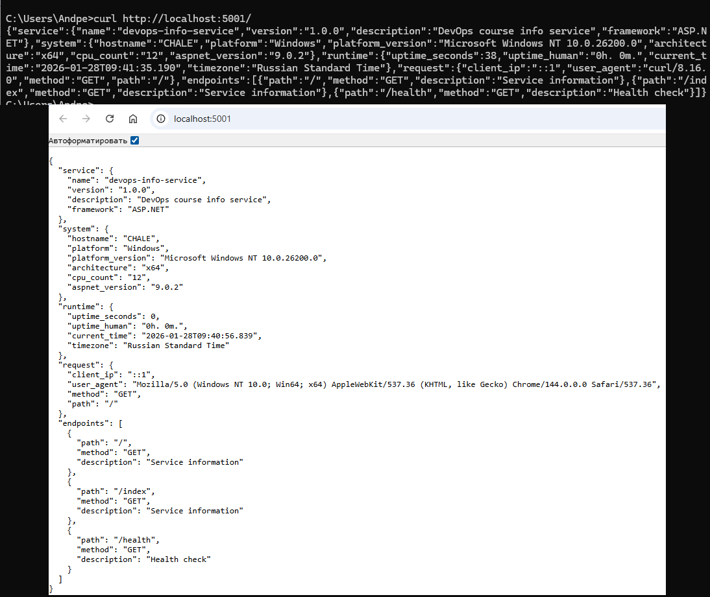
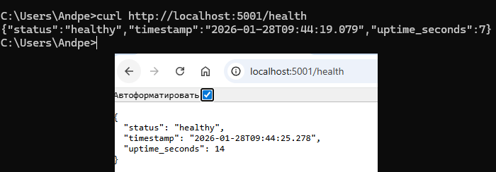
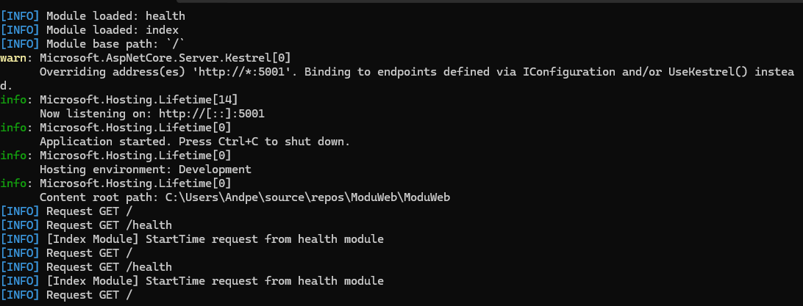

## 1. Framework

For the compiled-language bonus task I used **C# + ASP\.NET Core** hosted inside the **[ModuWeb (self-made application)]((https://github.com/Chaleshka/ModuWeb))** application. I used C# because it was more familiar to me than the other options. <br/>
***ModueWeb** - is a .NET web application that supports dynamic runtime loading, reloading, and unloading of external modules (.dll files). Each module is self-contained and can expose custom HTTP routes, CORS policies, and request handlers.*

## 2. Implementation Overview

The C# implementation lives in `app_csharp/`:

- `modules_src/index/index.csproj` — class library project that builds `index.dll`.
- `modules_src/index/index.cs` — ModuWeb module that exposes the enpoind for main system info.
- `modules_src/health/health.csproj` — class library project that builds `health.dll`.
- `modules_src/health/health.cs` — ModuWeb module that exposes the enpoind for health info.

### Endpoints

The module implements the same endpoints as the Python version:

- **`GET /`** — Returns system and service information
- **`GET /index`** — Returns system and service information
- **`GET /health`** — Returns health and uptime status

The module inherits from `ModuleBase` (provided by ModuWeb) and registers routes in class constructor:

```csharp
public sealed class Index : ModuleBase
{
    public override string ModuleName { get; } = "index";
    static DateTime startTime = DateTime.Now;

    public Index()
    {
        Map("/", "GET", ServiceInfoHandler);
    }
    ...
}
```
Then base url (with base configs) for this module will be: https://localhost:5001/api/index/ and then inner routes. For unique module names (for example, index), url will be https://localhost:5001/index/ (or for index page https://localhost:5001/).

## 3. Build and Run Instructions

### Build the Module

From the `app_csharp/module_name` directory:

```bash
dotnet build ./module_name.csproj
```

The output DLL is:

- `app_csharp/module_name/bin/Debug/net9.0/module_name.dll`

### Integrate with ModuWeb

1. Download or build **ModuWeb** (`https://github.com/Chaleshka/ModuWeb`) and run it once so that the `modules/` folder is created.
2. Copy `index.dll` and `health.dll` into ModuWeb’s `modules/` directory (next to `ModuWeb.exe` / `ModuWeb.dll`). Moduel will be autamicly detected and loaded.
3. For next start ModuWeb — it will detect and load the modules automatically (and set correct `start_time`).

Assuming ModuWeb listens on `http://localhost:5001`:

```bash
curl http://localhost:5001/
curl http://localhost:5001/index
curl http://localhost:5001/health
```

## 4. Testing Evidence

All screenshots located in [docs/screenshots/](screenshots/):

#### Index page:


#### Health page:


#### Console logs:


## 5. Challenges & Solutions

| Challenge | Solution |
|------------|-----------|
| How to get system info | Found information on the Internet |
