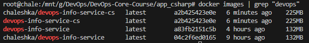
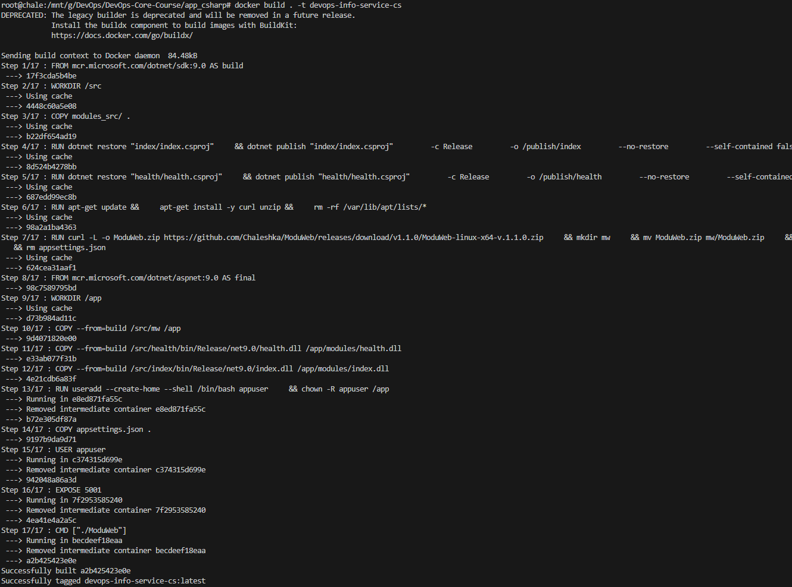
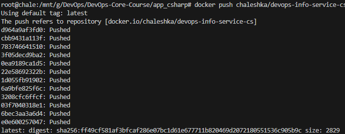
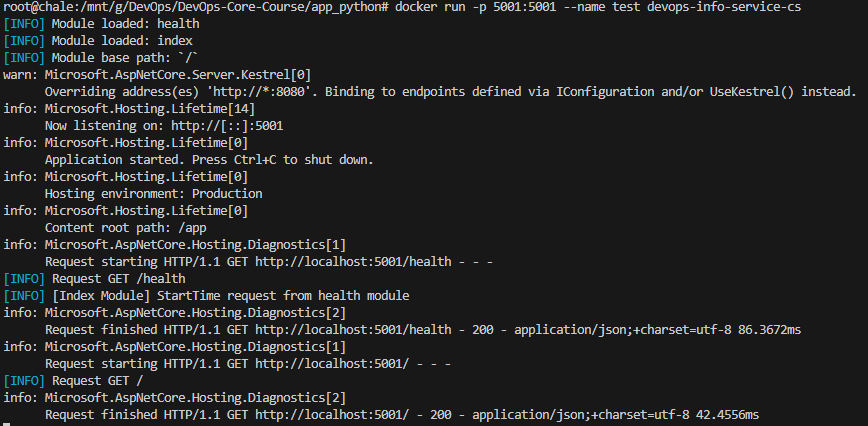
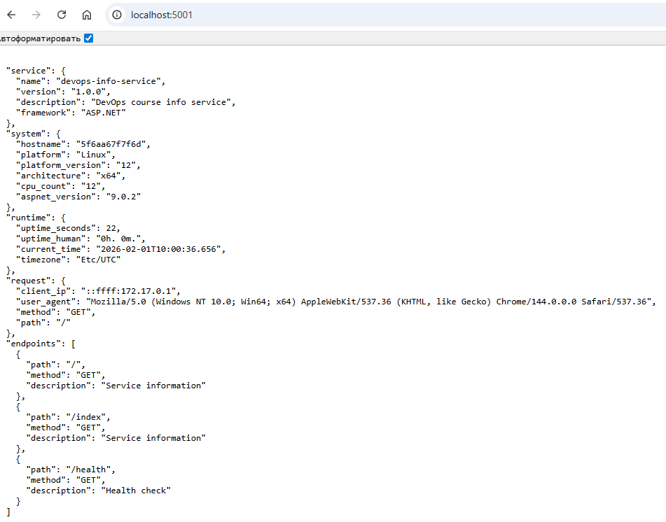
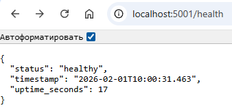

# LAB 02 — DevOps Info Service (Docker Containerization)

## Docker Best Practices Applied
- **non-root user**
    - Attacker can't get access to system from container
    ```
    RUN useradd --create-home --shell /bin/bash appuser
    ```
- **Exclude with .dockerignore**
    - We copy all files that are not ignored. All copied files will be used by app
    ```
    modules_src/bin/*
    modules_src/obj/*
    .gitignore
    Dockerfile
    *.md
    docs/
    ```
- **Don't install unnecessary packages**
    - Install all requirements packages before run app
    ```
    COPY requirements.txt .
    RUN pip install --no-cache-dir -r requirements.txt
    ```
- **Choose the right base image**
    - We can install that base image, that contains only necessary components and packages
    ```
    FROM python:3.12-slim
    ```

## Image Information & Decisions
- Choosen base image: `mcr.microsoft.com/dotnet/sdk:9.0` for build and `mcr.microsoft.com/dotnet/aspnet:9.0` for runtime. On the local machine, I run and tested the build on asp.net version 9.0.11. Therefore, sdk 9.0 will build modules, that will perfectly connect with the release of ModuWeb and aspnet 9.0, that will perfectly run ModuWeb without errors.
- Final image size: 225MB. This weighs few times less if we install everything locally (installing sdk and runtime). 
Thanks to this, we have optimized the amount of disk space required. But its still more then `app_python`. 

One of possible way for make it less: few code changes and build ModuWeb as native (AoT) build and then we don't need and runtime. Just base linux system. If we will have small sized application: user can faster download docker container and install more containers. Also it will work faster, then application that stores gigabytes of memory.
- Layer structure explanation:
    1. **Base image layer:** base image for build
        ```
        FROM mcr.microsoft.com/dotnet/sdk:9.0 AS build
        ```
    2. **WORKDIR setup layer:** Set work directory for build modules
        ```
        WORKDIR /src
        ```
    3. **Source code copy layer:** Copy source code of modules
        ```
        COPY modules_src/ .
        ```
    4. **Index module build layer:** Build index module
        ```
        RUN dotnet restore "index/index.csproj" \
            && dotnet publish "index/index.csproj" \
                -c Release \
                -o /publish/index \
                --no-restore \
                --self-contained false
        ```
    5. **Health module build layer:** Build health module
        ```
        RUN dotnet restore "health/health.csproj" \
            && dotnet publish "health/health.csproj" \
                -c Release \
                -o /publish/health \
                --no-restore \
                --self-contained false
        ```
    6. **Utility setup layer:** Install utils for ModuWeb release download
        ```
        RUN apt-get update && \
            apt-get install -y curl unzip && \
            rm -rf /var/lib/apt/lists/*
        ```
    7. **ModuWeb download and prepare layer:** Download, unzip and prepare ModuWeb realese for linux=x64
        ```
        RUN curl -L -o ModuWeb.zip https://github.com/Chaleshka/ModuWeb/releases/download/v1.1.0/ModuWeb-linux-x64-v.1.1.0.zip \
            && mkdir mw \
            && mv ModuWeb.zip mw/ModuWeb.zip \
            && cd mw \
            && unzip ModuWeb.zip \
            && rm ModuWeb.zip \
            && chmod +x ModuWeb \
            && rm appsettings.json
        ```
    8. **Runtime base image layer::** minimal ASP.NET runtime image
        ```
        FROM mcr.microsoft.com/dotnet/aspnet:9.0 AS final
        ```
    9. **Runtime workdir layer:** Set work directory for final modules
        ```
        WORKDIR /app
        ```
    10. **ModuWeb copy layer:** Copy installed ModuWeb from build stage
        ```
        COPY --from=build /src/mw /app
        ```
    11. **Index module copy layer:** Copy index module from build stage
        ```
        COPY --from=build /src/index/bin/Release/net9.0/index.dll /app/modules/index.dll
        ```
    12. **Health module copy layer:** Copy health module from build stage
        ```
        COPY --from=build /src/health/bin/Release/net9.0/health.dll /app/modules/health.dll
        ```
    13. **User configuration layer:** Create and configure user and change application files owner
        ```
        RUN useradd --create-home --shell /bin/bash appuser \
            && chown -R appuser /app
        ```
    14. **ModuWeb Configuration copy layer:** Copy configuration file for ModuWeb
        ```
        COPY appsettings.json .
        ```
    15. **USER select layer:** Choose user for current application
        ```
        USER appuser
        ```
    16. **EXPOSE layer:** Expose port for application
        ```
        EXPOSE 5001
        ```
    17. **Lanch layer:** Start application
        ```
        CMD ["./ModuWeb"]
        ```

## Build & Run Process
- **Build image**
    - docker build
    
    - docker push
    
- **Run image**

- **Testing outputs**
    - Index page:
    

    - Health page:
    
- Docker hub repository: https://hub.docker.com/repository/docker/chaleshka/devops-info-service/general

## Technical Analysis
- An application running locally and using a container works the same way.
- Every command in file creates new layer. There are some layers whose order cannot be changed. For example, we can't move `FROM` in the end. `FROM` MUST be first command.
- *What would happen if you changed the layer order?* It depends on layer. If we move, for example, `EXPOSE layer` and `ENV configuration layer`, everything will continue to work correctly. If we move `USER select layer` or `Application code layer`, it will cause build errors.
- *What security considerations did you implement?* User for application is non-root. This will prevent attackers from invading the system from the container.
- *How does .dockerignore improve your build?* `.dockerignore` contains all files that should not be copied into docker app. We copy only necessary files.

## Challenges & Solutions
- Since I already had some experience with `docker`, I didn't have a lot problems with it.
- Problems: multi-stage dockerfile (build -> final), download release from github repo., move files from build to final stage.
- *What i learned?* I learned:
    - Docker also contains file that describe ignorable files: `.dockerignore`
    - Create and use special user for application.
    - Dividing the image build into several stages