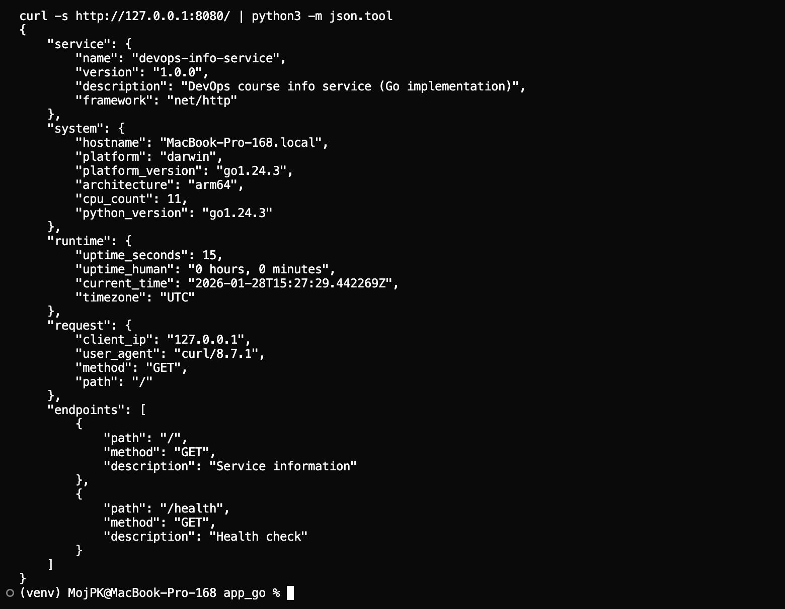
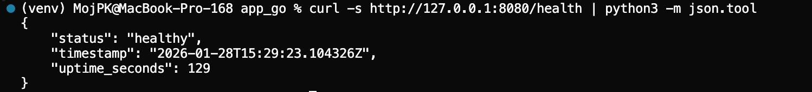

# LAB01 — DevOps Info Service (Go Implementation)

## Overview

This document describes the Go implementation of the **DevOps Info Service** as a compiled-language bonus for Lab 1.  
The Go service exposes the same two endpoints as the Python version:

- `GET /` — full service, system, runtime, and request information
- `GET /health` — minimal health status and uptime

The implementation is located in `app_go/main.go`.

## Endpoint Behavior

### GET `/`

Returns JSON with the following structure:

- `service`
- `system`
- `runtime`
- `request`
- `endpoints`

Example usage:

```bash
curl -s http://127.0.0.1:8080/ | python3 -m json.tool
```

### GET `/health`

Returns a lightweight health payload:

- `status`
- `timestamp`
- `uptime_seconds`

Example usage:

```bash
curl -s http://127.0.0.1:8080/health | python3 -m json.tool
```

## Testing Evidence (Go)

Screenshots are stored in `app_go/docs/screenshots/` and show the Go implementation in action:

- **Main endpoint JSON (`GET /`)**  
  

- **Health check (`GET /health`)**  
  

## Implementation Details

Key parts of the Go implementation:

- **Structs** are defined for `Service`, `System`, `RuntimeInfo`, `RequestInfo`, `Endpoint`, and `HealthResponse`.
- **Global `startTime`** is used to compute uptime, similar to the Python version.
- **Environment variables**:
  - `HOST` (default `0.0.0.0`)
  - `PORT` (default `8080`)

```startLine:endLine:DevOps-Core-Course/app_go/main.go
// Service metadata
type Service struct {
	Name        string `json:"name"`
	Version     string `json:"version"`
	Description string `json:"description"`
	Framework   string `json:"framework"`
}
```

```startLine:endLine:DevOps-Core-Course/app_go/main.go
var (
	startTime = time.Now().UTC()
	logger    = log.New(os.Stdout, "", log.LstdFlags)
)
```

```startLine:endLine:DevOps-Core-Course/app_go/main.go
func indexHandler(w http.ResponseWriter, r *http.Request) {
	logger.Printf("Handling request: %s %s", r.Method, r.URL.Path)

	uptimeSeconds, uptimeHuman := getUptime()

	response := RootResponse{
		// ...
	}

	w.Header().Set("Content-Type", "application/json")
	if err := json.NewEncoder(w).Encode(response); err != nil {
		logger.Printf("ERROR encoding JSON response: %v", err)
		http.Error(w, "Internal Server Error", http.StatusInternalServerError)
	}
}
```

```startLine:endLine:DevOps-Core-Course/app_go/main.go
func main() {
	logger.Println("DevOps Info Service (Go) starting...")

	http.HandleFunc("/", indexHandler)
	http.HandleFunc("/health", healthHandler)

	host := os.Getenv("HOST")
	if host == "" {
		host = "0.0.0.0"
	}

	port := os.Getenv("PORT")
	if port == "" {
		port = "8080"
	}

	addr := host + ":" + port
	logger.Printf("Listening on %s", addr)

	if err := http.ListenAndServe(addr, nil); err != nil {
		logger.Fatalf("Server failed: %v", err)
	}
}
```

## Build and Run Instructions

From the `app_go` directory:

```bash
go run main.go
```

Or build and run:

```bash
go build -o devops-info-service-go
./devops-info-service-go
```

With custom host/port:

```bash
HOST=127.0.0.1 PORT=9090 ./devops-info-service-go
```

## Binary Size Comparison

Suggested steps to compare Go vs Python:

1. **Go binary:**

   ```bash
   cd app_go
   go build -o devops-info-service-go
   ls -lh devops-info-service-go
   ```

2. **Python app footprint:**

   ```bash
   cd ../app_python
   du -sh venv
   ```

The Go binary will typically be a single file (tens of MB by default, smaller with build flags) while the Python environment will include many dependencies, which is important when optimizing container image size.


