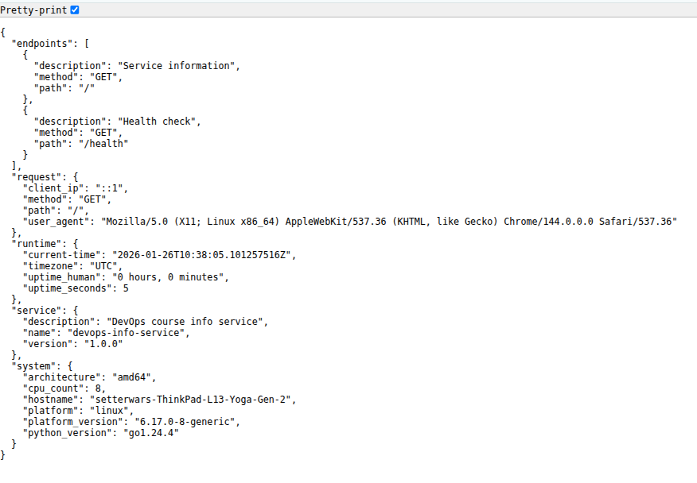
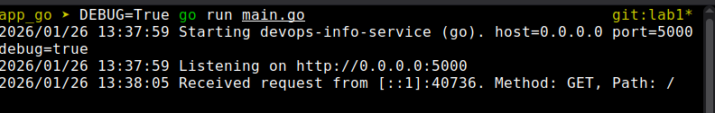
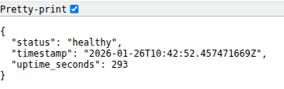
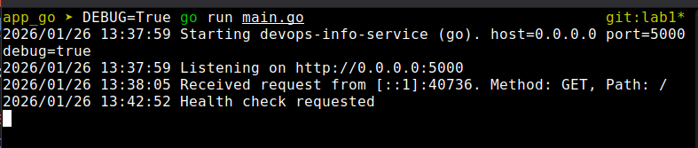

# Choosen language: Go

# Best practices followed
- Use virtual environment for dependency management
- Clear function and variable names
- Logging for monitoring and debugging
- Error handling for robustness
- Modular code structure for maintainability

# API documentation 

- endpoints:
  - `GET /` - Returns system metadata including hostname, IP address, and current timestamp.
  - `GET /health` - Returns the health status of the service.

## Testing commands in basic configuration 

    curl http://localhost:5000/
    curl http://localhost:5000/health

# Testing evidence

Basic endpoint test:

Health endpoint test:

# Challenges and solutions
 No challenges faced during the lab