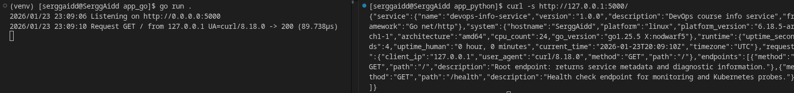
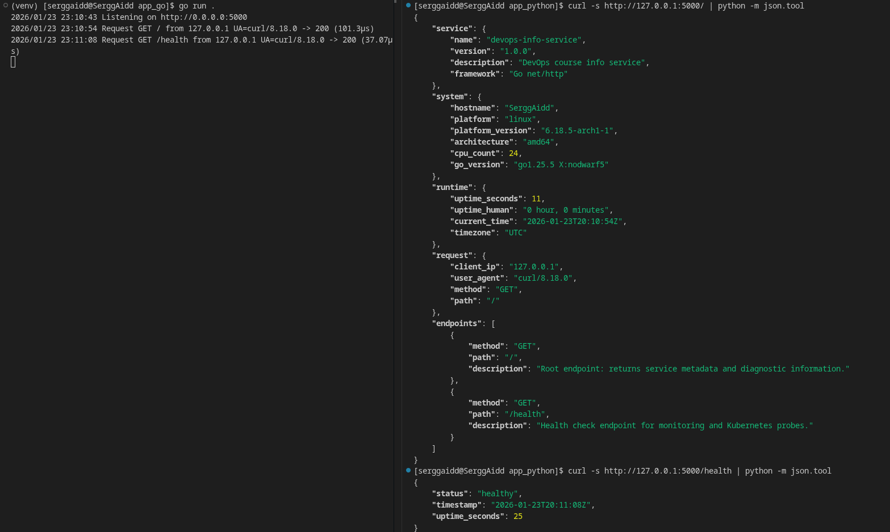
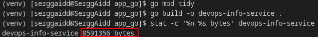
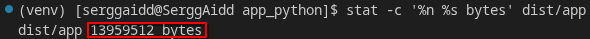

# LAB01 — DevOps Info Service (Go)

This document describes the Go implementation of **DevOps Info Service** for Lab 01.
The service is a small HTTP JSON API that exposes system/runtime/request metadata and a health check endpoint.

---

## Framework Selection

### Choice: Go standard library (`net/http`)

This implementation uses only the Go standard library:
- `net/http` — HTTP server
- `encoding/json` — JSON encoding
- `os`, `runtime`, `time` — configuration + system/runtime metadata
- a minimal custom router + middleware for logging and panic recovery

**Rationale**
- Minimal dependencies (easy to review and reproduce).
- Predictable behavior and portability (single compiled binary).
- Container-friendly defaults (stdout logging, fast startup).

### Comparison table with alternatives

| Option | Pros | Cons | Decision |
|---|---|---|---|
| **Standard library (`net/http`)** | Zero deps, small binary, portable | Routing/middleware is manual | **Selected** (fits Lab 01 scope) |
| Gin | Fast, popular, good DX | External dependency, more abstraction | Not required for 2–3 routes |
| Echo | Middleware-rich, ergonomic | External dependency | Not required for Lab 01 |
| chi | Lightweight router | External dependency | Chose zero-deps approach |
| Gorilla/mux | Mature ecosystem | Heavier router, extra dep | Not needed for exact matches |

---

## Best Practices Applied

Below is a list of practices applied in the implementation, with short code excerpts and the reason each matters.

### 1) Configuration via environment variables
**Example**
```go
host := os.Getenv("HOST")
if host == "" { host = "0.0.0.0" }

port := os.Getenv("PORT")
if port == "" { port = "5000" }

debug := strings.ToLower(os.Getenv("DEBUG")) == "true"
```

**Why it matters**
- Matches common container/Kubernetes configuration patterns.
- Allows the same binary to run in different environments without code changes.

### 2) Consistent JSON errors (404 / 500)
**Examples**
```go
writeJSON(w, http.StatusNotFound, ErrorResponse{
    Error: "Not Found", Message: "Endpoint does not exist",
})
```

```go
defer func() {
    if rec := recover(); rec != nil {
        writeJSON(w, http.StatusInternalServerError, ErrorResponse{
            Error: "Internal Server Error",
            Message: "An unexpected error occurred",
        })
    }
}()
```

**Why it matters**
- Ensures clients always receive machine-readable error payloads.
- Prevents unexpected crashes from stopping the service.

### 3) Request logging to stdout
**Example**
```go
log.Printf("Request %s %s from %s UA=%s -> %d (%s)",
    r.Method, r.URL.Path, clientIP(r), r.UserAgent(), sw.status, lat)
```

**Why it matters**
- Stdout logging is the standard in Docker/Kubernetes.
- Useful for validating health probes and debugging locally.

### 4) Proxy-aware client IP extraction
**Example**
```go
xff := r.Header.Get("X-Forwarded-For")
if xff != "" {
    return strings.TrimSpace(strings.Split(xff, ",")[0])
}
```

**Why it matters**
- Preserves real client IP when the service is behind an ingress/reverse proxy.

---

## API Documentation

### `GET /`
Returns service metadata, system/runtime details, request metadata, and the list of available endpoints.

**Request**
```bash
curl -s http://127.0.0.1:5000/
```

**Response**
See *Testing Evidence* below.

### `GET /health`
Health endpoint for monitoring / Kubernetes probes. Returns HTTP **200** when the service is running.

**Request**
```bash
curl -s http://127.0.0.1:5000/health
```

**Response (example)**
```json
{
  "status": "healthy",
  "timestamp": "2026-01-23T19:08:22Z",
  "uptime_seconds": 8
}
```

---

## Testing Commands

Run the service:
```bash
HOST=0.0.0.0 PORT=5000 DEBUG=false go run main.go
```

Test endpoints:
```bash
curl -s http://127.0.0.1:5000/
curl -s http://127.0.0.1:5000/health
curl -s http://127.0.0.1:5000/does-not-exist
# You also can use command bellow of uncomment crash endpoint in code
# curl -s http://127.0.0.1:5000/crash
```

Pretty-print JSON:
```bash
curl -s http://127.0.0.1:5000/ | python -m json.tool
```

---

## Testing Evidence

### Screenshots showing endpoints work

Required screenshots are stored in `docs/screenshots/`:

1) **Main endpoint showing complete JSON**
- `docs/screenshots/01_root_complete_json.png`




2) **Health check response**
- `docs/screenshots/02_health_check.png`


3) **Formatted/pretty-printed output**
- `docs/screenshots/03_pretty_print_command.png`




### Terminal output

```text
$ curl -s http://127.0.0.1:5000/ | python -m json.tool
{
    "service": {
        "name": "devops-info-service",
        "version": "1.0.0",
        "description": "DevOps course info service",
        "framework": "Go net/http"
    },
    "system": {
        "hostname": "SerggAidd",
        "platform": "linux",
        "platform_version": "6.18.5-arch1-1",
        "architecture": "amd64",
        "cpu_count": 24,
        "go_version": "go1.25.5 X:nodwarf5"
    },
    "runtime": {
        "uptime_seconds": 3,
        "uptime_human": "0 hour, 0 minutes",
        "current_time": "2026-01-23T19:08:17Z",
        "timezone": "UTC"
    },
    "request": {
        "client_ip": "127.0.0.1",
        "user_agent": "curl/8.18.0",
        "method": "GET",
        "path": "/"
    },
    "endpoints": [
        {
            "method": "GET",
            "path": "/",
            "description": "Root endpoint: returns service metadata and diagnostic information."
        },
        {
            "method": "GET",
            "path": "/health",
            "description": "Health check endpoint for monitoring and Kubernetes probes."
        }
    ]
}
```

```text
$ curl -s http://127.0.0.1:5000/health | python -m json.tool
{
    "status": "healthy",
    "timestamp": "2026-01-23T19:08:22Z",
    "uptime_seconds": 8
}
```

```text
$ curl -s http://127.0.0.1:5000/does-not-exist | python -m json.tool
{
    "error": "Not Found",
    "message": "Endpoint does not exist"
}
```

```text
$ curl -s http://127.0.0.1:5000/crash | python -m json.tool
{
    "error": "Internal Server Error",
    "message": "An unexpected error occurred"
}
```

---

## Challenges & Solutions

### 1) Endpoint discovery without a framework
**Problem:** `net/http` does not provide a route registry similar to Flask.
**Solution:** Implemented a minimal router that stores routes and exposes a sorted `endpoints` list for the root response.

### 2) Correct client IP behind proxies
**Problem:** `RemoteAddr` can reflect only the proxy address.
**Solution:** Prefer `X-Forwarded-For` (first value) and fall back to `RemoteAddr` parsing.

### 3) Handling internal failures without process exit
**Problem:** A panic would terminate the process by default.
**Solution:** Added panic recovery middleware that converts panics into a JSON 500 response.

### 4) Readable evidence output
**Problem:** JSON key ordering is not guaranteed by the standard.
**Solution:** Evidence uses pretty-printing tools; the endpoints list is sorted by `(path, method)` for deterministic output.

---

## Compare binary size to Python
To compare the sizes of application binaries, the following commands were executed:

- Go application (8591356 bytes):
```bash
go mod tidy
go build -o devops-info-service .
stat -c '%n %s bytes' devops-info-service
```


- Python application (13959512 bytes):
```bash
pip install pyinstaller
pyinstaller --onefile app.py
stat -c '%n %s bytes' dist/app
```


### Summary
According to measurements, the Go binary (8.19 MiB) is noticeably smaller than a Python onefile via PyInstaller (13.31 MiB) - a difference of about 5.12 MiB (around 38.5%). This is because Go builds a single native executable with runtime and dependencies, while PyInstaller in `--onefile` mode also packages the Python interpreter and a set of libraries, resulting in a larger final artifact. This gives Go an advantage in terms of size and portability for containers and fast deployments.