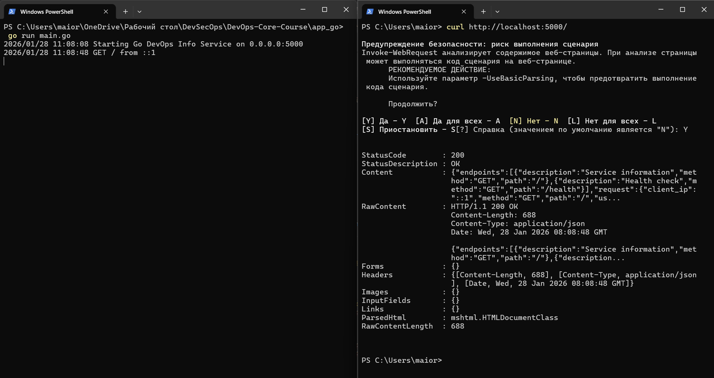
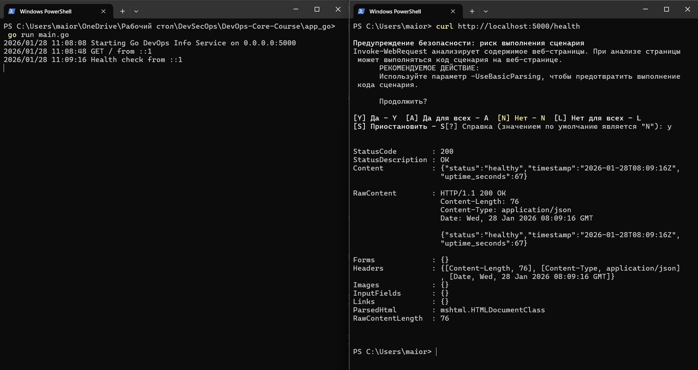

# LAB01 — DevOps Info Service (Go Version)

## 1. Framework / Language Selection

**Chosen Language:** Go (Golang) 1.24.5

**Justification:**
Go is a compiled language suitable for building lightweight, high-performance web services.

---

## 2. Best Practices Applied

**1. Clean Code Structure**

* Separation of concerns: utility functions, handlers, and main server logic
* `getUptime()` function calculates runtime
* Route handlers: `mainHandler` for `/`, `healthHandler` for `/health`
* Consistent logging of requests

**2. Error Handling**

* Returns default page `/` if error happens

**3. Logging**

* Uses Go’s standard `log` package
* Optional verbose logging via `DEBUG` environment variable

**4. Environment Configuration**

* `HOST`, `PORT`, `DEBUG` are configurable through environment variables

**5. Dependency Management**

* Uses Go modules (`go.mod`) to track dependencies

---

## 3. API Documentation

### `GET /`

Returns service, system, runtime, and request information.

**Example Request:**

```bash
curl http://localhost:8080/
```

**Sample Response:**

```json
{
  "endpoints": [
    {
      "description": "Service information",
      "method": "GET",
      "path": "/"
    },
    {
      "description": "Health check",
      "method": "GET",
      "path": "/health"
    }
  ],
  "request": {
    "client_ip": "::1",
    "method": "GET",
    "path": "/",
    "user_agent": "Mozilla/5.0 (Windows NT; Windows NT 10.0; ru-RU) WindowsPowerShell/5.1.26100.7462"
  },
  "runtime": {
    "current_time": "2026-01-28T08:32:20Z",
    "timezone": "UTC",
    "uptime_human": "0 hours, 24 minutes",
    "uptime_seconds": 1452
  },
  "service": {
    "description": "DevOps course info service",
    "framework": "net/http",
    "name": "devops-info-service",
    "version": "1.0.0"
  },
  "system": {
    "architecture": "amd64",
    "cpu_count": 16,
    "go_version": "go1.24.5",
    "hostname": "Daniil",
    "platform": "windows",
    "platform_version": "go1.24.5"
  }
}
```

---

### `GET /health`

Returns health status.

**Example Request:**

```bash
curl http://localhost:8080/health
```

**Sample Response:**

```json
{
  "status": "healthy",
  "timestamp": "2026-01-28T08:33:26Z",
  "uptime_seconds": 1518
}
```

---

## 4. Testing Evidence

* **Main Endpoint:**
  

* **Health Check:**
  

* **Command-line Test Example:**

```bash
curl http://localhost:8080/
curl http://localhost:8080/health
```

---

## 6. Summary

The Go implementation mirrors the Python (Flask) version of the DevOps Info Service:

* Same endpoints and JSON structure
* Faster startup and compiled binary