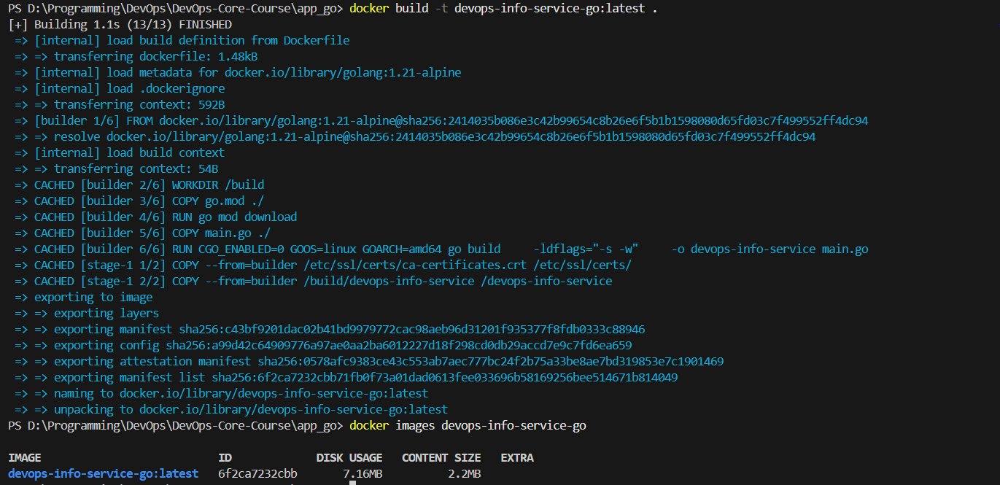
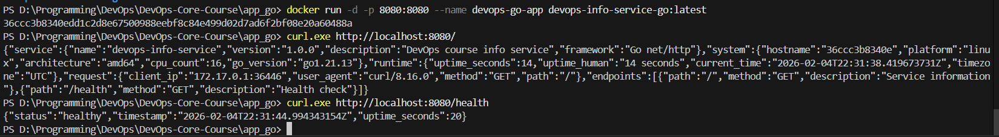

# Lab 2 — Docker Multi-Stage Build (Go)

## Overview

This document describes the multi-stage Docker build implementation for the Go DevOps Info Service. Multi-stage builds are a critical technique for compiled languages, allowing us to achieve minimal final image sizes.

## Multi-Stage Build Strategy

### Why Multi-Stage for Go?

When building a Go application, you need:
1. **At build time**: Go compiler, standard library, build tools (~800MB)
2. **At runtime**: Only the compiled binary (~5-8MB)

Multi-stage builds let us use the full Go SDK for compilation, then copy only the binary to a minimal runtime image.

### Our Two-Stage Approach

```
┌─────────────────────────────────────────────────┐
│            Stage 1: Builder                      │
│                                                  │
│  golang:1.21-alpine (~300MB)                    │
│  ├── Go compiler                                │
│  ├── Standard library                           │
│  ├── Build tools                                │
│  └── Our source code                            │
│                    │                            │
│                    ▼                            │
│         Compile binary                          │
│         (CGO_ENABLED=0)                         │
│                    │                            │
└────────────────────│────────────────────────────┘
                     │
                     ▼
┌─────────────────────────────────────────────────┐
│            Stage 2: Runtime                      │
│                                                  │
│  scratch (0MB base)                             │
│  └── Only the binary (~7MB)                     │
│                                                  │
│  Final Image: ~7-8MB                            │
└─────────────────────────────────────────────────┘
```

### Stage 1: Builder

```dockerfile
FROM golang:1.21-alpine AS builder

WORKDIR /build

# Copy go.mod first for dependency caching
COPY go.mod ./
RUN go mod download

# Copy source and build
COPY main.go ./
RUN CGO_ENABLED=0 GOOS=linux GOARCH=amd64 go build \
    -ldflags="-s -w" \
    -o devops-info-service main.go
```

**Purpose:** Compile the Go source code into a static binary.

**Key decisions:**
- `golang:1.21-alpine`: Smaller than full Go image, still has everything needed
- `go mod download` as separate step: Enables layer caching for dependencies
- `CGO_ENABLED=0`: Creates a static binary with no C dependencies
- `-ldflags="-s -w"`: Strips debug symbols, reducing binary size by ~30%

### Stage 2: Runtime

```dockerfile
FROM scratch

COPY --from=builder /etc/ssl/certs/ca-certificates.crt /etc/ssl/certs/
COPY --from=builder /build/devops-info-service /devops-info-service

EXPOSE 8080
ENTRYPOINT ["/devops-info-service"]
```

**Purpose:** Create the minimal runtime container with only what's needed.

**Key decisions:**
- `FROM scratch`: Empty base image (0 bytes) - the ultimate minimal image
- CA certificates copied for HTTPS support (future-proofing)
- Only the binary is copied - nothing else
- `ENTRYPOINT` instead of `CMD`: The binary is the only thing that can run

## Image Size Analysis

### Size Comparison

| Component | Size |
|-----------|------|
| `golang:1.21-alpine` (builder) | ~300 MB |
| Go SDK and tools | ~250 MB |
| `scratch` (runtime base) | 0 MB |
| Compiled binary | ~7 MB |
| CA certificates | <1 MB |
| **Final image** | **~7-8 MB** |

### Comparison with Python

| Metric | Go (Multi-stage) | Python (Single-stage) |
|--------|------------------|----------------------|
| Base image | 0 MB (scratch) | ~150 MB (python:3.13-slim) |
| Runtime | 0 MB (compiled) | ~30 MB (interpreter + deps) |
| Application | ~7 MB (binary) | <1 MB (source) |
| **Total** | **~7 MB** | **~180-200 MB** |

**Size reduction: ~96%** compared to Python version.

### Why Size Matters

1. **Faster deployments**: Smaller images transfer faster between registries and nodes
2. **Lower storage costs**: Reduced disk usage on nodes and registries
3. **Faster scaling**: New containers start faster when image pull is quick
4. **Smaller attack surface**: Fewer packages = fewer potential vulnerabilities
5. **Network efficiency**: Less bandwidth consumption, especially in CI/CD

## Build & Run Process

### Build Commands

```bash
# Navigate to app directory
cd app_go

# Build the image
docker build -t devops-info-service-go:latest .

# Check image size
docker images devops-info-service-go
```

### Build Output



### Run Commands

```bash
# Run container
docker run -d -p 8080:8080 --name devops-go-app devops-info-service-go:latest

# View logs
docker logs devops-go-app

# Test endpoints
curl http://localhost:8080/
curl http://localhost:8080/health
```

### Testing Result

```

## Technical Explanation of Each Stage

### Stage 1 Technical Details

#### Base Image Choice: `golang:1.21-alpine`

- **Why alpine variant**: ~300MB vs ~800MB for full image
- **Alpine Linux**: Minimal Linux distribution using musl libc
- **Contains**: Go compiler, standard library, common tools

#### Static Binary Compilation

```dockerfile
RUN CGO_ENABLED=0 GOOS=linux GOARCH=amd64 go build \
    -ldflags="-s -w" \
    -o devops-info-service main.go
```

| Flag | Purpose |
|------|---------|
| `CGO_ENABLED=0` | Disable C bindings, create fully static binary |
| `GOOS=linux` | Cross-compile for Linux (even if building on Windows/Mac) |
| `GOARCH=amd64` | Target x86-64 architecture |
| `-ldflags="-s -w"` | Strip symbol table (-s) and debug info (-w) |

**Why static binary?**
- No dependency on glibc/musl at runtime
- Can run on empty `scratch` image
- Fully self-contained executable

#### Layer Caching Strategy

```dockerfile
COPY go.mod ./
RUN go mod download
COPY main.go ./
```

If `go.mod` doesn't change:
- `go mod download` layer is cached
- Only source code copy and compilation happen
- Build time: ~5-10 seconds (vs ~30+ seconds full rebuild)

### Stage 2 Technical Details

#### Why `scratch` Image?

| Base Image | Size | Contents |
|------------|------|----------|
| `ubuntu` | ~80MB | Full Linux userspace |
| `alpine` | ~5MB | Minimal Linux with musl |
| `distroless` | ~2MB | Minimal runtime only |
| `scratch` | 0MB | Empty - nothing at all |

`scratch` is possible because:
- Go binary is statically linked
- No runtime dependencies needed
- No shell needed (ENTRYPOINT runs binary directly)

#### What's Copied from Builder

```dockerfile
COPY --from=builder /etc/ssl/certs/ca-certificates.crt /etc/ssl/certs/
COPY --from=builder /build/devops-info-service /devops-info-service
```

1. **CA Certificates**: Required if the app makes HTTPS requests
2. **Binary**: The compiled application

Nothing else - no shell, no package manager, no utilities.

## Security Benefits of Multi-Stage

### 1. Minimal Attack Surface

| Image Type | Packages | CVEs Possible |
|------------|----------|---------------|
| Ubuntu-based | ~300+ | High |
| Alpine-based | ~20 | Medium |
| Scratch | 0 | Very Low |

With scratch, there are no:
- Shell (no shell escape attacks)
- Package managers (no supply chain attacks)
- Network tools (no reconnaissance from inside container)
- File editors (no runtime modifications)

### 2. Build Tools Excluded

The final image doesn't contain:
- Go compiler (could compile malicious code)
- Build scripts
- Source code (IP protection)
- Development dependencies

### 3. Immutable Container

Without a shell or package manager, the container cannot be modified at runtime. This ensures:
- Reproducible deployments
- Configuration through environment only
- Easier auditing

## Docker Hub

### Repository URL

```
https://hub.docker.com/r/ravwvil/devops-info-service-go
```

### Push Commands

```bash
# Tag for Docker Hub
docker tag devops-info-service-go:latest ravwvil/devops-info-service-go:latest
docker tag devops-info-service-go:latest ravwvil/devops-info-service-go:1.0.0

# Push
docker push ravwvil/devops-info-service-go:latest
docker push ravwvil/devops-info-service-go:1.0.0
```

## Challenges & Solutions

### Challenge 1: Binary Not Executing on Scratch

**Problem**: Initial build created a dynamically linked binary that failed on scratch.

**Error**: `standard_init_linux.go: exec format error`

**Solution**: Added `CGO_ENABLED=0` to ensure fully static compilation.

### Challenge 2: Missing CA Certificates

**Problem**: Application worked but would fail on HTTPS requests.

**Solution**: Copied CA certificates from builder stage:
```dockerfile
COPY --from=builder /etc/ssl/certs/ca-certificates.crt /etc/ssl/certs/
```

### Challenge 3: Cannot Debug in Scratch Container

**Problem**: No way to exec into container for debugging.

**Solution**: 
- For debugging, temporarily change to `FROM alpine` in stage 2
- Use comprehensive logging in application
- Accept that production containers should be immutable

## Screenshots

> **Note:** Add screenshots showing:
> 1. Docker build output (both stages visible)
> 2. `docker images` showing final size (~7-8 MB)
> 3. Running container and curl output
> 4. (Optional) Comparison with single-stage image size
