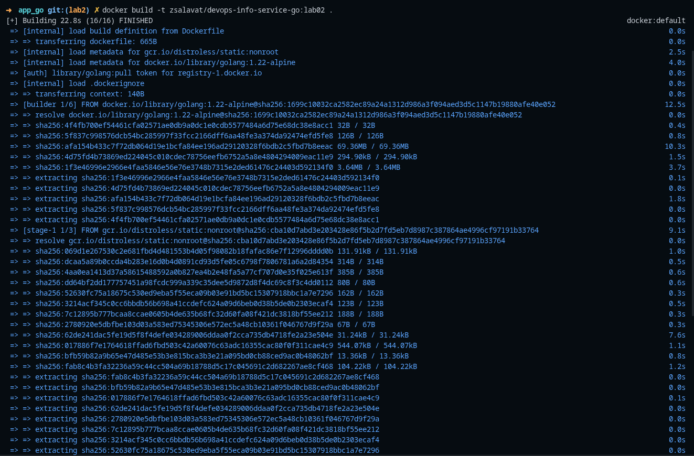
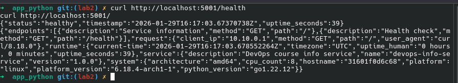

## Strategy Overview

- **Stage 1 (Builder)**: Use `golang:1.22-alpine` to compile a static Linux binary with `CGO_ENABLED=0`, `-trimpath`, and stripped symbols (`-ldflags "-s -w"`). Cache Go modules and build artifacts to speed up incremental builds.
- **Stage 2 (Runtime)**: Use `gcr.io/distroless/static:nonroot` to ship only the binary. No package manager, no shell, and runs as non-root by default → minimal attack surface.

## Size Comparison

```bash
➜  app_go git:(lab2) ✗ docker images | grep devops-info-service-go
WARNING: This output is designed for human readability. For machine-readable output, please use --format.
zsalavat/devops-info-service-go:lab02         067f534f40f3       13.3MB         2.99MB        
```

## Why Multi-Stage Matters

- **Smaller images**: Faster pulls/pushes and less disk/memory footprint.
- **Security**: Fewer components → fewer CVEs and reduced attack surface; distroless has no shell or package manager.
- **Performance & Deployability**: Static binaries start quickly and work consistently across environments.
- **Best practice**: Keep build-time and runtime concerns separate.

---

## Build & Run Process

### Build


### Run


### Test Endpoints


---

## Technical Explanation of Each Stage

- **Builder stage**:
  - `go mod download` with cache mounts speeds up dependency resolution.
  - `CGO_ENABLED=0` produces a fully static binary suitable for `distroless/static`.
  - `-trimpath` removes local path info; `-ldflags "-s -w"` strips symbol/debug info → smaller binary.
  - Output binary at `/out/app` for clean handoff to runtime stage.

- **Runtime stage**:
  - `distroless/static:nonroot` includes just enough to run the binary; no shell or glibc needed for static binaries.
  - Runs as non-root (`USER nonroot:nonroot`) by default.
  - `EXPOSE 5000` documents the port; environment variables allow overrides.

## Security Implications

- **Reduced attack surface**: No compilers or package managers in runtime.
- **Least privilege**
- **Determinism**

