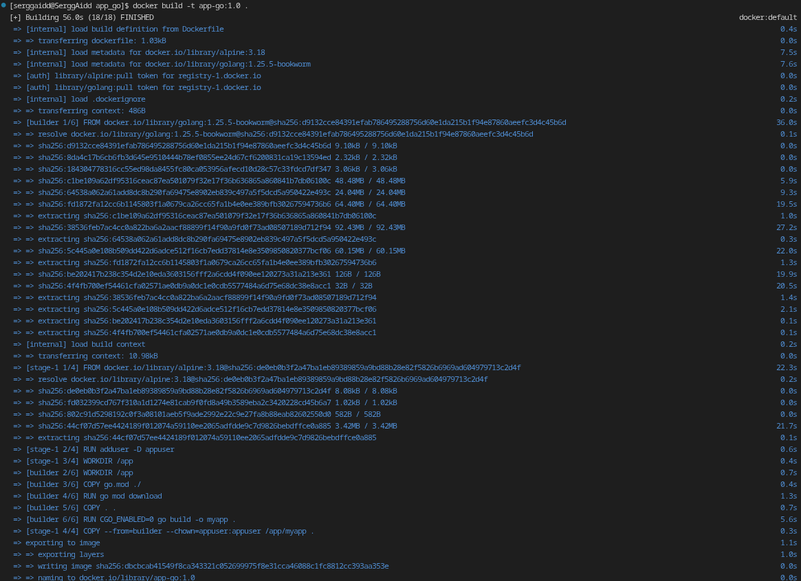
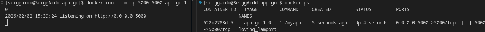
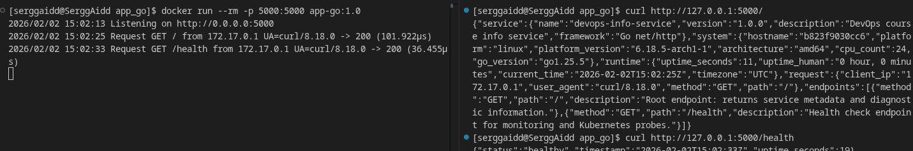
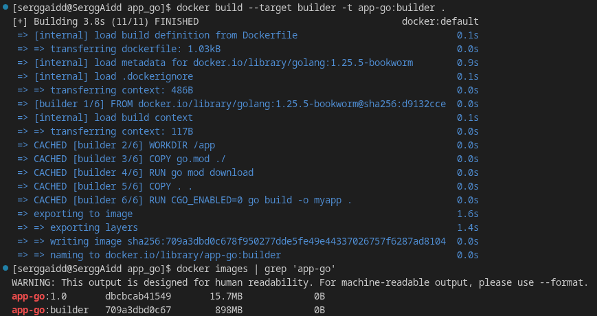

# LAB02 — Docker Containerization (app_go)

## Multi-stage build strategy
A multi-stage build strategy was used to separate the process into two independent stages: build and run. The main goal is to obtain a minimal production image containing only what is needed to run the application, without development tools.

The strategy is based on the following principles:
1. Isolation of the build from the runtime
    - The Go application is compiled in a separate "builder" stage, where the compiler, system utilities, and (in the future) module cache are available.
    - The final "runtime" stage does not contain the source code, compiler, or downloaded build dependencies.

2. Minimization of the final image
    - Only the finished binary file is transferred to the runtime image, while the entire build environment is automatically discarded and not included in the final image.
    - This directly reduces the image size and speeds up pull/push operations.

3. Security by default
    - The container runs as an unprivileged user to reduce the impact of an application compromise. 
    - Fewer files and tools within the runtime reduce the attack surface.

4. Ready for scaling and faster rebuilds
    - The Dockerfile structure enables efficient dependency caching by separately copying go.mod (and go.sum, when available), so that code changes don't require repeated, cumbersome steps.

**The result of this strategy:** a large "builder" image is used only as a temporary environment, while the final "runtime" image is lightweight, reproducible, and more secure, which is the core value of a multi-stage approach for compiled languages.

## Terminal output showing build process and image sizes
- Complete terminal output from build process: 
- Terminal output showing container running: 
- Terminal output from testing endpoints (curl/httpie): 
- Building only the builder stage and output the dimensions of both images:

## Size comparison (builder vs final image)
A comparison of Docker image sizes shows that the final `app-go:1.0` runtime image is 15.7 MB, while the `app-go:builder` image is 898 MB. This means the final image is approximately 57.2 times smaller, representing a size reduction of approximately 98.25% (a savings of approximately 882 MB). This is achieved through a multi-stage approach, resulting in a runtime image that does not contain a compiler, source code, or build dependencies, which will contribute to faster pull and push operations and a reduced attack surface.

## The importance of multi-stage builds for compiled languages
1. Drastically reduces the final image size
    - Without multi-stage, you could accidentally "slip" your entire toolchain (hundreds of megabytes or gigabytes) into production.
    - Multi-stage leaves only the binary in the final image, meaning less traffic and faster pull, push, and deploy operations.

2. Reduced attack surface (security)
    - The fewer components in a container, the fewer potential vulnerabilities.
    - A runtime image does not include a package manager, compiler, or unnecessary utilities that could make it easier for an attacker to establish or develop an attack.

3. Cleaner and more "production-like" environment
    - The final image adheres to the principle of "only what's needed to run."
    - This simplifies maintenance, updates, and analysis of what's actually in production.

4. Better reproducibility and control
    - The build is performed in a fixed environment (builder image), and the run is performed in a minimal environment, which reduces the risk of "works on my machine" and makes the build more predictable.

## Technical explanation of each stage's purpose:
This Dockerfile is split into two stages — builder and runtime — to separate compilation from execution and keep the final image minimal.

1. Builder stage (builder):
    - Uses the base image `golang:1.25.5-bookworm`, which includes the full Go toolchain required to compile the application.
    - Sets `/app` as the working directory.
    - Copies only `go.mod` and runs `go mod download`. This is done for layer caching: when dependencies are added later (and `go.sum` appears), Docker can reuse the cached dependency-download layer as long as `go.mod`/`go.sum` remain unchanged.
    - Copies the rest of the source code (`COPY . .`) and compiles the project.
    - Builds with `CGO_ENABLED=0`, which disables CGO and typically produces a statically linked binary. This is convenient because it reduces runtime dependencies and allows using a smaller runtime image.
    - Output of this stage is a single executable binary: `myapp`.
2. Runtime stage (runtime):
    - Uses a lightweight base image `alpine:3.18`.
    - Creates an unprivileged user appuser, so the container does not run as root (security hardening).
    - Sets `/app` as the working directory and copies only the compiled binary from the builder stage using `COPY --from=builder ...`.
    - Applies `--chown=appuser:appuser` during copy, so the binary is owned by the unprivileged user without needing an extra chown layer.
    - The final image contains no source code, no Go compiler, no module cache, and no build tools - only the minimal OS and the application binary.
