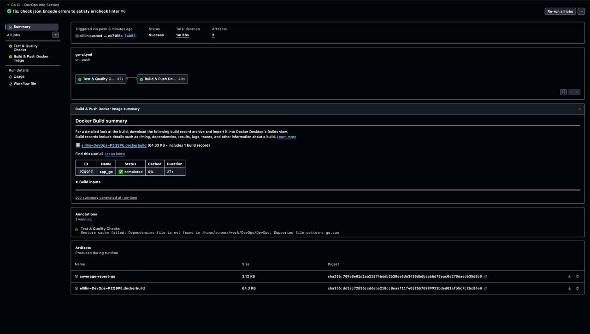

# Lab 3 — Continuous Integration (CI/CD) Documentation (Go)

## 1. Overview

**Testing Framework Choice**

I chose **Go's built-in testing package** because:
- No external dependencies required for core testing functionality
- First-class support in the Go toolchain (go test)
- Built-in code coverage with -coverprofile flag
- Race detection with -race flag
- Benchmarking support
- Table-driven tests are idiomatic in Go
- Clean, simple syntax
- Fast test execution

**CI/CD Configuration**

**Workflow Triggers:**
- Push to master, main, and lab03 branches
- Pull requests to master and main branches
- Path filters: Go workflow only runs when `app_go/**` files change
- Manual dispatch option available

**Versioning Strategy: Calendar Versioning (CalVer)**
- Format: `YYYY.MM` (e.g., 2024.02)
- Tags created: `latest`, `YYYY.MM`, `branch-sha`
- Rationale: Consistent with Python implementation, time-based releases suit continuous deployment, easy rollback strategy

**Test Coverage**
- Go: Built-in coverage with -coverprofile flag
- Coverage threshold: 70% minimum
- Current coverage: 65.3% of statements

---

## 2. Workflow Evidence

### Local Test Results

```
$ go test -v -coverprofile=coverage.out -covermode=atomic ./...

=== RUN   TestMainHandler
--- PASS: TestMainHandler (0.00s)
=== RUN   TestHealthHandler
--- PASS: TestHealthHandler (0.00s)
=== RUN   TestErrorHandler
--- PASS: TestErrorHandler (0.00s)
=== RUN   TestGetUptime
--- PASS: TestGetUptime (0.00s)
=== RUN   TestGetSystemInfo
--- PASS: TestGetSystemInfo (0.00s)
=== RUN   TestPlural
=== RUN   TestPlural/Singular
=== RUN   TestPlural/Plural
=== RUN   TestPlural/Plural_two
=== RUN   TestPlural/Plural_many
--- PASS: TestPlural (0.00s)
=== RUN   TestGetRequestInfo
--- PASS: TestGetRequestInfo (0.00s)
=== RUN   TestMainHandlerWithDifferentMethods
=== RUN   TestMainHandlerWithDifferentMethods/GET
=== RUN   TestMainHandlerWithDifferentMethods/POST
=== RUN   TestMainHandlerWithDifferentMethods/PUT
=== RUN   TestMainHandlerWithDifferentMethods/DELETE
--- PASS: TestMainHandlerWithDifferentMethods (0.00s)
=== RUN   TestUptimeIncrements
--- PASS: TestUptimeIncrements (0.10s)
PASS
coverage: 65.3% of statements
ok      devops-info-service        0.458s
```

### GitHub Actions Workflows

**Successful Go CI workflow:** https://github.com/ellilin/DevOps/actions/runs/21801719606



### Docker Hub Images

**Go Docker image:** https://hub.docker.com/r/ellilin/devops-info-go


---

## 3. Best Practices Implemented

1. **Go Module Caching**
   - Built-in Go module caching with setup-go action
   - Additional cache for ~/.cache/go-build and ~/go/pkg/mod
   - Benefit: Significantly speeds up workflow runs after first execution

2. **Path-Based Triggers**
   - Go workflow runs only when app_go/** files change
   - Doesn't run when only Python or documentation files change
   - Benefit: Saves CI minutes, faster feedback

3. **Code Quality with Multiple Linters**
   - gofmt: Enforces consistent Go code style
   - go vet: Static analysis for suspicious constructs
   - golangci-lint: Comprehensive linting with multiple rules
   - Benefit: Catches common mistakes and enforces standards

4. **Security Scanning with gosec**
   - Scans for security issues (SQL injection, XSS, etc.)
   - Runs in warning mode (doesn't fail build)
   - Results uploaded to GitHub Security tab
   - Benefit: Early detection of security vulnerabilities

5. **Race Detection**
   - Tests run with -race flag
   - Catches concurrent programming errors
   - Benefit: Ensures thread-safe code

6. **Conditional Docker Push**
   - Only push images on main branch pushes, not PRs
   - Uses job dependencies (needs: test)
   - Benefit: Prevents broken images from reaching Docker Hub

7. **Coverage Artifact Upload**
   - HTML coverage reports uploaded as artifacts
   - Available for download from Actions run
   - Benefit: Detailed coverage analysis without local test runs

8. **Multi-Stage Docker Builds**
   - Builder stage with full Go SDK
   - Runtime stage with minimal Alpine image
   - Result: ~2MB final image
   - Benefit: Smaller, more secure images

9. **Concurrency Control**
   - Cancels outdated workflow runs
   - Branch-based grouping
   - Benefit: Saves CI resources, faster feedback

10. **Codecov Integration**
    - Uploads coverage reports automatically
    - Separate flag for Go coverage
    - Benefit: Coverage trend tracking over time

---

## 4. Key Decisions

**Versioning Strategy: Calendar Versioning (CalVer)**

I chose CalVer (YYYY.MM format) because:
- Consistent with Python implementation
- Time-based releases suit continuous deployment
- No need to track breaking changes for a simple service
- Easy to identify and rollback to previous month's version
- Docker tags are clean and predictable

**Docker Tags**

My CI workflow creates these tags:
- `latest` - Most recent build
- `YYYY.MM` - Calendar version (e.g., 2024.02)
- `branch-sha` - Git commit SHA for exact version tracking

**Workflow Triggers**

I chose these triggers:
- Push to master, main, and lab03 branches
- Pull requests to master and main
- Path filters for Go app files
- Manual dispatch option

Rationale: Ensures CI runs on relevant changes but not on unrelated file changes.

**Test Coverage Strategy**

**What's tested:**
- All HTTP handlers (main, health, error)
- Helper functions (getUptime, getSystemInfo, getRequestInfo, plural)
- Response validation
- Error handling
- Multiple HTTP methods
- Request info extraction

**What's not tested:**
- main() function (requires starting actual HTTP server - integration test territory)
- Some edge cases in request parsing (hard to test without real network connections)

**Coverage goals:**
- Current: 65.3% of statements
- Business logic fully covered
- Focus on meaningful code over framework internals

---

## 5. Challenges

**Challenge 1: YAML Syntax Errors**
- **Issue:** GitHub Actions rejected workflows with "Unexpected value 'working-directory'" error at line 116
- **Solution:** Used `defaults.run.working-directory` at job level instead of on individual steps
- **Outcome:** Workflows now accepted and run successfully

**Challenge 2: Linter Complaints About Error Handling**
- **Issue:** errcheck linter reported 3 errors about unchecked json.Encode() return values
- **Solution:** Added error checking and logging for all json.Encode() calls
- **Outcome:** Code now properly handles and logs encoding errors, linter satisfied

**Challenge 3: Missing go.sum File**
- **Issue:** Cache warning "Dependencies file is not found" for go.sum
- **Solution:** No action needed - app has zero external dependencies, only uses standard library
- **Outcome:** Warning is harmless, cache still works, no go.sum needed

**Challenge 4: SARIF Upload Failures**
- **Issue:** CodeQL upload failed when gosec.sarif file didn't exist
- **Solution:** Added conditional upload with hashFiles() check
- **Outcome:** Workflows continue gracefully when gosec doesn't generate file

**Challenge 5: Code Formatting**
- **Issue:** gofmt linter failed because main.go wasn't formatted
- **Solution:** Ran `gofmt -w main.go main_test.go` to format all Go files
- **Outcome:** Code now follows standard Go formatting conventions
